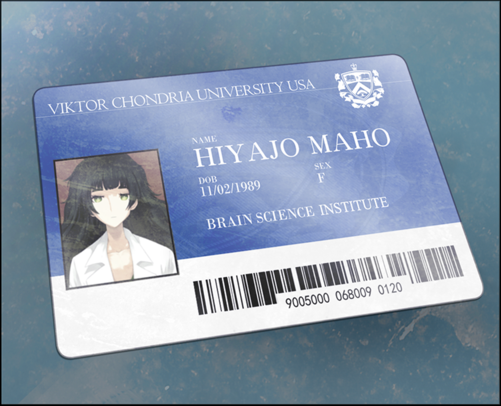

# 零化域的缺失之环 - 01
> 1.129848  
> [ 2010/11/23 ] 研讨会前，结识真帆，“初遇”萌郁。  

| [←prev](./0000) | [menu](../) | [next→](./0002) |

---

UPX 大楼，作为秋叶原新地标之一，耸立在秋叶原车站前。4 楼的大厅里，从早晨开始就在为 ATF——秋叶原科技论坛的研讨会做着准备。同国内外数所大学和研究设施合作，这里不定期会开展各种研讨会和座谈会。我就读的东京电机大学也作为产学合作机能的一环参与其中，相关研究会的学生也必须参加这些研讨会，并向导师提交报告，不然就拿不到学分。我作为演讲者之一的井崎准教授的助手参与这次研讨会，现在正待在公共大厅的前台，对照名单记录与会学生的出勤情况。离研讨会开始还有一段时间，大厅里的人也是零零散散，名单上的学生还一个都没有来。真闲啊，但也只能在这里等着。  
对于以前的我来说，如此勤奋是无法想象的。我之所以这样向井崎教授展示自己，是因为我有了新的人生目标——维克多·孔多利亚大学。井崎教授正在和这所大学进行合作研究，人脉也很广。如果能成为他的助手，应该会是我靠近自己目标的第一步吧，这是我算不上聪明的大脑的思考结果。而且，这次的研讨会末尾，还会有维克多·孔多利亚大学的演讲，我当然很关注。  
夏天啊……曾经的红发天才少女的身姿，突然再一次在脑海中一闪而过，我发出了一阵痛苦的呻吟。我之所以将维克多·孔多利亚大学作为目标，是因为想学习牧濑红莉栖要做的东西，并且把它继续进行下去。当然，我不是红莉栖那样的天才，所以，我也不会说出“想要继承她的全部研究”这种没有自知之明的话来。但是，对我来说，至少一成的话，如果能够做到的话……真亏我能够这样振作起来，对此我不由一阵苦笑。  
这时大厅里响起一个声音：  
“那个，那边那位——？”  
“嗯……？”  
我抬起头，看到从电梯井的方向走来一位娇小的少女。  

身高、体型……总之整体上都很小。姑且能感受到一些，只有经历过青春期才会产生的女性特有的魅力，所以应该不会是小学生……大概是中学生吧？明明有着一张这么可爱的脸，却显得有些土气。乱蓬蓬的头发被随意甩在背后，服装也是，就连我也能一眼看出，根本没有任何品味可言。  
“打扰一下，请问职员室在哪边？”  
“那个，这里是 ATF 研讨会的会场哦……”  
这里明显和女中学生不搭调，估计是进错地方了吧。  
“这种事我知道啊！要我重复几次才够呢？  
 啊不，对你还是第一次说这个……但是对我来说，你已经是第四个了！  
 真是的，到这地方后就一直……”  
 少女突然变得盛气凌人，边说边从怀中掏出了一张卡片，是给这次演讲的嘉宾配发的来宾卡，正面用日语和英语印有姓名和所属机构。  

“诶……？来宾……维克多·孔多利亚大学，脑科学研究所，比屋定真帆？”  
我来回打量着眼前的少女和卡片，总算想到——  
“啊啊，是这么回事啊！你这张卡，是在哪里捡到——”  
“这种话我也是第四次听了！”  
她一副受够了的样子，举起另一张卡片给我看。  

这次是带有照片的 ID 卡，来自维克多·孔多利亚大学的脑科学研究所。  
“诶？诶？！”  
我在另外的世界线曾经见过红莉栖的 ID 卡，和这张是同样的设计。卡上印着的照片，毫无疑问正是眼前的女孩。  
“读作 *Hiyajo Maho*，我的名字哦，比屋定真帆。  
 因为不论是汉字还是罗马音都没人能好好读出来，所以就先跟你说明咯。”  
“嗯……那个……维克多·孔多利亚大学的……中学生？”  
“要犯迷糊的话请等到晚上。大学里可能会有中学生吗？”  
“这……也是呢。那就是，跳级的吗……？”  
与日本不同，在美国跳级并不少见。红莉栖也是 17 岁就已经大学毕业了。即使这样……这么小的女孩子就已经是大学的研究员什么的……  
“……我能先跟你确认件事吗？”  
“啊……嗯。”  
“你现在，多少有点震惊的吧？  
 比如‘这么小的孩子……不敢相信啊！’，  
 还有‘这个年龄就……好厉害啊！’之类的？”  
“啊，哈哈……”  
由于被说中了我发出略带尴尬的笑声。  
“仔细看这里！”  
比屋定真帆用纤细的手指指向 ID 卡的一处。出生年份 1989 年，现在是 2010 年的话……  
“……21 岁？！”  
“所以说我可是了不起的成年女性了！可不是中学生，当然更不是小学生、幼女什么的。”  
说着，她一下子挺起了胸膛。虽然胸部完全说不上大，但是看起来就像是在强调“我是穿衣显瘦的类型，脱下来可是很厉害的哦！”这样。  
“……”  
“你这表情是什么意思？”  
“啊，没……不好意思啊，我道歉。”  
难以置信，居然比我还要年长……介绍给桶子的话，估计他会一边喊着“合法萝莉 <abbr title="表示事情按预想进行而兴奋激动的状态，“来啦！就是这个！（日文“kitakore”）”的缩略语">KTKR</abbr>！”，一边双手蠢蠢欲动吧。  
“算了，不管去哪都会被这么对待。”  
“嗯，我想也是……”  
“你说什么？”  
“啊不，没什么！”  

话说回来，脑科学研究所……那不是红莉栖所属的机构吗？所以，这孩子……不，这位女性说不定认识红莉栖。我强忍着想要问些什么的冲动，再次查看写着研讨会日程的小册子。维克多·孔多利亚大学的演讲，是今天演讲的最后一场，也就是所谓的“大轴”。这位比屋定真帆要上台演讲吗？就像在夏天的演讲中，红莉栖登台那样……不，等等，不对，不是这样的，这里没有这样的事实——牧濑红莉栖根本没有在夏天进行演讲，那是 α 世界线上的事。现在我所处的这条世界线上，她在夏天的演讲之前就……  
“今天，是你上台吗？”  
“不哦，我是来做助手的，还负责一部分翻译。”  
我再次看向小册子，在演讲者一栏写着 *Alexis Leskinen*，阿莱克西斯·雷斯吉宁，职务是维克多·孔多利亚大学的教授、脑科学研究所主任。  
“主题是《人工智能革命》吗？嗯，有点意思呢。”  
“有时间的话也想听一听你的感想呢。”  
“我会奉陪的。啊，你是要去职员室吧？”  
我把她领到电梯旁，给她指了职员室的位置。  
“谢谢啦！”  
没有理由继续缠着她了。我也点点头，准备回到自己的位置。  

就在这时——电梯门恰好打开，从里面走出一位成年女性。看到那张脸的瞬间，我全身的汗毛都立了起来。

“……！！！”  
桐生……萌郁！我拼命抑制住马上就要喊出来的冲动。冷静下来！这里是 β 世界线！**真由理还活着！萌郁不会杀真由理！** 我和她四目相对，眼镜后的那双瞳孔依旧是毫无生气，看不懂在想些什么。为了不被看穿，我慌忙错开了视线。  
“……？”  
萌郁歪了歪头，但很快对我失去了兴趣，向比屋定真帆走了过去。  
“那个……？”  
“啊啊，你是杂志社的人吧？”  
“…………按照约定……来采访……”  
不知道说“一如既往”是否恰当，这条世界线的桐生萌郁也依旧只能用含混不清的语调说话。  
“雷斯吉宁教授还没到，可能会让你稍等下。”  
“…………好的。”  
“教授来之前，要不要我先给你说明下系统概要呢？”  
“…………拜托了……”  
两人一同走向了职员室。我看着两人的背影，反复深呼吸。尽管想要冷静下来，心跳却很难平复。  
“桐生萌郁……难道，又是……你吗？”  
内心的创伤又好像要撕裂开来，讨厌的感觉，让我想起了秋叶原的所有线路都因为恐怖袭击预告而停运的那个夜晚，
阴云一般的不祥预感笼罩开来。  
“你又要在这里……”  
还是说，只是我想太多了吗？现在的萌郁不是什么 **SERN** 的 **Rounder**，只是一名杂志记者吗？不，就算桐生萌郁是 Rounder，我们也和 SERN 没有瓜葛了，他们没理由再盯上我们。  

“呼……”  
我再次深呼吸，从口袋里拿出镇定剂，用之前买的矿泉水冲服到胃里。药效发作大概需要 15 分钟，这段时间应该会相当难熬。我略带自嘲地笑着，坐回了前台的椅子上。  

 

> (to be continued)
---

| [←prev](./0000) | [menu](../) | [next→](./0002) |
