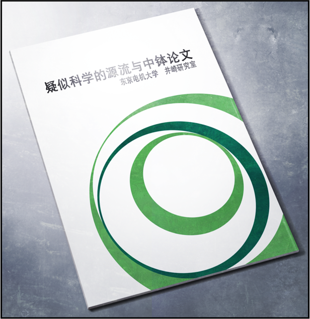

# 零化域的缺失之环 - 02
> 1.129848  
> [ 2010/11/23 ] 研讨会前半程，红莉栖论文被质疑，冈伦爆发。  

| [←prev](./0001) | [menu](../) | [next→](./0003) |

---

平复心情的时候接到了真由理的 **RINE**。这是最近才火起来的一种即时通讯软件，比邮件更加方便，所以用的人越来越多，大有取代邮件的架势。  
『嘟嘟噜\~♪』  
『冈伦\~研讨会的准备还顺利吗？』  
「啊啊，没问题」  
『是吗？真好呢\~』  
『很期待是怎样的研讨会呢』  
『真由喜也想看看啊\~』  
「对你来说可能太难了」  
『』  
『说的也是呢\~那么，就不打扰你啦，再见\~\~』  
多亏了真由理，15 分钟感觉也没那么难过了。  

前台的桌上堆着要分发给研讨会参加者的小册子和宣传单，还有资料的折叠传单。《疑似科学的系谱和中钵论文》，这是井崎教授的演讲宣传册。  

《**中钵论文**》——那个男人在俄罗斯发表的论文，**记载了关于时间机器实用化的理论**。在那个命运的 7 月 28 日，**中钵从亲生女儿那里夺去了论文并且带走**，我知道这件事情——**只有我和中钵知道**。  
我随手翻了翻宣传册，上面简单介绍了 20 世纪之后的很多疑似科学和伪科学，姑且可以当做奇闻读物来看。作为这个系谱的最顶端，在后半场华丽登场的，就是俄罗斯的《中钵论文》，井崎教授这样作结。简言之，中钵博士的事件及其理论完全没有被明面上的学会所认可。不惜放弃自己的女儿都要得到的地位、权势和名声，那个男人一样都没有得到。而且根据传闻，他在论文发表之后就**被俄罗斯的研究设施软禁了起来**。听说他还以为自己会得到很好的待遇，这就显得更为滑稽。有一段时期，他被许多伪科学杂志报道和采访，本人也沉醉其中。  
讽刺的是，《中钵论文》实在是太过正确，并且富有革命性。因为害怕这论文泄露到其他国家，**以俄罗斯对外情报厅为首，俄罗斯对此实施了严格的情报管制**。尽管如此，在水面之下，**围绕着论文的情报战争已经开始了**。从 2036 年回来的旅行者约翰·提托都这样说了，应该就是如此。这样发展的结果就是第三次世界大战吗？现在考虑这些也没用。  

之后的几个小时，研讨会顺利地进行着。井崎教授的演讲结束后，电机大的学生大部分都回去了。我继续待在这里，既是为了消磨时间，也是为了听听维克多·孔多利亚大学的演讲。想着时间还早，我慢悠悠地走向会场。  
途中正好看到了从职员室出来的比屋定真帆。她旁边有一位身材特别高大的金发白人男性，那位就是阿莱克西斯·雷斯吉宁教授吗？名字听起来不像是美国人，可能和红莉栖一样，是来自其他国家的移居者或是移民的后裔。虽然没想偷听，但看到他们边走边说着什么，表情还十分严肃，我也忍不住关注了谈话内容。他们的对话自然是用流利的英语，所以我没怎么听懂。但是从说话的语气上可以听出，并不是什么轻松的话题。话说刚才的对话当中好像有听到“牧濑”这个单词……真痛恨自己蹩脚的英语能力。  
我就这样看着二人走进了在 UPX 剧场旁边的演讲者准备室，然后将好不容易听到的信息片段试着整理起来：“红莉栖家发生火灾”，“牧濑夫人平安无事”，“强盗”，“警察停止调查”，“为什么 FBI 会来”，“真奇怪”，大概这些。红莉栖的家……是指她在美国的住所吗？红莉栖的母亲就应该住在美国。那里发生了火灾？强盗、停止调查还有 FBI 什么的，这些可疑的词汇让我非常在意。  

我的思绪还一团乱的时候，演讲开始的时间到了。不再多想，我只好走进了剧场。根据刚才进入剧场的人流就能预料到，现场的气氛相当高涨。与大学生们为了学分而参加的井崎教授的演讲明显不同，对尖端科学感兴趣的听众，以及研究者一类的人，几乎占满了整个会场。这可能是因为最近维克多·孔多利亚大学的研究者们接二连三的在《*Science*》杂志上发表论文，一跃成为了众人瞩目的焦点吧。  
哪里有空座位呢？我环顾四周，在角落发现了一个空位。但是看到旁边座位的人，我又差点喊了出来。桐生萌郁，又是你吗……她完全不和周围的人交流，仅仅是一直把手机放在大腿上打着字，看样子我曾经命名为“闪光的指压师（*Shining Finger*）”的高速键入功力仍在。她究竟在和谁联络呢？完全想象不到。  
我逃离了那里，寻找另外的空位。在我终于坐下的同时，雷斯吉宁教授和比屋定真帆出现在了讲台上。  

现场一下子爆发出热烈的掌声。但是看到随后出现的娇小少女，掌声变成了窃窃私语。对于比屋定真帆来说，这种反应想必是意料之中吧。她带着平常的表情站在教授旁边。  
教授拿着话筒环视现场，看起来相当的老练。  
“*Ladies and gentlemen……*”  
雷斯吉宁教授用英语开始了演讲。而比屋定真帆则在教授示意后，用日语开始了同声传译。  
“女士们先生们，感谢今日出席本人的演讲。  
 我是维克多·孔多利亚大学，脑科学研究所的阿莱克西斯·雷斯吉宁。  
 专业是，脑信号处理系统以及人工智能理论。”  
“然后，我是担任助手的比屋定真帆，  
 同样来自脑科学研究所，在教授的指导下研习中。  
 请多指教。”  
雷斯吉宁教授的自我介绍结束后，比屋定真帆也进行了自我介绍。观众席上又产生了一阵骚动，和我初见她时的反应相同。嘛，会有这种反应也很正常嘛。  
“那么事不宜迟，现在开始向大家介绍我们最新研究的一部分。  
 虽然这次的主题是‘人工智能革命’，但接下来要演示的系统，恐怕会超乎各位的想象。”  
雷斯吉宁教授开始操作讲台上事先准备好的笔记本电脑。  
“这台电脑，现在正与我们研究所中的一台超级电脑连接着——啊，先不要投影出来！”  
好像是正在启动一些重要的程序，比屋定真帆代表教授制止了工作人员的投影。  
“很抱歉，因为还在开发途中，极度欠缺美感的程序会溢满屏幕的。  
 被人看到如此廉价的程序我会很不好意思，比被看到裸体还要不好意思。  
 在座的各位中有没有工程师，会很理解的吧？”  
一部分接到了雷斯吉宁教授玩笑的听众会心一笑。  

“在启动期间，就由我来说明一下系统的整体概述吧。”  
在讲台中央还设置有另外一台投影仪，画面放映着一篇论文的概略图文，还带有为了方便一般听众理解的日语翻译，论文的标题是《**关于蓄积在颞叶的记忆相关神经脉冲信号的解析**》。  
对我来说，这篇论文再熟悉不过了，就是想忘也忘不掉。这是由一位 17 岁天才少女所写，发表在《*Science*》且广受好评的论文。这位天才少女解析了全部掌管人类记忆的神经脉冲模式，并且应用这些知识，成功地将记忆转化成了数字信号，就在我的面前，开发出了『**时间跳跃机**』这一划时代的发明。虽然已经不存在了——不论是『时间跳跃机』还是开发者本人，在这条世界线上都不存在了。  
“因为曾发表在《*Science*》，所以在座各位中也有人了解过吧。  
 这是我们小组中一位天才的日本研究者提出并完成的。”  
说到这，比屋定真帆连自己都没察觉到地叹了一声，然后继续翻译的工作。  
“人类的记忆是由大脑皮质，尤其是颞叶所记录，类似于闪存一样的东西。  
 而对那个磁盘进行记忆读写的，就是位于颞叶处被称为海马旁回的部位。”  
雷斯吉宁教授边说边指向投影上的大脑和海马体的图片。  
“大脑，是在被称为神经元的细胞之间，以传导电信号来活动。  
 所谓的记忆过程，实际上就是这类电信号传导的一种，由海马体控制。  
 即是说，正因为电信号一直在海马体出入，才会有记忆的形成。  
 而牧濑红莉栖——那个，是指这篇论文的作者——嗯……牧濑研究员考虑到……  
 那个……通过海马体的电信号，根据电信号的类型，和大脑皮质的……”  
比屋定真帆的节奏突然乱了。即使拥有如此高超的语言功力，长时间进行同声传译想必也是十分辛苦的。我在网络上看过报道，即使是同声传译的专家，最多 20 分钟就是极限了。国际会议和海外直播的同声传译工作都是多个人轮流承担的。但是除了这方面的原因，我还有一种感觉，节奏突然乱了，是因为出现了红莉栖的名字？  
雷斯吉宁教授察觉到了比屋定真帆的异样，暂停了演讲。比屋定真帆简短地道了歉，然后继续。  
“牧濑研究员，着眼于出入海马体的电信号模式，  
 哪种类型的信号对应着大脑皮质中的哪项记忆呢？  
 随着不断分析研究，终于得到了完整的数据。  
 据此，将记忆这种暧昧的模拟信号，转换成电信号模式的组合这种数字信号。  
 基础理论得以确立，这就是她在《*Science*》发表的论文内容。”  
比屋定真帆又是一声不易察觉的叹息。  
“现在，我们的小组，正以此理论为基础，开发能够将人类记忆作为数据提取的系统。”  
剧场内产生了微微的骚动。  
“即——将人类的记忆保存到电脑，并加以活用的系统。”  
剧场内的骚动更大了。这样啊，红莉栖的研究，在她死后也被好好地继承下来了啊。这也是理所当然的吧。α 世界线上，我曾经亲身证实过，『时间跳跃机』的基础理论。那时，我的记忆毫无疑问是被数字化并储存在电脑中。现在雷斯吉宁教授讲述的，正是这一实践的基础理论。  
“现在，我们进行的项目主要有两个方面，一是医疗方面……”  
雷斯吉宁教授切换了投影的影像。  
“现在显示的是我们与精神生理学研究所共同进行的项目。  
 将保存在电脑中的记忆数据，通过海马体再次写入原本的大脑中……”  
“难以置信！”  
坐在第一排的一个像是研究生的男子，忍不住发出了赞叹。对于他失礼的打断，雷斯吉宁教授却没有表现出不悦，而是柔和地回答：  
“确实难以置信，这种心情我能够理解，如果我处在各位的立场亦会如此吧。  
 我们也感受到了这项研究的价值。如果能够实用化，将会是多么美妙呢？  
 比如，老龄化带来的记忆障碍，阿尔兹海默症等，针对这些病症的疗法值得期待。  
 程序会将患者的记忆作为数据自动备份，  
 **即使记忆丢失，只要连接电脑，将数据重新覆盖回脑内即可**。  
 为此，我们设想，这是不是能够帮助人们延缓遗忘的进程？  
 最终，可以让海马体随时与电脑里的记忆数据连接。  
 这样的话，假如大脑受到强烈损伤而萎缩，  
 **即使在丧失大脑机能的状态下，也能让人脑的机能继续维持运作**。  
 如同外接存储器一样。”  
大厅被异样的氛围笼罩着。对于自己好像见证了一个不得了的技术发布的震惊，和对于这种技术是否有可能实用化的怀疑，以及对于操纵人类大脑产生的厌恶感，诸如此类的种种感情掺杂在一起而成的兴奋，在人群中传播着。  

见此，雷斯吉宁教授举起大大的手掌，向大家示意：  
“看来，在说明第二个项目之前，我们需要先回答一下各位的疑问呢。我会尽可能解释的，请。”  
闻言，许多人立刻举起了手。从年轻者到年长者，许多人都对这项技术有着强烈的好奇心。雷斯吉宁教授指了一位提问者，示意他提问。  
“把模拟信号的记忆转为数字信号记录，需要进行采样。这是不是代表会有信息被舍弃呢？”  
提问者是用日语发言的，不过教授很快点头，并立刻用英语开始了回答。看来他能听懂日语。  
“你的问题换一种说法就是，  
 将现场演奏的交响乐保存成 *.wav* 格式时，无法完美记录所有的细节吧。  
 确实，我们也需要解决这个问题，这也是当前研究中最困难的一环。  
 大脑里的信息，如果只看神经递质的 ON 和 OFF，也就是二进制的话，  
 那其实很简单，因为那本身就是数字化的数据。  
 但实际上我们知道，神经递质和电信号在大脑中是以模拟信号的形式变化的。  
 对于这个问题，我们目前的解决方案只有使用更高的采样率。  
 同样用音乐来比喻，比起 44.1kHz 采样，听众更愿意选择 48kHz 甚至 96kHz。  
 由此，尽管是数字信号，也可以得到和模拟信号更为接近的信息。”  
些许的失望感在听众间传播开来——果然只是纸上谈兵，不可能实用化吧——之类的。  

接下来又有几个人提出了问题。每个问题都对教授的研究表示否定的态度，并且表达方式多是让人怀疑是否在故意挑衅。就连在一旁听着的我都忍不住烦躁起来。这既是雷斯吉宁教授的研究，同时也是和红莉栖有关的研究。这项技术的实用性我是最清楚的，所以我无法原谅那些不经大脑就横加否定的人。那些家伙，真的是研究者吗？  
我压抑着自己的情绪，把目光移回讲台。比屋定真帆表情不太对，难道她也在生气？对于无礼的提问，雷斯吉宁教授承认其中的问题点并柔和地回答着，与此鲜明对比的是，她的翻译中能听出些许带刺的感觉，这让我对她稍稍有了一些亲近感。  
问答环节还在继续进行，又有一个人十分傲慢地发言：  
“说到底，把这种东西用在医学上根本就是无谋之举吧！  
 把数据写回大脑什么的，绝对办不到！简直疯了！  
 《*Science*》的那篇论文我也看过了，还是难以置信，  
 更别说，第一作者只是个**区区 17 岁的小女孩而已**——”  
对于这番话，我是绝对不能当做没听到的。  
“我说你啊——”  
台上的比屋定真帆试图反驳那位没礼貌的质问者，可我已经控制不住地站了起来怒吼：  
“我有异议！”  
“诶？”  

讲台上的二人、无礼的提问者、以及现场的所有听众，都一齐看向突然发作的我。  
“都没有尝试过，你能明白什么？  
 世界上不是有很多技术，一开始都觉得办不到吗？  
 但是，不正是因为研究者们克服了困难，得到了成果，才有了现代科技吗？  
 只是一味批判，是不会进步的！”  
会场安静下来，所有人都表情复杂地看着我。但是，我并不后悔在这种情况下冲出来。只是忽然感怀，同样是在研讨会上被我突然起立发言打断，某个 17 岁天才少女却能够机智地反问到我哑口无言——当然那是别的世界线上的事了。  
“你……”  
讲台上的比屋定真帆呆呆地看着我，雷斯吉宁教授则是对我露出洁白的牙齿，显然是在笑。  
“*Awesome! He's really something!* ”  
雷斯吉宁教授一边说着，一边独自鼓起掌来。  
“哎？”  
为、为什么鼓掌？这样的反应，岂不是更让我羞耻吗？  
“……真棒！他真是个了不起的家伙！——教授是这么说的。”  
比屋定真帆不知道是无奈还是欣慰地长出了一口气，然后特意看着我翻译了教授的话。  
“只是身为科研人员必须时刻保持冷静。能够大喊大叫的，就只有实验成功的时候。  
 ‘*We did it!*’ 只要这句话就足够了——教授是这么说的哦。”  
“对、对不起……”  
我连忙低下头，坐回椅子上。本来以为现在的自己已经足够冷静，却还是气血上头了，与半年前相比毫无长进。如果红莉栖还在的话，我又会被她狠狠嘲讽了吧。周围听众投来冰冷的视线让我好痛苦，真想现在就退场，但是很在意雷斯吉宁教授接下来的演讲，就故作淡定地继续坐着。  

“嗯，那么各位，差不多该继续了。不过在此之前，让我们先为那位勇敢的人鼓掌吧！”  
现场响起了稀稀拉拉的掌声。喂喂，饶了我吧。  
“正因为有他这样的挑战者，科学才会进步，才能发展出让所有人事后震惊的理论。  
 他，也许能成为第三位爱因斯坦呢。  
 顺带一提，第二位爱因斯坦呢，是我的这位有点啰嗦的小助手。”  
本来一本正经翻译的比屋定真帆突然反应过来，向教授抗议道：  
“……教授，请不要说些奇怪的话。”  
整个会场响起一阵轻笑，缓解了刚刚被我弄得有些尴尬的气氛。  

“那么，我会暂时停止翻译工作了。接下来，会有比我更优秀的翻译登场。  
 这就是，我们小组，目前最为用心的第二个项目——  
 **『Amadeus』系统**。”  

 

> (to be continued)
---

| [←prev](./0001) | [menu](../) | [next→](./0003) |
