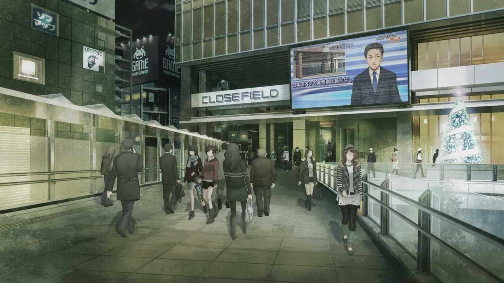
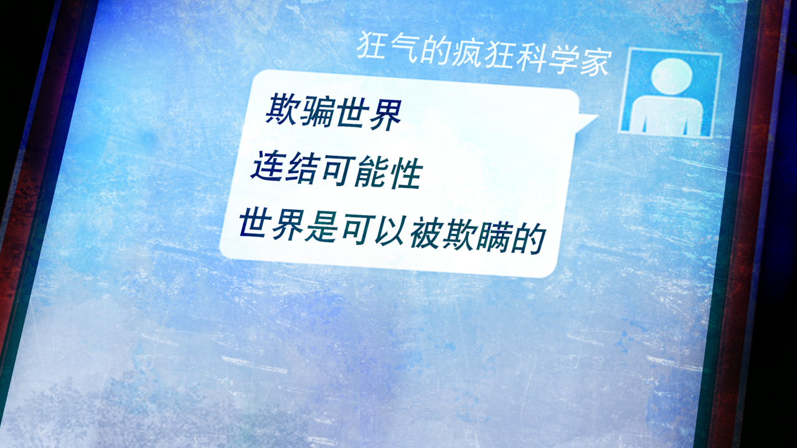

# 闭时曲线的碑文 - 13α
> 1.129848  
> [ 2010/12/15 ] 接 0017 - 接听电话。与教授和真帆见面前，在秋叶原的天桥偶遇吹雪和枫。被问到喜欢的人，想起杀死红莉栖的场景而痛苦干呕，然后逃走了。  

| [←prev](./0017) | [menu](../) | [next→](./0019) |

---

手指颤抖着，始终无法按下关机键，最终还是接起了电话。  
“呼……怎么了？”  
“什么‘怎么了’！突然挂断是很失礼的行为……发生什么事了？”  
“没什么。”  
“可是你的脸色看起来很差啊？”  
“真的没什么，不用管我。如果可以，请你暂时不要联系我了……”  
“……别太勉强自己，要和认识的人联系啊。再见。”  
意外的是，“红莉栖”没有继续纠缠，轻易作罢了。是意识到，身为人工智能的自己什么都做不到吗？  
意识？就像真正的人类一样。想到这，脑海中又要浮现出，红莉栖浑身是血倒在我怀里的场景。我咬紧牙关，拼命压抑想吐的感觉。果然在冷静下来之前，还是把手机电源关掉为好。明明之前都好好的……现在仅仅是听到红莉栖的声音，就会感到恐慌。又回到半年前的状态了，那个时候也是，只要听到红莉栖的名字，就会十分动摇。  
“不应该参与的……”  
不应该追逐红莉栖的幻影的。总之，先把手机电源关掉——到最后我也没有这么做的决心。  

我站在秋叶原的天桥上，感觉喉咙非常干，于是将手里的矿泉水一饮而尽，然后长出了一口气。和雷斯吉宁教授他们约定的会面时间还有一会儿，我站在这里吹风，想让自己恢复过来。漫不经心地俯瞰街景，周围全都是圣诞的颜色，充满欢快的气氛——和现在的我正相反。反复深呼吸，呕吐感还没有消失，头痛也只是稍微缓解了一点。以这种状态去见雷斯吉宁教授他们，绝对会被担心的吧。  
这时，我注意到，走在天桥阶梯上的女性二人组正朝我这边看来。天色愈发昏暗，我凝视试图辨认对方的脸。同时，二人组中的短发少女朝我轻轻挥了挥手。  
“果然是冈伦啊！”  
“你好。”  
另一位长发少女也轻声向我问好。  
“啊，你们是真由理的朋友。”  
靠近后我终于认出，她们是和真由理一起 cosplay 的朋友。我只知道 cosplay 名，貌似是……吹雪和枫——哪一位是吹雪，哪一位是枫呢？  
“你没事吧？看起来状态不太好呢……”  
长发少女温柔地关心我，我连忙表示没事。要是她们出于担心而联系真由理，之后还要努力解释——我不想让真由理为没必要的事担心。一开始就不该回秋叶原的，随便在街上走走就会碰到认识的人。刚刚从神社出来就应该直接向神田方向走的。  
“冈伦总是看起来很痛苦的样子。”  
“……有吗？”  
“有的哦。看着那样的冈伦，真由喜也很痛苦的样子……  
 我也是，看着那样的冈伦和真由喜也很想哭……  
 啊，我在说什么啊……”  
短发少女属于外向开朗的类型，照搬了真由理对我的称呼。她说话的方式非常直球，身边的长发少女小声叫她的名字想提醒她委婉些，她依旧一口气说完了。看来这位名叫吹雪的女孩子非常重视真由理，这让我十分欣慰，情绪也温和了一些。  
“那个……冈伦喜欢的人，是谁啊？”  
“什……！？”  
吹雪突然给予我暴击。喜欢的……人……我再也控制不住，脑海中清晰地浮现，红莉栖浑身是血倒在我怀里的场景，双手也回忆起，夺走她生命那个瞬间的触感，变得冰冷而麻木。不妙，冷静——  
“呕……！”  
“冈伦先生，你没事吧？”  
“对、对不起！问了失礼的问题！那个……我……”  
看到我弯腰捂嘴拼命压抑呕吐感的样子，枫更加担忧了，吹雪也一脸慌张而抱歉的表情。  

“呃、啊……没事……我还有事就先走了……”  
我像是逃跑一样，和二人分别了。  

  
涉及真结局的部分

  前提：已完成《盟誓的文艺复兴（红莉栖结局）》  
  与吹雪和枫谈话，被问到喜欢的人，浮现红莉栖的幻影时，白袍凶真的幻影同时浮现，手机收到这封改变世界的 D-RINE（分成三条送达）。  

  

 

> (to be continued)
---

| [←prev](./0017) | [menu](../) | [next→](./0019) |
