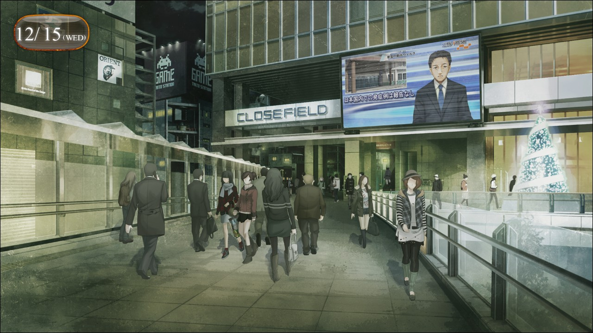

## 闭时曲线的碑文 - 13α
> 1.129848  
> [ 2010/12/15 ] 接0017 - 不关机。与教授见面前，在秋叶原的天桥遇到了吹雪和枫。被问到喜欢的人时想起杀死红莉栖的场景而呕吐，然后逃走了。  

手指颤抖着，一直无法做到按下关机键，反而是接起了电话。  
“呼——……什么？”  
“才不是‘什么’呢！突然挂断电话很失礼……发生了什么？”  
“什么都没有。”  
“但是脸色看起来很差啊。”  
“真的什么都没有。别管我。如果能暂时不和我联系就帮大忙了……”  
“……别太勉强自己，要和认识的人联系啊。再见。”  
“红莉栖”意外地轻易作罢了。是察觉到作为人工智能的自己什么都做不了么？  
察觉？就像真正的人类一样。这么一想，脑海中又仿佛出现被鲜血染红的手的幻影，咬紧牙关拼命忍耐。果然在稍微冷静之前，还是把手机电源关掉为好。明明到刚才为止什么事都没有的……现在仅仅是听到红莉栖的声音就会变得恐慌起来，又回到半年前的状态了。那个时候也是，只要听到红莉栖的名字就会变得摇摆不定。  
“不应该参与的……”  
不应该追逐红莉栖的幻影的。总之，先把手机电源关掉。  
但是……到最后我也没有办法下这个决心。  

站在秋叶原的天桥上，我感觉喉咙非常干，将矿泉水一饮而尽，然后吐了口气。和雷斯吉宁教授他们约定的时间还有一会儿，我站在这里吹风，想让自己恢复过来。漫不经心地俯瞰景色，周围全都是圣诞的颜色，充满欢快的气氛。和现在的我正相反。反复深呼吸着，呕吐感还没有消失，头痛也只是稍微缓解了一点。在这种状况下去和雷斯吉宁教授他们见面的话，绝对会被担心的吧。  
这时，我发现走在天桥阶梯上的女性二人组正朝我这边看来。我在愈发昏暗的光线中凝视，试图辨别对方的脸。同时，二人组其中的短发少女轻轻地挥了挥手。  
“果然是冈伦啊！”  
“你好。”  
另一位长发的少女也轻轻地向我问好。  
“啊，你们是，真由理的朋友。”  
她们靠近之后我终于认出，是和真由理一起cosplay的朋友。名字的话，只知道cosplay名，貌似是……吹雪和枫。哪一个是吹雪，哪一个是枫呢？  
“没事吧？看起来状态不太好的样子……”  
长发的少女温柔地关心着我，我连忙表示没事。如果她们因为担心而去联系了真由理的话，之后还要费力去解释，我不想让真由理为没必要的事担心。真是一开始就不应该回秋叶原的，只是在街上走走就会碰到认识的人。刚刚从神社出来就应该向神田方向走的。  
“冈伦总是看起来很痛苦的样子。”  
“……是吗？”  
“是的哦。看着那样的冈伦，真由氏也很痛苦的样子……  
 我也是，看到冈伦和真由氏就会变得要哭出来一样……  
 啊，我在说什么啊……”  
短发少女属于外向开朗的类型，对我的称呼方式应该是照搬了真由理的。她说话的方式非常直球，身边的少女小声叫了她的名字想提醒她委婉些，她也依旧一口气地说了出来。看来这个叫作吹雪的女孩子非常重视真由理啊。明白了这一点，我的情绪变得温和起来。  
“那个……冈伦喜欢的人，是谁啊？”  
“……！？”  
吹雪突然给予我暴击。  
喜欢的……人……  
视野角落里，浑身鲜血的红莉栖幻影又出现了。双手回忆起了夺走她生命的那个瞬间的触感，变得十分麻木。不妙，冷静——  
“呕……！”  
“冈伦先生？没事吧？”  
“对，对不起！问了失礼的问题！那个……我……”  
看到我弯腰捂嘴十分痛苦的样子，枫更加担忧了，吹雪也一脸慌张而抱歉的表情。  

“额，啊，啊……没事……我还有事就先走了……”  
我像是逃跑一样，和二人分别了。  

 

> (to be continued)
---

| [←prev](./0017) | [home](../../) | [next→](./0019) |
