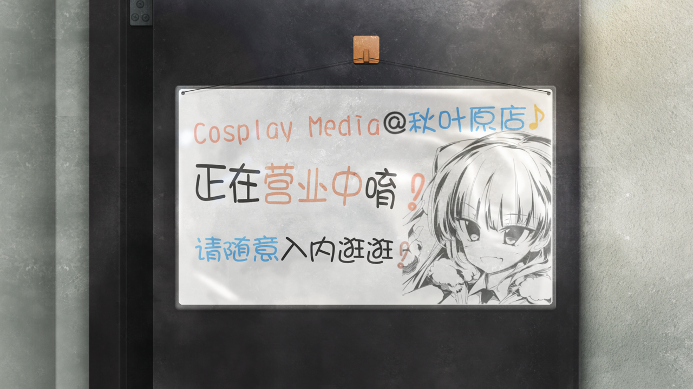
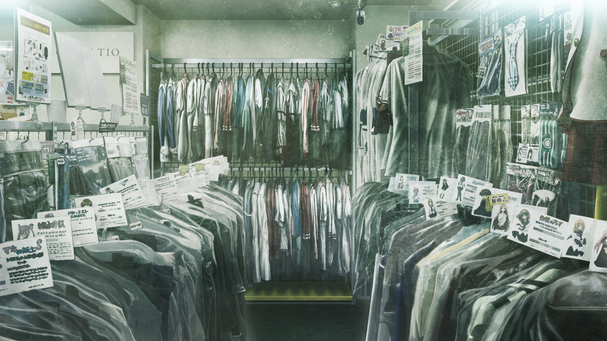
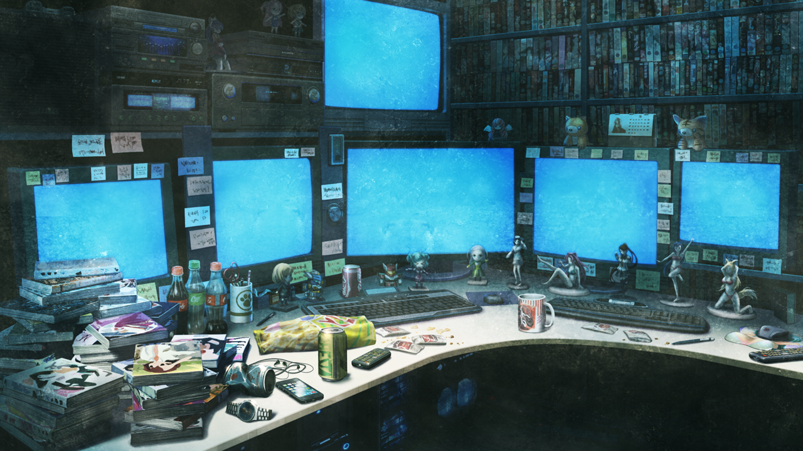

# 永劫回归的潘多拉 - 08
> 1.129954  
> [ 2011/01/23 ] P2：在桶子秘密基地是否优先接听“红莉栖”的电话？  

| [←prev](./0034) | [menu](../) | [next→接起电话](./0036) |  
|                 |             | [next→先谈事情](./0140) |

---

桶子告诉我的地点同样是在秋叶原，从这里步行过去还不到五分钟。从大街上拐了几条小胡同，就看不到半个人影了。东京中心，秋叶原，明明还是周日的大白天，却弥漫着潦倒的气氛。在这样狭窄的胡同里耸立的陈旧的杂居大楼的 7 层，桶子指定的店就在那里。  

“唔……”（x2）  
在入口的铁门上挂着的告示板让我们不禁稍微停顿了脚步。走进一看，不大的店面里摆满了 cosplay 服装。距入口不远的墙角是“新番角”和“人气 cosplay 角”，那里展示着五颜六色的 cos 用假发、缎带、珠宝饰物一类的小道具；对面的墙上则是“二手服装角”，还有袜子、学生鞋、高跟鞋、长筒皮靴之类的“鞋子专卖角”；再往里走，陈列着死库水和竞技泳衣之类的特殊服装。看来是家针对女性的 cosplay 店，但是这氛围怎么看女孩子都不会轻易进来的，毕竟其它楼层也都是些“灵神的水滴有限公司”、“宇宙电波接收器贩卖处”、“花瓣影像企划”之类的名字奇怪的店铺。  
“比屋定来过这里吗？”  
“不，之前见面是在别的杂居大楼，虽然也是一家可疑的店就是了。”  
“是、是吗……”  
好像看到了桶子不可告人的一面……  

店内鸦雀无声，除了我们没有其他的客人。一个像是店员的长发瘦弱男子坐在深处的收银台，在我们进来后头都没抬过一下，读着杂志一类的东西。事实上，我从进门到一直都没法放松，觉得和比屋定进来这里，在旁人看来可能是一种相当糟糕的行径，很可能会被当作带女中学生到不三不四的店的变态大学生。  
“喂，冈伦，这边。”  
刚才完全没有看到桶子的身影，却冷不丁地出现在店铺深处。  
“话说真帆碳也来了呢。”  
“那个‘真帆碳’的称呼，能别用吗？”  
“为什么？不是很可爱吗？”  
“感觉被这样叫显得很蠢……”  
“先不说这个，桶子，你是从哪儿出来的？”  
待在收银台的男子什么都没说，也就表示对方已经知道并且同意桶子待在这里了。  
“总之先来这边。”  
桶子走进店铺深处，挪开一个挂着大量偶像系 cosplay 服装的衣架，带我们穿过里侧挂着的帘布。帘布后面有大约一平米左右的空间，墙上有一扇写着 “STAFF ONLY” 的门，如果不挪开衣架完全不可能注意到。我吃惊得说不出话，比屋定也感叹这里简直就是忍者的屋舍。  
打开门后，是一个挤得要命的办公室。不，这个房间原本应该还是很大的，也有太过昏暗的原因吧，给人很大的压迫感，甚至让人呼吸困难。四张满是金属支架的桌上乱堆着各种各样的电脑和周边设备；不知道是不是垃圾的盒子和塑料袋扔得遍地都是；杂志、游戏、塑料模型以及手办的盒子像塔一样堆积着；桌上也是乱七八糟，和 LAB 的情况一模一样。虽然装饰用的手办因为太暗看不清，想必也是积满了灰。说起来真的需要 6 个显示屏吗？每个显示屏上都显示着不同角度的店内的样子，看来是监视器的影像。从这个店的规模和客流量来看，3 个监视器都够多了。  

“嘛，随便坐吧。”  
“这有人坐的地方吗？”  
“我现在就腾点地方出来。”  
桶子把地板上堆积的箱子随便一挪，勉强挤出了点空间，然后摆了两把折叠椅。  
“你……和这家店是什么关系？”  
“嗯……就像是兼职领班一类的吧，我有不少在这种地下店铺的兼职呢。  
 所以，有时候也拜托店主把办公室借我当作个人工作室使用。”  
“为了地下兼职的工作吗？”  
“就是如此。”  
这家伙，说不定是个相当厉害的男人啊。  
“这里的东西，全是你的私人物品吗？”  
“不，是和兼职的大家的共同财产，再说我哪有那么多钱买这么多东西啊。”  
“哦……”  
话虽如此，哪些是真话哪些是假话，很可疑。  
“我好意外啊，没想到真帆碳竟然和冈伦认识。  
 之前在 *MayQueen* 撞见的时候，我还不知道怎么回事呢。  
 不过很快就发现交集了，因为牧赖红莉栖氏这位共同的朋友。  
 可是真帆碳，不是说过要对冈伦保密吗？结果还是坦白了吗？”  
“正确来说，是被识破了。”  
“啊，原来如此。”  
桶子点点头，然后抓了一个桌上的膨化零食，扔到了嘴里。  

这个时候，口袋里的手机突然响了起来，来电显示是“红莉栖”的名字。比屋定看到了显得有些犹豫，接下来要谈的话题，尽可能不想让“红莉栖”知道，我也在纠结该怎么办。而且，我突然想到，在那条我迷茫地漂泊在战争时期一个多月的世界线里，我最终见到的“红莉栖”——『Amadeus』——正处于美军的管理下，下一瞬间世界线就发生了变动。那究竟代表着什么，我现在还没有找到答案。  

我注视着手机屏幕，  
是要**接起电话**，  
还是**先谈事情**呢？  

 

> (to be continued)
---

| [←prev](./0034) | [menu](../) | [next→接起电话](./0036) |  
|                 |             | [next→先谈事情](./0140) |
