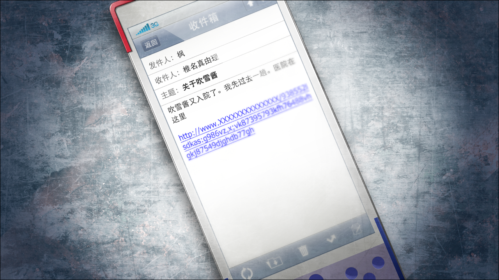
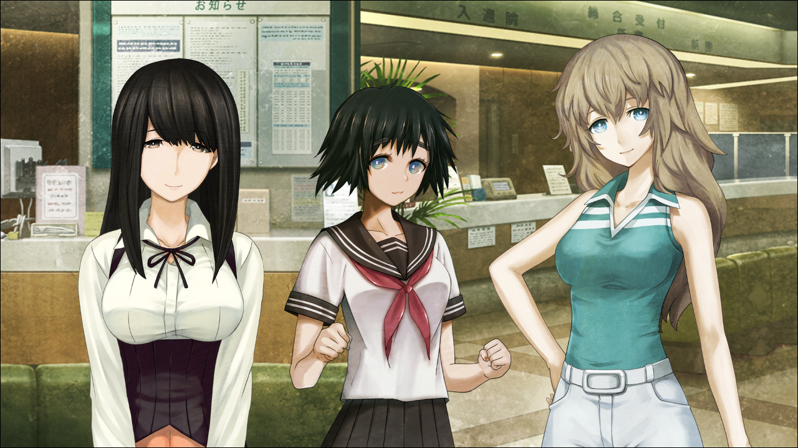

# 私秘境里的污点 - 03
> 1.129954  
> [ 2011/06/25 ] 去医院探望再次入院的吹雪，偶遇雷斯吉宁。  

| [←prev](./0038) | [menu](../) | [next→](./0040) |

---

“啊……”  
“怎么了？”  
“嗯……就在刚才，枫发了邮件过来，我都没注意到呢……怎么办啊，冈伦……？”  
真由理看起来忐忑不安，眼看着就要哭出来了。  
“发生什么事了？”  
“呐，冈伦……你之前说过的吧，吹雪酱她不是生病吧？”  
“吹雪酱？是中濑小姐，不是来岛小姐吧？”  
“嗯。你说的是真的吗？真的不是生病了对吧？”  
“啊，是啊，应该不是生病。”  
“可是……”  
真由理把手机伸到我面前展示给我看。  
“又住院了……？”  
我难以置信地盯着画面上邮件的内容。  

  

吹雪这次住院的医院和上次的不一样，是在代代木的一个叫做【AH 东京综合医院 附属先进医疗中心】的地方，在日本以屈指可数的最新医疗设备而闻名。根据网上的情报，最近流行起来的新型脑炎患者，现在应该都被集中在这里进行着专门的治疗。然而，网上的传闻并不止这些，有关这个医院的都市传说还有各种轶闻，也被大量地贴了出来，让人不禁害怕那究竟是什么可怕的地方。然而实际进到里面以后发现，这里并非什么可怕的设施，反而干净整洁，像是星级宾馆一样。  
“真由理酱，冈伦先生——”  
“这边——”  
我和真由理进入大厅以后，等在那边的枫和由季向我们挥了挥手。由季应该也是收到了枫的邮件后急忙赶过来了。  
“吹雪酱怎么样了……？”  
“没事的。”  
由季微笑着温柔地抱住不安的真由理的肩膀。另一边，枫则是过意不去地低下了头。  
“抱歉吓到你了呢。我也是太着急了，应该好好确认之后再发邮件才对。”  
代替快要失了神的真由理，我开始向枫了解状况。  
“所以呢……中濑小姐现在的情况是？”  
“我刚才在病房里见到了吹雪酱的妈妈，她说应该不是上次的病情恶化了。”  
“那……就只是住院再检查……之类的？”  
“对的，是这么说的，所以完全不用担心。”  
“这、这样啊。哈啊……太好了……”  
由季怀里的真由理终于放松下来。吹雪之前定期去医院接受了检查，医生表示，虽然还有疑问，但是在病情不恶化的情况下，对日常生活没有影响。  

这种新型脑炎自从登陆日本国内至今，患者数量仍在持续增加。不过不幸中的万幸是，其中没有出现任何一名死者。  
（我还是觉得，那不是什么病症啊……）  
在我的想法里，这种新型脑炎的症状，实际上应该是一种跟 *Reading·Steiner* 很接近的能力。之前探望吹雪的时候，我顺便悄悄地调查了她以外的患者。虽然不能得到准确的结论，不过至少可以确定，当时和吹雪在同栋楼住院的患者，基本都有不同程度的对“同一世界线”的记忆——也就是，关于“处于战争状态的日本”的记忆。  

“可以和吹雪酱见个面吗？”  
“那个，她现在在 MRI 接受脑部检查的样子，所以不在病房里。”  
“这样啊……”  
“不过，应该很快就结束了。吹雪酱的妈妈让我们在这里等一下，检查结束后会告诉我们的。”  
枫带着由季和真由理坐到了旁边的沙发上。我则继续站着，环顾整个大厅。  
“真是个厉害的医院呢。”  
“啊，是啊。中濑小姐家里，实际上是很厉害的有钱人吗？居然能在这种地方住院。”  
我附和着由季的感叹，光看大厅就直到，这里的费用一定很高。枫却说：  
“不，不是那样的……听吹雪酱的妈妈说，  
 好像是日本和美国的政府出资，在这里实施新型治疗项目的样子，  
 是以这家医院，还有美国的专科医院以及研究所为中心进行的。”  
“这样啊……”  
我的心里有一种复杂的感觉。这种症状虽然被认定为新型脑炎，但如果我的想法正确，这并不是某种病症的话……这种做法还真是浪费资源啊。  

“拜托了，请给所有患者分配单独的病房。  
 还有，尽量安排隔开的房间，让患者之间不要相互接触。”  
“可是啊，很难准备出那么多床位的。”  
“那也必须这么做！一旦患者间进行交流，‘梦境’的情报不就会相互传播了吗？”  
“呃，虽然是这样没错……”  
“大脑这种东西呢，有可能与其他人的产生共感，  
 明明是别人的梦境，交流之后却可能产生自己也梦见了的错觉！”  
我循着争论的声音横穿大厅，视野中出现了一位快步走着的、穿着白大褂的日本老医生，以及正追着他说着什么的、穿着西装的巨大的外国人的身影。  
“……啊！”  
那个穿着西装的外国人，我有印象——不如说，是我很熟的人。  
“教、教授——雷斯吉宁教授！”  
我急忙追了过去。  
“雷斯吉宁教授！是我啊，冈部！”  
因为他在用日语和老医生交流，应该是戴着翻译机吧，所以我也试着用日语跟他打招呼。雷斯吉宁教授也注意到了我，很有气势地笑了起来。  
“*Oh——! Rintaro!* ”  
他的声音大得过头，以至于医生、护士、职员、患者，大厅里的人们都看向了这边。然而，雷斯吉宁教授却完全不在意，啪嗒啪嗒地跑了过来，带着和倔强的橄榄球手正要触地得分一般的魄力。  
“呜哇！？等、请等一下教授！STOP！STOP！”  
我的哀求完全没有奏效。雷斯吉宁教授华丽地完成了擒抱，顺势一下子勒紧了我的全身。瞬间从橄榄球手转职成摔跤手的教授，一脸开心地抱着我转起圈，让我有种好像变成了小孩子的感觉。事到如今我也只好任由他摆布，毫无反抗之力。  
过了一会儿，雷斯吉宁教授终于注意到了周围冰冷的视线，把我放开了。  
“哎呀哎呀，不好意思，我实在是太惊讶了，一不小心过头了。”  
雷斯吉宁教授缩着巨大的身子，向周围人点头哈腰地道歉。  
“雷斯吉宁博士，您和这位青年是什么关系呢？”  
刚才在和雷斯吉宁教授说话的那位初上年纪的医生讶异地看着我。  
“啊，呃……这个……”  
要问是什么关系的话，也不是师生关系，应该怎么回答呢……  
“看你应该还是个学生吧……哪所大学的啊？和教授一样是脑科学相关的——”  
“不，我是——”  
“他的话，9 月开始就是维克托·孔多利亚大学的学生了，以后也是准备来我的研究所的。”  
“诶？”  
“嚯嚯，维克托·孔多利亚大学啊，真是让我惊讶啊。”  
我用眼神询问雷斯吉宁教授，这到底是怎么回事，但只得到了一个调皮的微笑作为答复。这个人……还是老样子，有时候像个小孩似的。  
“日本学生里没有几个能去那里的啊，真了不起。”  
“谢、谢谢，啊哈哈哈（心虚）……”  
“*Hahaha!* ”  
随后，目送这位老医生离开之后，我用故意让雷斯吉宁教授看得出来的动作长出了一口气。  
“那个，刚才那位是？”  
“这家医院的院长。”  
“院长！？对那种大人物，就这么光明正大地说谎吗……”  
“哦呀？我有说什么谎吗？  
 我确实说了‘从 9 月开始就是我们学校的学生’，  
 但是并没有说就是今年的 9 月哟。  
 不然呢，难道你最终还是没有来我们学校的自信吗？那真是太遗憾啦……”  
……真是和小孩子一样的强词夺理，太明显了吧。但是，不可思议地我并不觉得讨厌。  
“不过我很惊讶，教授居然又来日本了。”  
1 月在成田机场送别他们之后，已经有 5 个月没见了。  

“*Maho* 也一起来了哦。”  
“是吗！？她完全没和我提过啊……”  
提交『Amadeus』测试报告相关之外，我们定期也会通过邮件、Rine 或者视频聊天来联络，但是完全没听她或者“红莉栖”说过有关要来日本的话题。  
“我们还在和光市的那间危险的办公室。你和‘红莉栖’一起，什么时候来玩都可以。  
 因为被洗劫过，真是想叫他们换个别的地方啊。”  
雷斯吉宁教授夸张地仰起头看着天花板。确实那个地方有很严重的安全隐患。  

“*Rintaro* 你有哪里不舒服吗？来这里接受治疗？”  
“啊，不，不是的，是来探望一位住院的朋友。”  
“啊，这样啊，那真是太好——不，对于那位朋友来说并不好，真是抱歉。”  
“啊，没事……”  
“那么，教授呢，来日本的医院要做什么呢？”  
这时教授把脸凑近我这边，注意着周围的情况，压低了声音：  
“你也知道吧，最近的新型脑炎的事情？  
 受美国政府委托，精神生理学研究所正在研究相关的治疗方法。  
 不过他们好像陷入了瓶颈，所以我也受大学之命加入了调查。”  
“这样啊，雷斯吉宁教授来调查新型脑炎……”  
在意外的时机出现了这个词汇……我向教授简单介绍了之前提到的“住院的朋友”，以及她被怀疑患有新型脑炎的事。  
“你那位朋友难道是，*Nakase·Katsumi*（中濑克美）？”  
“诶？啊也是，教授在圣诞派对上见过的。”  
“嗯嗯，实际上我对新型脑炎感兴趣，也是以那次派对为契机。  
 那时候，你和 *Katsumi* 同时倒下了吧？”  
这么说来确实如此，虽然那个时候我是跳跃到别的世界线去了。  
“几天前我见过 *Katsumi*，她向我抗议了好几次——  
 ‘为什么又让我住院了呢？明明我还这么健康！’之类的。”  
“这、这样啊……”  
“如果她能稍微配合一些，我会很高兴的。*Rintaro* 可以替我劝劝她吗？”  
“啊……”  
“实际上，不只是 *Katsumi*，我对所有患者都怀有一种愧疚的心情。  
 不管是我们还是日本的医疗团队，虽然都在努力推进着研究，  
 但是难以理解的检查结果实在太多，我们也很困扰。”  
不论什么时候都表现得很阳光的雷斯吉宁教授，少见地脸色阴沉了下来。我现在才注意到，一直以来都在源源不断地展现活力的教授，露出这种表情的时候，脸上也会出现许多很深的皱纹。看来正如他说的，他正承受着相当大的压力。  
“说实话，最早的时候不管是哪位医生，好像都没想到会是这么让人无法理解的病症……”  
“……”  
“嗯？怎么了，*Rintaro*？”  
“啊，呃，这个……”  
“有什么在意的事吗？”  
“没……我毕竟并不是医学生，对这些完全不懂啊。”  
我差一点就把 *Reading·Steiner* 的事说出去了，但最后还是忍住了。我这种外行人的意见，如果哪里弄错了的话，对那些新型脑炎的患者们可能会是性命攸关的问题。所以，这并不是什么可以随便说说的话题。  

忽然，教授又把脸凑过来，几乎要贴上一般盯着我低声说道：  
“说起来，那位 *Katsumi* 说了一些很有趣的事呢。”  
“嗯？”  
“‘我们不是生病了，而是拥有通过梦境看见别的世界发生的事的能力’之类的……”  
“什……！”  
我应该一再叮嘱过吹雪，要她对这件事保密的。难道是没忍住吗？这下情况麻烦了，搞不好，吹雪会被怀疑是否有精神方面的问题……  
“呃……中濑小姐她，那个……想象力特别丰富，特别喜欢 SF 和动画什么的。  
 ‘感知其他平行世界的力量’什么的，我想大概是受兴趣的影响才会那么说的吧。  
 实际上，我也有经常说那些事情的时期啊，哈哈……”  
我拼命想蒙混过去，但是雷斯吉宁教授却一副认真的表情在思考着。  
“但是啊……我参与治疗项目之后，也发现了让我惊讶的事实……  
 作为这个病症的特征，的确出现了很多患者拥有同样梦境的现象。  
 这和集体幻觉现象很类似，我们目前正在向这个方向调查。  
 这究竟是怎么回事呢？我还是第一次见这种事呢。  
 就目前的脑科学，现在还无法得出‘解答’。  
 说实话，最合适的形容就是‘非科学性’这个词了，  
 也就是，平行世界、还有前世记忆什么的。”  
“这样啊……”  
“和 *Katsumi* 多聊聊各种各样的话题，也会很有帮助的。  
 有些事不能对医生说，却可以告诉朋友。”  
“好的，之后……我会去和她聊聊的。”  

“那么，*Rintaro*，这些事就说到这。有件事我想确认下——”  
雷斯吉宁教授把视线转向了我的后方。  
“圣诞派对那会儿我就觉得，你的这些女性朋友们都是些很 *cute* 的姑娘呢。”  
“诶？”  
我转身看向那边，真由理、枫、还有由季都从沙发上站了起来看着这边。她们注意到了雷斯吉宁教授的视线，轻轻地挥了挥手。  
“果然，这里面的其中一位就是你的恋人吧？  
 *Yuki*（由季）？*Kaede*（枫）？*Mayuri*（真由理）？  
 *Ruka*（琉华）？还是说，就是 *Katsumi* （克美）吗？”  
“啥！？”  
我对这突如其来的问题哑口无言。比屋定一直说这位中年教授就是个“爱淘气的少年”，现在他的表情正像她所说的那样。  
“哎呀，我不会勉强你一定要告诉我，也并不想探究你的个人隐私。  
 嘛，只是想回去的时候，和可爱的学生聊一些旅行趣闻而已啦。”  
“？？？”  
在我还陷入混乱中的时候，雷斯吉宁教授就这样往回走了。  
“那么 *Rintaro*，我还有些事要和院长说，先这样吧。  
 可以的话还想和 *Yuki* 她们每人来个拥抱的，  
 还是留到下次吧，替我向她们问好啊。”  
“啊，好的！”  
我目送那个巨大的背影离开，然后走向远处观望的真由理她们。  
真由理：“刚才那个人，是雷斯吉宁老师？”  
枫：“应该是吧，感觉好像在哪里见过的样子。”  
由季：“不是已经回美国了吗？”  
“……哈、哈哈……（干笑）”  
“冈伦？”  
刚才和雷斯吉宁教授聊的那些内容，完全不能告诉这几位女性啊……  

吹雪的检查结束了以后，在病房里听她发了发牢骚，这天的探望就这么结束了。吹雪就如同雷斯吉宁教授说的那样，一直都很精神，还豪言道现在就能马上出院，跑着回家。看到那种样子，真由理她们多少安下心来，但是我却仍然有各种各样的烦恼。  
果然，还是应该告诉雷斯吉宁教授有关 *Reading·Steiner* 的事比较好吗？但是，究竟应该怎么说起……实在不行，拜托比屋定和雷斯吉宁教授说明应该也行。然而我无法立刻得出结论。  

 

> (to be continued)
---

| [←prev](./0038) | [menu](../) | [next→](./0040) |
