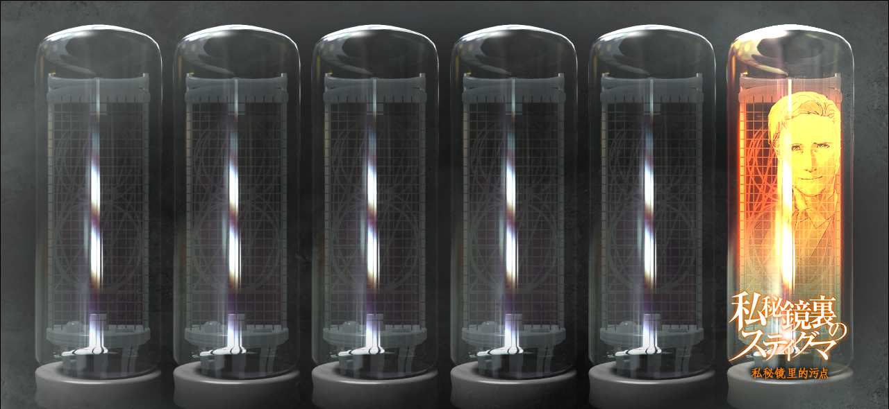

# 瓦尔基里最终报告 - 01
> 1.143688  
> [ 2036/08/13 ]  

## 情报整理 | 各方势力
### LABMem
- 冈部伦太郎
  - 未觉醒，彻底放弃。
  - 2025年去世。
- 椎名真由理
  - 2011年秋叶原大战后失踪。
- 桐生萌郁
  - 交集不深。
  - 以报社编辑的身份采访过真帆。
- 比屋定真帆
  - 从冈伦出套出时间机器情报。
  - 被【教授】洗脑，泄露情报。
  - 2011年秋叶原大战后主动消失。
- 椎名篝
  - 被【教授】洗脑，后为了母亲摆脱控制。
  - 2011年秋叶原大战时救出冈伦而牺牲。

### 同盟  
- 黑色骑手装女性
  - 真实身份为篝，幼时被【教授】洗脑。
  - 因为真由理觉醒摆脱控制，闯入 STRATFO 基地救出冈伦后牺牲。

### 中立  
- SERN-Rounder

### 敌对  
- 阿莱克西斯·雷斯吉宁 *Alexis·Leskinen*
  - 【美】STRATFO，代号【教授】。
  - 擅长洗脑技术，控制了篝和真帆。
- 朱蒂·莱耶丝 *Judy·Reyes*
  - 疑似为【教授】的同盟。
- 未知武装势力
  - 想要抢夺红莉栖的笔记本电脑和移动硬盘。

## 情报整理 | 重要物品
- 《中钵论文》
  - 大战导火索，但本身质量很差。
  - 怀疑实际存在红莉栖所著原本。
- 红莉栖笔记本电脑和移动硬盘
  - 密码未解锁。
  - 已被冈伦破坏。
- 『Amadeus』
  - 会被【教授】监听。
  - 已被删除。
- FG V204 2nd EDITION ver2.31
  - 2011秋叶原大战中被破坏。

## 情报整理 | 重要事件
- 未知原因跳跃世界线——苏联线
  - 发生时机：圣诞节听到八音盒中《星之奏》后。
  - 新世界线中，苏联疑似未解体，世界处于战争中。
  - 冈伦最终被交给美军基地。
  - 结束时机：见到美军手中的『Amadeus』的“红莉栖”。
- 新型脑炎
  - 真实原因是 *Reading·Steiner*。
  - 吹雪记得在其他世界线的经历。
  - 【教授】在收集新型脑炎患者。

## STEINS;GATE 到达条件
- ■■■■■■■■■■■■■
  - ■■■■■■■■■■
  - ■■■■■■■■■■
- ■■■■■■■■■■■■■
  - ■■■■■■■■■■
  - ■■■■■■■■■■
- ■■■■■■■■■■■■■
  - ■■■■■■■■■■
  - ■■■■■■■■■■

---

“我相信，凤凰院凶真迟早有一天一定会和我们一起……不，不对，是站在我们的前阵，指引我们。”  

  —— No.002 巴莱尔·提托 
  

 

> Hope is always there in the “future”.
---

| [←prev](./0048) | [menu](../) | [next→](./0050) |
