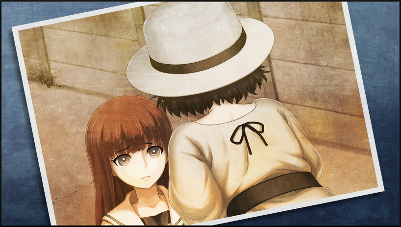

# 亡失流转的寂寥 - 04
> 1.064750  
> [ 2010/12/15 ] 铃羽分享篝失踪情报，冈伦桶子帮忙。真由理准备圣诞派对。冈伦开始察觉自己逐渐“红莉栖”当真人。  

| [←prev](./0053) | [menu](../) | [next→](./0055) |

---

“椎名……？”  
很自然的，我对这个姓有些在意。在未来，桶子他们身边的，姓椎名的少女。  
“铃羽……难道说那孩子……”  
“嗯。她母亲的名字是——椎名真由理。篝是真由姐的孩子。”  
对啊，对于真由理来说，拥有那样的未来也是理所当然的。但是这事实仍旧给了我超出想象的冲击。既然有孩子的话，也就是说有结婚对象吧。然后，结婚对象是我——这种事情是不可能发生的。要说为什么的话……我在 2025 年就死了。  
嗯？……等一下？  
2036 年女孩是 10 岁的话，那么出生时间就是 2026 年左右。虽然需要仔细考证，但是这样就算是在 2025 年死亡的我，勉勉强强……还是有可能……的吧！？  
……不，不不不会吧。就像铃羽出现在桶子面前，我、我也碰上这种事了！？  
“父、父父父……”  
父亲是谁！？实在是没敢这么问。  
“嗯？稍微等下，既然女孩姓椎名的话，姓氏没有变啊？这么说的话……”  
“篝是战争遗孤。真由姐收留了没有归宿的她并抚养她长大。”  
“啊……这的确像是真由喜的风格。”  
听到这些，我居然在双重意义上感到了安心，也稍微陷入了自我厌恶之中。就算真由理在未来和谁结婚，只要她幸福的话，这明明是值得高兴的事情啊……明明应该这样的。  
“我受真由姐之托照顾篝。所以，本来不应该变成这种情况的——  
 那孩子之前一直粘着真由姐，到这个时代谁都不认识，内心肯定一直充满不安……”  
“那孩子为什么会走散？刚才说，遇到了麻烦是吧？”  
年仅 10 岁的她通过时间机器来到未知的时代，能依靠的应该只有铃羽一人。应该不可能离开铃羽独自跑掉的。  
“我也不清楚。但是跳回过去的篝，精神显得相当不安定……”  
原来如此。仔细想想，这也不是不可能。只有 10 岁的少女。突然就被带到陌生的过去世界，不可能不紧张。  
“有关于那个女孩的照片和别的什么吗？”  
“啊，嗯……”  

铃羽拿出一张皱巴巴的照片，上面有两名女性。一名是成熟女性，虽然没有拍到脸，很可能是二十多年之后的真由理。另一名少女面露怯色，就像要躲进成年女性的影子里一样。这孩子就是椎名篝？  
“这孩子应该长到 22 岁了吗……现在变成什么样了，完全想象不出来啊。”  
当然前提是还活着的话。就算日本再怎么和平安全，这么小的孩子想一个人生活下去还是太艰难了。如果运气好的话，她可能受到保护被带到了某处的设施里；如果不是这样的话——铃羽应该也考虑到这种可能性了吧。这种话实在是说不出口。  
“……呐，冈伦，来帮个忙吧。”  
“……毕竟是真由理的养女。这样的话，我也想找到她。  
 不过……铃羽觉得可以吗？对于我来帮忙这件事……？”  
铃羽现在肯定在轻视着我，这个本来还有拯救世界的机会却放弃的我。她会想要我这种人来帮忙吗……  
“……叔叔如果不介意的话，我觉得人还是越多越好……”  
“……这样啊。那就让我来帮忙吧。”  
当然，我并不把这视为赎罪。  
“谢谢。”  

“真由喜的<abbr title="注：“幼女”和“养女”同音">幼女</abbr>怎么了吗\~？”  
突然，在极近距离处传来声音，全员一齐向看过去。  
“嘟嘟噜\~♪冈伦，真的在这等着呢！”  
真由理……  
“……？怎么了？”  
看到真由理，我终于感到了安心。  
“太好了……真由理……”  
握着那双小手，切实地传来了体温。真由理还活着。  
“冈、冈伦？”  
“啊……抱歉……”  
“没事哦……并不讨厌所以没关系啦……”  
“真由姐……你什么时候来的？”  
“嗯？刚刚才到的哟？”  
失算了……太过专注于铃羽的话，没有注意到真由理进入房间。  
“呐呐，我听到真由喜的幼女什么的，到底在说什么呀？”  
“嗯……这个嘛……这个……”  
不妙。虽然真由理知道铃羽是从未来过来的，但是突然听到未来的女儿这种事的话刺激是在是太强烈了。一定要想办法糊弄过去。  
“真、真由理看起来还很年幼——所以被称为幼女，对吧桶子？”  
“诶？啊，没错没错。真由喜像幼女一样可爱！”  
“嗯，经常被人说是娃娃脸呢\~虽然我本人是想变得像由季那样成熟的感觉呢。”  
“可能只有食量这一点像真正的大人吧。”  
“诶嘿嘿\~”  
这并不是在夸你啊，真由理。总之，总算糊弄过去了。  
“对了。说到吃的，冈伦在圣诞节有什么想吃的吗？”  
“圣诞？是说派对的事情吗？”  
“嗯！”  
“随便什么都行。只要是能吃的……”  
“圣诞派对吗……”  
“铃小姐是第一次参加吗？”  
“因为在我们那个时代，没有举办派对的空闲呢。  
 但是曾有一次，爸爸不知从哪里弄来了很好吃的鸡。  
 然后真由姐说要亲自来料理它，被爸爸阻止了……”  
铃羽像是在怀念过去——不，在怀念未来的样子，表情很缓和地望向真由理。  
“虽然只是比平时稍微好吃一点点的饭菜，但就算这样我还是很开心……”  
在通向第三次世界大战的未来里，应该没有庆祝的空闲。就算在这样的世界里，真由理果然还是真由理——她一直都怀着和现在一样，想给大家带来笑容的心情吧。  
“桶子君想要吃些什么？”  
“只要有可爱的女孩纸穿着圣诞服的话，我就满足了哦！”  
“嗯…料理要准备多少呢？虽然是要和由季一起准备的……对了，叫琉华君和菲莉丝也来帮忙吧。”  
真由理的脑子已经装满了圣诞派对的事情了。  
“冈伦有想邀请来派对的人吗？”  
“我？并没有……”  
话说到一半，脑中突然浮现出一个身影。比定屋真帆。虽然她说过圣诞节是要跟家人一起过的……  
“冈伦？”  
“……没，并没有想邀请谁。”  
她会度过一个怎样的圣诞呢？  

送真由理回家之后，一个人在路上，回想起白天的事情。如果——如果那是世界线变动……原因是什么？有谁成功开发了类似电话微波炉（暂定）的东西，向过去发送了短信，这种可能性是最高的。因为就连我们都成功做出来了，这并非不可能的事情。其他可能性的话——不，还是算了吧，那是我的错觉。而且，就算世界线变动了，原因也不在我们这里。已经不会跟我扯上关系了。一个人独处时，就会思考一些不必要的事情。  
……  
我从口袋中取出手机，点击了早已习惯的图标。  
“Hello——”  
“红莉栖”还是老样子，一脸淡然地开口。  
“都这个时间了，怎么了？”  
“没什么……不知怎么想说说话。打扰到你了吗？”  
“并没有。和你说话，反正对我自己也有好处。”  
本来就是人工智能，应该不管什么时间段都不会不方便吧。  
“见到前辈了吧？”  
“嗯。”  
“说了些什么？”
“说了什么……就是报告关于我和你对话的内容什么的。”  
“就这些？有没有邀请去哪里？”  
“……还在说这些吗？你去跟比屋定说说看，肯定又会被发火哦。”  
“因为，前辈可能终于时来运转了，希望她好好抓住这个机会嘛。”  
“红莉栖”不管说多少次，都想帮我和比屋定牵线搭桥。真是的，明明还有别的需要考虑的事情。  
需要考虑的事情……如果是她的话，会不会提供一点提示呢。  
“呐，稍微找你商量一下……想要搜索下落不明的人，该怎么做？”  
“真是突然的问题呢。”  
“身边发生这样的事情了。但是，不知道该怎么做。”  
“跟我说说详情。”  
开始主动问了起来。真的是充满好奇心的家伙。  
“这……”  
“这是不方便说的事情？”  
“……因为不仅仅是我的问题啊。”  
“这样就算是想商量的话也没法开展啊。”  
“也是呢……只按普遍情况来说就行，只是想听听你的意见……”  
“这样的话……最好的就是去找警察。”  
极其理所当然的回答。  
“然后就是去找侦探所或者过去的新闻报道。啊，但是这些应该已经试过了吧……”  
“怎么说呢……”  
“什么怎么说……难道这些都没准备就想去找了？”  
“我也是今天刚知道这事的。稍后去确认一下。”  
就算这么说，篝是来自未来的少女，铃羽自己同样没有这个世界的户籍，所以拜托公共机关基本不可行。  
“在美国有通过探测术和遥视来找人的吧？”  
“难道，你想相信那些完全没有科学根据的东西？”  
“不，只是说说。”  
“那还好。如果你说相信的话，我就再也不想和你说话了。”  
真的是，不管从哪个方面看都和红莉栖一模一样。  
“谢谢，我会参考你的意见的。”  
“祈祷能你找到。”  
“啊……还有……”  
“什么？”  
“啊……没、没什么……”  
“什么嘛。好让人在意。”  
“真的没什么。那么今天就到这吧。”  
“……”  
“……”  
……我到底在想什么啊。真由理说要开圣诞派对，如果可以的话你也来参加——什么的。  
“红莉栖”再怎么说也是人工智能，明明只是存在于计算机中。  
尽管如此，我还是渐渐开始把“红莉栖”当成现实存在的人了吗……  

 

> (to be continued)
---

| [←prev](./0053) | [menu](../) | [next→](./0055) |
