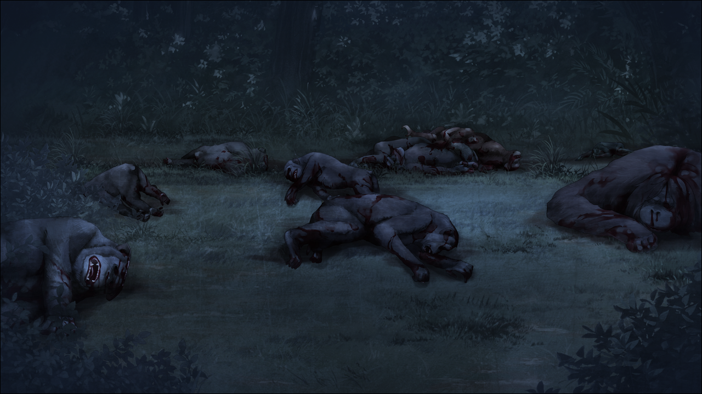

## 亡失流转的寂寥 - 06
> 1.064750  
> [ 2010/12/16 ] 美国 新闻报道AI方面专家失踪，发现猩猩尸体，脑部有缺损。  

——美国，加利福尼亚州。  
“真是的，为什么我非要做这种报道不可啊！”  
被导演要求马上赶到现场的记者——杰西卡·艾蒙德现在非常气愤。自己的梦想是好莱坞，也在电影中出演过一次了，可为什么还得来报道这种莫名其妙的事件呢？  
“无论什么都好，给我工作吧。是你自己这么说吧？”  
“我确实是说过，但是这种事件——”  
“我好心好意地用了你这种过气女演员，你不感谢我还反过来怪我？”  
“你再说一次？”  
“还是说你又要在这里放弃工作逃跑吗？做什么都是半桶水，你这幅样子，小心孩子的抚养权都被人给抢了。”  
“……！”  
女记者对无法还嘴的自己感到悔恨。自己多的只有无聊的自尊。梦想做个女明星去了好莱坞，结果演了个B级电影的小角色后就再没后续，生子后又回到了现实中。这就是自己。但是孩子真的很可爱。无论做什么，哪怕是啃石头，也想养育孩子。  
“那……现场在？”  
“那片树林深处。”  
被催着进了树林，她看到了——  
“呜……”  
那是多具惨不忍睹的尸体。  

新闻播报：“时至今日，国内失踪的研究者已达五人——其中三人是AI领域的研究者。当局怀疑这与反对人工智能技术发展的原教旨宗教主义者集团的暗中活动有关，正在继续调查。接下来是现场报道。杰西卡！”  
“这边由杰西卡·艾蒙德为您带来现场报道。关于今早在现场发现的遗体，最初认为是人类的遗体——警方调查后，确认是多具黑猩猩和红毛猩猩等猿类的尸体。因为一部分尸体的脑部及头部出现缺损，警察将其认定为猎奇性事件，呼吁当地居民加强警戒……”  

 

> (to be continued)
---

| [←prev](./0055) | [menu](../) | [next→](./0057) |
