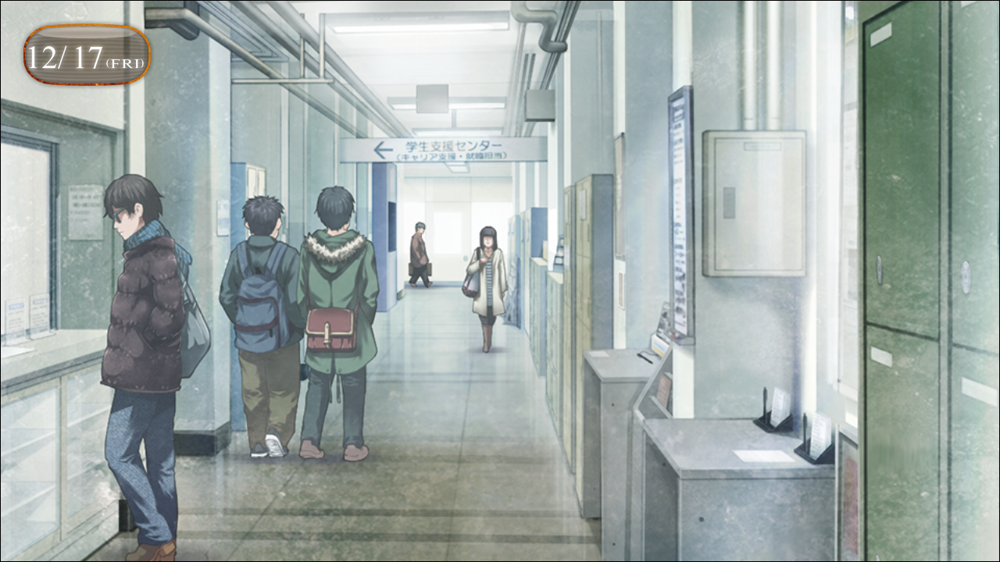
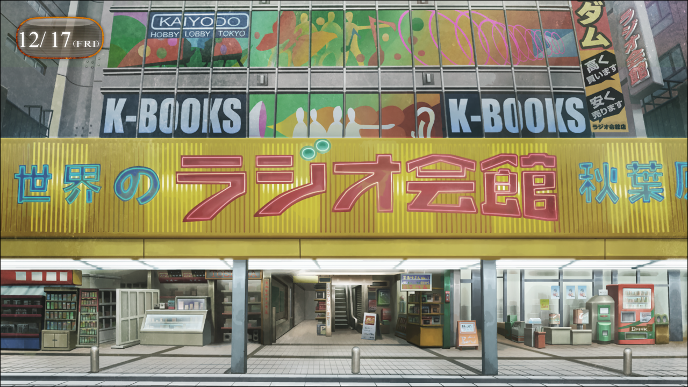
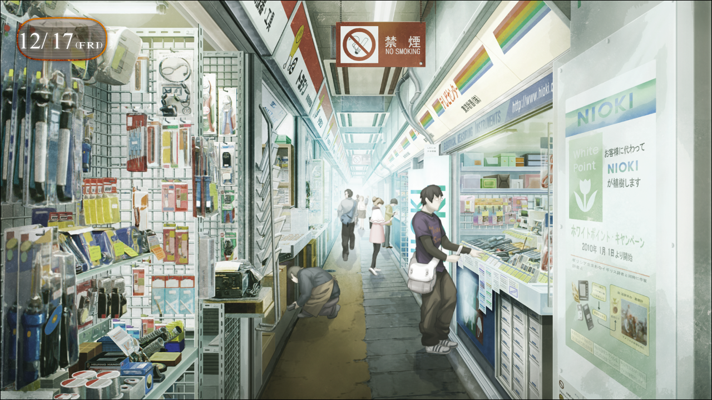
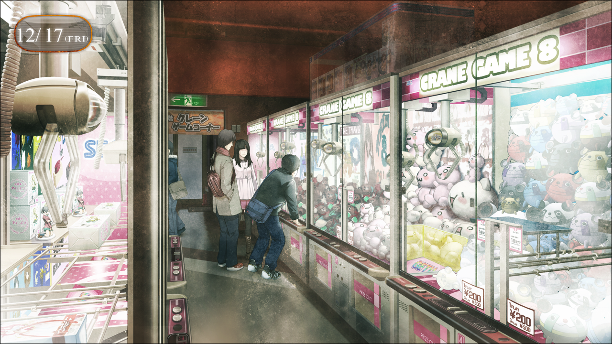
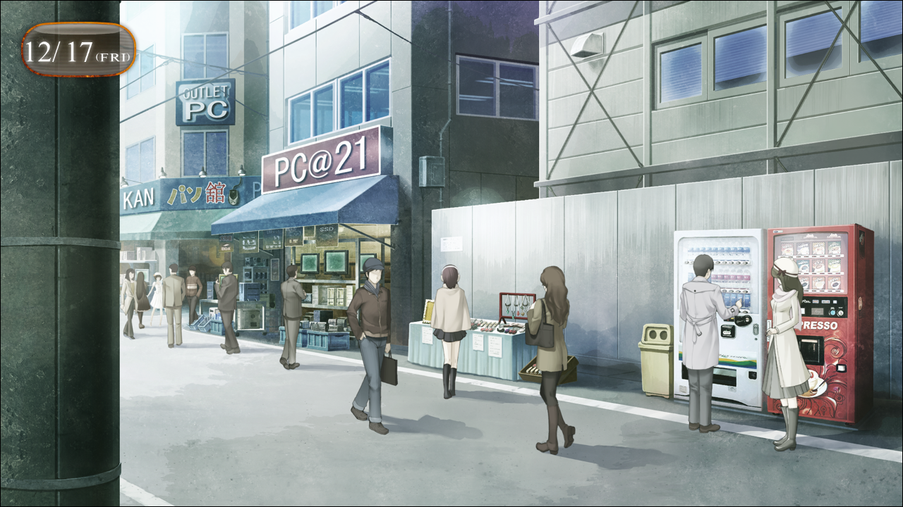
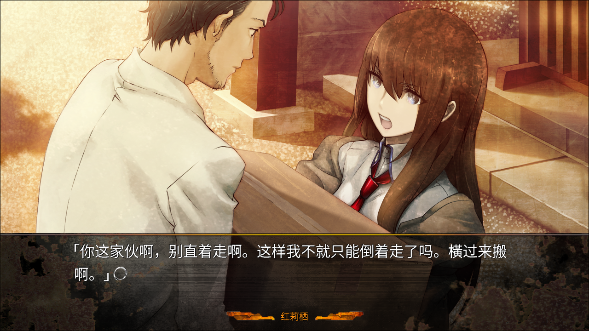

## 亡失流转的寂寥 - 07
> 1.064750  
> [ 2010/12/17 ] 整日搜索篝的线索无果。桶子找来萌郁帮忙。  

“喂，冈部。你之后有课吗？”  
“没，今天没课了。”  
“是吗，那要不去哪吃个饭？”  
“反正又是咖喱吧？<abbr title="（虚构）位于神保町的一家老字号西餐厅。由于性价比比较高，午餐时有很多工薪阶层和学生光顾。特别受欢迎的餐点是咖喱。">东海厨房</abbr>？”  
“昨天有了点临时收入，今天可能去 <abbr title="（虚构）位于神保町的咖喱专卖店。以浓郁的欧洲咖喱而闻名。但是对学生而言算是高消费。店内的薯条可免费追加。">Mondi</abbr> 奢侈一把。”  
“我就算了。这个月手头有点紧。”  
“是吗。那就下次吧。”  
“啊啊。”  
下课后和友人间的对话。已经习惯了这种感觉。夏天之前还觉得大学里没有我的容身之所，现在也感觉没那么糟了。那时我认为自己是特别的，但现在不是了。只要自己主动进入生活的循环中，自然而然地就会有自己的容身之处。人是可以改变的。不，是不得不改变。事到如今，我才明白了这点。真的是事到如今……  
“好，那就回……嗯？”  
转头走向玄关的一瞬间，瞄到了一个熟悉的人影。那是……  
（……雷斯吉宁教授？）  
因为我所在的大学对接受留学生很积极，在学校里看到外国人并不奇怪。但——  
“不见了……”  
慌忙追上去，但已经找不到刚才看到的人影了。  
是我看错了吗？不过想想的话，就算教授来这所大学也不是什么奇怪的事。说不定，就是约好来见我的导师井崎的。而且井崎之前也很想和雷斯吉宁教授保持深度交流的样子。  
（下次见到教授问问吧……）  
最后看了一眼那疑似教授的人影消失的方向，我离开了大学，前往秋叶原。  

从电器街检票口出来，眼前的广播馆一如往常地耸立着。铃羽乘坐的时间机器就安置在屋顶上。想想虽然不是什么常有人来的地方，但这么久还没被发现也真是了不起。这也多亏了菲莉丝，她租下并封锁了广播馆的楼顶。  
不过我也不是来这查看时间机器的。昨天从LAB回家后，收到了菲莉丝和琉华子的回复。琉华子问了父亲，菲莉丝问了管家黑木先生，果然还是没有任何线索。想想也是当然的。如果当年向警察提出搜索请求说不定会有些以前留下的线索，不过我们无法尝试这方面的手段。  
不过菲莉丝还说了一件有意思的事。  
“但是，听说了有麻花辫的幽灵出现的事。”  
“麻花辫的幽灵？”  
“是喵。听说那个幽灵隔几年就出现一次，到处找人问有没有见过一个小女孩喵。  
 而且不论经过多少年样子都不变，最近已经被传说成了麻花辫的幽灵喵。”  
……怎么想说的都是铃羽。她要是知道自己被看作幽灵，会露出什么表情呢？脑补着那个样子，我强忍住笑走向了广播馆。目的当然是为了获得篝的情报。篝和铃羽分开，就是在这个广播馆。也就是说最有可能有线索的地方，也是这里。到广播馆里挨家问了各个店，但没有得到任何信息。想必铃羽之前也这样问过了吧，这结果也在意料之中。但是，也不能因此就这么放弃。  

零件商店，商业设施，甚至是后街小路。我为了打听篝的事，转遍了秋叶原。然而没有得到任何有用的情报。倒是和菲莉丝说的一样，有人提到了麻花辫幽灵的事。但最为关键的篝的行踪，谁也不知道。说到底，如果是有一个孩子被拐卖、遇到事故这种醒目的事件的话，可能会有目击证言。但若是失踪就另当别论了。假设椎名篝是以自己的意志“失踪”的，那么一个10岁的小孩一个人在路上走，也不是那么引人注目的事。还是发生在10年前，就更不可能有人记得了。  
再次思考，这种时候最好的办法是什么？不能依靠警察之类公共机构的话，就只剩——和里世界有关联的人物了。  
里世界……吗？  
说完立刻从脑子里驱散了这种想法。太蠢了。像这种中二病的思考方式，我早就已经摒弃了。  
这么说起来……曾经也有像这样，在秋叶原街上满大街找东西找到筋疲力尽的时候呢。虽然那时的目标是物而不是人。IBN5100。铃羽在过去世界找到的东西，半年前我在α世界线的秋叶原也找过。那时候——红莉栖也在身边。我和红莉栖得知琉华子老家仓库有IBN5100后，合力把那台笨重的PC搬了回来。

回想起来当时那家伙，老是在抱怨着。不服输，又傲慢，但却又比其他人更加害怕寂寞。
“……”  
我又在无意识之间从口袋里掏出了手机。『Amadeus』……可能是因为昨天有数次电话没有接，今天她一次都没有打过来。在盯着那个APP图标一段时间之后，我仍是没有启动它，把手机收回了口袋里。  

“……”
“呜……”
回到LAB就看到了满脸疲态的桶子。不用问，一筹莫展的样子。铃羽不愧是已经持续寻找了半年以上，表情和平时没有变化。桶子看见我也没有问“怎么样了？”这样的话。应该是看我表情就察觉到了吧。  
“稍微想想，到现在为止的搜索铃羽也应该都做过了。我们这种外行人再重新做一遍，根本不可能有新发现的吧。”  
桶子说出了我心中想到却没有出来的话。  
“谢谢帮忙。你们不用勉强自己了，接下来的搜索我一个人就行了。”  
铃羽并不准备放弃。  
“不，等一下，铃羽。我想说的是——”  
“让你们这样勉强自己我实在过意不去。篝这件事也是我自己的责任。”  
“说什么傻话。孩子的责任就是父母的责任啊常考！”  
“爸爸……”  
“呐，刚才的话怎么样？是不是很有爸爸范？说着‘最喜欢爸爸了’抱过来也是可以的哟！”  
“哈……”  
看着这二人，不知为何有种奇妙的感觉。刚刚见面那会完全就是陌生人，现在已经是一家人的样子了。而且按年龄来算，父亲和女儿基本同岁。铃羽先不说，对于桶子来说到底是怎样的心情啊。  
“总之我想说的是，仅仅胡乱地找是不行的。”  
“那，你说该怎么做？”  
“俗话说各司其职，这种情况果然拜托专业人士才是最好的办法。”  
“专业人士？”  
“这种情况，拜托精通里世界情报的人是最妥当的吧常考。”  
和我的思考回路完全一样，我的头开始隐隐作痛。  
“有什么头绪吗？”  
“啧啧啧，别把你爸爸看的太简单呐。我虽然是肥宅但是我的人际关系还是很广的呢！”  
“体型也很宽广呢。”  
“不要开玩笑啊。”  
“话说，你是认真的吗？你真的跟里世界的人有联系？”  
“稍微试着联系一下。”  
桶子这么说着，没等我和铃羽的回应，取出手机开始写短信。难道，是真的？但是，那个世界的人也用短信联络吗？  
“……你怎么认为，叔叔？”  
“如果实际上真有这样的人物的话，拜托一下也是可以的……”  
嘛，想想看，黑客也是在里世界工作的人呢。因为这种人就在自己身边，所以桶子说的那种人也可能是真实存在的。  
“好，发送。接下来就是等回信……”  
桶子的手机立刻传来短信提示音。  
“嗯？”  
“哦？”  
“诶？已经有回复了？”  
“嗯……说是现在朝这边赶过来。”  
“对方真是好说话呢。”  
“总比拖拖沓沓好吧？”  
的确如他所说。桶子又一次编辑了短信，大概是把这边的地址发送过去。接下来只要等那个人过来了。  
接着手机又响了。不是桶子的而是我的。难道是“红莉栖”？看了下来电人，是琉华子。真少见。通常都是顾虑着让真由理传话的，或者就是通过RINE发送短信。话说，难道桶子说的“精通里世界情报的人”是琉华子？日本全国的神社暗藏着搜罗机密情报的网络，琉华子实际上是其中的一员……之类的。……不可能吧一不小心就犯了以前的老毛病。  
“喂，琉华子？”  
“啊，冈部先生。对、对不起，现在有空吗？那个……其实……我，想跟你商量一点事情……”  
“商量？”  
“……现在可以碰个面吗？”  
“现在？电话里不方便说吗？”  
“对……稍微有点……”  
现在吗……这边交给铃羽和桶子真的好吗……  
“……抱歉。接下来这边有客人过来。”  
我很在意桶子认识的到底是怎样的人。  
“这……样吗……”  
“在这之后不行吗？”  
“在这之后，我也有事情……”  
“这样啊……”  
“那、那样的话……”  
在琉华子想要说什么的时候——门外传来上台阶的脚步声，然后是敲门的声音。  
“来了，请进。”  
“抱歉琉华子，客人来了。之后再联——”  
我一时惊得说不出话来。  
“什——！！”  
开门进来的人物，那是——  
(——这家伙！又是她！)  
“…………”  
来人是桐生萌郁。上次见面是在ATF的研讨会上。  
“那个……冈部先生？怎么了？冈部先生！？”  
我什么都说不出口，挂断了电话。  

 

> (to be continued)
---

| [←prev](./0056) | [menu](../) | [next→](./0058) |
