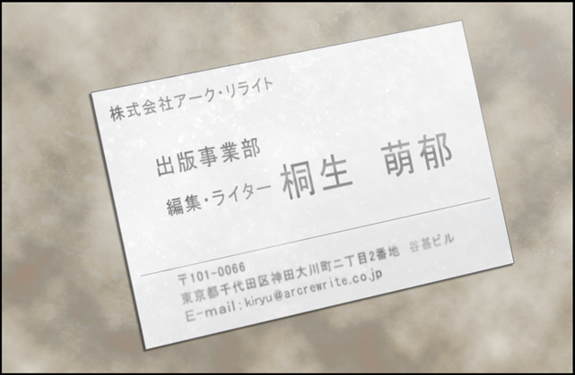
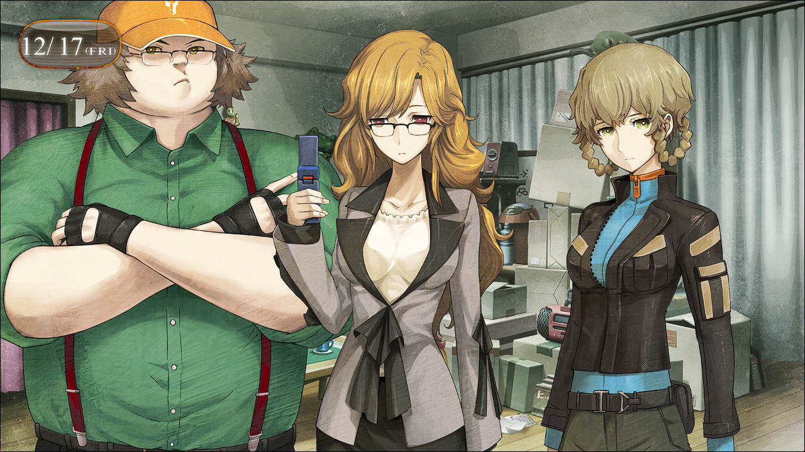

# 亡失流转的寂寥 - 08
> 1.064750  
> [ 2010/12/17 ] 拜托萌郁帮忙找篝。  

| [←prev](./0057) | [menu](../) | [next→](./0059) |

---

“请用茶。”  
“…………”  
“……”  
对面的桐生萌郁沉默着稍稍低着头，我的心脏如同被紧握着一般的钝痛着，沉重的心跳声仿佛在整个屋子里回荡。  
(为……什么……)  
为什么，这家伙会和桶子有联系？脑中浮现出数个问题。  
“怎么了，冈伦？”  
“没什么……”  
“…………？
萌郁微微歪了歪头看向我，我则立刻避开了视线。  
我们和 SERN 没有牵连。  
所以，桐生萌郁不会杀真由理。  
不会杀真由理。  
不会杀真由理。  
不会杀。  
对自己说了数遍之后，总算是平息了胸中的不安。  
“叔叔，脸色很差啊。没关系吗？”  
“别在意……比起这个，桶子……介绍一下。”  
“啊，这位是桐生氏。<abbr title="编辑代理制作的简称，承包来自各个出版社的策划和编辑工作。">编代</abbr>公司的专业写手。”  
“我是……桐生……萌郁……”  

她安静地递过来名片，公司名字是 <abbr title="（虚构）位于秋叶原的编辑出版社。主要业务是撰写电脑系列杂志的文章等。">*Arc Rewrite*</abbr>，职位是出版事业部的编辑、撰稿人。桶子简短地向她介绍了我和铃羽。  
“呐，桶子，你为什么……认识这个人？”  
“之前，桐生氏负责的杂志在制作有关于秋叶原都市传说的特刊。  
 当时她联系我说想就我的工作进行采访。  
 我的工作你也知道，不是那种能公开宣传的对吧？所以我郑重地拒绝了取材。  
 但是，我平时不是一直很注意不留下痕迹的嘛。  
 然而桐生氏却顺藤摸瓜找到了我，这让我很在意。  
 然后见了面，就发现居然是个超棒的美女哦。  
 追寻都市传说的美女写手，怎么可能不萌上她啊常考！”  
然后就这样熟识了吗……  
看着面对美女在那扭扭捏捏的桶子，铃羽板起了脸。虽然没说出来，“明明已经有妈妈了”这种想法已经表现在脸上了。另一方面，桐生萌郁完全不关心桶子这边，还是挂着一张扑克脸在那里摆弄着手机。这家伙，就算到现在也没换智能机，仍然用着翻盖机吗？  
“嘛，虽然不是专门负责找人的，但是她看上去对秋叶原的事情很详细。  
 而且好像也很清楚里世界的东西，所以想着可以试试拜托她什么的。”  
“……听说……在找人……”  
“嗯。实际上，想让你找一个 12 年前在秋叶原失踪的女孩子。”  
桶子给桐生萌郁大概讲了事情原委。桐生萌郁只是沉默着，把桶子话用很惊人的速度输入手机里。我只是沉默着，观察着桐生萌郁的一举一动。过去曾隶属 Rounder 的女人，可能现在也仍是这样的身份。拜托这个女的究竟是不是正确的选择呢？这次和桐生萌郁的接触纯属偶然，就算脑子里已经了解了，但是心里还在排斥着。在这条 β 世界线，桐生萌郁和我们没有任何交集——那是当然的，就是为此我才选择了 β 世界线。为此做出了牺牲红莉栖的选择。  
“……就是说……找到这个名叫椎名篝的人就行了吧……？”  
“就是这样。怎么样？”  
“……可以……试试看……”  
“真的？”  
“……但是……能不能找到……不确定……”  
“当然，那样也是没办法的事。”  
按常理来考虑，我和桐生萌郁本来应该没有交集。当然，在秋叶原街上擦身而过的可能性还是有的。事实就是，上个月 ATF 研讨会时，我见到了要去采访雷斯吉宁教授和比屋定的她。但是，我们之间并没有像现在这样直接的关联——我擅自这么认为。这也是……已经既定好的命运吗？我和桐生萌郁在称为时间的轨迹上有所交集，是类似这样的宿命吗？如果是这样……不用像之前那样躲着她，干脆就借此监视着她的一举一动说不定更好。听着桶子和桐生萌郁的谈话，我一边考虑着这些。  
“那么，报酬就采用成功后结算，其他的必要经费由我们这边支付，ok？”  
“……没问题。”  
“冈伦和铃羽也觉得这样可以吗？”  
“我只要有人帮忙就可以了。”  
“我也……觉得没问题……”  
“那么，既然如此契约成立。”  
“嗯……”  
萌郁微微点头，之后听取了关于篝的线索——比如失踪时的服装，特征样貌什么的，然后离开了 LAB。  

“呼……”  
心里一直紧绷的弦松了下来，我瘫坐在沙发上。  
“叔叔，真的没关系吗？”  
“没事……只是稍微有点紧张……”  
虽然现在才想到，我从口袋里取出镇定剂含在嘴里。  
“叔叔，你认识刚才叫桐生萌郁的人吧？”  
“诶？”  
被看穿了？  
“真的？冈伦什么时候？”  
“……为什么这么认为？”  
“一看就知道了”  
不愧是只有经历过地狱的人才特有的敏锐。  
“……不，不认识……”  
“在 α 世界认识的？”  
“……”  
“知道了，不会继续追问了。我也会相应的保持警戒。”  
“……就目前情况来说这样就行了。”  
“究竟在说什么？”  
“刚才很紧张之类的话啦。”  
“我懂。桐生氏那种巨乳美女，身材拔群又有眼镜娘属性啊，换谁都没办法不紧张呢。”  
“是啊……”  
“……”  
既然已经扯上关系了，就尽可能利用一下吧。  
不知是因为她从面前消失的原因，还是精神安定剂的效果，我已经可以冷静地想往这方面考虑了。只是不知道下次再见到她的时候还能不能这么想。  

 

> (to be continued)
---

| [←prev](./0057) | [menu](../) | [next→](./0059) |
