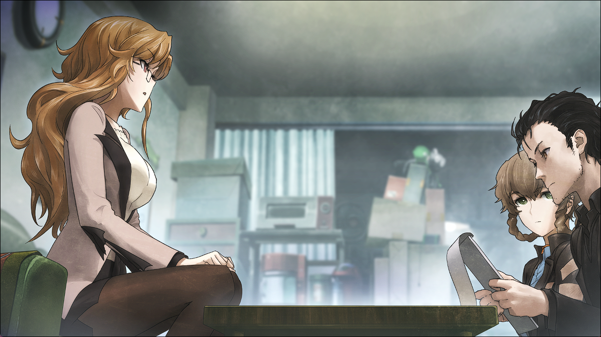

## 亡失流转的寂寥 - 09
> 1.064750  
> [ 2010/12/20 ] 真帆被神秘人袭击，打电话给冈伦求助。萌郁调查到有其他人也在找篝。  

【琦玉县和光市，脑科学综合研究机构·日本办公室&准备室】  

这天，比屋定真帆拼命忍着哈欠，结果并没有忍住，张得大大的嘴巴占据了她娇小脸庞的一半。  
“呼啊~~”  
前一天晚上，和“红莉栖”聊得太尽兴，回过神来已经是深夜，这是主要原因之一。最初的谈话内容还跟试验研究有关，之后话题变来变去，不知从何时起又转到了冈部伦太郎身上。据说是冈部最近几天都无视着“红莉栖”的联络。最初冈部连续8次不接电话时“她”的愤怒，和现在比起来，已经不值一提了。可以说真帆是第一次窥视到了牧濑红莉栖少女的一面也不为过。真帆不禁觉得很可爱。至今被各种调戏的她趁这个机会好好的戏弄了“她”一顿，不知不觉时间就飞快地流逝了。然后，本应该睡觉的真帆却因此异常精神，便取出了红莉栖留下的笔记本电脑。在分析密码时遇到各种各样问题的这段时间里，外面已经天亮了。  
“密码的话……果然，还是拜托专业人士比较好吧……”  
“在说什么呢？”  
“呀！？”  
突然，背后传来声音，真帆吓得差点跳起来。  
“哈哈哈，不至于吓成这样吧？”  
“教、教授。回来了啊。”  
“刚刚回来。”  
雷斯吉宁教授一边说着，放下了手里的便利店袋子。他10分钟之前才出发去吃饭，没想到这么快就回来了。
“话说回来，日本的便利店食物种类好多，真的是太棒了！  
 就算每天吃不一样的便当，一周之后立刻又会有新品便当出现。  
 而且每家店的味道也不同，每天吃便利店便当也吃不厌啊。”  
“只吃便利店便当的话，会营养失衡的哟。”  
“哈哈哈，和 *America* 的食物比起来，这可是相当健康的。  
 再说，关于吃饭这一点，我可不想被 *Maho* 说教呢。”  
“唔……”  
确实，真帆自己也不怎么均衡饮食。不如说很多时候都靠谷物食品和营养剂，是非常不健康的饮食生活。  
“话说，你想要找专业人士拜托什么？”  
“啊……那个是……没什么，没什么啦。”  
让雷斯吉宁教授知道这事也没有什么不妥，但是鬼使神差地真帆还是糊弄了过去。  
“是吗？如果有我能帮忙的事一定要跟我说哟。”  
“非常感谢。真到那时候就拜托您了。”  
真帆边说着社交辞令，边站起来向门口走去。  
“*Maho*？你要去哪？”  
“想着去秋叶原一趟转换下心情。”  
“以转换心情来说，走得还真远呢。”  
“唔……”  
“如果老实说是去见 *Rintaro* 的话我就批准。”  
“不，不是这样的……！”  
“难道不是吗？”  
“顺便……路过的时候去见见也不是不行……”  
冈部在秋叶原建立了一间Laboratory，这是昨天晚上“红莉栖”告诉真帆的。之前他好像在刻意远离LAB，最近又开始出入那里。对于这间LAB，真帆稍微有点感兴趣。  
“哼~~？”  
“先、先声明一下，不是这样的呢！并不是你说的那样呢！”  
“我还什么都没说呢？”  
“唔……总之，今天的研究先到此为止。”  
“帮我和 *Rintaro* 问好。”  

“红莉栖”也好，雷斯吉宁教授也好，真帆无法理解他们为什么总是动不动就想扯到恋爱八卦上。  
（话说，那种也算性骚扰吧，以当今世道来说。）  
最主要的，真帆想要拜访冈部所在的地方并不是因为想要见他。她想要与冈部再当面谈一次，获取些与红莉栖的笔记本电脑密码有关的线索。虽然冈部说不知道，但是真帆认为比起自己的瞎猜，他肯定知道的要多得多。那是从冈部对『Amadeus』的态度上看出来的，也可以说是女人的直觉。  
思考着这些事情，真帆换乘电车，从秋叶原车站检票处出来了。这时候——  
“嗯……？”  
真帆感觉到被谁盯着，回过了头。明明是平常时段，车站却人烟混杂。但是在那些人中没有找到真帆所感觉到的人。  
“……错觉……吧。”  
真帆一个人嘟囔着，再次迈出了脚步。【未来机械研究所】的地址从“红莉栖”那里得知了。虽然对秋叶原的地理位置不是那么熟，不过到了万不得已的时候只要让“红莉栖”当向导就行了。只是，突然到访的话，冈部如果不在该怎么办呢？虽然有些不安，不过如果真是那样就乖乖回去罢了。  
走马观花地扫过各式各样店铺陈列出来的商品，就这样走了一段时间——  
“……”  
果然，感觉到了谁的目光。但是，回头一看也没发现可疑的人。  
“……”  
真帆再次走了起来，转过拐角进入了小路。然后怀疑变成了确信。脚步声——从真帆的背后传来。当然，单纯那样的话是很正常的。走夜路的时候遇到逼近的脚步声就毫不犹豫地加快脚步，马上一个男人就会无趣地从边上超过去。这样的事真帆遇到过好几次。但是，这次情况不同，不知为何真帆如此确信着。她试着加快脚步，然后跟着的脚步声也加快了；放缓脚步的话，脚步声也缓慢了。  
“……！”  
在电影里看到这种情节的话，真帆总觉得换做自己就会一脚踹过去作为见面礼，但是实际遇到这种情况的她却连回头都做不到。真帆焦躁地从口袋里取出了手机。她的脑中没有出现报警这个选项，浮现出的只有现在想要去见的人的名字。她从通话记录中找出那个名字，用颤抖的手指按下了拨号按钮。  
（拜托了……）  
呼叫音与脚步声相重叠。  
（冈部，救我……！）  
脚步声逼近了身边。  
正要忍不住逃跑的时候——  
“喂？”  
电话的那边传来了声音。  
“喂，冈部先生！？我是比屋定！我现在就在你的LAB的附近——！”  
但是，真帆没机会说出更多的话来。感觉到有人从背后紧紧环抱住她的同时，手机从手中掉了下去。  

【LAB·未来机械研究所】

“这个是……？”  
我接过默不出声的桐生萌郁递过来的纸张，提出询问。  
就在十分钟前，桐生萌郁联络桶子说正往LAB过来。然后如她所说地出现在了这里。可以认为她发来联络的时候就已经到附近了。如果谁都不在的话，她会怎么办呢？  
“……报告书。”  
看来这上面记录了至今为止的调查结果。我接过一叠纸的手略微颤抖着。面对桐生萌郁的不安，仍或多或少地残留在我心中。即使这样，大概是在接到联络后马上服用的精神安定剂起作用了，与前几天相比已经好了很多了。  
“怎么样，叔叔？”  
“果然，没这么容易就能找到的啊……”  
“是么……”  
本来多少有些期待的吧，铃羽的声音明显带着些失望。  
“篝……你在哪里，做着些什么呢……”  
我无法回答那个疑问，只是默默地翻着报告书。  
“嗯？”  
“怎么了，冈伦？难道有什么有用的线索吗？”  
“不，虽然不是那样……”  
“让我看看。”  
我直接把报告书交给铃羽，指出了在意的地方。  
「调查中发现了一件令人在意事情：
 在这一两个月中，除我们以外，还有其他人在寻找名为椎名篝的女性。」
“……怎么回事？”  
“……如同你读到的……”  
也就是说——  

这时，突如其来的来电铃声打断了我的思考。现在在讨论重要的事情，平时的话，我都会暂时无视掉，之后再回电的——偏偏这个时候，我不知为何感觉一定要接这通电话。  
“抱歉，我接个电话。”  
“喂？”  
“喂，冈部先生！？我是比屋定！”  
比屋定的声音非常急促，让紧张感急速地升高，我的音量也不禁提高。  
“怎么了，比屋定小姐——”  
“我现在就在你的LAB的附近——！”  
之后，听到了什么东西摩擦的声音和撞击的声音。  
“比屋定小姐？比屋定小姐，怎么了！？”  
然后，电话就这样挂断了。  

 

> (to be continued)
---

| [←prev](./0058) | [menu](../) | [next→](./0060) |
