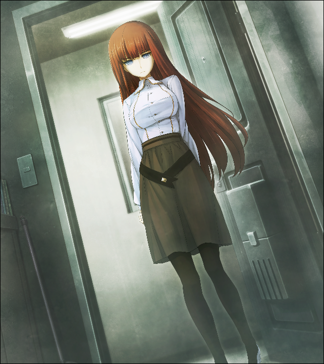

# 亡失流转的寂寥 - 11
> 1.064750  
> [ 2010/12/23 ] 圣诞节不办派对了，改为新年派对。琉华子带陌生失忆女性来 LAB 找冈伦求助，女性长得非常像红莉栖。  

| [←prev](./0060) | [menu](../) | [next→](./0062)  

---

从桐生萌郁那里听到关于椎名篝的报告之后，又过了几天。昨晚确认了一下，据说那之后的调查就没有新进展了。桐生萌郁也有杂志社的校对工作，没有太多时间吧。虽然对寻找椎名篝的家伙感到不安，但也不能让她把原来的业务放下，优先忙这边的事情吧。  
“哈呜\~真由喜非常伤心……”  
“嗯？难道是圣诞节派对的事情吗？”  
“嗯。枫和吹雪酱，有事情了不能来了。  
 菲莉丝酱也要忙着工作，绹酱也要和店长一起过\~  
 桶子说要和由季一起去玩。”  
“不是挺好吗。”  
据说铃羽为此做了许多准备。她一直抱怨为什么桶子不能对由季有个明确的态度。对铃羽来说，这可是有关自身存在的事情。虽说是注定的关系，但也可能因为一些原因而发展不顺利。而且铃羽也想看看，在这个和平年代里，父亲母亲相亲相爱的样子。如果能以此为契机有所进展的话，她也会比较放心吧。  
“真由理圣诞节也在家过比较好吧？前阵子叔叔订了蛋糕哦。”  
“你见过爸爸了\~？”  
“在家附近偶然遇到的。说是为了给真由理惊喜，一鼓作气订了一个大蛋糕。”  
“这样啊……嗯\~那，还是回家吧。”  
“啊，话先说前面，刚才的话当作没听见吧，难得叔叔给你的大惊喜。”  
“嗯，我知道啦。但是冈伦圣诞节要怎么办？”  
“没有什么特别的计划啊。我家本来就是不会过这类节日的。”  
大学的家伙们说要开“只有单身男性的圣诞节饮酒会”，而我没有被邀请。不管否认了多少遍，那些家伙们还是把真由理当作我的女朋友，还各种羡慕嫉妒恨。  
“没记错的话，你说了想要圣诞老人的礼物之后，结果早上起来枕头旁边放了蔬菜对吧？”  
“不管怎么看都是昨天卖剩的。抱怨之后，还反过来教训说我们家又不信基督教。”  
仔细想想，那种教育下真亏我没有踏入歪门邪道啊。……不过，也很难说我所走过的路有多正经。  
“圣诞节过完了之后，有 CM，然后就是正月了。一年一眨眼就过去了呢\~”  
“是啊……”  
也不能说是一眨眼吧。因为我，无数次地重复了那个时间。不如说是非常漫长的一年。  
“对啦！呐，冈伦。虽然圣诞节派对不能开了，但是开新年派对怎么样？  
 大家一起去参拜\~然后一起吃年夜饭\~说今年也请多指教\~”  
“……啊，挺好的嘛。”  
“对吧对吧\~嗯，之后要问问大家呢\~”  
真由理那么说着，缓缓的站了起来。
“那么，真由喜接下来要去买东西了\~”  
“买东西？”  
“嗯。吹雪酱的 cos 服，突然需要一个小物件。”  
“这样啊，路上小心哦。”  
“嗯。”  
“对啦，冈伦，琉华君好像有事情要和冈伦商量。”  
“啊……”  
说起来，之前琉华子打过一个电话。那时桐生萌郁来访，还发生了很多的事，让我完全把这件事抛诸脑后了。如果是琉华子，可能因为我那句“之后再联络”的关系，而一直在等着电话也不一定。  
“我知道了，我会打电话过去的。”  
“嗯，拜托了\~那，我出门啦\~”  
真由理穿上了外套，向我挥了挥手出去了。  

那，给琉华子打电话吧。话说回来……要商量什么呢？不会又说想变成女孩子……之类的话吧。不，怎么说也不会是这个吧。那是因为电话微波炉（暂定）的存在，才第一次听到的请求。那到底是……算了，问问就知道了。  
……  
（琉华子这家伙，不接啊……）  
没办法。总之发个 RINE 吧。输入……发送——  
「对不起，上次电话的事情，我给忘记了。」  
然后稍微等了一下琉华子的回复。但是给琉华子发送的 RINE，一直显示着未读。是在忙什么事情吗？有一瞬直接去琉华子家的神社的想法，但是既然在忙的话只会给他添麻烦吧。之后会在方便的时候回信的吧——  
就在那么想的时候，LAB 外面的楼梯传来了脚步声。桶子——好像不是，桶子的话会有更重的咚咚声。  
“请进。”  
“你好……”  
“琉华子……？”  
“太好了，冈部先生在这里。”  
来者正是刚才想要联系的琉华子。  
“对不起。之前的事情我忘记了。我刚才给你打电话……”  
“诶？啊，真的……对不起。我真是的，居然没有发现。”  
琉华子查看了手机，脸上摆出了十分抱歉的表情，好像对没接到电话都有罪恶感一样。  
“啊，没关系哦。比起这个，很冷吧？快进来。”  
“啊，好的……”  
虽然这么答复了，但是琉华子好像很在意身后的样子，在那里踌躇着。  
“那个，冈部先生……那个……关于要商量的事……  
 其实……之前有个人想让你见见，我把她带来了……可以吗？”  
“想让我见的人？”  
“这位……”  
琉华子稍稍让开了身体。然后，从她背后，出现了一位女性。  
“那个……初次见面……”  
“——！”  
诶？不会吧……站在那里的是……  

“红莉栖……？”  
“请多……指教……”  
“请，请……用茶。”  
“谢谢……”  
我将瓶装茶倒在杯子里递过去，非常努力地不让拿着杯子的手颤抖。那位女性用几乎听不到的声音道谢。然后我坐到对面的沙发上，再一次仔细端详了她的脸。  
（……真像）  
不是像琉华子。眼前的女性长相和那家伙——牧濑红莉栖非常像。不管是茶色的头发，还是上挑的眼睛，亦或是淡然的脸庞。除了好像没有展现出要强的一面，可以说就像同一个人。第一眼看到她的时候，我震惊得心脏都要停止跳动了。但是仔细看的话，还是有一些不一样的地方。比如说……胸部大小什么的……  
“…………?”
年龄和我差不多大吧？可以看得出比琉华子大。记得琉华子好像的确有姐姐的……难道就是这位吗？老实的样子倒是感觉和琉华子很像……但是好像听说过他的姐姐和弟弟不同，更加活泼一点。  
“冈部先生？”  
“啊，没……那么，琉华子——”  
“琉华……子……？”  
“啊，失礼了，我是这么叫他的。因为……像女孩子一样。”  
想了想也是一种失礼的叫法。但是已经成为了口癖，想不出有其他的叫法了。  
“原来是这样啊。”  
女性的表情稍微缓和了。果然——很像。我轻轻吐了一口气，让心跳缓和了。  
“那么，琉华子……这位是……？”  
“那个……我之前说过了吧？父亲的朋友来我家住。”  
“啊啊。你说过……就是这位？”  
“是的。”  
被吓到了。  
“因为说是琉华子父亲的熟人，我还以为是个更年长些的人。”  
“啊，不是。更准确地说，她是父亲那位熟人带过来的……”  
“这样啊……”  
所以这位应该不是说晴海之类的话题的那个人吧。稍微安心了。  
“然后，要谈的事情就是关于这位的……”  
“在此之前，请先把名字告诉我吧。总不能一直叫她‘这位’吧？”  
“…………”  
听完我的话，面前的女性的表情沉了下来。难道我说了什么奇怪的话吗？  
“……其实要商量的，就是这件事。  
 那个……想要知道这个人是谁……那个，应该怎么办……”  
我不能立刻理解这句话的意思。  
“……等一下，琉华子，什么意思……？”  
“……好像是……记忆丧失……”  

 

> (to be continued)
---

| [←prev](./0060) | [menu](../) | [next→](./0062)  
