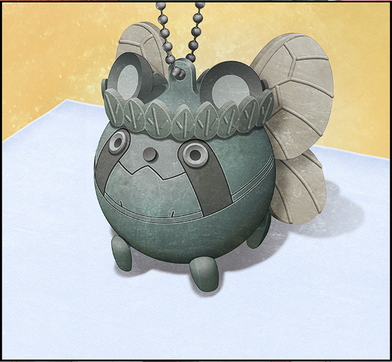

> <big> **亡失流转的寂寥 - 12** </big>  
> 1.064750  
> [ 2010/12/23 ] 铃羽发现，琉华子加借住的失忆女性居然就是失踪已久的篝。  

我惊讶地看向女性，想要再进一步确认。  
“记忆……丧失？”  
“是的……”  
“这样的话，名字也？”  
“是的……”  
“就连从哪里来也忘了？”  
“是的……”  
“为什么……”  
“我不清楚。”  
理所当然的，因为不知道这些事才能称为记忆丧失。  
“但是，为什么要介绍给我？”  
“我觉得冈部先生的话，也许知道取回记忆的方法，所以……  
 就是，冈部先生，说过很多人脑还有记忆什么的，很难的话题……”  
“不管怎么样都可以！只要有办法能让我找回自己的话！”  
“等、等一下，我的确有说过那种话，但我只是对这方面有兴趣而已，并不知道什么专业的知识……”  
我只是知道脑的功能和构造的程度，也知道记忆丧失的字面意思。但是如果突然问我找回记忆的方法，那就是另一回事了。就算有最高级的医疗设施也做不到吧？若是像『Amadeus』一样，把记忆事先存到了其他地方的话倒是另当别论。  
“这……样啊……”  
对于我的回答，女性显然很失望。  
“既、既然这样，有什么可以调查身世的方法呢，加奈好像真的非常痛苦……”  
“加奈？”  
“<abbr title="暂时的名字，日语为“仮の名前(kari no namae)”，简称为“仮名(kana)”，直接翻译是“暂名”，用作人名则翻译为“加奈”">因为是暂时的名字所以叫加奈</abbr>，琉华的父亲起的……说是没有名字很不方便。"  
“还、还真是随意啊……”  
这样真的可以吗……  
“因为也不会一直用这名字，所以这种程度就够了，他是这么说的……”  
原来如此，虽然不知道这算不算深思熟虑……  
“冈部先生，有没有什么方法呢？至少只知道名字也好……”  
“我虽然也想帮忙……果然还是去拜托信用调查社之类的比较好吧？”  
“信用调查社……侦探之类的吗？”  
“嗯。但是就算那样，没有线索的话还是很难找的吧。有没有带着钱包或者手包之类的东西？”  
“这一类的好像都没有……”  
“都没有？不是非常重要的东西也可以，一件两件可以作为线索的东西就行。”  
“……我只有一个……但是，不清楚这个能不能作为线索……”  
加奈小心翼翼地把一个手绢包拿了出来。里面包裹着的，就是那个“唯一一个拥有的东西”吧。  
“可以让我看看吗？”  
“可以……”  

“啊咧？莫非是有客人来了？”  
加奈打开手绢包的同时，玄关传来了真由理柔和的声音。应该是买完东西回来了吧。她身后跟着铃羽。好少见的组合啊，是在来这里的路上汇合的吗？  
“啊，真由理酱。”  
“啊~ 琉华君！”  
“琉华哥，那位是？”  
“那个，是住在我家的客人……”  
“……”  
加奈微微低头行礼。  
“哇啊~”  
真由理不知道为什么用着很高兴的音调，看着加奈手绢里的东西。  
“那个，是乌帕吧？”  
“啊……”  
的确，加奈手心摊开的白色手绢上面，放着一个已经褪色的乌帕钥匙圈。  

“你喜欢乌帕吗？真由氏也是，最~喜欢乌帕了~~”  
“…… ”  
“难道，这就是线索吗？”  
老旧的乌帕钥匙圈，这样的东西能当作线索吗？  
“但是，这个乌帕，是什么时候的东西呐？好像很旧的样子……”  
这么一说确实如此……乌帕是《雷NET翔》这部动画的吉祥物，其商品问世，也只是数年前的事。但是眼前的乌帕，看起来已经有相当的年份了。  
“这个，原来不是绿色的嘛？因为这个是‘森之妖精先生’版本的嘛~”  
“森之妖精先生？”  
“嗯~之前放映的电影里出现过。看~真由氏也有这个~但这里的设计有点不一样。”  
即使她用手指着，我也完全不清楚哪里不一样。  
“这个钥匙圈啊，一直买不到，所以一~直在找它呢。  
 然后不久之前，琉华君发现后买给我了~呐？”  
“嗯，偶然看到店里有卖……”  
“但是好奇怪啊。之前的电影商品的话，应该是在不久之前发售的啊。为什么这么旧……嗯？”  
“唔……！”  
这时我才突然发现，加奈的脸色已经相当糟糕了。  
“……哈啊……哈啊……”  
“没、没事吧，加奈小姐？”  
“身体不舒服吗？”  
“没关……系……”  
“啊！”  
琉华子慌乱地支撑起了摇摇晃晃地想要站起来的加奈。  
“对了，喝点什么冷的东西吧……”  
我正要去冰箱拿矿泉水的时候，发现了铃羽用愕然的表情看着加奈。  
“……”  
“铃羽？”  
“不会……吧……”  
“诶？”  
令人惊讶的是，不止是加奈，就连铃羽的身体也在微微颤抖。  
“假的吧……那个……那个乌帕……”  
“怎么了？铃羽？”  
“我知道。那个乌帕……那是……”  
“喂……铃羽！”  
“哈啊，哈啊…………”  
加奈摇摇晃晃的向着铃羽走了两步，三步。  
难道——不、不可能吧——但是——  
“……难道，你是……”  
“哈啊……哈啊……哈啊……”  
“篝……？”  
什——！  
“……你是篝——椎名篝吗！？”  
“——！”  
这句话，让加奈瞪大了眼睛。  
“……”  
然后她慢慢地倒在了那里。  

 

> (to be continued)
---

| [←prev](./0061) | [home](../../) | [next→](./0063) |
