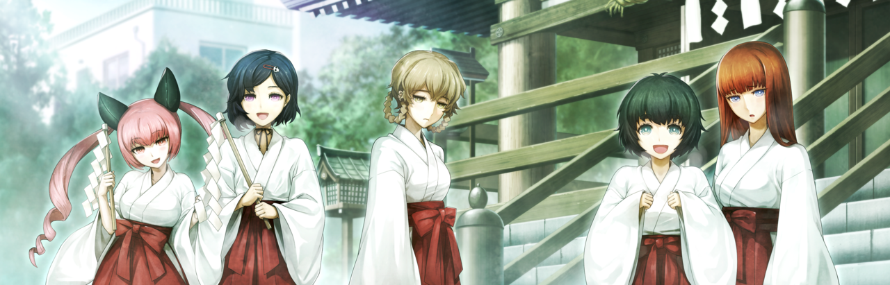

# 轨道秩序的日蚀 - 05
> 1.064750  
> [ 2011/01/01 ] 新年参拜 下。真帆打探冈伦女朋友，察觉红莉栖在他心中的地位。冈伦逃避回答。  

| [←prev](./0066) | [menu](../) | [next→](./0068) |

---

新年的柳林神社，尽管不能跟跟神田明神神社相比，但仍然是超乎想象的热闹。  
“啊，是冈伦他们喵！喂，冈伦！这边，在这边喵！”  
“新年快乐，各位。”  

琉华子很适合巫女装这件事已经不用多说了。另一边菲莉丝虽然装备着猫耳，但是跟平时的女仆装相比显得相当的质朴。但是，这也让人感到很新鲜，如果是粉丝团的那群人应该会按捺不住吧。  
“新年快乐喵！”  
以两人的问候为开端，桶子、由季和一同前来的人们开始互相进行新年的问候。  
“哦哦，菲莉丝碳！菲莉丝碳变成猫耳巫女什么的，活着真是太好了嗷！”  
“谢谢喵！”  
“由季小姐也来了啊。”  
“新年快乐，铃羽。”  
“啊，啊啊……新年快乐。”  
铃羽嘛，印象中总是穿着粗制又便于行动的衣服，原来如此……现在这样子说不定也不赖。至少这种完成度完全不会联想到这是桶子的女儿。这时候要是再加上笑容就完美了。  
“妹属性巫女来了耶————！那么说说看，‘到注射的时间了哟，哥哥！’”  
“真是的，就因为你老是说这些话，妈妈才会产生误解啊。”  
“误解？”  
“从真由姐那里听说了哟，妈妈觉得自己不怎么受你的喜欢。”  
“为什么会变成这样？我对铃羽自不必说，对阿万音氏、菲莉丝碳还有琉华氏，  
 明明对女孩纸都是同等喜欢的。”  
“所以说，这样子是不行的啦。”  
“那个，你们俩从刚才开始在说些什么呀……？”  
“啊，没什么，没说什么。对了，这里有御神酒和神签，要试试吗？”  
正如铃羽所说，桶子自己不稍微注意一点的话，真的会有可能导致铃羽不会出生呢。待会好好说说他。  

枫：“话说回来，琉华君依旧是那么美呢……”  
“不、不，哪有……”  
吹雪：“真的真的，而且居然是男孩子什么的，真的难以相信啊。”  
比屋定：“诶！？骗人的吧……你，是男孩子吗？”  
“啊，是的……”  
比屋定：“骗人的吧……日本果然好先进呢……”  

绹：“那个，喵咪姐姐。”  
“嗯？怎么了喵？”  
绹：“真由理姐姐在哪？”
“真由喜？记得刚刚的确是在御神酒那边的……啊，在那喵！  
 真—由—喜—！快来这边喵！冈伦他们来了喵\~！”  
因为菲莉丝的呼喊，终于发现我们的真由理，牵着篝的手，一路小跑着过来了。  
真由理：“啊，冈伦……那个……新年快乐！”  
篝：“新年快乐，冈部先生。”  
“啊，新年快乐。”  
“那个……怎、怎么样，冈伦？这身打扮合不合适啊？”  
“嗯？啊，超乎想象的合适。”  
“真的！？诶嘿嘿\~太好了。”  
真由理脸上一直挂着的紧张，变得放松了下来。  
“在 *MayQueen+Nyan²* 活动的时候不也 cosplay 过吗？现在明明就没什么好紧张的啊。”  
“那个因为是工作所以没关系。”  
如果是工作就没事，如果是私下里就不行什么的，真是无法理解的理由。而且，就算是这次巫女的事，因为会付工资所以也算是工作呀。  
“呐，冈部先生，我这身怎么样？合适吗？”  
“啊……篝小姐也是，很合身。”  
“耶！太好了！对了，之后请一起拍张照吧？”  
“拍照？倒是没什么问题……”  
“你看，有照片话就会留下记录了吧？我，想把现在的时间好好地记录下来，为了不会再遗忘。”  
并不是因为新年的原因才显得很开心，篝在这几天时间里已经完全变开朗了。虽然之前因为失去记忆而不安，看上去战战兢兢的，她本来应该是像现在这样的孩子吧。在和真由理、琉华子一起做新年准备的这段时间里，看样子是开始渐渐找回了一点自己原来的样子。  

枫：“哇，真不愧真由理酱，穿着好合适！”  
真由理：“是这样吗？稍微有点害羞呢\~”  
吹雪：“嘴上这么说，明明就不会害羞。”  
真由理：“诶嘿嘿\~”  
枫：“啊，这位是之前提到的，那个……”  
篝：“啊，我叫篝，椎名篝。”  
吹雪：“真的呢，和真由喜是一样的姓氏呢。”  
篝：“嗯，真巧。”  
虽然并不是巧合。  
吹雪：“嗯……篝的身材也好棒，应该很适合 cos 的。”  
枫：“啊，我也这么觉得……”  
篝：“cos？”  
吹雪：“ cosplay。呐，你有喜欢的角色吗？”  
篝：“那个……我不太懂这个。”  
枫：“吹雪酱！”  
吹雪：“啊，这个……抱歉。”  
篝：“啊，没什么，别在意，没关系的。”  
真由理：“呐，冈伦也来这边，真由喜来给你消灾避邪吧\~这个叫……那个，那个……叫什么来着？”  
“这叫<abbr title="神道教祭祀时使用的道具。在红淡比的树枝前端挂上纸垂，对着祓除对象挥舞，将秽气从对象身上转移至大币内。">大币</abbr>，真由理酱。”  
真由理：“对对，大币\~”  
“为了消灾避邪，首先要先向神明大人双手合十祈祷呢。”  
篝：“啊，是呢。那么在这之后，我也给你祓除吧。”  
“好，那就拜托你了。”  

用水清洁了一下，我们开始在神殿内参拜起来。仔细想想，像这样在这里认真地双手合十，说不定还是第一次。这时候比屋定来到了我的身边。  
“许了什么愿？”  
“嗯？啊……希望世界和平，这样的。”  
“又像这样岔开话题……”  
我并没有说谎。不过，明知道这个愿望并不能实现，这么做也称不上是赎罪。  
“说起来他们还真慢呢。”  
“嗯……？”  
“教授他们。我说要来新年参拜，他们也一副很想来的样子，就把地点告诉他们了……”  
“诶？是不是在什么地方迷路了？”  
“因为莱耶丝教授也在，可能顺路绕道先去哪里了吧。”  
教授们一来的话，感觉应该会变得更热闹。  
“话说，是那个女孩子吗？”  
“什么？”  
“冈部先生的女朋友。那个，是那位叫真由理的吧？”  
“真由理和我并不是这样的关系。”  
“真的假的？那，是哪个人？”  
“谁都不是。我没有女朋友。”  
“真的？明明有这么多可爱的女孩子围着你？冈部先生难道是……”  
“？？？”  
“啊，不过没关系，我对此并没有什么偏见。”  
……好不容易明白了她想要说什么。  
“我说啊……不是这样的，没这回事。”  
“是吗……那为什么，不交女朋友呢？”  
“……你啊，明明不久前还在狠狠批评‘红莉栖’，现在却问着同样的事情啊。”  
“啊……你这么一说还真是。人呐，明明扯上自己就很讨厌，扯上别人就充满好奇。我有必要反省一下。”  

“冈伦\~我要用<abbr title="真由理把“大币”搞错了">‘大仁田’</abbr>帮你‘唰唰唰’了！快来\~！”  
“……稍微失陪一下。”  
“好的……”  
“果然……是因为有红莉栖了吗……”  
真由理突然招呼我过去让我有了绝妙的借口逃避这个话题，离开时这样的轻声低语传到了我的耳朵里，但我还是装作没有听见。  

 

> (to be continued)
---

| [←prev](./0066) | [menu](../) | [next→](./0068) |
