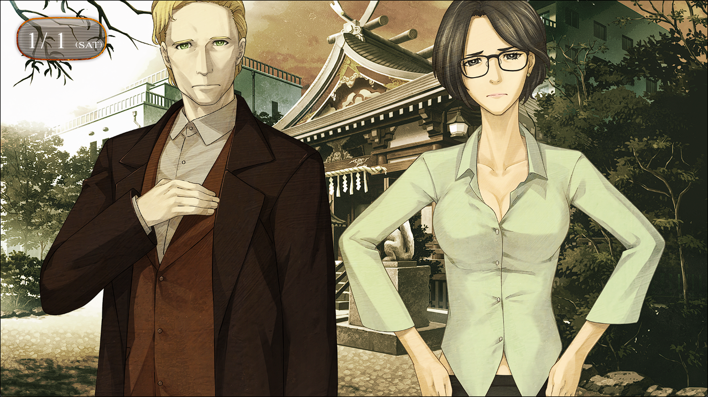
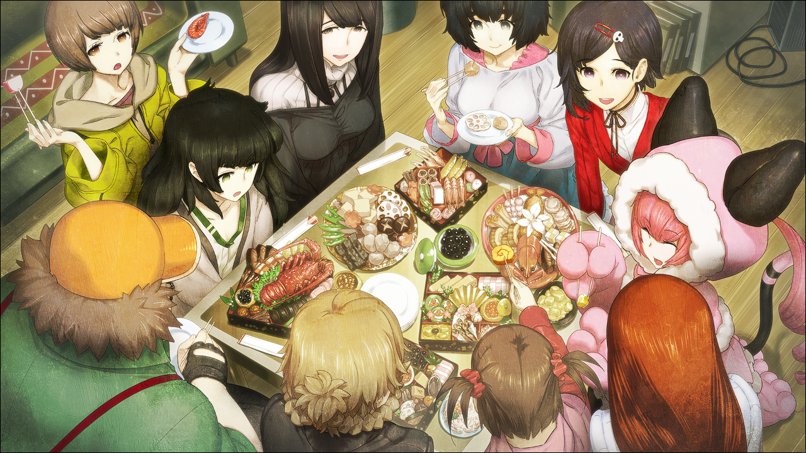

## 轨道秩序的日蚀 - 06
> 1.064750  
> [ 2011/01/01 ] 新年派对 上。LAB终于热闹了起来。  

2011年最初的一天，本来应该只是新年参拜的，却在各种拍照和聊天之间，流逝到了黄昏。  
“久等了喵！”  
“呼。穿着那衣服肩膀好酸呢。”  
菲莉丝和铃羽换回了平常的穿着，我们也终于感觉回到了日常。  
吹雪：“啊咧？真由喜她们呢？”  
“还没换完衣服，说是稍微等一下喵。”  
真由理和琉华子还没有出来。  
“我说我说，冈伦，说到换衣服，难道真由喜和琉华氏是在同一地方一起换衣服？”  
“不，真这样的话很糟糕的吧……”  
“‘呀，琉华君~，帮我把背上的拉链拉开~’  
 ‘这、这怎么可以……我怎么能做这样的事……’  
 ‘琉华君~，这边也拜托你了~  
 里面会不会是这样的对话啊，哈啊——哈啊——”  
“呐，冈部先生，这人没问题吗？”  
比屋定和桶子接触才不过数次，很明显对他抱有警戒心。  
“桶子虽然言行有点那个，但并不是危险人物所以不用担心。”  
“而且是超级嗨客喵！”  
“应该叫黑客的吧常考！”  
“黑客？真的吗？”  
“虽然不能大声宣传，不过确实在干像这一类的事啦，有什么要帮忙的拜托我也是可以的哟。”  
“哦~这样啊，这样的话……”  
“*Oh，NOOO!*”  
比屋定被突如其来的声音吓到，循声望去，在那里的是……  

“*Where? Japanese shaman girl在哪, Rintaro?*”  
雷斯吉宁教授和莱耶丝教授一脸悲痛地走了过来。  
“明明听真帆说，来这边就能见到 *Japanese shaman girl* 了呀，根本没有啊！”  
“J、Japanese shaman girl?”  
“是指<abbr title="雷斯吉宁他们理解中的“巫女”就是日本萨满少女">巫女</abbr>。”  
啊……原来如此，多亏比屋定替我解释。她接着对教授他们说道：  
“今天巫女的出场已经结束了。”  
“*Holy cow! So I said we should come soon!*”  
“But you just enjoyed shopping too!”  
两位教授开始互相抱怨，手里面都拎着很多电器商店的福袋，看来是来这之前买了不少东西啊。  
“*That's enough!* 双方都有错。”  
“*Hmm……*”  
两人没有隐藏失落的情绪，垂头丧气地开始望向神社。这时真由理和琉华子刚好从里面走出来。  
“久等了，冈伦~”  
“有点久呢，真由理。”  
“嗯。琉华君的妈妈呢，给了好多年节菜哦，说是跟大家一起吃！”  
“妈妈说把这个带过去，这个也带过去……等重新打包好已经到这个时间了。真是抱歉。”  
“不，我们才是，受到这么多关照真是不好意思。”  

“*Excuse me?* 稍微打扰一下可以吗？”  
应该是被提前告知过，雷斯吉宁教授找上了琉华子。  
“诶？啊，好的。”  
“参拜……这个到底要怎么做呢？”  
“啊，那个……*First of all, we should purify our hands and mouth there.*”  
“什……！”  
“*I see……*”  
“*Please come with me. I'll show you how to do.*”  
雷斯吉宁教授和莱耶丝教授在琉华子的带领下前去参拜了。虽然觉得会不会有什么宗教问题，但既然他们本人都不介意的话，旁人也没什么好说吧。比起这些……  
“琉华子……好厉害啊……没想到英语说得那么好……”  
“因为琉华君很聪明呢~”  
是……这样子吗。  
“而且，因为来秋叶原观光的人很多，为了能应对别人的问题，用功学习过呢。”  
我还是第一次知道琉华子这一令人意外的一面。  
“说起来，真由理，篝怎么样了？”  
“啊咧？差不多该出来了……啊，来啦来啦，快看~”  
“抱歉，久等了。”  
这样就全员到齐了呢。接下来就只要等琉华子那边的事情结束——  
“*Thanks a lot. We had a wonderful experience!*”  
“*Not at all.*”  
“那么，向LAB出发吧。”  
“啊，虽然之前说好了……实际上我之后有急事……”  
“诶？由季不来吗？”  
“对不起，真由理酱……打工的地方缺人手，说是无论如何都要我去帮忙……”  
“这样啊……那就没办法了……”  
我看向了桶子和铃羽，他们也是很失望的垂头丧气的样子。  
“教授们之后有什么安排？”  
“我之后有事……”  
“我也一样。”  
“今天非常感谢，有很棒的发现。虽然没有见到 *Shaman girl* 呢。”  
“真的呢，非常 *Exciting* 呢。”  
“那么再会了。*Rintaro*，偶尔也去见见 *‘Kurisu’* 啊！”  
“那么各位再会。*See you soon!*”  
两位教授笑着道别后，便消失在秋叶原的喧嚣中。  
“那我们也走吧。”  
“是啊。”  

虽然途中由季独自离开了,但我们回到LAB的人数还是比来时多了一倍。  
真由理：“那么再正式来一次……新年快乐！”  
大家：“新年快乐！”  
真由理：“嗯~琉华君家的年菜，好好吃啊~”  
琉华子：“真的？我和篝都帮忙做了，你这么说我真是太高兴了。”  
篝：“嗯~哼！没啦，我其实只是帮忙装盘的。”  
绹：“我超喜欢这个甜鸡蛋烧！圆圆哒滑滑哒！”  
桶子：“这边的杂煮也是超绝品。铃羽，怎么样？”  
铃羽：“嗯，很美味。”  
菲莉丝：“这其实是 *MayQueen+Nyan²* 的正月菜单喵！”  
桶子：“呜呼！弹弹的软软的，有菲莉丝碳的味道哦~”  
吹雪：“桥田先生真是个HENTAI呢。”  
经过一整天已经看够桶子的变态行为了吧，现在吹雪对桶子的吐槽几乎已经变成机械式的了。要吐槽这家伙的所有变态行为也是够累的。  
比屋定：“在美国马上就会被告性骚扰哦。”  
枫：“话说，美国的新年都吃些什么？”  
“不清楚，不是火鸡吗？”  
枫：“那不是圣诞吗？”  
比屋定：“在美国大家会在12.30闹，过了年反而很朴素，吃豆料理什么的。”  
桶子：“正处于对豆料理的发音悸动的<abbr title="在汉语中这个成语专指少女的十三四岁。这句发言的梗我没有完全了解，推测是日语中“豆”【まめ，mame】，跟“魔鬼灭亡”的“魔滅”【ま めつ，ma metsu】是谐音，这也是日本撒豆驱鬼习俗的来历（这里撒的豆子必须是炒熟的黄豆）。如果是中二病的话，会将“豆料理”的发音联想成“魔灭料理”的帅气感觉而悸动不已。如果是这样的梗，中二的年纪恰好也在十三四，翻译成豆蔻年华就比较巧妙且能体现变态感。">豆蔻年华</abbr>。”  
吹雪：“桥田先生真是个HENTAI呢。”  
菲莉丝：“绹喵，看这个栗子团，很好吃喵！”  
铃羽：“这边的黑豆也不错啊，看起来营养价值很高。”  
绹：“这个、那个……我吃不了那么多啦。”  
篝：“不用着急，慢慢咀嚼再吃下去。”  
琉华子：“呵呵，篝像妈妈一样呢。”  
真由理：“诶~嘿嘿，果然人多才高兴呢，冈伦。”  
“嗯，是啊。”  
上次这么热闹是多久以前了啊……不，那是α世界线的事——也就是说，在我们所处的β世界线上，还是第一次这样热闹。  

 

> (to be continued)
---

| [←prev](./0067) | [menu](../) | [next→](./0069) |
