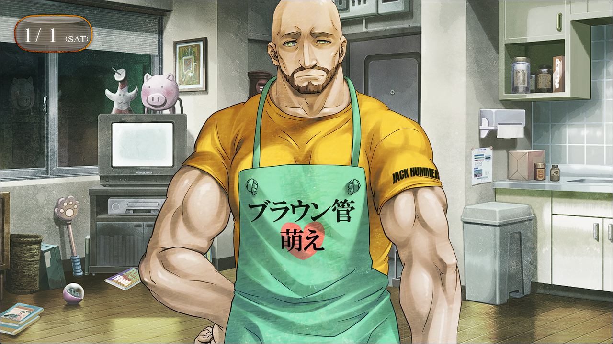
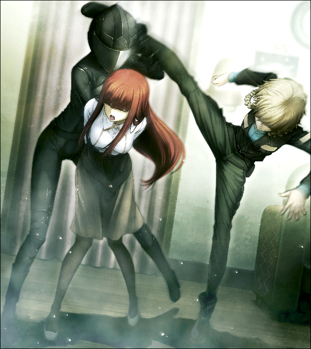

## 轨道秩序的日蚀 - 08
> 1.064750  
> [ 2011/01/01 ] 新年派对 下。LAB被人袭击，目标是篝，幸得天王寺相救。冈伦送众人回家，安排铃羽同住在神社。最后回LAB路上得到桶子的安慰。  

对于穿着鞋闯入房间的男人们，室内的人一时搞不清状况慌乱了起来。  
菲莉丝：“什、什么情况喵！”  
对方全员都带着奇怪的面具，手里有枪，还有拿自动步枪的。  
比屋定：“什、什么啊这是？什么惊喜环节？”  
“啊……啊啊……啊啊啊啊……”  
我张大嘴但完全说不出话，只有含混的叫声传出。眼前的光景让我的恶梦复苏了。真由理无数次被杀的惨状——已经没事了——明明是这么想的。已经没事了——明明应该如此的。是半个月前世界线变动的影响吗？真由理……真由理又会……  
“别吵！”  
“冈伦……我好怕……”  
“我说别吵！”  
砰！
“啊！！”  
“真由理！！”  
略带沉闷的枪声响起，地板上开了个黑色的洞。没事，只是威慑。然而这已足够让众人的恐惧决堤。  

桶子：“那、那……是真家伙啊？”  
琉华子：“冈、冈部先生……我……我……”  
绹：“噫！……呜呜……呜哇哇哇哇！”  
这样不行！不要再刺激这帮人！他们是来真的。不必要的人都会毫不犹豫地杀死。铃羽！铃羽在干什么！？我偷偷向铃羽的方向瞥了一眼——糟了！她被害怕的綯紧紧抓着脚，没法动弹！不，也许是对方人太多，不敢轻举妄动吗。我……我明明必须做点什么，但是关键的双脚除了不停地颤抖着以外派不上任何用处。  
“总、总之……大家，先冷静……”
“就算你这么说……”  
“别管其他的！冷静下来按照他们说的做！”  
明明是经历过无数次的情况，即使这样，我光是发出声音就很勉强了。但是，好像理解了我的心情一样，大家停止了骚乱，相互靠拢，咽着口水盯着侵入者的举动。把枪口笔直对着我们的男子们的身后响起了高跟鞋的声音。从脚步声判断，走上楼梯的——是女性。果然是那家伙吗？桐生萌郁——是你吗？你，又要把真由理……最终，从开着的门走进来的是——全身黑色的女性，贴身的黑色骑手装以及黑色头盔，脸被黑色的面罩覆盖着，看不见。这家伙果然是——但是，这伙人的目的是什么？那时候，他们的目标是我和桶子以及红莉栖三个人。但现在红莉栖不在。那么说是——比屋定吗？穿黑色骑手装的女人扫视沉默的室内，径直走近围在一起的我们，然后伸出了手。那只手抓住篝的手臂，拉了过去。  
“诶？”  
“篝！”  
这群人的目标是篝？但是，为什么是篝？不，如果说目标是篝的话，理由只有一个。果然，这群人——是知道，篝是来自2036年的人？  
“不、不要！放开我！”  
篝试图反抗。但是，穿黑色骑手装的女人的力量比想象的要强得多，篝的身体被轻松地拽了过去。  
“不要！救命！谁来救救我！”  
“篝！”  
“真由理酱！救我！”  
真由理和篝向对方伸长手臂，但是，双方的手都只抓到了空气。怎么办？我该怎么办？如果在这里乱动的话，真由理又要……大家……那么，只能无奈地看着篝被抓走吗？我……我要……  
“咕啊！”  
突然，门附近传来了惨叫声。  
“呃啊！”  
注意看过去的时候，第二个人已经被放到了。  

“喂喂，到底在闹什么？”  
“布朗氏！！”  
“可恶！”  
天王寺的手比枪口转动更快，抓住了第三个男人的手并把他拽了起来。立刻听到了骨头断掉的声音。  
“啊啊啊！”  
面对突然出现的壮汉，袭击者们表现出了骚乱。其中一个男人冲了过来企图打破局面。手伸向了看起来最弱小的人——绹。一般来说这是正确的判断，但此时此刻这个选择是完全错误的。那巨大的身体以无法想象地动作一瞬间拉近了距离，然后凭腕力击飞了那个男人。那人的背部狠狠地撞向墙壁并被弹了回来后倒在地上，余下的人看到这一幕大惊失色。于此同时，被绹放开的铃羽也行动了起来。用那无法想象是桶子女儿的纤细的腿，瞬间瞄准了穿黑色骑手装的女人的头踢了过去。  

“——！”
铃羽的鞭腿被穿黑色骑手装的女人在极近的距离用手臂格挡住了。但是，她为了防御松开了抓着篝的手。  
“篝小姐！”  
我马上伸出手把篝拉了回来。  
“冈部先生……”  
“——！”
穿黑色骑手装的女人发觉形势不利，就护着被铃羽踢到的手臂一下子窜出了LAB。其他袭击者们也抱起倒下的同伴跟在她后面离开了。之前的喧闹一下子变回了静寂。  
“冈……冈伦……”  
听到真由理颤抖的声音，我总算回过神来。  
“真由理……没事吧？”  
“嗯……”  
“其他人也没事吧？有没有受伤？”  
桶子、铃羽、菲莉丝、琉华子、绹、比屋定、篝——大家虽然脸色都不太好，但是没有受伤的样子。  
“爸、爸爸——！”  
“没事了，已经没事了。爸爸会保护好绹的。”  
“呜——”  
看着抱在一起的天王寺父女俩，大家总算放心地松了口气。  
“喂，冈部，给我解释解释，那群是什么人？”  
“不知道……我也不知道……”  
不知道。我最初也想会不会是SERN干的，但如果是他们，天王寺就不会这样闯进来了。这位天王寺裕吾，正是指挥着秋叶原这一带的Rounder的，被称为FB的人。当然，底层的人——桐生萌郁他们在这个FB不知道的情况下行动的可能性也不是没有……  
砰——！门再次被打开，全员都做出了反应。  
“我们回来啦——买了许多饮料哦！”  
“回来晚了真是抱歉，吹雪酱挑来挑去的……”  
“……咦？大家怎么了，一副可怕的样子……？”  
这次推门进来的是买饮料回来的吹雪和枫。但是新买的饮料已经没什么必要了。  

“……非常感谢能送我们回来。”  
“没什么……”  
理所当然，那之后新年派对就这样结束了。虽然是真由理如此期待的难得派对，但大家还没有乐观到在发生那样的事后还能继续下去。我告诉大家改天再说明具体情况后，为了确保每个人的安全，先让大家都回家了。除了天王寺父女以外的所有人一起前往了车站，在那里送走了要坐电车的人，剩下的人都来到了柳林神社。现在我身边有桶子、铃羽、琉华子，还有篝。  
“没有被跟踪吧？”  
“没问题，我一直有注意着，没有察觉到可疑的气息。”  
“是吗……”  
在秋叶原车站也没发现奇怪的人。如果是SREN的Rounder的话，他们的势力可以延伸到各个地方……我对乘电车的人也说了直接回家，并且到家之后马上发个消息过来，现在已经收到了几个人平安到家的消息。对于真由理，我特别关照了要每隔一段时间就用RINE发个消息，所以她从到池袋开始就时不时地汇报行程直到到家，应该没问题了吧。即使这样，我还是没办法放心。  
“那个……果然是我被盯上了吗？”  
“……十有八九。”  
“那群人……知道篝碳的事情吗？”  
“大概吧……”  
还不知道那群人是不是隶属于SERN。但是，知道篝是来自未来的人，所以才袭击她——这样想比较合理。  
“……对不起，因为我，让大家也陷入了危险的境地……”  
“不是你的错……”  
尚且年幼的她从未来被带到这里，然后失踪了——换言之，她也是被命运玩弄的受害者。  
“但是，不报警……真的没问题吗？”  
“……抱歉，现在还……”  
比屋定他们也提议要报警，但是，在我的拜托下，他们暂且妥协，作保留选择。说到底，这件事报警能不能被受理还是个问题，而且最重要的问题是篝。被盯上的是篝，那么就必须要解释她的来历。我们又不能说出真相，而且即使说了真相，我想也不一定有人相信。  
“那么，冈伦叔叔，接下来怎么办？”  
“……总之，如果不知道那群是什么人，也没办法定对策。”  
“那么，只能靠我们自己弄明白了？要怎么做？”  
“这个……”  
说真的，我不知道。如果时间机器被发现了的话，不仅是SERN，世界上多的是想要它的人，无论是俄罗斯、美国，还是中国，日本也一样。总之，得想办法查清楚对方是谁，不然有可能会发生同样的事。  
“关于方法，明天再想吧。在这之前，琉华子，有件事想拜托你。”  
“啊，好的，什么事？”  
“虽然有些抱歉，今天开始可以让铃羽也一起住在你这里吗？”  
“诶？”  
“让我住到琉华哥的家里？”  
“嗯，虽然也考虑过到其他地方安置篝，不过这里人数也多，防盗设施也很齐全。”  
估计是为了应对香油钱小偷和捣乱的人吧，稍微扫视一下四周，就能发现到处都装配有防盗摄像头。另外，这原本也是篝本人的意愿。  
“篝小姐也觉得这里比较好吧？”  
“……嗯。”  
很正常，本来就已经因为丧失记忆导致精神不安了，又发生了今天这样的事。  
“铃羽在的话，大家也会稍微放心点吧。当然，这需要琉华子家人的同意。”  
“我想家父一定会热烈欢迎的。”  
也是呢。  
“我也无所谓。”  
“我也可以留下来哦！”  
“哥哥还是请回吧。”  
“伤心——”  
看着他们的互动，稍稍有些回到了平时的感觉，琉华子和篝的表情也稍微放松了一些。桶子一如既往的言行在这种时候发挥了作用。  
“那么，拜托了。如果发生了什么，立刻联系我。”  
“知道了。”  
把篝托付给二人后，我和桶子走向了LAB的方向。  

“那个，刚才的事是实实在在发生的吧……”  
“嗯……”  
“不是整蛊节目，而是现实吧……”  
现实……是的，那是现实。至今为止经历过无数次的，那个情景——惨叫与硝烟的味道。  
“……呜……！”  
“怎、怎么了，冈伦？”  
“呃，抱歉……大概是因为突然松懈下来，身体……”  
送走大家时一直紧绷的神经急速放松，这时我又回想起来半年前的事。  
“没事的，现在我和你在一块，要不稍微休息下？”  
桶子的大手在我后背上下抚动着。不可思议的是，只是这样心情就稍微镇定了一些。  
“谢谢……已经没事了。”  
“别逞强哦。”  
“嗯……”  
我再次朝LAB的方向走了起来。桶子一副担心的样子跟着。  
“呐，冈伦。”  
“嗯？”  
“果然，这也和时间机器有关吧？”  
“……嗯。”  
“……这也是那个命运石之门的选择吗？”  
命运石之门的选择……吗？现在想想，真是羞耻的叫法。  
“……冈伦”  
无论怎样无视它，避开它，还是一直跟过来了吗？我明明只是，想度过平凡的时间而已。已经连这点事都不被允许了吗？  
“冈伦，肩膀借给你。”  
“……诶？”  
“你还左摇右晃的啊，来。”  
“没事的……”  
“好了，别客气了。”  
“桶子……”  
“嗯？”  
“你……有点恶心哦？”  
“……最近变得正经的冈伦才恶心的说！”  
“……谢啦。”  
“别在意。”  

 

> (to be continued)
---

| [←prev](./0069) | [menu](../) | [next→](./0071) |
