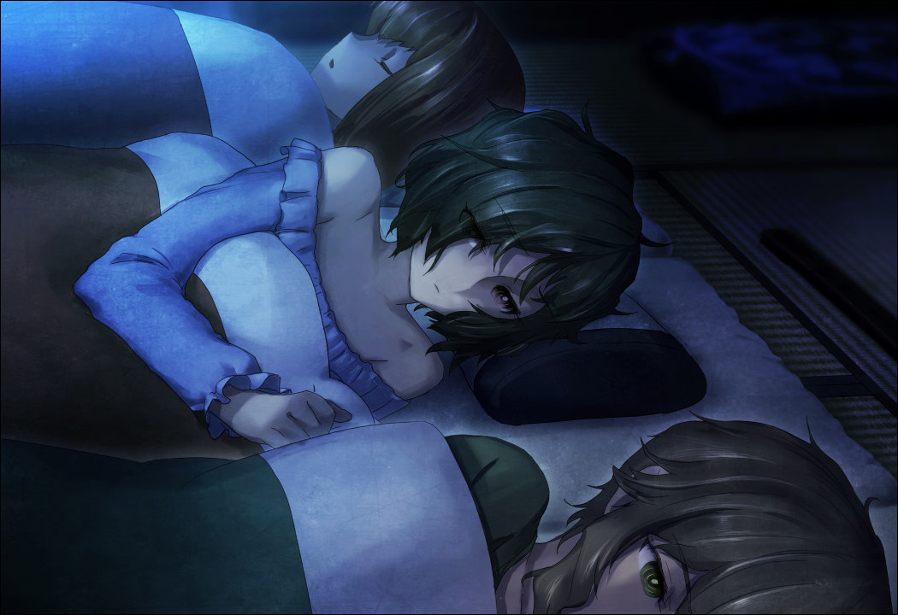

# 轨道秩序的日蚀 - 09
> 1.064750  
> [ 2011/01/01 琉华视角 ] 琉华子感觉自己被排斥在秘密外，但铃羽觉得说不定冈伦是想让他单纯地活在“现在”作为救赎。  

| [←prev](./0070) | [menu](../) | [next→](./0072) |

---

漆原琉华很悲伤。很久很久以来一直很悲伤。  
从结识了冈部伦太郎，关系变得像这样亲密起来，像这样进出未来机械研究所开始，就这样过去了很久。从同为校友的椎名真由理开始，桥田至，还有其他的成员也都开始把自己视为友人。这件事本身很让人高兴。大家愿意接纳没有长处、畏首畏尾的自己——对于这一点，琉华是非常感激的。尽管如此，琉华却一直抱有着一种疏远感——只有自己一人像是局外人那样。大家都在向自己隐瞒着什么，这点琉华能够察觉。正因如此才会悲伤。但是，更悲伤的是，明白了这些，自己却无法将“请告诉我”这句话说出来。  
“睡不着吗？”  
“……阿万音小姐也是，还醒着呢？”  
“有好多事情要考虑呢。”  
“这……样啊……”  
说是好多事情，琉华很清楚，多半就是关于今天发生的事情。在 LAB 举行新年派对时突然发动袭击的迷之男性们，手上还握着枪，并不是什么模型枪，是真正的手枪。在琉华看来，那种东西能在日本搞到手都很不可思议。但是，那是不容怀疑的事实。男人们手里拿着真枪，枪口对着琉华他们。当时还没有什么现实感，但是现如今对这件事感到颤栗不安。如果，男人们扣在扳机上的手指再稍微用点力的话，琉华现在应该就不会在这里了吧。  
“呜……”  
睡着的椎名篝发出梦呓。经过这天旋地转的一天，想必是相当累了吧，躺下之后立刻就睡着了。但是她的呼吸声渐渐变成了呻吟声。  
“……妈妈……妈妈……不要走……妈妈……”  
是在做着关于母亲的梦吗？  
“妈妈……真由理，妈妈……”  
“……”  
听到这样的话，琉华已经不是那么惊讶了。因为前几天篝晚上也呼唤过这个名字。椎名篝，椎名真由理。相同的姓氏什么的，多么巧合啊——最初他是这么认为的。但是——  
“啊……”  
琉华欲言又止。明明有很多想询问的事情的。想要获得勇气，只要一点点就好，能说出“请告诉我”的勇气。  
“…………”  
琉华向枕边摸去，手指间传来了坚硬的触感。是随处都有卖，很便宜的模型刀。尽管如此，对琉华来说是件宝物。他紧紧地握住了刀柄。  
“那、那个！”  
“嗯？”  
“问……问一下……可以吗？”  
“什么？”  
铃羽坐起身，直勾勾地盯着琉华。琉华不禁想要移开视线，拼命忍住了。这里要是移开视线的话，到头来就什么也问不到了。琉华再一次摸着模型刀，之后缓缓开口说道：  
“阿、阿万音小姐……为什么称呼冈部先生为冈伦叔叔啊？”  
“……”  
“为什么称呼真由理酱为真由姐？为什么称呼菲莉丝为留未姐？——为什么，称呼我为琉华哥？”  
“……”  
“‘真由理妈妈’，指的是真由理酱对吧？为什么篝要说‘真由理妈妈’这样的话？”  
“……我知道我没有立场说这样的话，但是，我觉得你还是不知道的比较好。”  
“又要……像这样把我撇在局外了吗？我也想知道，我也想跟大家分享相同的烦恼！”  
“琉华哥……”  
“不能……告诉我吗？”  
铃羽就这样盯着琉华的眼睛，暂时沉默下来。琉华，只是默默地等待着。  
“冈伦叔叔呢……不告诉琉华哥实情的理由，我或多或少觉察到了……”  
“理由……？”  
“他希望琉华哥能一直保持生活在‘目前’这个世界里面。  
 他希望只有你能一直单纯存在于‘现在’这个时间之中。  
 这是……冈伦叔叔的救赎。”  
“我是……救赎？”  
“是啊……”  
“怎么会……”  
话说到这份上，琉华没有做出进一步的询问。冈部伦太郎真的是这么想的吗？连这一点无法不能确认。到头来，自己无论经过多长时间也还是什么都不知道。  
然后漆原琉华又一次悲伤了起来。  

 

> (to be continued)
---

| [←prev](./0070) | [menu](../) | [next→](./0072) |
