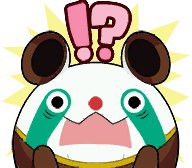
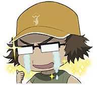
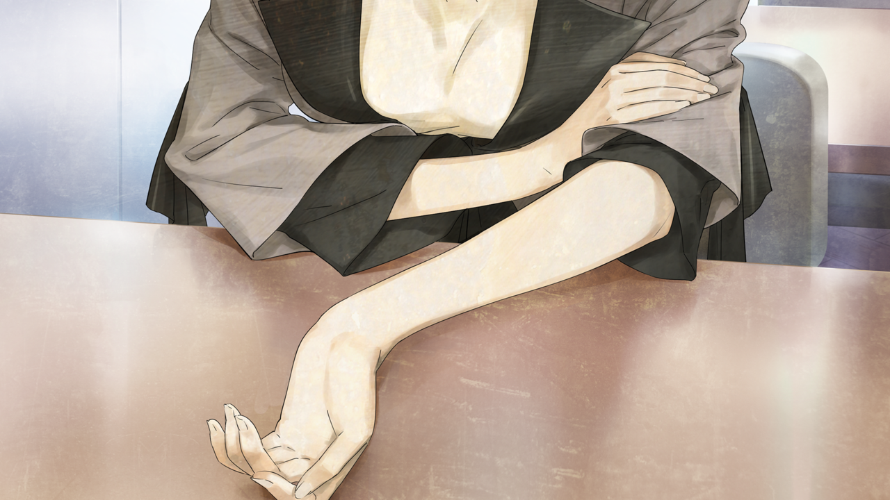
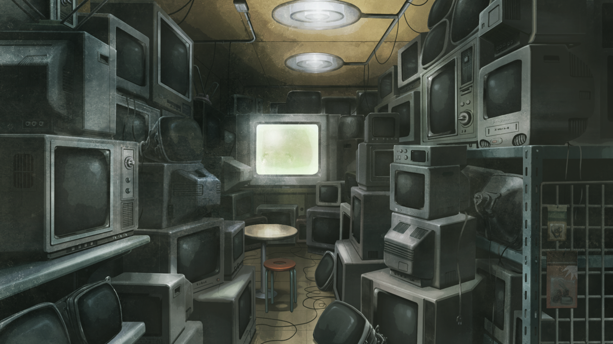
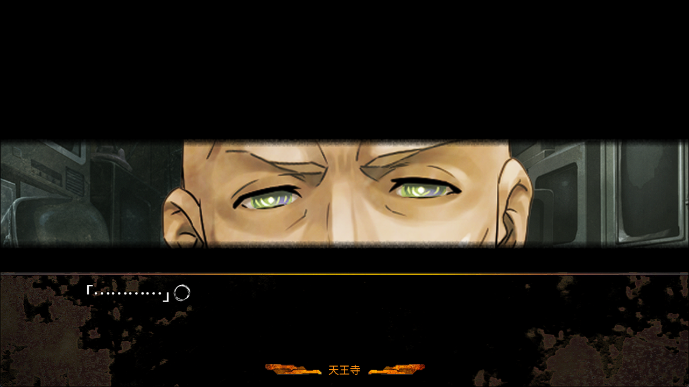

# 轨道秩序的日蚀 - 10
> 1.064750  
> [ 2011/01/02 ] 冈伦查看萌郁手臂排除其嫌疑。随后与天王寺交涉，道破其身份，以铃羽、篝二人在店里打工交换他关照二人，达成合作。发现袭击者使用神秘暗号 K6205，从 5 的读法判断可能来自西方军队。  

| [←prev](./0071) | [menu](../) | [next→](./0073) |

---

与真由理的 RINE 聊天记录：  
『冈伦，冈伦，不得了了呢\~？』  
「怎么了，发生什么事了？」  
『昨天不是发生那种事情了吗？  
 所以呢，刚才和绹酱用 RINE 聊了聊  
 然后呢，就聊到了将来的梦想』  
「绹的梦想？  
 是怎样子的？」  
『首先，第一个是  
 羽毛球想打得更好』  
「既然说第一个，就是说还有第二个咯？」  
『第二个是  
 格斗游戏想玩得更好  
』  
『第三个是』  
「」  
『想让显像管工房变得更时尚  
』  
『第四个是  
 想要个望远镜』  
「这算是梦想吗？」  
『说是最近为了能看星星在期待呢\~』  
「是不是受了真由理的影响呢」  
『』  
『她好像也对宇宙充满了兴趣  
 绹酱，好厉害呢。是非常坚强的女孩子』  
「是啊」  
『啊，真由喜也已经不要紧了！』  
「」  

袭击事件发生后的第二天。我比约定好的时间稍微早到了一点，但对方的身影已经出现在那里。  
“久等了喵。”  
“多谢。”  
“附近的座位暂时不会让别人坐的，你们尽情交谈就行喵。”  
“帮大忙了。”  
一边喝着刚泡好的咖啡润喉，一边观察面前的人。  
“…………”  
桐生萌郁。她依旧面无表情，不知道在想些什么。  
“要说的话是……？”  
“……手臂怎么样了？”  
“手臂？”  
“啊……已经不要紧了吗？”  
昨天穿黑色骑手装的女人，用手臂接下了铃羽的踢击。后来问了铃羽，说是确实踢得很重，也就是说对方应该相应地会留下伤痕。如果桐生萌郁身上有那痕迹的话——  
“……不知道你在说什么。”  
“这样啊……”  
这样还不能断定萌郁是清白的。  
“能让我看一下手臂吗？”  
“手臂……？”  
“啊，想请你卷起左手的袖子。”  
“……为什么？”  
“不行吗？”  
“…………”  
桐生萌郁有些错愕地叹了口气，但没有动摇的样子。对此，不如说我开始动摇了。她为什么如此坦荡？  

桐生萌郁按我说的缓缓卷起袖子。那下面是白皙到病态的肌肤，除此以外并没有其他的东西。没有淤青，也没有用粉底掩盖伤痕的痕迹，当然，更没有缠着像绷带一类的东西。  
“谢谢你，把袖子翻回来吧。”  
“…………”  
桐生萌郁微微歪了歪头，然后把卷起的袖子恢复了原状。  
那个穿黑色骑手装的女人，并不是桐生萌郁。果然是这样，我内心之中也有着不是她的预感。仔细想想，桐生萌郁本来更早就知道椎名篝在我们这里，没必要像这样在一大群人集中在一起的时候发动袭击。桐生萌郁跟这次事件没有关系——能确认这个事实真是太好了。但是，这样一来又有了新的问题。那个穿黑色骑手装的女人，到底是谁？  
为了把她的疑惑糊弄过去，我听取了目前为止的调查报告，并请她继续调查。然后我就和她分别了，向另一个地方赶去。接下来我要造访的是这里——  

话说回来，新年第二天就开店还真是热心工作呢。深呼吸一次之后，我下定决心，跨过了门槛。  
“打扰了。”  
“啊……”  
“哼，总算来了啊。”  
天王寺和绹都在店里。听他的口吻，好像一直都在等我到来一样。  
“是来解释昨天的事情的吧？”  
“这点也包括在里面。”  
天王寺昨晚非常执着地询问发生了什么，我对他说改日再详细说明。  
“然后？昨天那究竟是怎么一回事？”  
“在此之前，我想确认一件事……昨天的事，并不是你指使的吧？”  
平常就总是一副臭脸的天王寺，现在显得更加的不高兴了。  
“我指使？这究竟是什么意思？为什么我要把那群家伙派到你们那去？”  
“听不懂吗？”  
“这种鬼话怎么可能听懂？”  
“那是因为……”  
我确认了绹在附近之后，开口说道：  
“因为你是 Rounder 啊，Mr. <abbr title="卡尔·费迪南德·布朗，Karl·Ferdinand·Braun，1850-1918，德国人。1909 年诺贝尔物理学奖获得者，发明了阴极射线显像管，又称布朗管。天王寺因为非常喜欢显像管，所以用此人的名字作为代号，简写为 FB。巧合的是中二时期的凶真给他起的代号也是 Mr. 布朗。">费迪南德·布朗</abbr>……不，应该称呼你为 FB 会比较好吧？”  
“…………”  
天王寺的神情，从刚才的不悦，瞬间转变为面无表情的冷酷。  
“你这家伙……”  
“爸……爸？”  
敏感地觉察到父亲态度的变化，绹靠过来窥探着父亲的样子。  
“怎么了……？”  
“嗯？绹怎么突然这么问呀\~？”  
“因为突然，爸爸脸上的表情变得很吓人……”  
“是吗？爸爸跟平时一样啊\~瞧\~”  
“……嗯。”  
“好啦，知道的话就当个乖宝宝的去外面——啊，不不，在那边看看电视什么的，好吗？”  
“……嗯。”  
绹虽然很在意这边，但还是听话地坐在了大显像管电视前的椅子上。电视上正播放着新年的搞笑节目。  
“……果然，不想让女儿知道呢。”  
“…………”  
天王寺没有回话，只是催促我坐到离绹远一些的椅子上。他没有像平时那样大声喊叫，只是冷静和透彻的模样。面对这种态度，明明是在冬天我的身子却一直冒汗。但是，话已经说出口，已经没有办法回头了。我按照他指示地坐在了一把小椅子上，为了随时能动起来而保持双腿用力的状态。  
“你这家伙……在说些什么？”  
“……想要糊弄过去也是没用的。”  
“糊弄什么，我完全不懂你说的话啊。那个叫 FB 的是什么东西，新的<abbr title="社交网络服务，Social Networking Service 的简称。交流型网站有各种各样的形式，如邀请制、注册登录制等。SNS 的设立旨在让人更容易与他人在网上进行交流。">SNS</abbr>吗？”  
“我知道的，你是 SERN 的 Rounder 这件事。”  

笔直的视线射过来，那个眼神和平常的天王寺判若两人。那是杀手的眼神。冷酷、不隐藏杀气的眼神。  
“……姑且问一下，你说的这个情报是从哪里弄到的？”  
“没有说出来的必要。”  
不要被威吓到，这场交涉主动权掌握在我手里。  
“好了说来听听吧。你至少是做了这些觉悟，才来这里的吧。”  
“就算说了你也不会相信。”  
“别这么说，就当是喝茶闲谈了。反正这种日子里不会有什么客人来。”  
“……”  
这个男人是 SERN 的走狗——Rounder。Rounder 在那个世界里对我们做了什么，我是绝对无法忘却的。但是，恐怕天王寺并非是自愿加入 SERN。走到这一步，是有什么原因的吧。至少，我在 α 世界线里感觉是这样。当然，我现在身处的这条 β 世界线里也许不同。这条世界线的他应该没有和名为桥田铃的人见过面，我不知道这会造成多大程度的影响。  
天王寺保持着那杀手般的眼神，一动不动地紧紧盯着我。根据我的态度，有可能会直接抹杀——他的眼神表明着这一点。好吧，这样的话，就和他说说看吧，说那些让他云里雾里的话。  

“哼，世界线啊。怎么都很难相信啊。”  
“我最初就说过了吧。而且，跟你信不信没关系，我知道你的真实身份——只有这点是重要的。”  
“……的确如此。”  
居然承认了！  
“你的话几乎完美无缺，甚至包括了只有我自己知道的事情。老实说，简直让人有些不舒服了。”  
天王寺承认了自己的真实身份。就此而言，这场交涉的第一回合，我姑且可以认为自己赢了。现在开始才是关键。  
“我知道 SERN 是绝对保密的。而且，也知道不仅是任务失败的人，连完成任务的人也会被处分。”  
SERN 把成为了 Rounder 的人当成了一次性用品。然后用这样的爪牙将真由理——  
“连这都知道啊。这样的话…… ”  
他突然站了起来。  
“……但是，这和任务没关系！”  
被对方气场镇住的同时，我声嘶力竭地说道。  
“我说的机密也是，我不是因为情报泄漏而得知的，只不过最初开始就知道了。  
 所以，你不会成为处分对象……没错吧？”  
“……哼，诡辩啊。”  
天王寺向我逼近。被稍带绿色的眼瞳盯着，像被蛇盯上的青蛙一样，我的身体完全不能动弹。  
“但是你说的没错。”  
“呼……”  
“我既没有被 SERN 告知要搜寻 IBN5100 什么的，也没有被告知要把你们带过去。  
 没有被告知的事情，就没有必要去做。  
 我是 Rounder 的事，你不说出去就没关系。没有任何伤脑筋的地方呢。”  
天王寺的视线投向了在背后看电视的绹。从杀手的眼神，迅速变成了截然不同的，父亲的眼神。  
“那么，你的目的是什么？把这些全部向我摊牌，是有什么目的吧？”  
“……事实上，我有事想拜托你。”  
天王寺没有回话，促使我继续往下说。  
“椎名篝——昨夜被袭击的女性，希望你能够保护她。”  
“那位小姐，为什么，又是被谁，袭击了？”  
“不知道。”  
“这样的话，我不能答应你啊。”  
“因为不想让女儿卷进来……吗？”  
“你不是很明白吗，那一开始就不要说那些话啊。”  
“不是已经被卷入过一次了吗。昨天那种事情，今后就不会有了吗？”  
“你打算把绹当成人质吗？杀了你哦，你这混蛋……”  
“呃……”  
不要胆怯。在这里却步的话，交涉就结束了。  
“我是在说，协力合作。”  
“哼，‘协力’，呢。我这边只有苦头没有甜头啊。”  

“不是那样的。”  
盖过天王寺的声音，插着话走进来的，是铃羽和——  
“不好意思打扰了……”  
篝……  
“铃羽，你听到我们的谈话了吗？”  
铃羽点了点头，然后转而继续对天王寺说道：  
“比如，能让我和篝在这里打工的话，就能时刻盯着我们了。”  
的确，如果这样，不但离 LAB 近，而且说不定比在 LAB 更安全。考虑到保护绹这一点，这样更好。  
“你们赶紧从这楼里滚出去就是最快的解决方案，这样的话我和绹就不会被卷进来了。”  
“你们父女俩昨天看到了袭击者的脸。这意味着什么，你不是应该明白的吗？”  
“……”  
那群人，把看到过自己脸的人全部抹杀掉的可能性也绝不是零。  
“我有战斗的经验，也能用枪，你昨天也应该看到了。所以，我可以派上一定用场。”  
“……”  
天王寺一边敲着自己的头，一边思考着——  
“爸爸。”  
一直沉默地看着电视的绹，突然开始说话了。  
“我，虽然不是非常明白，可是，像昨天那样的事情，很可怕……所以，不想再遇上了。”  
“绹……”  
“虽然爸爸保护我，我非常开心。但是一想到，爸爸为了保护我而乱来，有可能受伤……就更害怕了。  
 铃羽姐姐特别厉害，昨天也保护了我哦。”  
绹这孩子……她听懂了我们的话题吗？  
“我想和姐姐们在一起。”  
绹投以依赖的眼神看着天王寺。他很为难地挠着自己的头，生硬地说道：  
“话说在前头啊，我只出一份打工费给你们两个人啊。”  
“真小气。”  
“抱怨的话就算了。”  
“不、不，谢谢你了，店长先生。”  
铃羽小声抱怨被天王寺反击了回去，结果篝赶紧圆场。  
“爸爸！”  
绹开心地抱住了父亲。太好了，有天王寺跟着的话，就可以稍稍确保篝的人身安全了吧。  
“谢谢……”  
“少在那自作多情，我是为了绹。”  
绹立刻很开心地和篝她们打成了一片。看着那样的她，天王寺变回了父亲的眼神。  
“好吧，我这边就这么办吧。冈部，你去查明那伙人是什么来历。否则没办法制定对策。你懂的吧？”  
“知道了。”  
虽然这么回答，但说实话，可以说是没有任何线索。不管怎样，总算说定了托付铃羽和篝的事。  

正准备回 LAB 时，背后的天王寺仿佛想起了什么开口道：  
“对了，说起来那伙人，好像说了奇怪的号码。”  
“号码……？”  
“好像是……对，是 K6205 什么的……”  
K6205……是什么的暗号吧？  
“而且把‘five’发音成‘fife’。”  
“是哪里的口音吗？”  
“不。这是<abbr title="为了在无线电通话中清楚辨别内容防止误听而设计的发音规则，如 Alpha 代表A，Bravo 代表B。">北约音标字母</abbr>，是军队用语。”  
“军队……”  
“而且，是西方的。”  

 

> (to be continued)
---

| [←prev](./0071) | [menu](../) | [next→](./0073) |
