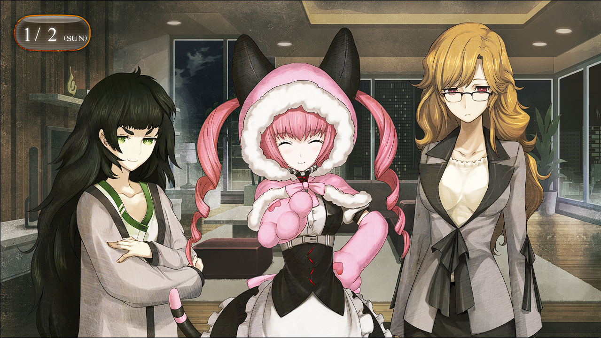

## 存在证明的自动机械 - 02
> 1.081163  
> [ 2011/01/02 ] “红莉栖”打来关心真帆现状，分析后怀疑犯人的目标是『Amadeus』的控制代码，这个代码只保存在真帆大脑中，连雷斯吉宁教授都没有。众人商讨后，决定安排真帆借宿在菲莉丝家。菲莉丝安排真帆和萌郁同住。

居然是“红莉栖”？这么说，『Amadeus』被劫持这件事，已经不存在了吧……  
比屋定以我也能看到手机画面的角度，接通了『Amadeus』的来电。  
“前辈！没事吧？有没有受伤！？没有遭遇暴、暴力事件吧！？  
 ……？冈部？为什么你和前辈在一起？  
 啊，难道你和前辈，已经是那种关系了！？”  
“没有这回事，‘红莉栖’，我目前在LAB呢。”  
“太好了！平安无事呢！”  
“嗯，所以稍微冷静一点啦。”  
“怎么可能冷静得下来！我这边不管打了多少次都联系不上啊！  
 在网上搜索了之后，好像有宾馆发生了入室盗窃，看上去还很像前辈的房间……  
 总之，我都担心死了！”  
“Ok，明白了，我道歉，对不起。  
 谢谢你‘红莉栖’。我没事，虽然确实遇上了入室盗窃，不过没有正面遇上犯人。  
 现在正在这边休整，手机因为忘记充电所以关机了。让你担心了呢。”  
“……没事，没有发生什么事就好。”  
“……”  
“红莉栖”看上去没有什么奇怪的地方。比屋定重复对我说过的话，向“红莉栖”说明了发生的事情。  
“——情况就是这样，也没有什么特别的东西失窃。”  
“嗯……”  
听了粗略说明的“红莉栖”，正在思考着什么。  
“怎么了？”  
“果然犯人的目标，是研究数据之类的吧。”  
“但是啊，犯人不是已经详细调查过真帆碳的情报了吗？  
 既详细地知道真帆碳住在哪个房间，又准确地把握她离开房间的时机入侵。  
 明明都调查到这种地步了，却不知道研究数据不在宾馆里，这种事可能吗？”  
“这么说，目标可能就是比屋定放在包里的笔记本电脑吧。”  
“但是，知道这东西存在的只有前辈，我还有冈部啊。”  
“还有我也知道。”  
“也就是说，除非我和桶子就是犯人，否则笔记本电脑就没有成为目标的可能性啊。”  
“还有一种可能性——”  
“红莉栖”用食指指着自己的太阳穴。  
“说不定，目标是我的控制代码。”  
“控制代码？是指管理者密码之类的东西？”  
“稍微有点不同。之前跟冈部说过，『Amadeus』系统里，存在着只有我自己才能访问的领域。”  
“啊，说是像“秘密日记”一样的东西呢。”  
“没错。无论内部还是外部，只要和我相关的访问，都会在那个秘密日记里留有记录。  
 如果有谁改写了系统，想要夺取并自由地控制我的意志，因为无法接触到秘密日记的内容，  
 我就能比较前后的系统，追查到系统被改写这件事，从而进行复原。”  
“哦哦，了解了。打开这个秘密日记的钥匙，就是控制代码吧。”  
“对的。虽然『Amadeus』系统数据的管理负责人是雷斯吉宁教授，  
 但知道控制代码的，世界上只有一个，就是真帆前辈。”  
“……这样吗？”  
“……没错，正如‘红莉栖’所说。假设是冲着我的研究成果来的，目标也就是这个了。”  
“这、这东西有没有被偷！？”  
“不用担心。对吧，前辈？”  
“嗯。控制代码没有任何形式的书面记录——”  
比屋定像刚才“红莉栖”那样，指着自己的太阳穴。  
“只在我的脑袋里面保管着。”  
感觉这个保管方式真危险呢。如果犯人觉察到了这一点，被盯上的就会是真帆本人。  
“但是，这下头疼了呢……是啊，说不定是盯上了控制代码呢……”  
 又不能立刻离开日本，也不想在遭遇袭击呢……  
 话是这么说，又能怎么办呢……”  
“在平静下来之前可以待在LAB哟~或者，要来真由氏的家里吗？”  
“谢谢，真由理小姐。但实在不好意思受到如此关照。”  
虽然已经变成了不存在的事情了，篝遇袭的事件还是在我脑中浮现。LAB也好，真由理的家也好，都不能算作是安全的地方。  

“……所以，大家都到我这里来了喵？”  
“……啊。”  
一小时之后，我们全员来到了菲莉丝所住的公寓。  
“大家讨论了好久，觉得在菲莉丝的公寓里住几天是最好的解决办法……”  
“那个，该怎么说好呢……”  
正当比屋定犹豫不决的时候，菲莉丝抱着胳膊并满意地点了点头。  
“这个结论很正确喵！确实，这个公寓因为有完全的安保措施所以很安全喵。况且黑木也在。”  
“黑木先生？”  
“刚才在门口见到的管家哟~是货真价实的管家哟~！”  
“啊……但是，这又怎么了呢？”  
“黑木先生是最强管家。”  
“哈……？”  
还是不要对此进一步说明了，况且我自己也不是很了解。就算是想当面询问，也感觉是不会被允许的。总之，是个很厉害的人。  
“菲莉丝这边完全没有问题喵。房间用里面的客房就行了喵。  
 别说几天，真帆喵待在日本的这段时间里一直住在这里都行喵！”  
“真、真帆喵……？”  
“……那个。”  
“诶？桐生小姐，什么事？”  
“……取材。”  
“我……比屋定博士……取材……不然的话……”  
“……啊，对啊，今天本来是这么计划的呢。要不改天，去咖啡店之类的地方——”  
“有主意了喵！”  
“诶？”  
“萌郁喵也一起住下来就行了喵！”  
“诶诶诶诶诶？”（比屋定&冈伦）  
“客房的空间很大的喵！多一个女孩子的话，真帆喵也会更安心的喵？”  
“这、这倒也是。”  
“萌郁喵，怎么样喵？”  
“……萌、萌郁……喵？”  
“等一下，菲莉丝，这——”  
有危险，我本想这么说。桐生萌郁从属于Rounder的可能性还是有的，至少就我自己来说，现在也不信任这个女人。但是——  
“这不是挺好吗？桐生氏不是说过，因为涉及调查地下工作的缘故，学习过防身术，对吧？”  
“……嗯，学过点。”  
“跟我和冈伦比起来，强得不是一点半点哦。”  
“但是……”  
“怎样喵，萌郁喵？”  
“……我不介意。”  
“决定了喵！”  
“多了两个人的话，会不会打扰到你？”  
“完全不用在意喵！因为菲莉丝是独生女，像这样多了姐姐和妹妹很开心喵！”  
“什！我可是成年人啊！”  
“…………”  
最终，我的反对意见完全没有被采纳。  

 

> (to be continued)
---

| [←prev](./0075) | [menu](../) | [next→](./0077) |
