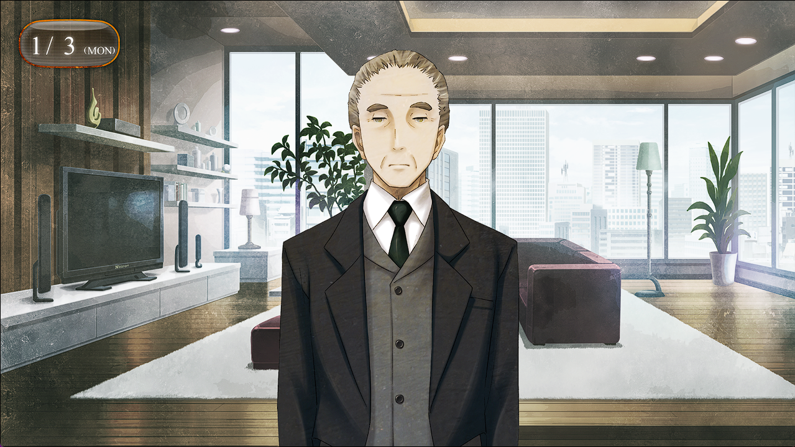

## 存在证明的自动机械 - 03
> 1.081163  
> [ 2011/01/03 ] 犹豫不放心，冈伦去菲莉丝的公寓查看二人情况。除了房间被改造得乱七八糟之外二人生活得反而很和谐。冈伦稍微放下戒心。

第二天，新年的第三天，我连续三天来到了秋叶原。这次为的是前往菲莉丝的公寓，确认比屋定的情况……不，不对，应该是为了确认桐生萌郁的情况。昨天，大体上是定下了比屋定和桐生萌郁同居的事。桐生萌郁能向比屋定取材，比屋定也能消除独自一人的不安，这或许是最佳方案。但是，我知道桐生萌郁的另一面——她是一名Rounder。不只是所谓的“学过了防身术”这种程度，而是必要的情况下能够杀人的技术。问题是，这种技术，要向谁施展呢？在我们不用费心搜索IBN5100，也没有造出时间机器的这条世界线里，Rounder应该是不会盯上我们的。虽然心里很清楚这些道理，但是……  
就算是新年假期，秋叶原看上去还是一如既往的热闹。从家电贩卖店到女仆咖啡店，基本都是从元旦起就开门营业了，只是营业时间跟平时比有所缩短。不过因为福袋和新春特别菜单之类的，以及只能在元旦三天才能买到的商品，以此为目的聚集的客人更多了。从附近神社过来的穿着靓丽的女性们和一成不变的秋叶原阿宅们在人行道上穿梭着，真是跟平时比起来更加混乱的景象啊。话说回来，*MayQueen* 这几天也没有休息还在营业啊。菲莉丝和真由理也是，今天早上就说去店里上班。这样的话，公寓里只有那两个人了吧——准确来说，管家黑木先生应该也在。应该……没问题吧？桐生萌郁会对比屋定实施某种行动——比如施加暴力什么的——想想还是不可能，因为没有这么做的理由。但是，就算脑中再怎么明白，心情还是冷静不下来。怎么都无法释怀，留意到自己心中不断堆积的心结，昨天并没有睡得很好。亲眼见证两人的共同生活，确认没什么问题的话，说不定这种焦躁就会慢慢消散。  
怀着复杂的心情，我急速赶往菲莉丝的公寓。  

“欢迎到访，冈部大人。”  
管家黑木先生在门口迎接我。他是仅凭一人之力就完美照料了因父亲去世而孤身一人的菲莉丝的最强管家，现在也协助着菲莉丝的工作，是菲莉丝为数不多能够完全信任的人。  
“非常抱歉，大小姐现在外出了。”  
“啊，是的，我知道。我是来看望比屋定小姐的。”  
“那两位正在客房里。请进。”  
“非常感谢。”  
“那么，我先告退。”  
黑木先生如往常一般干净利落地180度转身，准备以最短距离回到自己的房间——  
“哎哟……”  
不知道是不是脚被什么东西绊住了，黑木先生稍微踉跄了一下，停在原地。  
“非常抱歉，我失态了。”  
“没事吧？”  
“可能是有些许疲惫，让您见笑了。”  
“啊，没……”  
“稍微休息一下就没问题了，失陪了。”  
虽然表情没有变化，不过他道歉的声音略显尴尬。我目送他走回了自己的房间。  
“看到了难得的一幕啊……  
 无论何时都冷静沉着得像机器人一样的人物，居然会在客人面前踉跄……  
 说是因为累了，是有什么操心的事吗？”  

算了，比起这事还是先去看看比屋定的情况要紧。  
“比屋定，在吗？”  
“冈部先生？请进。”  
“这、这是什么情况！？”  
打开门的瞬间我就呆住了。这里的的确确应该是我进入过无数次的客房……才对。但是，房里的布置已经完全变样了。首先，本来应该在这里的床不见了，取而代之的是一张大办公桌和一张矮脚桌。办公桌由比屋定占据，她一边盯着15.6寸笔记本电脑的屏幕，一边将泡有咖啡的马克杯送到嘴边；矮脚桌上放着一台小型笔记本电脑，桐生萌郁以女子坐的姿势直接坐在绒毯上，轻巧地敲打着键盘；二人背后并排立着不锈钢书架，上面摆放着很多英语的专业书籍和时尚杂志。到昨天为止还是客房的这个房间，仅用一天就变成了比屋定和桐生萌郁的工作室一样的地方。  
“马上就结束了，先在那边坐一会儿吧？”  
比屋定这么说着，双眼紧盯着屏幕，里面是复杂变化着的3D图像。  
“…………”  
桐生萌郁坐在矮脚桌前，没有看向这边，一声不吭地敲打着键盘。  
“发、发生了什么！？难道，世界线又变化了吗——！？”  
说着，我慌忙捂住嘴。好在，二人都沉醉于自己的事情上，没有任何反应。  
“——搞定！”  
事情告一段落，比屋定把椅子转过来，朝向我这边。  
“上午好，冈部先生。”  
语气就好像什么都没发生。  
“你是来看望我的吗？”  
“啊，嗯。”  
“难得你来了，不过很抱歉，我接下来必须要配合桐生小姐的取材。”  
“这没关系，不过你不对这个房间的惨状做一个说明吗……”  
“惨状？我觉得是相当不错的环境啊。”  
“昨天可不是这样乱七八糟的啊？”  
比屋定一时间满脸疑惑地看着我，之后终于露出了恍然大悟的表情。  
“既然外出有危险，只能在这边进行研究了吧？为了方便工作所以改变了一下房间的布置。”  
“改、改变布置？”  
把这种程度称之为改变布置也太过于冲击性了……我和桶子虽然也都不擅长整理房间，但还不至于到这种地步。  
“这些全都是你们自己准备的吗？”  
“是的哦。桐生小姐也说要在这里写报道，所以我们俩挑选了必需的家具和资料。对吧？”  
“……嗯。”  
『虽然报道在哪里都能写，但因为我是保镖，所以必须待在比屋定博士身边！>_<』
“这么短的时间，你们是从哪儿弄来的桌子和书架……”  
“…………”  
『冈部君太落伍了——！
 网购的话，大部分东西一天就能送到哦  
 比屋定博士列出了想要的物品清单，我在网上订购的  
 』  
“哈……我还以为——”  
“还以为，什么？”  
“……不，没什么”  
——刚才还以为，在自己不知道的情况下，世界线又变动了。看来是杞人忧天了啊。  
“桌子和书架也是你们俩组装的吗？”  
“拜托了管家，那个人真厉害呢。”  
“……啊，所以黑木先生会那么累啊。  
搞清了种种事情后，感到精疲力竭，正准备随便找个地方坐下来——  
“啊……”  
有什么东西卡住了脚。低头一看，发现绒毯上有一本厚厚的书摊开着放在那里。  
“这是？”  
“那本书我过会儿要看的，绕一下吧，注意别弄乱页数哦。”  
“过会儿是？”  
“嗯……估算了一下，大概19小时以后吧。”  
“……书架都有了，不读的时候把它收起来不就行了吗？”  
“把很快就会再看的书一本本地放回书架，是不理性的哦，这不是科学家应该采取的方式。”  
“……有这种问题吗？”  
看向绒毯上，就这样打开着放任不管的书还有四本。不仅如此，周围还放着文件和吃完了空着的杯面、浴巾还有手帕，一大堆东西就这么乱放着；两个人穿过的衣服之类的也脱下来扔在了地上，裙子、T恤、衬衫、袜子、紧身衣等等。感觉像是过去在别的世界线里，去桐生萌郁家时看到过的一样。看来桐生萌郁和比屋定大概都不是会把日常整理放在心上的类型。矮脚桌前也是连落脚之地都没有的程度，除了桐生萌郁坐着的地方以外，都放着东西，很难坐下。  
“除了书和文件，别的东西可以挪开吗？”  
“请便。”  
“……可以。”  
得到许可后，我拿起了地上的一摊粉色毛巾。  
“——啊！”  
那不是毛巾，而是粉色的胸罩。  
“什、什什什什！？”  
突如其来的事态令我无法思考，就这样捏着胸罩僵住了。  
“…………”  
桐生萌郁面无表情地抬头看着的我。”  
“啊、不，这、这是！”  
『冈部君，那是我的  
 怎么可以随便摸女孩子的内衣呢！>_<』 
“不、不可抗力啊！”  
我瞬间叫了起来，慌忙丢掉了胸罩。  
“…………”  
桐生萌郁迅速移开了视线，脸颊微微发红。然后，悄悄用手盖住衣服的胸口处。  
“……我完全没有奇怪的企图啊！”  
“…………”  
摒弃杂念，我在房间的一角勉强找到了一个足够的空间，坐了下来。  
“要喝茶自己倒哦，冰箱在那边。”  
房间的一角放了一个粉色的圆圆的小型冰箱，上面叠放着塑料杯子。  
“冰箱都买了！？”  
『工作的地方有冰箱的话非常方便呢！  
 不需要出去就能拿到饮料，除了上卫生间以外都不需要出房间了真好！>_<  
 』  
“……两个不适合社会生活的人聚在一起，就会制造出这样的空间吗……”  
“这是主观差异哦。不如说，这是最适合从事智力生产活动的生活空间……希望你这么说呢。”  
“……哈。”  
我所怀有的不安，果然是杞人忧天。至少，桐生萌郁没有对比屋定抱有敌意，比屋定看来也很享受和桐生萌郁共同生活。两人和谐友好地一起选了家具，简直可以说是令人欣慰的景象了。过来瞧瞧情况是值得的，看来今夜可以好好睡一觉了呢。  

 

> (to be continued)
---

| [←prev](./0076) | [menu](../) | [next→](./0078) |
