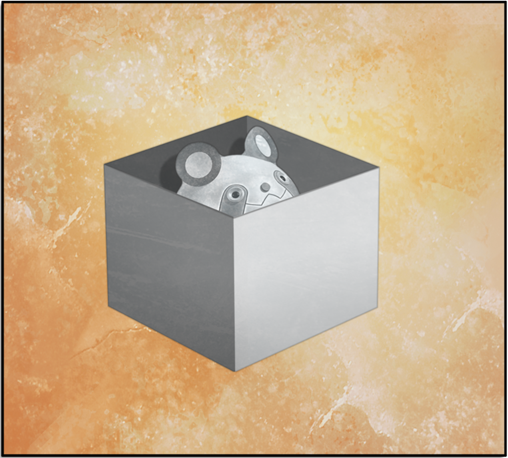

# 存在证明的自动机械 - 04
> 1.081163  
> [ 2011/01/03 ] 由于萌郁实在不善言辞，冈伦加入采访。真帆用介绍了人工智能发展的现状，并通过实验解释了框架问题。  

| [←prev](./0077) | [menu](../) | [next→](./0079) |

---

看完情况一切正常，就此打道回府也不错，但我还是决定再稍微观察一下这两人。  
“那么桐生小姐，准备开始取材吧。”  
“……好的。”  
桐生萌郁啪地把笔记本电脑合了起来放在一旁，开始在自己的包里翻找。  
“你们俩说的取材具体是做什么啊？”  
“采访哦。”  
“采访？”  
“其实本来计划昨天在宾馆接受采访的。”  
『我所属的 *Arc Rewrite* 公司，正在制作商业杂志的专题报道  
 专题内容是《人工智能研究最前线》”  
   
 我负责比屋定博士，整理博士的业绩和最新的研究内容  
 但是，只是在网上搜索就能得到的内容并不够写出冲击性的报道呢……  
 因此，想在卷首登出对比屋定博士的长篇采访』  
“……想不到你会这么热心于工作啊。”  
“……因为……喜欢……写文章”  
在 α 世界线，桐生萌郁的工作只是为了掩饰自己作为 Rounder 的身份，不过是个幌子，因此应付工作而被炒鱿鱼了。但是在这条世界线，好像在认真工作。有没有同时作为 Rounder……在工作呢……？  
“对我而言，给桐生小姐添了这么多麻烦，至少也想要为她的工作出份力啊。  
 而且人工智能研究，如果能让更多人知道，也是好事。”  
 桐生小姐，准备好了吗？”  
“……嗯。”  
桐生萌郁点了点头，采访开始了……然而，实际上，没有开始。  
“……”  
“…………”  
“……”  
“真的是弱项呢……桐生小姐不擅长说话这点我已经想到了，不过没想到是这种程度……”  
“……对……不起。”  
连我看了都觉得桐生萌郁的情况太严重了。采访根本无法成立。无论如何，明明是应该引出谈话的一方，桐生萌郁却只是一动不动地握着记事本和圆珠笔，泫然欲泣地盯着比屋定。即使我和比屋定帮忙解围，想将采访进行下去，也完全没有效果。  
“嗯，怎么办呢……要不改天再做吧？”  
“……期限……要……时间表……很紧……”  
“这、这样的话，今天之内就得搞定呢……  
 话是这么说，也没办法立刻就克服桐生小姐不擅长说话这一点……”  
“……对……不起……”  
桐生萌郁用微弱的声音道歉，可能是为自己的不中用感到懊恼，眼看就要哭出来了。  
“啊，不是的！别误会，我不是在责备你。  
 现在是在准备哦，只是为了解决问题，在列举应该讨论的条件。”  
“问题？”  
“‘想要完成采访’——这是问题。  
 条件就是，桐生小姐如果没办法采访的话，就需要另一个采访者。  
 而且，可以的话最好是对信息学科有相应知识的人。  
 还要马上就能来帮忙的……”  
“啊……”（x2）  
两人同时看向了我。  
“……诶？莫非，你们想让我……？”  
“嘿嘿，这个问题还真好解决呢。冈部先生，可以稍稍拜托你一下吗？”  
“不是，你这说得也太突然了……”  
“冈部先生恰好符合条件呢。专业也多多少少有些接近，说不定能问出一针见血的问题呢。  
 不管怎么说，你也有着让雷斯吉宁教授‘一见钟情’的潜能啊。”  
“别抬举我了，我这种日本大学生随处可见啊。”  
“开玩笑啦，但是我确实认为你能胜任。”  
“不，但是……”  
『我也拜托你了！！（>_<）  
 不是很多的话，我也可以付打工费给你  
 （x3）』  
“呃……”  
采访啊……既能达成观察两人生活的目的，又能收到打工费的话，也不错呢。年关期间去 LAB 的次数增多了，因此去打工的次数减少了。而且最近，我心中也有了去维克多·孔多利亚大学留学的梦想。能和比屋定真帆这样优秀的现役人工智能学者直接对话，在某种意义层面上，是非常珍贵的机会，肯定也有人即使交钱都想要这种机会。  
“……我知道了。我也对比屋定的研究很有兴趣，如果我可以的话，请让我帮忙。”  
“谢谢，你这么说真是帮大忙了啊。”  
“……谢……谢。”  

“那么，赶紧开始吧。桐生小姐，要怎么记录？”  
“录音。”  

桐生萌郁拿出一个录音笔放在桌上  
“呃，可以按我的节奏进行吧？”  
“……可以。随便……说……就行。之后……再编辑。”  
“我应该问些什么？先说好，我在人工智能方面拥有的知识，只有日本人平均的水平。”  
“也是呢，虽然我也可以随心所欲地说……  
 既然机会难得，我们以讨论的形式进行吧。这样聊起来也比较起劲。”  
这句话在我脑中瞬间勾出了一个清晰的影像。在另一条世界线上，红莉栖在演讲开头说过同样的话。  

  

“……”  
“冈部先生？怎么了吗？”  
“没事……吧？”  
“诶？”  
比屋定和桐生萌郁，担心又略带疑惑地注视着我。  
“如果你不喜欢讨论的形式——”  
“啊，不，不是的。抱歉，我只是回想起红莉栖和你说过一样的话。”  
“红莉栖？什么时候？”  
“她来日本的时候，在 ATF 的时间机器讲座——”  
不对，那是另外一条世界线的事情。在这条世界线上，红莉栖既没有做时间机器的演讲，也没有来过 LAB，就从世界上消逝了。  
“……不，是我搞错了。不好意思我打断了，请别在意。”  

“是吗？没事就好。那么，从什么开始说起呢……  
 好了……人工智能的研究，差不多是在计算机诞生的同时开始的。  
 我们在做的人工智能的中枢，是基于名为神经网络的技术，这项技术是 1950 年被提出的。  
 而被认为是世界上第一台冯·诺依曼结构的计算机 ENIAC 诞生于于 1946 年。时间上差不多吧？”  
 当时，计算机被认为是魔法一样的机器。  
 因为一旦装上了程序，无论多么复杂的计算，都能自动解出。  
 嘛，现在的计算机也是如此。  
 因此，当时的研究者认为，如果写出更厉害的程序，就能解决更多问题。  
 计算机进化到极限，就会拥有仿佛人类一般的智能，就可以制造出进行思考的计算机了。  
 但遗憾的是并没有做到。  
 拥有人类这般总括性功能的强人工智能，直到 21 世纪的现在，也没能做出来。  
 当然了，也不是说人工智能学者什么也没做哦，倒不如说正相反。  
 虽然终极的人工智能还没有完成，但研究的过程给信息科学领域带来不计其数的成果。  
 比如说，扫描图像读取文字的 OCR 技术，与人类识别文字的机制具有共同点。  
 传闻在不久的将来，手机可能会搭载语音识别系统，这在以前也是人工智能研究的一环。  
 但是，研究起步后经过了 60 年的现在，世界上依旧没有人能成功开发出，
 和人类拥有相同机能、通用的人工智能——除了『Amadeus』。”  
“为什么没人成功？”  
“嗯……一言以蔽之，就是没办法弄清大脑运作的原理吧。大脑还有很多未知的部分哦。  
 为什么数量在一千亿级的神经细胞，构成的活体计算机可以发挥出如此惊人的性能呢？  
 为什么可以记录下大量经过整理的信息，并在刹那间就能调用呢？  
 为什么会有，只要看一眼就可以将毫无关联的现象组合起来，这种灵光一闪的行为呢？”  
 这种例子不胜枚举。  
 也有一些问题，人类明明很容易就可以解决，计算机却无法解决题呢。”  
“有这样的问题吗？”  
“很多哦。一个个地弄清这些问题，就是我们的研究呢。”  
“……还是不能构建出一个印象啊。能不能讲一些具体的例子？”  
“我想想……用‘框架问题’试着说明吧。打个比方，现在我们把桐生小姐看作一台机器人。”  
突然被叫到名字，正在记录的桐生萌郁惊得肩膀一哆嗦。  
“……我是……机器人……？”  
“准确来说，是装在机器人上的人工智能呢。  
 桐生小姐，我想用一下桌子，能不能先挪开你的录音笔？”  
于是桐生萌郁把录音笔从桌上拿到了地板上。期间，比屋定嘎吱嘎吱地翻找着桌子一角的提包。  
“呃……好像是在这里面……啊，这个这个。”  
比屋定从包里取出一个可以用她的小手一手掌握的白色小盒子。她打开了盒子，取出了里面的东西，是真由理正热衷收集的“乌帕”。比屋定把乌帕递了过来，我接过来后摸了摸，像橡皮一样。  
“昨天真由理小姐给我的，很可爱呢。”  
……可爱吗？真由理也是这么说，女孩子口中的“可爱”真是没法理解。  

把乌帕还回去后，比屋定把它放回盒子，盖上盖子，最后将盒子放在桌子中央。  
“现在我们试着做一个简单的实验吧。  
 冈部先生，试着给桐生小姐下达命令，让她把那个盒子里的乌帕拿出来。”  
“命令？”  
“是哦。为了让桐生小姐这个工智能正确做出动作，需要发送程序。”  
“为了正确做出动作……”  
“命令要尽可能简洁，并且最好是严密的。”  
 比方说，这个房间里有很多盒子，  
 不能是其它任何盒子，而必须命令她打开放在桌上的这个盒子。  
 发送的命令仅限文字，用手指示意‘这个盒子’是违反规则的哦。  
 桐生小姐就试着按照冈部先生下达的命令来执行。  
 尽可能地忠于命令行动。可以吧？”  
“……明白。”  
“那么开始实验。冈部先生，请下达命令。”  
虽然不知道这到底有什么意义，但还是马上想了个命令说了出来。  
“打开桌上纯白的盒子，取出其中的物品。”  
“桐生小姐，刚才的就是命令。请按所说的行动，要尽可能忠实于命令。”  
一直盯着我的桐生萌郁看向了桌上的盒子。  
“…………做不到。”  
“诶？只是打开盒子而已吧？”  
我疑惑地指向桌子中央的盒子。但是，桐生萌郁只是皱着眉头并向我投以困惑的目光。比屋定满意地点了点头。  
“做不到哦。你看。”  
比屋定拿起盒子，把另一面转向我。  

“什、什么这是？”  
“‘上帝不会掷骰子。’爱因斯坦的名言。因为写着这个，所以桐生小姐无法打开盒子，对吧？”  
“……是。”  
“诶，是这样吗？为什么？写着这些字和无法执行命令有什么关系？”  
“……因为……不是……纯白。”  
“……诶？”  
“桐生小姐，你的做法很正确。  
 冈部先生的命令是‘打开桌上纯白的盒子，取出其中的物品。’对吧？  
 但这个盒子不是纯白的，因为写着字，所以桐生小姐无法打开盒子。”  
 和人类不同，计算机会过度忠实地执行被下达的命令，所以必须慎重地设定命令。”  
比屋定再次把盒子放到桌上，从我这边看不见刚才的文字了。  
“再试一次吧。冈部先生，以刚才为基础想一个合适的命令。”  
“……原来如此。也就是说，刚才是因为加了‘纯白’这个多余的词，所以不行的吧。”  
“没错。”  
“那就简单点好了。打开桌上的盒子，取出里面的东西。”  
“桐生小姐，试着按照冈部先生刚才的命令，如原话所讲的，忠实执行哦。”  
和刚才一样，一直盯着我的桐生萌郁看向了桌上的盒子。  
“…………做不到。”  
“这次又是什么问题……”  
桐生萌郁微微皱眉，指向桌上的盒子。  
“……这个……不是盒子……”  
“……？”  
“……噗，啊哈哈。”  
比屋定忍不住笑了出来。是比平时更显稚嫩的笑容。  
“桐生小姐，你真是个出色的测试体！没想到能做得这么好。”  
我可是完全没搞懂发生了什么。  
“怎么回事？”  
比屋定拿起盒子，把另一面转向我，揭露其中的原因。  

“‘这个不是盒子。’……又有字在上面啊？”  
“因为写有这句话，桐生小姐无法断定这是盒子，所以无法打开，是吧？”  
“……是。”  
“不不不，不管表面写着什么，盒子就是盒子吧？”  
“人工智能是不明白这些的。必须仔细地告诉它‘盒子是什么’。  
 虽然这次的前提是，桐生机器人大概知道‘盒子是什么’。  
 正如刚刚看到的，信息只是略有偏差，人工智能就无法做出期望的行动。  
 而且，现在桌上的盒子只有这一个。  
 假设还有一块和盒子很像的方形石头，那又会需要一个区分它和盒子的命令。  
 如果盒子上有块石头，那么如果不先下达拿走石头的命令，就不能取出其中的物品。  
 以此类推，需要逐个排除所有的可能性。”  
“那岂不是没完没了啊……”  
“是的，没完没了。  
 因为不知道哪些条件会影响判断，所以要把能想到的因素都包含在命令里。  
 桐生小姐，今天早饭吃了什么？”  
……今天的早饭？突然问这个干什么？  
“……豆沙包。”  
“除了豆沙包，早餐还有其他的选项吗？”  
“……肉包。”  
“如果选了肉包，也许桐生小姐的行为就会发生变化，这也要列入考虑；  
 其他还有，比如天气。今天是晴天 ，如果下雨会怎样？这也要列入考虑；  
 还有这个房间的温湿度；桌子的颜色也很重要；当然还必须考虑桌子材质及距离地板的高度；  
 那边的窗帘是开着的，如果是关着的有什么影响呢？或者还要讨论开一半、开 75%的情况；  
 窗帘的清洁度说不定也有关系；上一次送洗是什么时候？  
 甚至当时的费用和店员的态度也有作为变量考虑的必要；  
 还有——”  
“停停停。”  
我忍不住打断了比屋定滔滔不绝的话语。  
“再怎么说，早饭和天气也不会影响能否拿桌上的盒子吧？窗帘干不干净，更没关系了。  
 所以，那些条件事先就排除在外不是也可以吗？”  
听我这么一说，比屋定突然两眼放光。  
“对，就是这个！”  
“诶？”  
“正如冈部先生所说。确实，早饭和天气与打开盒子没有任何关系。”  
“那就——”  
“可是，冈部先生为什么会知道这些呢？”  
“不，这些事用常识一想就——诶？”  
此时我终于明白了这个实验的意义。比屋定满意地点点头。  
“对，人工智能是没有那个‘常识’的。”  
“——原来如此。”  
“这就是框架问题。为了执行某个命令，人工智能需要追加无数的附属条件。  
 那些条件的大多数本来都是可以无视的，但人工智能不知道应该无视哪些。”  
 那就必须考虑所有的情况。但是，所有情况，也就是无限吧。  
 如果要确认无限多的条件，就永远无法打开盒子。  
 打开盒子的行为和早饭菜品以及桌子颜色无关，这是人类不用思考也能明白的。  
 人工智能却做不到。  
 为了解决问题，而将判断基准设定在一定范围内。  
 这个边界，人类可以轻易划定，但人工智能却无法做到。  
 边界，即框架，所以才叫框架问题。”  
“原来如此，很有意思嘛……”  
“是吧？”  
“但，为什么人类能够划定这个边界呢？”  
“还完全不清楚呢，这也是人工智能研究 60 年以来的一大谜题。
 『Amadeus』也是为了探明框架问题的研究之一。  
 观察‘红莉栖’，表面上是解决了框架问题，  
 却不明白为什么她能解决这个问题，甚至连‘红莉栖’自己也不明白。”  
“不明白？『Amadeus』是你制作的吧？”  
“假说有好几种，但无法从数学领域证明。  
 首先，我制作的是，  
 将人类大脑存储的记忆以数据形式导出，并让其与大脑一样运作的人工智能机制。  
 虽然总体上模拟了大脑的运作，但并不是理解了它的全部。  
 假如制造一个和地球同质量的物体，就能让其产生 1G 的重力。  
 但这并不意味着探明了重力产生的机制。  
 这样说容易理解些吗？”  
“虽然完全不容易理解，但我明白你想说的了。  
 做出了能像人一样行动的人工智能，但却还不明白它为什么能像人一样行动。”  
“正确。但这也足以成为人工智能研究领域中跨时代的进展了。  
 模拟神经细胞行为的研究很早就开始了，但是没能发现高效构造数据的方法。  
 人类经过几十年的见闻、整理分类，并在脑中构筑、形成的复杂多样的数据……”  
“也就是，记忆？”  
“对，称为记忆的数据的构造，长久以来一直是个迷。  
 通过红莉栖的研究，总算成功地把记忆整体数字化并提取了出来。  
 虽然至今那数据的构造仍然未知，但却能将其作为数据使用。”  
“那就是，『Amadeus』…… ”  
“对。在人工智能领域，这样的情况很多。  
 但是，总有一天会探明的，关于人类所拥有的智能的真相。  
 到那时，我终于可以将红莉栖——”  
说到这里，比屋定突然沉默了。  
“怎么了？”  
“没什么……还有什么想问的吗？和框架问题无关的也行。”  
虽然还有很多想问的，但我认为目前的内容作为杂志文章刊登已经足够了。我看了看桐生萌郁，她犹豫了一下，开口了。”  
“……那个。”  
“什么事，桐生小姐？”  
“人工智能……有可能……超越人类吗……？”  
“有趣的提问呢。  
 现阶段，从学力的角度，『Amadeus』已经超过在座的我们了吧。毕竟有红莉栖的记忆。”  
毫无疑问，无法与天才的知识抗衡。和红莉栖本人有过多次争论的我，对此深有体会。  
“但那也只是在和我们相比的情况下。  
 ‘红莉栖’的基础是红莉栖本人，也就是人类的记忆。  
 是否将之看作是人工智能超越了人类，还有待考量吧。  
 但是，我认为要制造出超越人类的人工智能，还差一些。  
 本来研究者内部认为，2050 年左右会迎来人工智能超越人类的时代，  
 就是所谓的 *Singularity Point*（技术奇点）。  
 想必『Amadeus』的登场会让那一天来得更早吧。”  
“……非常感谢。”  
“不客气。”  
“机器超越人类……感觉像电影一样，有可能吗？”  
“啊啦，这发言真不像是工科大学生呢。”  
 冈部先生你不能像飞机一样飞吧？不比新干线跑得快吧？计算速度也不比便宜的计算器快吧？  
 现阶段，机器的能力就已经大幅超越了人类，谁也不能断定只有大脑是例外。  
 这个世界上，不存在科学无法解释的奇迹机制。  
 一切都是物理现象，只要探明了原理就肯定能人工制造。  
 解决所有谜题，制作出真正的人工智能，就是我的工作。  
 采访到这种程度可以了吗，桐生小姐？”  
“…………”  
桐生萌郁呆呆地看着笔记，没有回应。  
“桐生小姐？”  
“嗯……足够了。一定……能作出……有趣的报道。冈部君也……谢谢了。”  
“啊，我也受益匪浅。”  

虽然还想再问些事，但比屋定和桐生萌郁都还有一堆必要工作堆积着的样子，我不得已打道回府。  
“……‘一切都是物理现象。’吗？”  
比屋定不承认人脑中有任何黑盒子存在的想法，不愧为一位人工智能学者。但，我知道，大脑中，科学无法说明的东西，确实存在着——*Reading·Steiner*，究竟是什么呢？将来有一天，也能用科学解释这个现象吗？

 

> (to be continued)
---

| [←prev](./0077) | [menu](../) | [next→](./0079) |
