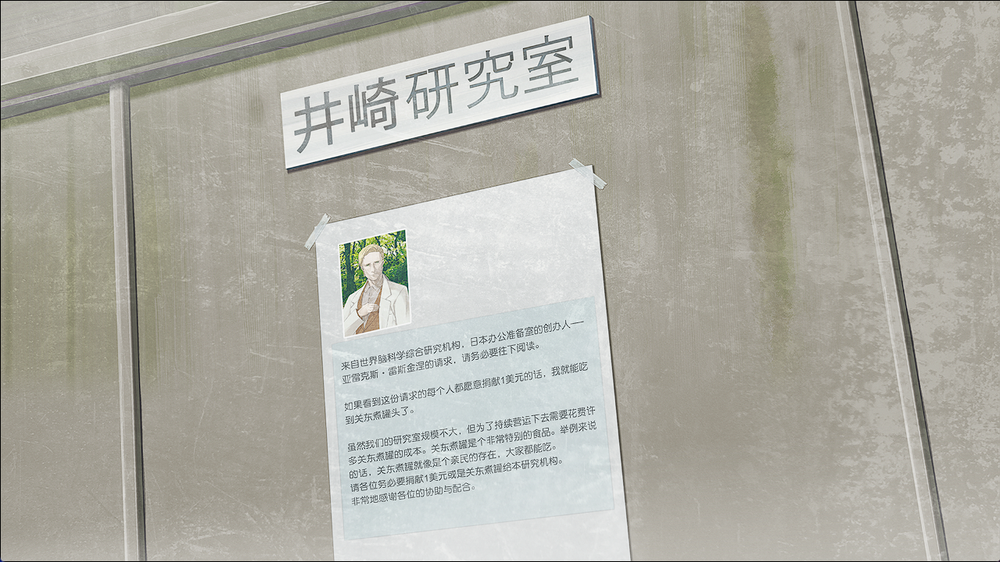
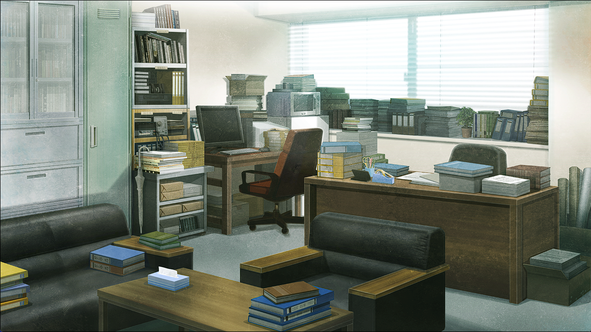

# 存在证明的自动机械 - 05
> 1.081163  
> [ 2011/01/04 真帆视角] 萌郁陪真帆前往电机大的临时办公室，途中两人关系拉近成为朋友，互称姓氏。来到临时办公室后，雷斯吉宁教授、真帆、“红莉栖”三人准备开会商讨后续计划。  

“哈\~啊——好险好险。”  
真帆不经意间忍不住打了个哈欠，慌乱地打住，然后确认了一下周围有没有人看到自己这羞耻的样子。周围靠近栏杆打发时间的人还有很多，当然大家都沉浸在自己的事情里，没人注意到真帆。本来今天是要在菲莉丝家，一整天都继续进行办公室暂时关闭的相关事后处理。但是早上，雷斯吉宁教授来了个电话，要真帆去东京电机大学一趟。好像是为了代替无法继续使用的和光市的办公室，而暂时借用了电机大的一间办公室。说是通过之前研讨会上帮过忙的的电机大的井崎准教授，对方虽然还在新年假期中，但是联系之后立刻同意了。顺带为了商讨关于今后的计划，真帆准备去往电机大的临时办公室。东京电机大学的神田校区，好像在离秋叶原不是很远的地方。  
“话说真是好天气呢。”  
从建筑物之间看到的天空，是冬天特有的澄净。因为昨天几乎整天都窝在房间里，即使吸到这样冻结般的空气，也感觉好舒服。真帆双臂并拢向上伸去。  
“嗯——不过好慢啊……”  
真帆在这里发呆，是在等萌郁。  
“啊，来消息了。”  
『对不起！马上就到了！（>_<）  
 』  
「不那么急也没关系，慢慢来就好」  
『』  
“也不必特地这么做啦。”  
由于真帆不知道电机大的地址，萌郁特地来当向导。作为交换，萌郁提了个要求。  
“……我想……拍照……给比屋定博士……放在报导中。”  
真帆不是很喜欢被拍照，但是难得人家来采访自己，想着尽可能配合，于是就答应了。萌郁现在回家去拿摄影用的相机，因为她说就是步行来回的距离，所以真帆就在这里等她。  
“她 RINE 上还真活泼呢。”  
放下手机抬起头，正好看到桥下萌郁慌张地跑来。  
“……让你久等了……真对不起……比屋定博士。”  
“不这么急也可以的呀。稍微休息一下吧？”  
“……不……没事……的。”  
萌郁说着，就先真帆一步向前走去。  

因为是年初，所以地铁还很空。真帆观察着旁边抓紧吊环的萌郁，她的模样让人有些在意。  
“…………？”  
萌郁注意到真帆的视线，侧头看了过来。然后很快拿出了手机，开始输入着什么。  
“？”  
包包底部，真帆的手机响了。好像是 RINE 上收到了信息。  
『怎么啦？』  
「原来如此，这样在电车里也能对话了呢  
 明明就在旁边却用 RINE 聊天，有种奇妙的感觉  
 桐生小姐看起来好像没什么精神啊，也许是错觉吧」  
萌郁的表情看起来没什么变化，真帆却觉得这并不代表她的感情起伏很小。看着她那双让人印象深刻的细长眼睛，就能知道她对于各种各样的事物，都很有兴趣地仔细观察着。不愧是记者啊——给人这样的感觉。  
『抱歉让你担心了（;﹏;）  
 没事的  
别在意！  
（x2）  
 因为要负责任地把比屋定博士带到电机大！』  
「这个“比屋定博士”的称呼，有点不好意思呢」  
『  
 称呼吗？』  
「对  
 现实中也好 RINE 中也好，不用每次都加“博士”啦  
 更随意一点吧？」  
『  
 可是，不知道该怎么称呼比较好呢（>_<）』  
「平常地用名字称呼就好  
 对于冈部，你就只是称呼他为冈部君而已啊  
 」  
『因为冈部君年龄比较小而且还是学生啦\~（;﹏;）』  
「同样对待我也没关系啦  
 我们会当一段室友，而且年龄也差不多不是吗  
 用“萌郁”/“真帆”来互相称呼怎么样？」  
也许旁人看来绝对无法理解，但是真帆和萌郁的年龄只差了一岁。而且真帆是更年长的一方，21 岁，萌郁 20 岁。到底是和神交换了什么契约，才能获得那样傲人的身高和丰满的胸部，真帆忍不住如此想道。  
『唔——呜——果然做不到！（>_<）  
 从来没有直呼过别人的名诶！（;﹏;）  
 太紧张了绝对说不出口！』  
「……唔  
 那“桐生”/“比屋定”怎么样？  
 请成为我在日本为数不多的朋友之一吧」  
『知道了！就这样！（>_<）』  
「OK！  
 那现在就来叫看看吧」  
『』  
“……啊？”  
萌郁吓得睁大了眼睛。  
“……现……现在？在……这里……？”  
“对\~”  
萌郁声若蚊蝇般发问，真帆鼓励地点了点头。  
「既然决定了就要立即实践吧」  
『但是但是！刚刚也说了，我，对于和人谈话真的很不在行啊\~！（>_<）  
 』  
「这样吗？  
 还以为昨天你紧张是因为冈部在呢  
 以为你是有异性在就紧张的类型……」  
『唔……  
 的确，和男性谈话的时候更加紧张……（>_<）』  
「也就是说，和女性不是完全不能谈话的程度吧？」  
『嘛，大概，也许吧……』  
「我们都是同性，就好好相处吧！  
 那么这样如何？  
 我和桐生两个人独处的时候，可以的话就不要用 RINE 而是开口聊天怎么样？  
 有人陪我聊天，就不会觉得无聊了  
 桐生要继续当记者的话，这不也是个很好的练习机会吗？如何？」  
『呃……  
 （x3）  
知道了！我努力试试看！（>_<）』  
萌郁终于下定了决心，抬起头看向真帆。  
“……比……比屋定……请……多多关照。”  
“嘿嘿，请多关照呢，桐生\~”  

就这样，电车到达了目的地。东京电机大学的周围一片寂静。从萌郁处得知，由于办公区和官府区就在附近的缘故，这个时间段基本没人。对萌郁说了声抱歉，请她在外面等一下。现在大学正在假期，虽然在校园内也能找个教室让她待一会，但是她却拒绝了。  
“那结束后再联系你。”  
说完，便和萌郁分开了。一直没找到井崎研究室的位置，真帆完全迷路了。由于正值放假期间，大学里基本没有学生，也没办法找谁来问路。最后，打电话给雷斯吉宁教授，询问了具体的位置。  
研究室的门前，【井崎研究室】的牌子下面，用透明胶贴着一张信纸大小的纸张，纸面上印着教授微笑的照片，还有直接用电脑截图打印的一样，分辨率超低的文字。  

“教授还是喜欢搞这种事呢……”  
不论在多么正式的场合，想开玩笑就开，阿莱克西斯·雷斯吉宁教授就像个小孩一样。但是多亏这种奔放的性格，真帆和红莉栖才能在研究上尽情地自由发挥。突然想起了红莉栖，情绪微微高涨了一点。回顾一下，突然间，住宿的地方改变，并且和刚认识的人开始了共同生活，这让真帆有些疲惫。今天能久违地和她慢慢聊天了——准确的说是和她残留的记忆。  
“教授？雷斯吉宁教授？”  
踏入研究室，叫着教授的名字，一位巨人从更里面大步走来。  
“*Yo, Maho!* 终于来了啊，欢迎来到*power up*的准备室！”  

“哈……也就是说，一张桌子两张沙发，就是‘*power up*的准备室’啊。”  
“*Yes!* 不是有句话说，‘简约才是接近真理的秘诀’吗？”  
“谁说的？”  
“就是我啊！*HAHAHA!*”  
不理会拍手大笑的教授，真帆坐到了对面的沙发上。教授也没在意，就这样进入正题。  
“那么，我们来讨论今后的计划吧。”  
“啊，抱歉，我先启动『Amadeus』，请稍等一下。”  
真帆拿出笔记本，在办公桌上打开，启动为研究定制的 Linux 操作系统，来到登录界面，熟练地输入用户名——Salieri。  
“唔……”  
真帆顿了一瞬，注视着账户名，然后输入密码调出桌面。终于，“红莉栖”出现了在画面中。  

 

> (to be continued)
---

| [←prev](./0078) | [menu](../) | [next→](./0080) |
