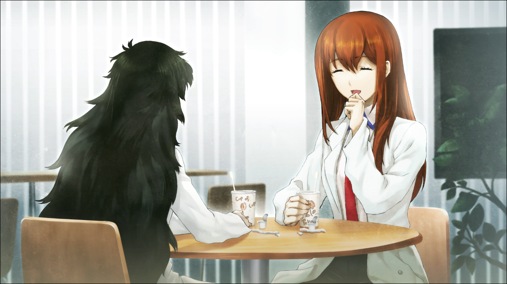

# 存在证明的自动机械 - 06
> 1.081163  
> [ 2011/01/04 真帆视角 ] 通过莫扎特的钢琴曲回忆起和红莉栖成为朋友的契机。“死亡意味着不能再听莫扎特了。”真帆隐约想起有件事情很重要，一定要想起来，与自己在红莉栖去世一个月后决定使用的用户名 Salieri 有关。  

| [←prev](./0079) | [menu](../) | [next→](./0081) |

---

“好久不见，前辈。”  
“什么好久，前天不是才说过话吗？”  
“那是紧急情况，不能算作说话。即使不算上那次，最近也没怎么聊过。”  
“没办法啊，因为还在测试期间。”  
当下，冈部和“红莉栖”的正在进行交流实验，为了避免实验中掺入“噪音”，真帆和雷斯吉宁教授都自我克制，不与『Amadeus』进行谈话。  
“冈部先生最近也没怎么和我聊呢。莫非，前辈和冈部先生经常瞒着我见面吗？前天也在一起呢。”  
“喂！都说了不是你想的那样啊！为什么你不论什么时候脑袋里都充满了恋爱妄想啊！”  
“才不是妄想！这是基于冷静的观察和分析，而得出的可信度极高的推论。”  
“那样的话，你去专门研究那个作为课题不是很好？  
 只是你这种偏离实际的分析，别说博士学位了，连本科毕业都有危险。”  
看着真帆和红莉栖和过去一样地拌着嘴，雷斯吉宁教授动作夸张地拍起了手。  
“这种气氛，真令人怀念呢。  
 以前不管在校园什么地方，要找你们都一点也不费劲。  
 因为整个校园不论什么时候都能听见你们俩拌嘴的声音啊。*HAHAHA!* ”  
“真是的，教授，别开玩笑了！”  
“这是你们关系要好的证明啊，就好像姐妹一样。  
 那么，我们就开始进行关于今后计划的会议吧。  
 ‘最高效利用时间的人就是胜者’，这也是我的名言哦\~  
 话说想来点音乐啊。*‘Kurisu’*，能麻烦你一下吗？”  
“好的。”  
马上，笔记本的喇叭里流出了钢琴安静的旋律。  
“这是……”  
“前辈，还记得吗？我和前辈的，契机之曲。”  

——怎么可能忘记。那件事发生在一年前，让真帆和红莉栖相交，开始加深对彼此的了解，也成为了象征两人关系的事件。  
距今约一年前的 2009 年 9 月，红莉栖成为了脑科学研究所的正式成员。同年 5 月，红莉栖就修完了大学院的博士学位，7 月份才刚满 17 岁。本来真帆是以最小的年龄进入脑科学研究所的特例，但是这个记录被红莉栖大幅刷新了。红莉栖是天才——认识她的任何人，即使只是聊过几句，都这么认为。因为雷斯吉宁教授在学院里有导师的工作，真帆和她也见过几面，因此了解到，她是与众不同的。红莉栖并没有炫耀自己的才能，相反，看起来一点也不觉得自己是天才。但也正因为这种姿态，对于周围人来说反而有一种微妙的难以接近的距离感。越是和红莉栖交谈，就越会切身体会到，和她之间存在着绝对无法弥补的能力差距。后来从雷斯吉宁教授那里听闻，她好像从研究生时代就有了这种倾向。不仅如此，也有传闻说，这也是她 11 岁从日本移居美国的原因之一。与本人的意志无关，无论在哪里生活，她都会被周围孤立起来。这就是与她的天资伴生的罪业。真帆与她既是同性，又年龄相仿，虽然不至于排斥，对她还是抱有一定的对抗意识。毕竟在同一个研究所工作，别人无论如何都会将二人进行比较。不想输给她——因为这种想法，真帆没有主动和红莉栖搭话；红莉栖也为了尽快习惯研究所的工作方式而拼命努力，也没有主动和真帆搭话。  
不过，红莉栖来到研究所的两周后。由某首古典乐曲牵线，真帆和红莉栖的关系发生了巨大的改变。  
“播放……”  
真帆一直认为，人类可以分为“听音乐更能集中注意力”和“无声状态更能集中注意力”两个派别。从脑科学角度来说，听音乐更能集中注意力的说法，原理上是不可能的。即使没有意识到，声音也会让鼓膜振动，随即大脑也会持续进行分析。话虽如此，如果针对这件事召开听证会，真帆觉得自己会作为前者的拥护者而站上证人席。理论和感情是不一样的。听音乐的时候最能集中注意力，灵感也会连续不断地闪现。但是，有一个条件——  
“能让人集中注意力的音乐，只有莫扎特的曲子。”  
喃喃自语着，真帆转向了电脑。电脑上的批处理运算用了两天终于结束了，今天一天要对输出结果进行检验。因为是星期六，研究室除了真帆没有其他人了。只有这一天，这个广阔的空间是她独享的研究室。所以她才没有接上耳机，而是用扬声器播放莫扎特的第 11 号钢琴奏鸣曲。也不是为了听音乐，就像是一种仪式，引导她集中注意力，仿佛是潜入数值和公式之海前的准备运动。潜入之后就没必要了，集中注意力后自然就听不到音乐了。周围的风景也从视野中被排除出去。眼前映出的只有数值和公式。脑海中，也只有数值和公式。很快，存在于那里的，唯有名为比屋定真帆的思考机器。意识脱离肉体的束缚，思考速度无限增加。那么，今天也开始愉快的旅程吧——  
“早上好\~前辈。”  
“噫呀啊啊啊——！”  
突然有个人在耳边低语，真帆从椅子上弹了起来，最终失去平衡而倒下。抬头看去，红莉栖正惊慌失措地看着真帆。 
“对、对不起！没想到会吓成这样！”  
“红、红莉栖！别吓人啊！！”  
“我叫了很多次，你好像没有听到……”  
“啊……”  
真帆站起来重新坐回椅子。  
“对不起，我正在集中精神没有听见。”  
“嗯，我也这么觉得。”  
那就别管我就好了呀——真帆心里这么想着，也许脸上也不自觉流露了出来，所以红莉栖慌张地补充道：  
“我也觉得很抱歉。但是难得在休息日见到前辈，所以想和前辈打个招呼。  
 还有，我看你刚刚开始工作，应该不会打扰到吧。”  
“你刚到吗？”  
“是的。本以为只有我一个人，稍微有些惊讶。”  
这时真帆注意到了谈话的违和感。  
“你也说是刚到对吧？那为什么知道我是刚刚开始工作呢？”  
“啊，那是因为——”  
红莉栖指着播放着钢琴曲的扬声器。  
“还在第一乐章的开头呀，K331——莫扎特 A 大调第 11 号钢琴奏鸣曲，第一乐章。”  
“你喜欢莫扎特吗？”  
“略懂。而且比起莫扎特其他曲子，我更喜欢这首。  
 虽然对于普通人来说，《土耳其进行曲》更有名一些。  
 但是我觉得第一乐章的安静旋律更加舒心。”  
“我也是相同意见。”  
“太好了！我要集中精神进入状态的时候，也是放着莫扎特做 BGM。  
 不过这不像是科学家应有的言论呢。”  
“呵呵\~”  
听到红莉栖说出了自己脑中方才的想法，真帆不禁笑了出来。红莉栖加入团队两周了。虽然还存在些许距离感，突然间想多了解一些她的事情。于是，真帆说出了同事们之间常用的，暗示休息的信号。  
“要喝咖啡吗？”  
“赞成！而且有些事情想要请教前辈。”  
看着充满干劲靠近的红莉栖，真帆恍惚间好像看到了过去饲养的宠物犬。真帆之后才知道，这正是红莉栖的可爱之处。  

用公用咖啡机冲了两杯热咖啡，二人聊着研究相关的话题。20 岁的真帆和 17 岁的红莉栖，单手拿着纸杯装的热咖啡，一边进行着大脑生理学最前沿的讨论，在旁人看来应该是是十分令人讶异的情景。但是对于两个从未有过同龄同性的研究伙伴的人来说，很快就理解到这种交流对双方的好处。特别是对于年纪更小的红莉栖来说，真帆毫无疑问是非常重要的存在。表现之一就是，不论纠正多少次，她都没有改口，而是用“前辈”来称呼真帆。  
“说起来，爱因斯坦好像很喜欢小提琴呢。”  
“好像也很尊敬莫扎特呢。喜欢莫扎特说不定是科学家内部渊源深厚的传统。”  
“如果真是这样，那还真光荣呢，嘿嘿\~”  
结束了研究上的讨论之后，咖啡喝完之前，两人谈起了莫扎特。深入谈话之后，真帆发现对红莉栖的印象和当初完全不同。说话时随着话题变化丰富的表情，看着就觉得好可爱。只有这种反应才让人觉得她是一位符合她年龄的少女，而不只是一位“天才”。  
“前辈，你知道爱因斯坦是怎么回答，‘对你来说死亡意味着什么？’这个问题的吗？”  
“不知道，怎么回答的？”  
“‘死亡意味着不能再听莫扎特了。’这句话在日本可是很有名呢。”  
“死亡意味着不能再听莫扎特了。”——多么浪漫主义的回答，和真帆对爱因斯坦的印象稍微有些出入。  
“诶，不知道呢。爱因斯坦居然说过这种话。”  
“不，没说过。”  
“诶？”  
“虽然不能严格证明没说过，但至少从未留下过类似记录。”  
“怎么回事？”  
红莉栖微笑着曲指抵唇，眯着的双目仿佛美丽的新月。  
“以前，日本出版的一本书，从其他书上引用了这句话。  
 但是，这本书并没有注明引用的书名，至今为止也没有找到那本书。”  
“作者自己捏造的吗？真是无语。”  
“因为没办法证明，所以也没办法判断真假呢。  
 不过，我觉得这句话很有爱因斯坦的风格，很有逻辑性呢。”  
“逻辑性？”  
“嗯。因为，死了就听不到莫扎特了嘛。”  
“这不是当然的嘛。”  
“是的，这是当然的。不只是莫扎特，死了的话什么都听不见了。  
 ——命题为真。呐，很有逻辑性吧\~”  
“你真有趣呢，知性和幼稚在一个大脑中共存。”  
“才不是什么幼稚呢。”  
“不好意思。可能说得有点晚，今后要请多关照呢，红莉栖。”  
真帆伸出手，红莉栖双目闪光地握住了。她的手充满温暖。  
“请多关照，前辈。”  
以莫扎特为契机，两人一下子变得亲密起来。红莉栖是天才，是被神眷顾的孩子。对于她那与众不同的创造力，任何人都感到震惊，并投以尊敬的目光。当然，真帆也是其中的一员。”  
……  
…………  
………………  
总觉得，有件很重要的事情一定要想起来，是什么呢——  

“早上好\~前辈。”  
“噫呀啊啊啊——！”  
突然有个人在耳边低语，真帆从椅子上弹了起来，  
“什、什么？”  
“*HAHAHA!* 和 *‘Kurisu’* 说的一样呢！”  
不知什么时候，雷斯吉宁教授已经站在了身后，双手端着真帆的笔记本。屏幕上的“红莉栖”正看着真帆发笑。”  
“好像正是教授端着笔记本靠近真帆的耳边，让“红莉栖”细语的。”  
“前辈刚才进入了忘我模式。教授不管叫了几次，前辈都没办法从自己的世界里面回来呢。”  
“啊……对不起。”  
“在这种非常时期，还可以保持研究状态，真是了不起啊！”  
教授把笔记本放回办公桌，重新坐到对面的沙发上，就这样开始了会议，讨论今后该怎么办。根据实际情况，回到美国也作为其中一个选择被提了出来。会议过程中，真帆的心里总残留着一些朦胧的情感。刚刚在回忆和红莉栖的相遇场景时，同时也回忆起了一些其他的事情。Salieri——真帆的用户名，红莉栖逝去的一个月后决定使用的名字。那个时候的事情，不知为何突然就在真帆的脑海中浮现，挥之不去……  

 

> (to be continued)
---

| [←prev](./0079) | [menu](../) | [next→](./0081) |
