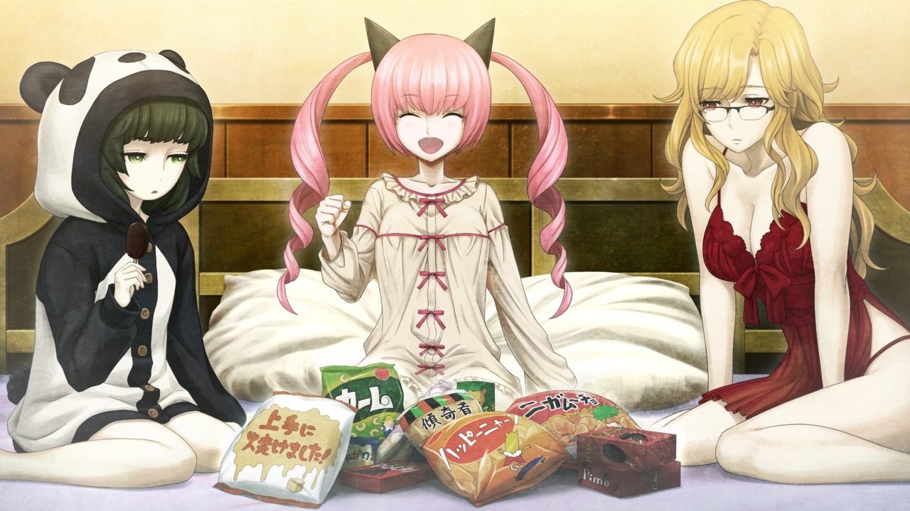

# 存在证明的自动机械 - 07
> 1.081163  
> [ 2011/01/04 真帆视角 ] 真帆帮萌郁打伞方便她拍照。真帆、菲莉丝、萌郁三人开深夜女子会加深感情。聊到人工智能未来，萌郁认为自己会被取代，真帆受到触动表达不会给更优秀的人或 AI 让出位置，我就是我，鼓励了萌郁。  

| [←prev](./0080) | [menu](../) | [next→](./0082) |

---

结束和雷斯吉宁教授的会议之后，来到电机大外面，天空正下着小雨。  
“啊，果然下雨了啊……日本的天气预报还真准得令人惊讶呢。”  
 桐生是不是去了哪个小店躲雨呢？”  
真帆拿出手机准备和萌郁联系，正好收到“红莉栖”发来的信息。  
『今天能和前辈聊这么久，好开心！  
 下次也和我讲讲你和冈部先生的事吧』  
「我也很开心呢  
 说过多少次了，我和冈部先生不是你想的那样！」  
『（x3）』  
“可恶……！”  
真帆正准备好好反击，突然发现了萌郁的身影。她撑着折叠伞，蹲在路边，举着手机。靠近后发现，萌郁正在用手机拍着，柏油路和草坪的间隙绽放着的花朵。  
“桐生，不好意思，让你久等了。”  
听到真帆的声音，萌郁抬起头，怯生生地开了口。  
“……比屋定。”  
真帆很开心她能直呼自己的姓氏。  
“在拍花吗？”  
“……嗯。”  
萌郁点点头，接着目光重新回到了地面。柏油路和草坪的间隙开着小小的花。周围没有看见相同的花，大概是被风吹来的种子长成的吧。花朵的颜色令人印象深刻，但是因为被雨淋湿的缘故看起来没什么精神。萌郁拍摄着那些花，一次又一次。因为一只手举着伞，拍得不是很好的样子。  
“我帮你撑伞吧？”  
“诶……不用了……”  
“好啦好啦。”  
从犹豫的萌郁手中，真帆略带强迫地接过了伞。  
“……谢……谢谢。”  
“不用客气。”  

萌郁双手拿着手机，调整好焦距按下拍摄键。过了一会儿，萌郁满足地站了起来。  
“……拍……好了。已经……可以了。”  
“是为拍人像做准备吗？”  
萌郁摇了摇头。  
“……比屋定的照片……拍不了了。因为……下雨了。风景照是……习惯。”  
“你喜欢拍照吗？”  
萌郁又摇了摇头。  
“……证明。今天……自己在哪里的……证明。”  
“证明？”  
“对。”  
“这是什么意——”  
这时，手机又响起了 RINE 的消息提示音。  
“又是‘红莉栖’吗……”  
“……我也……收到了，是菲莉丝小姐。”  
“菲莉丝小姐？”  
『大事不好了喵！  
 法蒂玛第 314 号预言终于实现了喵！  
 因为人们忘却了信仰，古印加帝国以自身为代价施加的封印被破坏了喵！  
 这样下去，冥王星的恐怖大邪神复活也只是时间的问题喵！  
 不仅仅是地球，也是大银河星团联盟的生死危机喵！  
   
 现立即向贵族院、元老院及奥之院全体发布召集通告喵！  
 总统如今行踪不明，一定是乘着空军一号深入敌境，独自奋战喵！  
 接下来菲莉丝也要为了再次封印邪神而准备举行仪式了喵！  
 希望你们两人能为我争取时间！  
 』  
「喂等等！  
 到底在说什么啊！」  
『』  
『刚刚是在开玩笑喵  
   
 但是真的有大事发生了喵！  
 （x2）』  
「发生什么了？」  
『』  
『待会儿再解释喵！  
 回到公寓之前，有项重大任务要拜托两位喵！』  
菲莉丝发来一堆意义不明的信息，真帆和萌郁看着对方，都露出了不解的神情。  

“两位终于来了喵！虽然最终时限正在迫近，不过还有一点时间喵。准备好了喵？”  
“……准备好了。”  
“嗯。”  
“那就开始了喵！作战名称是——  
 「灰姑娘们的深夜秘密聚会——让人梦中惊醒的发言！？」——喵！”  
“…………”（x2）  
“你们俩都怎么了喵？没什么情绪喵！”  
 难得搞一次女子会，再开心一点喵！”  
“呃，好吧。没想到，‘有项重大任务要拜托两位’，就是不要吃晚饭……”  
突然从菲莉丝那里收到“今天晚上开女子会”的通知，作为准备，菲莉丝拜托她们不要吃晚饭保持空腹。真帆和萌郁都很忠实地遵守了。  
“快点快点，快拿喜欢的来吃喵！蛋糕、冰淇淋什么的，还买了稍微贵一点的喵！”  
菲莉丝欢快地从便利店的塑料袋里一包接一包的往外掏。平常看起来是很有大小姐范，实际上也的确是大小姐的菲莉丝，有需要的话，也会买价钱要多个一两位的蛋糕。不过，她也很明白，深夜女子会需要的蛋糕零食要从便利店买，于是她也毫不介意地执行了。真帆觉得不论是 *MayQueen* 的客人也好，女仆们也好，一定都很敬仰她这一点。*MayQueen* 年初开张以来，好像就一直处于女仆数量不足的状态。但是今天菲莉丝身上却看不出一丝疲惫。  
“嗯\~？真帆喵怎么了喵？迷上菲莉丝了喵？来自女孩子的求爱一直欢迎的喵\~\~”  
“啥！才没有啦！”  
“不要害羞喵！对礼物满意的话，菲莉丝也会很开心的喵！”  
 如我所料，这件熊猫睡衣很合适喵！ ”  
“才、才不是喜欢呢！因为是好不容易用心准备的礼物，如果拒绝的话就太失礼了……”  
现在真帆穿着熊猫造型的睡衣，是菲莉丝买来的。  
“尺寸居然刚刚好……不过这怎么看都是小孩子穿的吧。”  
“因为真帆喵就像洋娃娃一样，肯定穿什么都合适的喵！”  
“不要用这种称呼方式。还有，拜托你不要考虑怎么让我每天穿不同的动物睡衣。”  
“喵！？”  
“什、什么啊！？”  
“真帆喵，你会读心术喵！？才刚刚准备了一周的款式，为什么你会知道喵！？”  
“已经买好了吗！？”  
真帆被菲莉丝用玩笑话尽情戏弄的时候——  
“呵呵……”  
萌郁捂住嘴尽力忍笑。  
“桐生？”  
“萌郁喵？”  
“……对……对不起。本……本来……不想笑……的。呵呵呵呵……”  
真帆是第一次看见萌郁的笑容，原来她笑起来是这样的啊。  
“萌郁喵！这个笑容，超可爱喵！让我在多看看喵！”  
昏暗中，菲莉丝双眼突然放出精光，压在萌郁身上，开始对萌郁的侧腹挠起痒痒。  
“胳肢胳肢胳肢胳肢胳肢——”  
“……不、不要……呼，哈……住手——”  
萌郁对挠痒痒很没抵抗力，眼角带泪、面红耳赤地扭着身体。  
“……不、住手……啊、哈啊——”  
“感觉……气氛好像变得，要发生些不能做的事情了喵。”  
“是呢……”  
菲莉丝从萌郁身上离开了，萌郁依旧满脸通红，大口喘着气。  
“……哈……呼……哈、哈啊……哈啊哈啊、啊啊……”  
“不过，好厉害喵”  
“是呢……”  
真帆和菲莉丝互相看着对方。  
“好厉害的胸部喵。”  
萌郁的睡衣是深红色吊带睡裙，是从她内向的性格完全无法联想到的，成熟女性的私房装。她本人好像并没有意识到这一点，单纯选了一件比较方便活动的而已。但是，萌郁本来身材就很棒，穿上后更散发出了妖艳的气质。而且，一边摇动着如此暴力的胸部，一边扭动身体，即使不是菲莉丝，感觉也会变得很奇怪吧。  
“……对、对不……哈啊、嗯、哈啊哈啊……起……”  
萌郁一边喘气一边道歉。好像觉醒了什么不能觉醒的东西……真帆默默摇了摇头。  
“算了，那我们开始女子会吧。”  
“好\~！我去拿冰镇果汁喵！今晚……不许睡觉喵\~！”  
“不许睡觉”只是菲莉丝风格的玩笑而已，她明天很早就要去工作。女子会定为两小时，三个人一直在谈天说地。实际上不过是菲莉丝一直在讲，真帆和萌郁偶尔回答两句的程度。就女子会而言，也许一般话题是打扮或者恋爱关系，但是三个人的关注点都不在这些话题上，取而代之的是当下的工作或者将来相关的内容。聊天过程中，她们很开心地发现彼此令人意外的一面。例如萌郁——  
“……兴趣是……写……小说。”  
在阅读最近流行的手机小说的过程中，产生了自己写的念头。而且是有不少和谐场景的恋爱小说。  
“让我看看喵！”  
“……不行……一章都……还没写完……”  
虽然萌郁拒绝了，菲莉丝和真帆还是强硬地和她结下了“写完就给我们看”的约定。菲莉丝也说出了令人意外的话语——  
“虽然不打算终结女仆事业，我也很憧憬结婚喵\~想要有好多孩子喵！”  
自幼失去双亲的菲莉丝，想要尽早拥有自己的家人，而且想要很多，从而组建热闹的大家庭。最后三十分钟左右，在菲莉丝的软磨硬泡下，真帆慢慢讲述着关于人工智能的研究。真帆在昨天的采访之外，又多补充了一些，聊了聊关于框架问题，关于『Amadeus』，还有关于诞生了超越人类的人工智能的未来。菲莉丝除了萌文化，对技术和发明也很有兴趣，兴致高昂地听着真帆讲话。但是真帆讲话的时候，注意到萌郁低下了头。  
“桐生，怎么了？”  
“…………”  
“困了喵？”  
“……不是……我觉得……未来……很可怕。”  
“未来很可怕吗？”  
“随着人工智能研究的进行……一旦出现比人类还优秀的人工智能……许多人都会失去工作。  
 我也……一定会是……其中之一。这点……很可怕。”  
原来她会这么认为吗，真帆在思考着。虽然和萌郁一起生活不过几天，也已经基本掌握了她的性格。人长得美，身材又好，工作也做得很不错，但是萌郁几乎感受不到自己的存在价值，总觉得没有人需要自己，如果出现比自己优秀的人，那么自己的容身之处就会立刻被夺走。如此循环往复，总有一天自己将无处容身，该如何是好。这就是她的恐惧所在。  
“没事的，桐生。”  
“对的喵！不用那么担心的喵！”  
“……我……不像菲莉丝……或者比屋定……拥有特别的技术……或者知识。  
 不论是谁……都能取代我；不论是谁……都能比我做得更出色。  
 我……不像你们俩……那么优秀。”  
“那又怎么样？有人能代替自己，有人比自己优秀，那又怎么样？”  
“真帆喵？”  
“比我优秀的脑科学家要多少有多少。  
 说不定哪一天，我发明的人工智能，会写出比我还优秀的论文。  
 但是，那又能怎么样？  
 维克多·孔多利亚大学的雷斯吉宁研究所中，我的座位是离门口最近的。  
 门的构造有问题，总会有风吹进来，走廊上聊天的人也很烦，但是那就是我的位置。  
 就算宇宙毁灭，我也不会把那个位置让给别人。  
 比我优秀的脑科学家，比我优秀的人工智能，想要那个位置我就要让出来吗？  
 我并不想说‘每个人都是无可替代的’这种天真的道理。  
 这个社会上几乎没有，换个人就做不来的工作。  
 但是，就算这样也没有让给别人的道理。”  
 因为，我就是我。”  
“……我，就是我……？”  
“而且，和优不优秀没关系。  
 假设，存在一个生物机器人，
 在分子层次上和菲莉丝完全相同，能够提供相同甚至更好的服务。  
 即便如此，我也会选择菲莉丝的服务。  
 即便价格要高出十倍、一百倍，我也不会选择机器人。  
 不需要任何理由。因为我只想喝菲莉丝沏的红茶。  
“就是这么一个道理。所以，这个……”  
真帆顺着自己的心情说了很多，突然卡壳了。  
“…………”（x2）  
回过神来，才注意到萌郁和菲莉丝都惊讶的看着自己。  
“对、对不起，我不小心顺势就——”  
“……我，就是我……或许……没错……”  
萌郁微微一笑。  
“真帆喵！”  
下一刻，菲莉丝突然扑到真帆身上抱紧了她。  
“等等下！干嘛啊！？”  
菲莉丝噙着泪花对她展露笑颜。  
“感动死了喵！真帆喵已经如此深爱着菲莉丝了喵！  
 我一定会回应这份感情喵！真帆喵一辈子的红茶都由菲莉丝来沏喵！”  
“诶——！？我说了那种话吗？”  
接下来的时间里，真帆不停地躲避着要来蹭脸的菲莉丝。  

 

> (to be continued)
---

| [←prev](./0080) | [menu](../) | [next→](./0082) |
