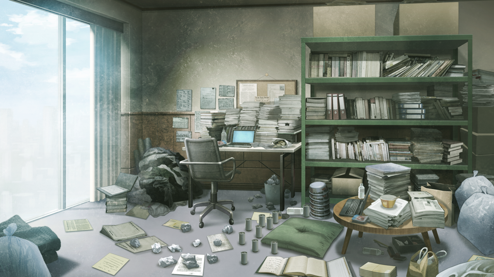

# 存在证明的自动机械 - 08
> 1.081163  
> [ 2011/01/05 ] 真帆和萌郁的房间已经乱到极致，菲莉丝求助、黑木崩溃。冈伦和真由理决定帮忙清扫。真由理提出要请“清扫军曹”。  

| [←prev](./0081) | [menu](../) | [next→](./0083) |

---

我在秋叶原下了电车，稍微叹了口气。话说，从年初开始我已经连续 5 天来秋叶原了。元旦是新年参拜；2 号是为了处理之前几天因中途世界线改变出现的骚动；3 号是去见比屋定和桐生萌郁。4 号也就是昨天，参加了真由理邀请的 *MayQueen* 的新年派对。去年夏天以来已经很久没有像这样每天都来秋叶原了。  
“菲莉丝酱到底怎么了呢？”  
“唉，搞不懂那家伙在想什么。”  
这次我邀请了真由理同行，起因是菲莉丝莫名其妙的消息。  
『凶真\~\~！！！！  
 不对，冈伦\~\~\~\~！！！！  
 冈伦\~\~\~\~\~\~！！！！  
 （x2）  
 大危机喵！！！！  
 今天傍晚，乃三十二万年不遇之九星联珠与群星归位并现喵！  
 最终封印将解除，幻想中等待千年的伟大存在即将苏醒，幻之大陆拉莱耶将重现于世喵！  
   
 夸张了点  
 但真的是有大危机喵！  
   
 虽然真的真的很抱歉，但希望尽快来菲莉丝家里喵！  
 菲莉丝今天一整天都没办法离开店里，所以只能拜托冈伦喵！  
   
 总之去了就知道了喵！  
 对了，去的时候希望也叫上真由喜喵！拜托了喵！  
 （x2）』  
总之，菲莉丝家里好像发生了什么麻烦的事情，所以来向我求助。  
“比屋定她们发生什么事了吗……？昨天和菲莉丝谈话的时候，看起来倒是和平时没什么不同。”  
“不是的哟。菲莉丝酱新年假期这段时间，总是很努力，所以可能太累了吧。  
 可是菲莉丝酱绝对不会露出半点弱态，不论发生什么事，总是很精神的样子。  
 但是这一次，却很罕见地向冈伦求助了。是不是发生了什么严重的事情了呢……？”  
总之，我和真由理迅速赶往菲莉丝家。  

“咦？”  
在一楼入口处呼叫菲莉丝家，却没有回应。管家黑木先生不在吗？比屋定和桐生萌郁也应该在啊。  
“没回应呐……”  
“好奇怪啊……”  
又试着呼叫了一次，这次有回应了。  
“您好……”  
“啊，我是冈部……”  
“好的……小姐已经吩咐过了……请进……”  
黑木先生的声音听起来不同寻常，我和真由理疑惑地对视了一眼，进入公寓楼来到菲莉丝家。进屋的时候，来迎接我们的黑木先生也没有了平常那样华丽的招呼，明显有些憔悴。  
“冈部大人……”  
黑木先生虚弱地叫出我的名字，下一刻，好像断了线的木偶一样无力地跪倒在地。  
“黑、黑木先生？”  
“再这样下去，秋叶家会……唔……”  
“哈啊啊啊啊——！”  
“黑、黑木先生？到底发生什么了？”  
“冈、冈部大人，请立刻撤离这里……此地不宜久留……”  
“到底发生什么事了？”  
“我也……不明白……完全无法相信……自己所见之物……”  
“所见？究竟见到了什么？”  
黑木先生欲言又止，最终放弃了一般绝望地摇摇头，然后慢慢抬起手臂，指着走廊的尽头。  
“客房……就在那里……”  
“什么……？”  
比屋定和桐生萌郁就住在客房！她们两位遭遇什么了吗！？  
“真由理！黑木先生就拜托你了！”  
“啊，嗯！”  
把黑木先生托付给真由理之后，我冲向了客房。门是关着的。  
“比屋定！桐生萌郁！没事吧？快回答我啊！可恶！我进去了啊！  
 什——！怎么会……为什么、会变成这样……！”  

眼前是一幅令人难以置信的场景——这副场景，任何词汇都无法形容。非要说那就是……废品的宫殿。客房已经被改装为比屋定和桐生萌郁的工作室，除了桌子和床的位置没变，其他空间已经完全变了样。大大小小各种各样的书、文具、还有一堆不知道是什么的东西，像沉积岩一样堆到了天花板。中途可能还只是暂时堆叠的书本，现在已经变成一道道直指天花板的高墙了。几百本书构成的墙壁在房间里纵横延伸，化成了一座小迷宫，有些地方不侧着走都过不去。在天花板电灯被遮挡照射不到的地方，还细心地设置了小灯泡，就好像地下迷宫里的火把一样。不可思议的是，这个空间居然不脏。这间房间极限适应了比屋定和桐生萌郁的智力生产活动，其结果就是诞生了一座迷宫。从某种意义而言，不得不说是功能美的极致。只不过，说到底也还是一堆废品的宫殿而已。  
比屋定正面向笔记本电脑轻快地敲击着键盘，戴着耳机哼着歌；桐生萌郁正在和矮桌上的小型笔记本电脑战斗着，同样戴着耳机在听音乐的样子。比屋定注意到了站在门口目瞪口呆的我，取下了耳机。  
“啊啦，冈部先生，你好啊。”  
桐生萌郁也注意到我，取下了耳机。  
“……你好。”  
“哇啊——好厉害的房间啊……”  
真由理从我后面探头进来看了一眼，同样哑口无言。能让真由理都无语，的确是很厉害了。  
“你们俩怎么了？”  
“还好意思问怎么了……这个房间究竟是什么情况……？”  
“房间？有什么奇怪的吗？”  
“…………？”
“哪里都很奇怪好吧……前天还不是这样的啊……”  
“……啊，这个啊。随着时间流逝，人和物都会发生改变。  
 房间当然也不例外呢。怎么样，实用性更强了对吧？”  
对于比屋定这种完全没有发现异常的语气，我感觉头好晕。  
“好像在探险一样呢\~\~”  
真由理自顾自地在书籍的迷宫中饶有兴趣地漫步。路途中还有帘子作为隔断，全都是悬挂着的五颜六色的吊带睡衣。  
“啊\~这些好可爱啊\~”  
“颜色……特意选过……挂在这里。”  
“真的啊\~萌郁小姐有好多成熟的睡衣呢\~”  
“真由理，不好意思，谈话节奏乱掉了，请你先出去一下吧……”  
“啊，嗯。”  
向比屋定和桐生萌郁询问了情况，但是没有得到有意义的回答。也就是说，这两人完全没有意识到这个房间乱得多么极致。她们俩甚至认为，必要的东西都在伸手可及的范围，是对于生活毫无障碍的、舒适的工作空间。菲莉丝会向我求助，还有黑木先生那将死一般的状态，原因毫无疑问就是这个。作为秋叶家最强管家的黑木先生，是以“一尘不染”为信条的。但是完全没有生活能力的二人，是乱七八糟却毫无自觉的类型，完全超过了黑木先生的极限。也难怪他会露出那样恐怖的表情。恐怕，自从她们俩住下之后，黑木先生就一直在尽力尝试去收拾那个房间。回想起来，前天我来公寓的时候，他的样子就有些不对劲。  

“但是菲莉丝为什么会来向我求助呢？  
 还有，为什么要求带真由理一起来也是个谜。”  
“诶嘿嘿\~关于这一点，真由喜已经想到了理由了！  
 菲莉丝酱一定是想要收拾这个房间呢\~所以才把真由喜叫来了呢。  
 只有冈伦一个人来的话，肯定会放弃吧？”  
“呃……”  
确实，可能会的。眼前这座拔地而起的新“建筑”，根本不像是靠“收拾”能搞定的。我一个人的话，也许就转身逃回去了。因为就算是找专门的从业者来，打扫一遍也要花一整天吧。何况拿不到工资，完全不划算。即使想发牢骚，但拜托菲莉丝将比屋定安置在这个房间的，就是我自己。硬着头皮干吧。  
“我们今天要打扫这个房间。不要有任何怨言，这是房东的命令。”  
“是吗？虽然不是很能接受……算了，了解。”  
“……知道了……”  
“我尽量找些熟人过来帮忙，该找谁呢……”  
“对了\~真由喜又想到了呢！找清扫军曹来帮忙怎么样？”  
“清扫军曹？那是什么？”  
“清扫军曹啊，对打扫很有心得呢！房间越乱就越有干劲！”  
“你的熟人吗？”  
“嗯，冈伦也很熟的一个人哦\~”  
“诶？我也……很熟的人？”  

 

> (to be continued)
---

| [←prev](./0081) | [menu](../) | [next→](./0083) |
