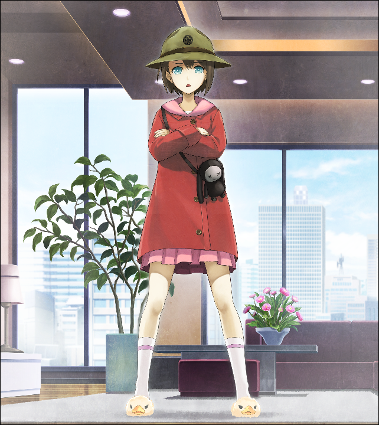
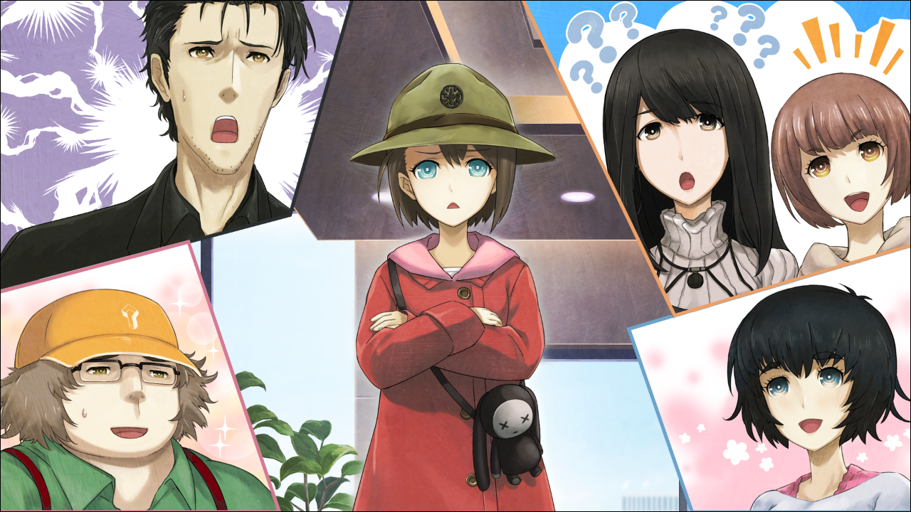

## 存在证明的自动机械 - 09
> 1.081163  
> [ 2011/01/05 ] 清扫军曹的扫除大作战。“绹大人！是的！绹大人！”  

真由理带我来到了LAB。确切来说是LAB所在建筑的一楼，显像管工房。  
“绹酱！嘟嘟噜~♪”  
“嘟嘟噜~♪”  
“啊……”  
“冈伦叔叔好~”  
“真由理，莫非……你之前说的‘清扫军曹’就是绹吗？”  
“嗯，答对了！绹酱对打扫可是非常在行呢~  
 不论店里还是家里，每天都是绹酱在打扫呢~”  
“是、是吗？”  
“是的哟！虽然显像管每天都是爸爸在擦，但其他地方都是我在打扫哟！”  
说起来，记忆中进入工房的时候从没见过地上有垃圾。  
“啊，并不是爸爸讨厌打扫，是因为我喜欢。  
 看到地上有垃圾就会想，‘不打扫不行！’，身体自己就行动了。  
 妈妈一直教导我，房间的肮脏就是心灵的肮脏。”  
“原来如此，但是为什么叫‘清扫军曹’呢……”  
听到我这么念叨，绹惊讶地瞪大了眼睛，脸红了起来。  
“啊！真由理姐姐！？明明说过不许和任何人讲的呀！”  
“对不起呢。但是，我们真的很需要清扫军曹的力量呢~”  
“人、人家才不是什么军曹呢~！只不过是在打扫的时候，特别有干劲而已啦~！真的哟！”  
绹拼命解释着，好像要哭出来了。也是，这个年纪的小女孩，被叫军曹大概很不情愿吧……  
“呐，绹酱，怎么样呢~？可以来帮真由氏和朋友们吗？”  
“嗯……不要再叫人家军曹了哦？”  
“嗯，不叫！”  
“那么，好哒！我要去打扫！而且也想去猫咪姐姐家里看看！  
 啊，但是，一个人的话有点没底呐……”  
“没问题的！大家都会帮忙的。对吧，冈伦？”  
“啊，是的，我去联络大家。”  
“那我去准备一下，你们稍等哦！我回家拿下帽子！”  
说完，绹没有回店里，而是朝着车站的方向跑去。  
“帽子？那是什么？”  
“很快就知道了哟~”  

——半小时后。我召集了吹雪、枫、桶子三人，和绹会合后，全员前往名为菲莉丝家的垃圾海。  
然后，我见到了“清扫军曹”。  

“我就是训练教官，前任军曹天王寺！听好了！  
 在这个房间打扫干净之前，你们这些家伙都是尺蠖！地球上最下等的生命体！  
 你们这些家伙不是电子器械，连被叫做吸尘器的价值都没有！  
 你们这些家伙只有在叶子上伸缩蠕动，除此之外毫无价值！  
 你们这些家伙肯定会讨厌严厉的我。但是，唯有憎恨才能让你们长记性！  
 我的严厉是公平的！我的使命就是让这个房间变得闪闪发光！  
 明白了吗？你们这些尺蠖！”  
（悄声）“真、真由理！”  
（悄声）“怎么啦？”  
（悄声）“怎、怎么回事啊，那是？”  
（悄声）“绹酱啊，在打扫的时候呢，性格上会有 一 点 点 变化哦~”  
（悄声）“那个根本不是性格上的变化了吧！人格都变了啊！”  
（大声）“小动物系萝莉美少女，真面目是抖S军曹，喜欢辱骂play……这在我们业内可是奖励！”  
（悄声）“桶子……你给我自重……”  
（大声）“真希望打扫完后突然来个温柔的、卿卿我我的展开呢。  
 ‘在清洁完房间之后，也来给你清洁一下’之类的！”  
“是谁！刚刚在那说些非常恶心的话！”  
“咿！是、是我说的！”  
“不要随便讲话！被问到的时候再用‘是的’或‘不是’来回答！”  
 还有，答话的时候，头尾要加上‘绹大人’的尊称！明白了么！”  
“绹大人！是的！绹大人！  
 哈啊——能沐浴在真实幼女的辱骂声里，今天简直太幸运了~!”  
“你在那里笑个什么劲儿！”  
“咿！”  
“听好了！现在开始你就叫笑笑熊了！”  
“绹大人！是的！绹大人！”  
“高兴吗？笑笑熊！”  
“绹大人！是的！绹大人！”  
 虽然怎样都好啦，但是这句‘绹大人！是的！绹大人！’很拗口呢……”  
“什么——！？你有什么意见么？笑笑熊！”  
“绹大人！不是！绹大人！”  
“你在戏弄我吗？笑笑熊！”  
“绹大人！不是！绹大人”  
“很好，笑笑熊！现在你给我在30秒以内，用抹布擦走廊10个来回！”  
 快点给我开始！去吧，1！2！3！”  
“绹大人！是的！绹大人！”  
 哈啊哈啊——再多点，请再多辱骂我吧！”  
“一个人高兴成这样啊……”  
“今天由季没来是对的呢~”  
枫和吹雪刚好结伴来秋叶原，所以能来帮忙。但是由季因为打工抽不出时间。为了桥田家的未来，也可以说是幸运吧。顺便一提，比屋定和桐生萌郁在这种体育类活动中早早就掉队了，作为阳台先遣部队在悠闲地擦着窗户。  
“好，下一个！那边的漂亮大姐姐们！”  
枫：“我、我吗？”  
吹雪：“漂亮？果然~！”  
“说一下为什么志愿加入我的队伍！”  
枫：“那个，我们只是被叫过来的……”  
吹雪：“是啊是啊，这是什么情况啊？”  
“提问的人是我！”  
吹雪：“咿啊！”  
“回答我的问题！”  
吹雪：“绹大人！是的！绹大人！”  
枫：  “绹大人……是的……绹大人？”  
“我再问一遍！为什么志愿加入我的队伍！”  
吹雪：“绹大人！为了打扫！绹大人！”  
“那就给我拿出点气势！”  
吹雪：“绹大人！是的！绹大人！”  
枫：“气、气势？”  
吹雪：“好了，要开始了哟枫酱！”  
枫：“诶，等、等一下！”  
吹雪：“真的是，扫除地狱daze！”  
真由理：“吹雪酱还真是兴致勃勃呢～”  
“来岛小姐，看起来非常为难啊……”  
“那边的两个人！还在闲聊什么呢！赶快把这个耸立黑粗的物体拿到下面的垃圾场去！”  
“耸立黑粗……什么玩意儿！？”  
“是指那边的垃圾袋哟。没错吧~？”  
“嗯！没错！赶快给我搬！”  
“绹大人，是的，绹大人～”  
“绹大人，是的，绹大人……”  
“你们在胡闹吗？听不见！这种态度还想让房间变漂亮吗？”  
“咿！”  
“拿出气势！大声喊出来！”  
冈伦&真由理：“绹大人！是的！绹大人！”  
“全体人员，有空露出这种傻瓜表情，不如多去捡个垃圾！”  
吹雪&枫：“绹大人！是的！绹大人！”  
“手上的任务完成后，就把家里面的门把手全都给我擦得闪闪发光！”  
冈伦&真由理&桶子：“绹大人！是的！绹大人！”  
“给我擦桌子擦到不会笑也不会哭吧！感到光荣吧！”  
全体：“绹大人！是的！绹大人！”  
就这样，再军曹的命令下，扫除一直持续到晚上。  

 

> (to be continued)
---

| [←prev](./0082) | [menu](../) | [next→](./0084) |
