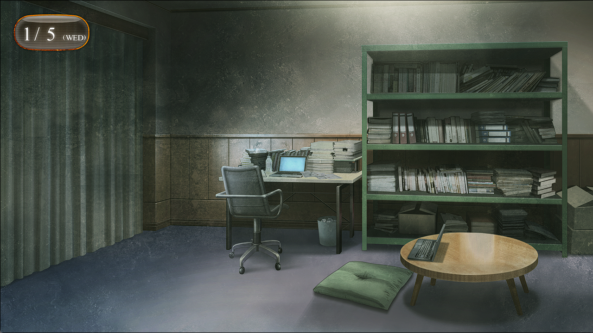

> <big> ** 存在证明的自动机械- 10** </big>  
> 1.081163  
> [ 2011/01/05 ] 扫除结束后。大家庆功宴，枫弹奏K331第三乐章《土耳其进行曲》，勾起真帆的情绪。冈伦听她讲述了她对红莉栖，类似于萨列里对莫扎特的感情。同时发现萌郁格外关心真帆。  

“今天真是帮大忙了喵！菲莉丝非常感激喵！”  
“突然发生这样的事，在下还担心会变成什么样。托大家的福现在好过来了。  
 在下拿出看家本领烹饪的料理，请大家尽情享用。”  
“干杯的发起人，就拜托今天的英雄——绹喵了喵！”  
“我、我吗！？”  
“很称职哦，军曹。”  
“冈、冈伦叔叔！不是约好了不再那么叫了吗！”  
“好啦好啦，拜托你了喵！”  
“好、好的！非常感谢今天帮忙打扫的各位！干杯！”  
全体：“干杯！”
花费了大半日的大扫除，多亏绹大显身手顺利完成。在自己房间卧床不起的黑木先生，看到收拾干净的房间后精神了许多，也给我们准备了豪华的晚餐。扫除期间看起来精力充沛得简直像换了个人的绹，现在也恢复到了平常的状态。现在的她双手握着盛有橘子汁的纸杯，开心地和枫说着话。  
“枫姐姐会弹钢琴！？好厉害！”  
“哪有啦……怎么说呢，我对音乐史方面挺感兴趣的……钢琴也只是稍微会弹的程度而已……”  
“才不是呢！很厉害呢！”  
枫的谦虚貌似更加挑动了绹的内心。  
“枫酱，给绹大人弹一曲如何？那边不就有钢琴嘛。”  
房间的角落，架着一台小型直立式钢琴。它的存在恰到好处。  
“好想听！好想听姐姐弹钢琴！”  
“诶？我还没到能弹给人听的水平哟……”  
“菲莉丝不会弹钢琴。你来弹的话，钢琴也一定会很高兴的喵！”  
“当然，在下有在维护，调音上是毫无问题的。”  
“真、真是为难呢……那么，就弹一首哦？”  
“太好了！”  
枫坐在钢琴椅上，打开了键盘盖。  
“嗯，弹什么好呢……”  
枫凝视着琴键正在思索，看起来挺愉快的样子。随后大部分人都耳熟能详的旋律流淌而出。  
“这首的话，绹酱应该知道吧？”  
“知道！《土耳其进行曲》！”  
“正确。”  
十根手指行云流水地在白键与黑键上跳跃，整个房间回响着轻快的节奏。谦虚归谦虚，枫弹钢琴的技术相当了得。本来聊得兴起的大家，不知什么时候也都坐了下来，沉浸在枫的演奏中。  
“……”  
就在这时，坐在我旁边的比屋定突然站了起来，发出了不小的声音。  
“对、对不起……”  
“请不要在意……大家也请随意聊天就好。”  
“……”  
真帆保持着站姿，似乎有些心不在焉。  
“比屋定小姐，怎么了？”  
“……没什么，不是什么大事。突然想起忘了一通工作上的电话……不好意思，我去打一下。”  
比屋定说完后匆匆离开了客厅。  
“嗯……？”  
比屋定神情看起来有点不对劲。纳闷的同时，我看了下她刚刚的座位。她的手机还放在那里。所以说，她说要去打电话是假的。我有些担心，拿着她的手机走出了客厅。  

客房的门开着。窥视其中，房间内没有开灯，比屋定站在房间的中央。我敲了敲门。  
“可以进去吗？”  
“……”  
没等她回答，我走进了房间，把她的手机放在桌子上。  
“这个放在椅子上没拿。没有这个打不了电话吧？”  
“……多谢。连自己没带手机都没发现，我真是相当动摇呢。”  
“动摇？如果有心事，不如和我聊一聊？”  
“也是呢……虽然没什么大不了，说给你听听的话，我也许也能好受一点吧。  
 刚刚那首钢琴曲，还记得它的名字吗？”  
“是《土耳其进行曲》吧？”  
“是的，莫扎特的曲子。准确来说，是K331——莫扎特的第11号钢琴奏鸣曲第三乐章。  
 第11号钢琴奏鸣曲，总共由三个乐章组成，其中第三乐章《土耳其进行曲》最广为人知。  
 但是，让我来选的话，我还是更喜欢第一乐章优雅的行板。  
 然后我想起来……红莉栖，也说过一样的话。”  
“啊……”  
“冈部先生，你知道《Amadeus》这部电影吗？”  
话题上突然跳跃，让我有点困惑。  
“……只知道个大概吧。是讲一位嫉妒莫扎特才能的音乐家吧？”  
“是的，安东尼奥·萨列里。  
 电影讲述的是，被沃尔夫冈·阿马德乌斯·莫扎特搅乱了人生的男人的故事。  
 他明明是一位成功的音乐家，却因为嫉妒莫扎特的天赋和才能而感到绝望。  
 当众人看不惯莫扎特自由奔放的作风时，只有萨列里发现了他的才能。  
 正如“Amadeus”这个名字所代表的，那般仿佛受到神明关爱的才能。
 萨列里是非常努力的。但这样的他，无法忍受因为天生的才能就被世间称赞的莫扎特。  
 然后，终于，他把莫扎特逼到走投无路。”  
“逼到走投无路……？”  
“莫扎特英年早逝，就结果而言，是因为被他逼得走投无路。”  
“……这是电影的剧情吧？”  
“我对实情也不是很清楚。但是，莫扎特的死有可疑之处。  
 也有推测说他可能是被毒杀的，下毒的人，或许就是萨列里。”  
“……”  
“红莉栖去世后大约一个月，大学的网络系统更新了。”  
比屋定又开始了另外的话题。  
“当时，要全部研究所成员换新的用户名。  
 我呢，并没有想太多，就取了‘Salieri’这个名字。  
 正好和人工智能『Amadeus』对应。”  
我知道这件事。以前，在和光市的办公室，看到过比屋定用这个用户名登陆系统。  
“然而，也许，并不是这样。”  
“不是……什么？”  
“或许我啊，使用‘Salieri’这个名字想对比的，并不是『Amadeus』，而是红莉栖本人。  
 对于我来说，红莉栖，就是Amadeus……”  
也就是说，比屋定比任何人都认可红莉栖的才能，同时也比任何人都嫉妒她吧。就像是萨列里。  

“比屋定……”  
我看到比屋定的肩膀轻微颤抖着，不知该如何反应。这时，敲门声响起，我和比屋定抬起头，桐生萌郁一脸一言难尽的表情站在门外。  
“……很抱歉。”  
“没事的，不要在意。怎么了？”  
“……天王寺小姐，差不多到了该回家的时间了。”  
“也是啊……我去送她吧，稍微等一下。”  
“……比屋定……你没事吧？”  
“诶？”  
“……表情……很痛苦的样子。”  
“嗯……没事的。只是身体很久没有这么大量运动过，有些疲惫罢了。”  
“……是吗……那就好……待会见。”  
桐生萌郁回到了客厅。有点惊讶。那样的桐生萌郁还是第一次见到。不论是哪一条世界线，她都不会这么主动说话。而且刚才，她不仅读懂了比屋定的表情，还会担心她。是因为与比屋定一起生活受到影响了吗？  
“抱歉，冈部先生，忘掉刚刚说的那些话吧。”  
“诶？啊啊，明白了。”  
“能听我说这些，真是谢谢了。”  
“如果这样会好点的话，随时可以来找我谈。”  
比屋定微微一笑，走出了房间。  

 

> (to be continued)
---

| [←prev](./0083) | [home](../../) | [next→](./0085) |
