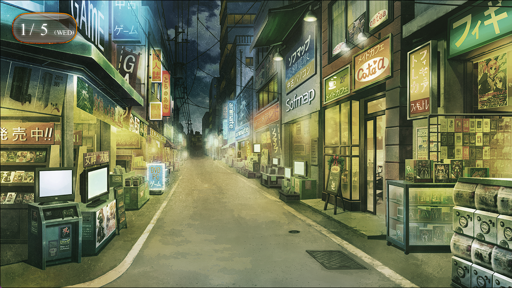
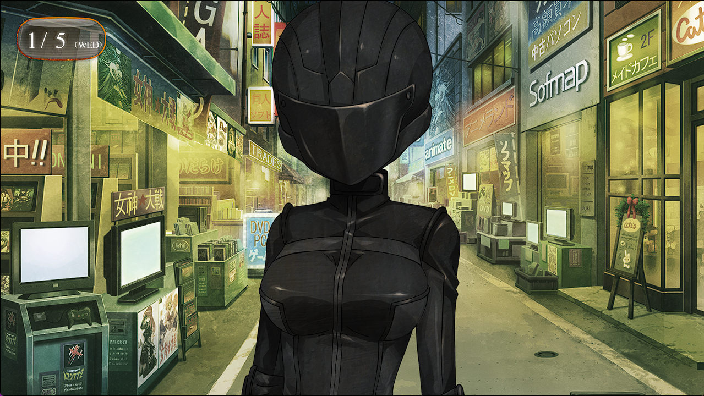

## 存在证明的自动机械- 11
> 1.081163  
> [ 2011/01/05 ] 送绹回显像管工房的路上遇袭，真帆独自逃跑。幸得天王寺解救。穿黑色骑手装的女人基本可以排除是萌郁的可能。  

“真由理姐姐！接下来到那个店！”  
“嗯！那就准备~预备——开始！”  
“到啦——！是我赢啦！”  
“哈啊，输了呢～绹酱跑步还真快呢。”  
“你们两个，晚上这么跑很危险的。”  
“没问题的啦。呐~”  
“呐~”  
由于时间也很晚了，配合绹的回家时间，大扫除后的派对就此散会了。我和真由理借助了清扫军曹的力量，也有责任将其送回显像管工房。比屋定也意外地想要一起出来散个步。  
“那下一个，就到前面的那家店吧！”  
“好——真由氏这回不会再输啦~预备——开始！”  
“唉，真是的……”  
绹看起来比平时更加情绪高涨呢。是努力完成了清扫军曹的工作，得到了赞扬的原因吧。  
“呵呵。”  
“嗯？怎么了？”  
“没什么。只是想着第一次见到冈部先生露出这样的表情呢。”  
“呃，什么样的表情？”  
“怎么说呢，没有紧绷着，很放松的样子。  
 从第一次见面开始，就感觉你一直处在精神紧张的状态。”  
“是吗……自己倒是没怎么注意到。”  
这个时间的秋叶原，进到小巷子里面，看到的也大都是开始做关门准备的店了，转眼间就没什么人了。现在，只有我们四个走在这条小巷子里面。抬头仰望，冬日明澈的夜空里，隐约能看到几颗星星。  
“呐……比屋定，我有件事……一定要跟你说。关于，红莉栖。”  
“……”  
“红莉栖她——”  

我正纠结着准备告诉她真相。这时，视线前方，赛跑的绹跑到了一个十字路口。突然，一辆没有开车头灯的黑色面包车冲了出来。  
“呀！”  
“危险！”  
“啊……!”  
绹勉强躲开没有被撞，一屁股跌坐在地上。真由理慌忙跑到她身边。都说过不要乱跑了。我也准备赶过去的时候，注意到情况不对劲。那辆黑色面包车的门打开了，从里面下来三个人，其中两个戴着面具，另一个戴着头盔。三个人手中，全都拿着枪。  
“*Freeze!!*”  
他们喊的，是英语。
“什么……？”  
地点和时间都不同，但是，这和之前遭遇过的是一样的情景。  
“为什么……”  
恐怖的印象冲击着大脑，我像被禁锢一般动弹不得。持枪的那群人看都没看绹和真由理，径直向我和比屋定这边冲过来。我马上就明白了，他们的目标是我或者比屋定。  
“快逃！”  
我将回忆强行抛于脑后，抓起比屋定的手催促她跑起来。  
“但是——”  
“别管了，快逃！”  
这里没有商量的余地，我猛推比屋定的后背。  
“唔——”  
比屋定脸上交织着困惑与恐惧，但是很快就按我说的跑了起来，很快跑进了小路，从我的视野里消失了。  
“*Don’t Move!*”  
袭击者同样无视了我，向比屋定的方向追去。于是我迅速挡在了他们面前。  
“啊！”  
昏暗的小巷响起了枪声，真由理和绹也发出了惨叫。开枪了！？戴着全覆式头盔的袭击者对着空中进行了威吓射击。在东京的街道上这么做，警察很快就会过来……！也就是说那群人对这种事也无所谓吗！？仔细观察，那家伙不仅是头盔，全身衣服都是黑色的、紧贴身体的骑手装。从身体线条可以看出是个女人，脸被黑色的护罩遮住看不见。难道是……桐生萌郁吗？不，不可能，她现在应该正在菲莉丝家里。  

穿黑色骑手装的女人一言不发地走到我的面前。  
“你们的目标是……比屋定吗？”  
“……”  
如果被盯上的是比屋定，我刚才让她逃跑，是好还是坏呢？穿黑色骑手装的女人紧盯着我，同时用手势向其他两个男人发出了指示。两人持着枪向比屋定消失的小路里追去。  
“等等！”  
我突然大吼一声，却也犹豫着要不要做更多抵抗。比屋定没多久就会被那两个强壮的蒙面男子追上的吧。但是，如果继续抵抗，不只是我，连真由理和绹的生命也会暴露在危险中——可恶，一定要逃掉啊，比屋定！这样祈祷着，眼睁睁看着袭击者们跑向了小路。  
“咕呜——！”  
突然，前面跑进小路的袭击者被甩飞出来，另一个蒙面男子紧张地盯着小路深处一步步后退着，好像在野外遭遇了熊一样。有人……在小路里？是谁？铃羽吗？  
“喂！这到底是什么情况啊？”  
一个魁梧的肌肉男从小路里走了出来。是天王寺裕吾。从店里赶了过来吗？  
“绹这么晚还没回来于是过来看看……你们这些家伙对我的女儿动手了？别以为可以简单了事……！”  
“*……! Pull Back!*”  
穿黑色骑手装的女人头盔里传来这句话，是撤退指令，一定是在用无线电。判断如此果断，这群人果然是专业的。面包车滑门都没关就紧急发动，疾驰而去，驾驶员应该在车里待机。真由理和绹瘫坐在原地，平安无事的样子。穿黑色骑手装的女人转过身准备逃向其他的小路。  
“站住！”  
我追上去，女人突然转过身用枪柄砸了过来。过于突然，我无法躲开，下巴受到了强烈撞击，当场倒地，身体用不上力气。  
“冈伦！”  
比屋定能安全逃掉就好了……这样祈祷着，我的意识快速远离。  

 

> (to be continued)
---

| [←prev](./0084) | [home](../../) | [next→](./0086) |
