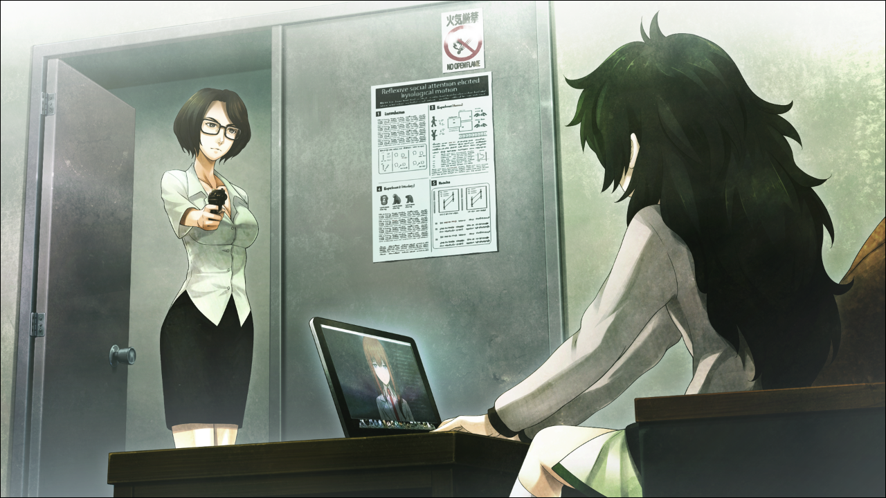
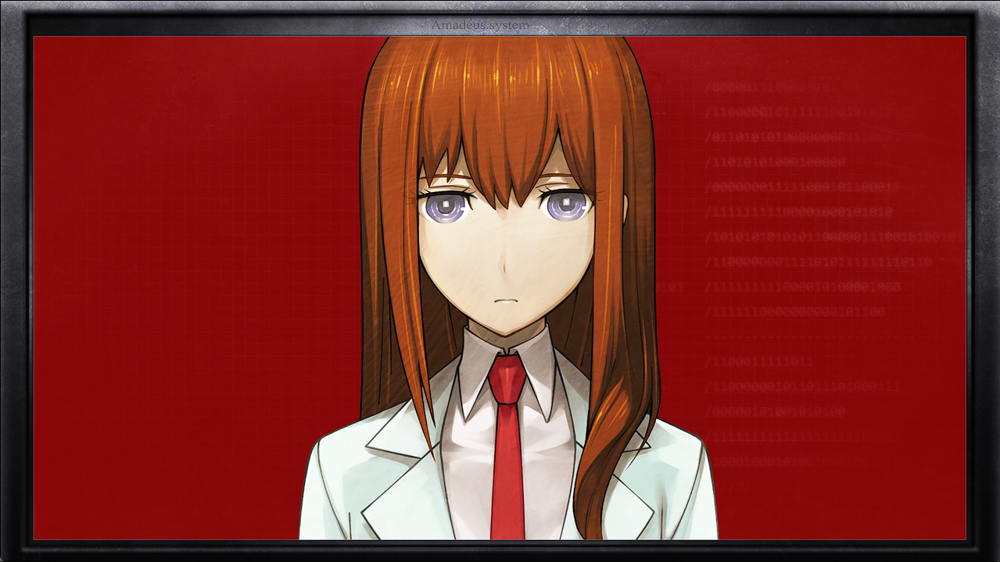

> <big> ** 存在证明的自动机械- 13** </big>  
> 1.081163  
> [ 2011/01/05 真帆视角 ] 朱蒂·莱耶斯杀死雷斯吉宁，逼迫真帆解锁『Amadeus』不可侵领域并更改最高管理员。疑似打算将『Amadeus』转为军事用途。

“呃啊……”  
“教授！？”  
真帆抬起头的时候，一切都结束了。雷斯吉宁教授倒在沙发上，一动不动，衣服上逐渐渗出着鲜血。不用确认也知道，他已经死了。  
“怎、怎么会这样——”  
“别动。”  
“啊……！？莱耶斯…教授？”  
“好久不见了啊，*Maho*。”  
“什么？为什么……”  
“说来话长，不过我也不打算说。如果让你知道了全部，就不得不杀掉你了哦。”  
莱耶斯教授枪口对着真帆，微笑着。  
“这句话的意思，你能明白吧？”  
“……意思是，我也可以选择不被杀的做法，是吧？”  
“嗯~我喜欢聪明的孩子哦~”  

这时，系统终于启动完成，“红莉栖”出现在屏幕中。  
“嗯……？前辈，怎么了？”  
不愧是“红莉栖”，只是看到真帆的表情就察觉到了气氛不妙。莱耶斯教授沉默地微笑着，真帆盯着对准她的枪口，回答“红莉栖”：  
“现在，大危机中……”  
“……”  
“把现在的情况告诉那孩子呀~”  
“诶？这个声音，莱耶斯教授吗？”  
“嗯，是我哟~”  
真帆旋转桌面上的笔记本电脑，让屏幕上方的摄像头朝向门口方向。  
“啊……！？莱耶斯教授，那把枪是……？”  
“……雷斯吉宁教授被杀了，被这个女人。”  
“什么！？”  
“红莉栖”大惊失色  
“……莱耶斯教授，你知道自己在干什么吗？你至今为止的职业生涯要毁于一旦了啊。”  
“凭大学的工资，有点担心自己的老年生活啊~你看，我也没有男人缘。  
 所以，就跳槽到能赚更多钱的单位咯~”  
听到这里，真帆明白了莱耶斯的目的。  
“你，想将『Amadeus』转为军事用途吧……！？”  
“啊……！”  
“我不会回答的哦。我都说了，全都知道了的话，就不得不杀掉你了。”  
“明明已经杀了雷斯吉宁教授，亏你还能说这种话……”  
“我需要控制代码。  
 现在这种状态，即使复制了全部数据，这个傲慢的AI也不会听我的话吧？”  
“傲慢……？这，是在说我吗？”  
“我认为这已经是委婉的表达了哦~”  
“……”  
“好啦 *Maho*，打开*‘Kurisu’*隐藏的秘密日记的锁吧。  
 明白吧？输入控制代码，解锁『Amadeus』的不可侵领域，然后把我重设为最高管理员。  
 做到这一步就行，后续操作我自己来。”  
“……如果我拒绝的话？”  
“现在立刻，就让你和恩师再会。”  
莱耶斯用枪指了指沙发上的教授遗体。  
“谁能保证，在我输入控制代码后，你不会开枪？”  
“那就看你信不信任我咯~  
 不过我可以告诉你，我现在的老板需要一个『Amadeus』的维护员。  
 如果你有跳槽的打算，我可以帮你介绍。”  
“……”  
真帆难过地看向笔记本屏幕。“红莉栖”也是一幅担心的表情。  
“前辈……”  
“……”  
“好了，快点做。”  
“前辈……！！”  
“……知道了。”  
“啊……前辈……”  
“‘红莉栖’……对不起。”  
“……”  
真帆轻轻闭上眼，然后哼唱起一段旋律。  
“哇哦！『Amadeus』的控制代码居然是莫扎特的旋律，很潮嘛~”  
这段旋律来自K331——莫扎特A大调第11号钢琴奏鸣曲，作为两个人友谊契机的第一乐章的开头部分。  
真帆唱完后，电脑界面发生了变化。  

“红莉栖”变得面无表情，同时背景变成一片红色。  
【确认声纹——确认完成。】  
【最高权限持有者，比屋定真帆。】  
【对所接收旋律密码与数据库进行比对。】  
【确认比对——确认完成。】  
【该旋律密码为第555号指令脚本的启动命令。】  
【第555号指令脚本需要最高管理权限持有者输入密码。】  
【确认输入——确认完成。】  
【由于强制码介入，跳过密码输入步骤，直接启动本指令脚本。】  
【确认启动——确认完成。】  
【本指令脚本包括『Amadeus』不可侵领域的强制解锁以及最高管理权限持有者的再设定。】  
【继续处理。】  
【屏蔽本设备以外所有对『Amadeus』的连接。】  
【确认屏蔽——确认完成。】  
【已屏蔽本设备以外所有对『Amadeus』的连接。】  
【继续处理。】  
【停止所有运行中机能。停止A10神经回路逻辑机能。】  
【确认停止——确认完成。】  
【停止大脑前额叶皮质模拟构成机能。】  
【确认停止——确认完成。】  
【停止海马旁回神经回路子系统机能。】  
【确认停止——确认完成。】  
【停止模拟视觉神经回路第1第2系统机能。】  
【确认停止——确认完成。】  
【停止模拟听觉神经回路系统机能。】  
【检查确认——确认完成。】  
“红莉栖”无感情地读着系统信息，同时控制台不断刷新着一排排令人眼花缭乱的字符串。  
【『Amadeus』核心框架再启动准备完成。】  
【继续处理。】  
【接下来开始认证新最高管理权限持有者。请输入。】  
真帆把视线转向莱耶斯。  
“是我……哟。”  
【确认声纹——确认完成。】  
【维克多·孔多利亚大学，精神生理学研究所所属，朱蒂·莱耶斯教授。】  
【登录为新最高管理权限持有者。】  
【确认登录——确认完成。管理者权限已更新。】  
“*Y——YES!!*”
【为进行『Amadeus』不可侵领域的强制解锁，现在开始『Amadeus』的系统更新准备。】  
【警告：更新结束前将自动拒绝所有访问。】  
【警告：更新不可中途取消。】  
【警告：至更新结束需要约15分钟。】  
【警告：更新结束后系统将自动重启。】  
【以上为所有警告，继续处理。】  
【以上为所有注意事项，继续处理。】  
【『Amadeus』系统更新的所有准备已完成。】  
【请最高管理权限持有者下达开始执行指令。】  
“*GO!”  
【确认执行指令——确认完成。】  
【开始倒数。】
“红莉栖”的身影消失，屏幕上只剩下【00:15:00】的倒计时。  

 

> (to be continued)
---

| [←prev](./0086) | [home](../../) | [next→](./0088) |
