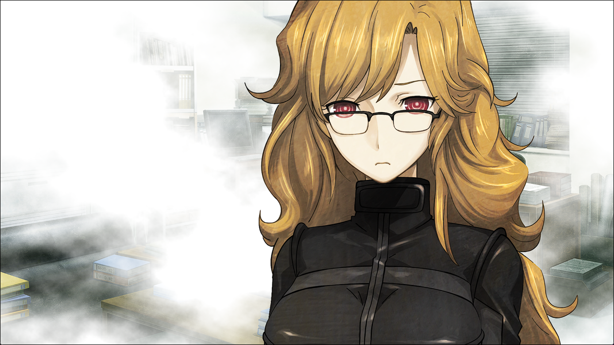

## 存在证明的自动机械- 14
> 1.081163  
> [ 2011/01/05 真帆视角 ] 萌郁来救真帆。途中萌郁告诉真帆萨列里从未嫉妒莫扎特，两人是相互尊敬。真帆重新理解了对红莉栖的感情，决定回去救“红莉栖”。  

“呼……”  
真帆深深叹了口气，将身体沉进沙发中。  
“辛苦了。”  
太阳穴处传来冰冷坚硬的感触，不用看也知道，莱耶丝用枪口指着自己。  
“双手离开键盘，举到头部。”  
“……你骗我？”  
“不要说得那么难听啦~快，赶紧举起手来。”  
真帆乖乖地举起手。  
“对，这样才对。  
 我会按照约定把你介绍给老板的。  
 就说这是一位非常适合担任『Amadeus』维护人员的优秀科学家。  
 然后老板一定会这么说：  
 ‘喂喂朱蒂，就算再怎么优秀，死人可写不了代码吧？’”  
“你……!没有一点作为人的良心吗！”  
“哈！打算交出『Amadeus』来换自己那条贱命的你，可没资格说我啊。  
 哎呀~我说得不对呢。不是打算，而是已经交出了呢。  
 重启之后，『Amadeus』的最高管理权限就是我的了。*‘Kurisu’* 会成为我顺从的仆人。  
 *Maho*，你就在天国好好看着 *‘Kurisu’* 跪着舔我的鞋子的姿态吧。”  
“……”  
已经到绝路了吗……真帆慢慢闭上了眼睛。  
“来，祈祷吧。”  
真帆紧闭双眼，在内心祈祷着。  
（拜托了……神明大人。）  
（事到如今才求神，您会生气吧。）  
（尽管如此请给我个机会！）  
就在这时——听到门被突然打开的声音，真帆下意识睁开眼。通向走廊的门开了，却没有人进来。  
“我说过谁都不准进来了吧！”  
莱耶丝生气地大喊，但门的那边毫无回应。她感觉不对劲，对准真帆的枪口稍微偏开。就在这一瞬间，一个不明物体从走廊被丢了进来。莱耶丝本能地后退了一步，但那东西不像是要爆炸的样子。  
“这是……什么？”  
被丢进来的，是一个深绿色的略大的罐状物。真帆感觉以前在哪里见过，好像是在LAB的角落躺着的。  
“……反坦克地雷？不，是赝品。为什么这种东西——什么！？”  
下一秒，那个物体喷出了大量白色烟雾，屋内的可视度瞬间变成了零。  
“什么东西！？怎么回事！？”  
此时真帆眼前出现了一个人影。  

“这边！”  
“桐、桐生！？”  
萌郁拉着真帆冲出布满烟雾的房间。离开房间后，真帆终于看清了周围的环境，大惊失色。  
“那、那个人……！”  
一个持枪男子倒在走廊上。是莱耶丝的同伙，仔细一看，服装和体格有点像，秋叶原道路上从黑色面包车下来的面具男。  
“没事，只是让他昏过去了。”  
“你究竟是……！？”  
“没时间解释了，现在先想怎么逃。这边，电梯停了，走楼梯。”  
“等、等等！”  
真帆慌忙跟上萌郁。  
“你怎么会在这里！？”  
“冈部君告诉我的。”  
“他没事吧！？”  
萌郁边跑边微微回头看向真帆，点头示意。  
“冈部君接到了『Amadeus』的联络，告诉我们比屋定在这里的情况。”  
“‘红莉栖’……”  
“！”  
到了楼梯前，萌郁突然停下，真帆差点撞上。楼梯下传来多个人的脚步声。  
“躲起来！”  
“啊——！”  
伴随着震撼的响声，楼梯的墙上出现了许多洞。对方开枪了，还不是普通的手枪，而是自动步枪一类的武器。这边，萌郁也架起自动步枪迎战。她迅速探出身体朝楼下射击，又瞬间缩回来。下面也不断反击着。  
“比屋定！”  
萌郁趁着空当向楼梯下方开火的同时，大喊着真帆的名字。  
“怎、怎么了！？”  
“开过枪吗？”  
“练习也算的话！”  
“拿着！”  
萌郁从腰带抽出手枪，递给真帆。  
“要是有人从后面过来，就开枪！”  
“！？”  
萌郁把手枪塞到真帆手中，又继续朝楼下开枪。这把枪手感沉甸甸的，是Colt Government(M1911)，真帆在射击场打过几次。真帆右手握紧枪柄，左手打开保险。准备上膛的时候，发现自己的手在颤抖——不行，恐惧让她无法开枪。尽管知道自己没出息，还是放下了拿枪的手。不杀人，就会被杀，现在就是这种情况。这种事心知肚明，但还是做不到。她没有把枪对准他人的胆量，没有那种不惜杀人也要活下去的意志。  

（红莉栖她……）  
（红莉栖那时又是怎么做的呢？）  
面对死亡，她是否会为了活下去，不惜一切手段也要抓住生的希望呢？她一定会那么做吧，真帆觉得，如果是她认识的红莉栖，应该到最后一刻也绝不会放弃。既然这样，为什么红莉栖没能活下来呢？真帆发现自己从未想过这件事。然后又在想，连红莉栖都没能避免的事，她凭什么能避免得了呢？  
“果然，萨列里就是萨列里啊！”  
这句话并不是想说给萌郁听的。  
“我能做的，最多就是嫉妒阿马德乌斯罢了。”  
到最后，还在逞强。  
“拼命地踮起脚尖，想尽办法和她并肩。”  
至少在莱耶丝看到我的尸体时，想给她留个笑脸。  
“但一切都是徒劳的。根本不可能赢过被神眷顾的人。”  
突然，双方的交火停息了。萌郁在掩体中换着弹匣，看向真帆。  
“不对。萨列里，从来没有，嫉妒。  
 有才能的人，对于比自己更有才能的人，是会尊敬的。  
 比屋定肯定也是这样的。  
 萨列里毒杀莫扎特，不过是当时的流言。  
 那部电影，是根据这个流言，艺术加工来的。  
 来岛小姐，是这么说的。”  
“为什么，你……”  
“我听到了，比屋定和冈部君说的话，我也想了解。  
 萨列里，是不是憎恨莫扎特，到想杀了他的地步？  
 但是——”  
“我认为，萨列里从来没有嫉妒过莫扎特。  
 比如说，莫扎特去世两个月写过一封信。  
 信中表示，萨列里对莫扎特邀请他观看的歌剧《魔笛》赞不绝口。  
 两人互相尊敬着对方。”  
“莫扎特……也尊敬，萨列里……  
 红莉栖知不知道这件事呢……  
 ……红莉栖把我比作萨列里也是……”  
红莉栖到底是以什么样的感情说的这句话，现在已经永远无法知道了。不过要怎么去理解，完全取决于真帆。  

“红莉栖……‘红莉栖’……！”  
“桐生……我，必须回去。我得去救那孩子……！救‘红莉栖’！”  
“…………”  
萌郁点点头，把自动步枪放在地上，从腰带里拿出深绿色罐状物。  
“这是震爆弹。闭上眼睛，捂住耳朵！”  
没等真帆理解，萌郁就把那东西丢到了楼下。真帆慌忙堵住眼睛和耳朵——  
下一刻，冲击声响起。  

 

> (to be continued)
---

| [←prev](./0087) | [home](../../) | [next→](./0089) |
