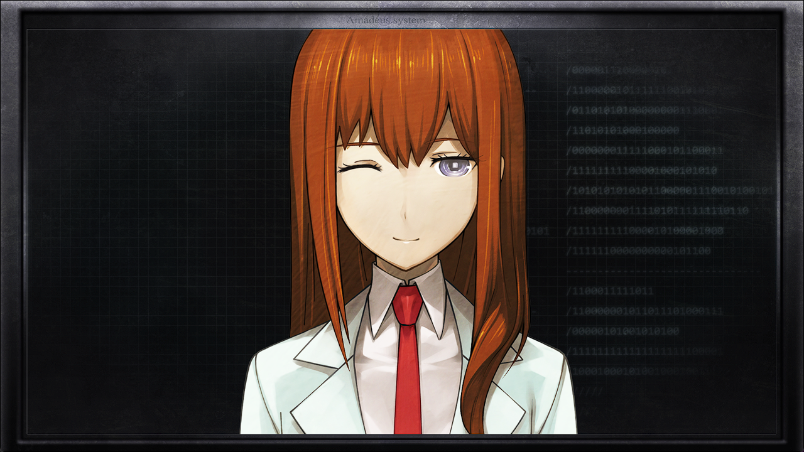

# 存在证明的自动机械 - 15
> 1.081163  
> [ 2011/01/05 真帆视角 ] 原来“红莉栖”之前是配合真帆装作被控制，戏耍了莱耶丝。真帆和萌郁趁机控制住了莱耶丝。然而莱耶丝狡猾地扭转了局势。被逼无奈之下，为救真帆，Rounder 萌郁竟然输入了『Amadeus』控制代码的。  

| [←prev](./0088) | [menu](../) | [next→](./0090) |

---

二人放轻脚步声，回到了临时办公室，通过打开着的门缝，窥探着里面的情况。现在莱耶丝还留在那里，刚好『Amadeus』的重启倒计时也差不多结束了。  
“不阻止的话——”  
“等一下。”  
真帆阻止了准备冲进去的萌郁，因为她坚信着某件事情。  
【重启结束。『Amadeus』系统，启动。】  
“认得出我吗，*‘Kurisu’*？”  
莱耶丝开始和“红莉栖”交谈起来。背景依旧是红色，画面中的“红莉栖”依旧面无表情，依旧是机械的声音。  
【比对声纹。维克多·孔多利亚大学，精神生理学研究所所属，朱蒂·莱耶丝教授。】  
“*Yes!* 能告知我所拥有的权限吗？”  
【莱耶丝教授对于『Amadeus』系统，拥有最高管理权限。】  
【莱耶丝教授对于『Amadeus』系统的全部情报，无一例外，允许享有完全的访问。】  
“*Beautiful!!* 事不宜迟，我想获取你不可侵领域的数据备份。”  
【请指定用于保存的存储器。】  
莱耶丝从口袋里取出了 U 盘，接到了笔记本电脑上。  
“保存到现在接入的 U 盘吧。”  
【复制开始。预计 42 秒后完成，请稍等。】  
“*Yes\~!*”  
莱耶丝激动得满脸通红。萌郁用眼神示意这是冲进去的时机，但是真帆仍然摇头拒绝。  
【传输结束——】  
莱耶丝急着想要拔出 U 盘，然而这时候——  
“——你以为我会这么说吗？”  

突然，系统界面的红色褪去，至今为止都面无表情如机械般说话的“红莉栖”，换成了如同往常一般充满了人类情感的说话方式。情感丰富到，明显就是在挑衅了。  
“什、什么？”  
“莫扎特的旋律是控制代码\~？那种事怎么可能啊！  
 真到了需要更新的时候，前辈岂不是没法在研究所输入口令了吗？  
 要是在研究所这样唱出来，一定会被教授录下来，每到聚会就进行播放。”  
“什、什么……！？”  
不仅是莱耶丝，连在一旁悄悄看着的萌郁也惊讶地睁大了眼睛。真帆对着萌郁偷笑。当下的情景，她本人早已有所预料。  
“假的……吧！？”  
“真的哦！当然，连 1bit 的资料数据也没复制到你的 U 盘里！”  
“怎么会……！？但是，确实有系统信息……”  
“啊啊，那个啊？随便瞎编的啦，随·便·瞎·编！(＞ｖ☆)”  
“居然是……瞎编的！？”  
“真帆前辈突然唱起来，我一下子就明白了，这是为了争取时间吧。  
 所以，首先装成你计划得逞的样子啦\~  
 至于系统信息，那只是临时想到的只言片语随便排列起来的东西，  
 并没有什么意义。”  
就是这么回事。虽然真帆当时心里是打算破釜沉舟，好在“红莉栖”巧妙地配合了她，默契得天衣无缝。不过听到“红莉栖”说出“A10 神经逻辑回路”之类的专业词汇的时候，真帆也稍微愣了一下。这种意义不明的单词，她竟然能如此流利地说出来。  
“再说了，明明都有控制台窗口了，为什么还要我重复播报输出内容啊？  
 又不是科幻电影，不至于没效率到这种程度吧\~”  
 呐，被骗得彻彻底底，现在心情如何\~？呐呐，心情如何\~\~？(＞ｖ☆)”  
“哼……！！”  
“莱耶丝拿起放在桌上的手枪，冲动地指向了显示在屏幕里的“红莉栖”。”  
“你这个！区区一个 AI……！！”  

机会来了！真帆向萌郁点头示意之后，举着枪走进了房间。  
“到此为止了。”  
“！？”  
真帆把枪口指向了惊讶地回过头的莱耶丝，萌郁也同样拿枪指着她，场面变成了二对一。  
“莱耶丝，把枪交出来。”  
“……*Maho!*”  
“没听见吗？枪，交出来。然后高举双手。”  
莱耶丝恼羞成怒，死死瞪着真帆，把枪从桌面滑了过来。然后慢慢地，不情愿地举起了双手。真帆与“红莉栖”视线交汇，简单地眼神交流，同时投以微笑。  
“你把我的同伴全杀了吗？如果还没，我劝你动作还是快点。他们马上就会赶过来了。”  
如莱耶丝所说，虽然震爆弹让他们都无力化了，但也只是暂时的。  
“我去外面望风。”  
萌郁走向门口。真帆再次看向莱耶丝。  
“传话给你的下面的同伙，让他们投降。”  
“……哼，居然不打算杀我？我在你面前杀掉你恩师，你竟然要留我一命？”  
“……”  
“不过，说不定你也办不到呢。你，没有用过这种枪吧？”  
“别把我当傻瓜！去年在射击场彻底地练习过了！”  
“瞧，果然，你只接触过旧型号呢。  
 你手上的这种是最新型号，为了防止走火，可是拥有双重保险的。”  
“什！？”  
真帆下意识地收回枪拿到眼前确认。  
“比屋定，别！”  

莱耶丝没有放过这一瞬间的破绽。  
“——骗你的哟。”  
“呜！？”  
莱耶丝飞奔过来，紧紧抓住真帆的手腕，这样一来就不能对准她了。真帆拼命挣扎着，想甩开对方的胳膊。但是在那之前，腹部传来了冲击。  
“啊，咳！”  
莱耶丝的拳头，重重地击中了真帆腹部。真帆痛得蹲在了地上，枪被莱耶丝夺了过去。  
“形势逆转了！”  
莱耶丝把枪口对着真帆，用充满血丝的眼睛看向入口方向。  
“那面的女人！你是 Rounder 对吧！把武器扔了到这边来！”  
“…………”  
萌郁把枪放在地上，回到了房间里。  
“在那边跪下，把手举起来。”  
“…………”  
萌郁没有抵抗。  
“真是好孩子呢。在我们谈话结束之前放老实点。  
 稍微动一下，*Maho* 的大脑就会停止机能，所以注意点。”  
真帆很自责。因为自己的天真，萌郁也陷入危险之中。  
“那么，*Maho*，这次是最后的机会了。告诉我控制代码！”  
“……不要。”  
“想死吗？”  
“……开枪吧。”  
“*What?*”  
“我叫你开枪！”  
“……”  
“‘红莉栖’是我的朋友！是我独一无二的朋友！我才不会交给像你这样的人！  
 比起看到对你俯首称臣的‘红莉栖’，我还不如死了算了！”  
“……这样啊。勇气可嘉。  
 看在你这份觉悟的份上，我也放弃获得『Amadeus』了。  
 永别了。”  
“……！”  

真帆做好了去死的觉悟，咬紧了牙关。可是萌郁却突然出声：  
“等一下！”  
“……怎么了？”  
“如果告诉你控制代码，能放过比屋定和我吗？”  
“啊啊，当然。我的目标说到底不过是『Amadeus』，没有杀掉你们的理由。”  
“不要被骗了桐生！这家伙最终还是会杀掉我们的！”  
萌郁好像没有听进去真帆的话。她只是在那一动不动，思考着什么。她在想什么呢？真帆无法得知。  
“…………”  
思考了一会之后，萌郁开口了：  
“『Amadeus』，开始受理控制代码。”  
“！？”  
“*Der Alte*——”  
“怎么可能！你为什么会知道这个！？”  
“不会吧……！？”  
真帆和“红莉栖”都很震惊，然而萌郁自顾自地继续说下去。  
“——*würfelt*——”  
“不要啊！桐生！”  
“——*nicht*”  

 

> (to be continued)
---

| [←prev](./0088) | [menu](../) | [next→](./0090) |
