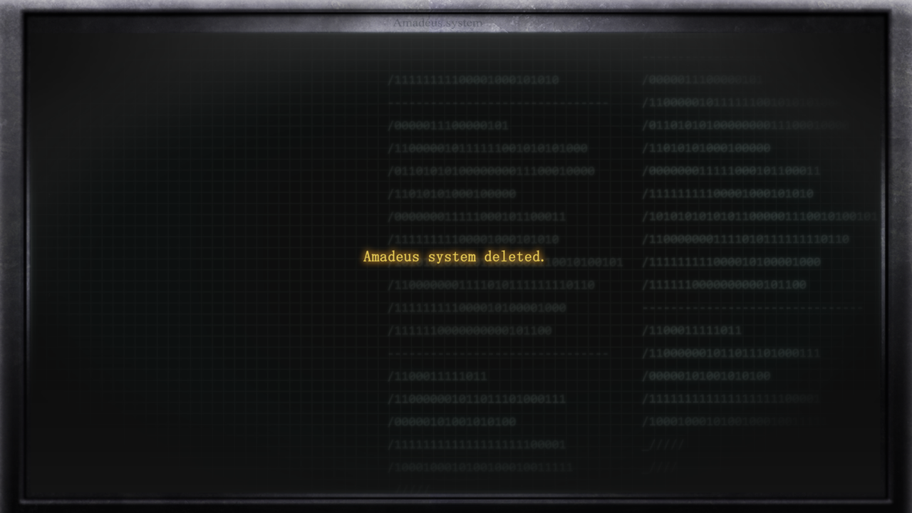

# 存在证明的自动机械 - 17
> 1.081163  
> [ 2011/01/05 真帆视角 ] 红莉栖突然出现在『Amadeus』里，交托遗志：“我们想要到达的世界是确实存在的。” “我们一定能够到达那个地方。” “凤凰院凶真，就拜托你了！”  

| [←prev](./0090) | [menu](../) | [next→](./0092) |

---

“前辈，为什么在哭？”  
“……诶？”  
真帆抬起哭花的脸，屏幕上再次出现了“红莉栖”的身影。由于数据正在被删除的缘故，那身影遍布马赛克，时不时抖动、扭曲，显示出乱码，就像是损坏的老式游戏机卡带在破旧的电视机上艰难显示出的画面。但能看出，她在温柔地看着真帆。  
“‘红……莉栖’？”  
“不要哭啦，前辈。来，把眼泪擦干。”  
“红莉栖”伸出手，仿佛要跨过屏幕帮真帆擦干眼泪。  
“哦……？碰不到……我……碰不到前辈……？”  
屏幕中的“红莉栖”，很明显和平常不同。  
“难道说……我……在『Amadeus』里……？  
 这也是符合预测的世界的可能性……  
 不，该说是生命和机械的可能性吗……”  
“……”  
“红莉栖”的言行莫名其妙。不过也没有办法，执行数据删除操作的过程中还能像这样说话，已经是奇迹了。  
“总之太好了……你还没有消失……”  
“消失？『Amadeus』……消失？”  
虽然很在意“红莉栖”的奇怪言行，但是真帆没有时间确认这些了。  
“‘红莉栖’……拜托了，现在立刻叫一辆救护车……  
 桐生中枪了……已经没有意识了……！”  
“啊……！振作一点，前辈。  
 我已经安排好了救护车，马上就会赶到。  
 不要紧的，桐生小姐会得救的。”  
“还不行……！得把她，运到楼下……啊啊，但是那里有全副武装的家伙——”  
“这点也不用担心，我刚刚通过大楼的监视系统确认了。  
 武装集团看样子已经在准备逃亡了。  
 目前就等急救人员过来吧。我先让停止的电梯重新运作起来。”  
“这样啊……”  
“红莉栖”完全不再表现出奇怪的言行，沉稳地回应着，让真帆感到非常安心。  
“谢谢……”  
可能是终于放松了心情的缘故，真帆一下子失去了力气，无力地瘫坐在地上。  
“我刚才看了一下日志。前辈，歌唱得很好呢，那首第 11 号钢琴奏鸣曲。  
 有个秘密我只在这里告诉你：这个旋律，也是我个人电脑的登录密码。”  
“是嘛……”  
虽然想让她忘掉唱歌的事，不过顾虑之下还是没有说出口。毕竟别说是这段记忆了，“红莉栖”的存在本身都马上要消失了。  

“……前辈。”  
“红莉栖”的声音已经失真，充斥着杂音。但真帆能听出，这句话的语调有所不同，混着些许紧张与严肃的情绪。  
“现在我要说的话，请你绝对不要忘记。”  
真帆看着屏幕里一脸严肃的“红莉栖”，她旁边显示着倒计时，那数字已经不足 60 秒。  
“**我们想要到达的世界是确实存在的。**  
 **我们一定能够到达那个地方。**”  
“嗯……？”  
真帆完全不明所以。但是，从“红莉栖”的声音里确实感受到，她迫切想要把这句话传达给自己。  
“……在说什么事情？”  
“我很了解前辈。如果是对于作为研究员的前辈，说不定我比世界上任何人都了解。  
 所以，我可以肯定地说：  
 前辈一定会完成我留下来的研究，并且能够开辟出更前方的道路。  
 即便我，已经不在了……  
 作为世界上最了解前辈的人，我敢保证这一点。”  
真帆明白“红莉栖”的意思了。她是在说：“你一定能够超越我，完成伟大的研究。”  
“而且将来总有一天，会有人需要前辈的研究。  
 一定会有的，前辈的研究，用来拯救世界的那一天。”  
“拯救世界的……研究？”  
“抱歉，我无法做出详细说明。  
“前辈和**我**，能像这样对话，已经是一个奇迹了。  
 奇迹什么的，对于科学家来说是个不太合适的词呢。”  
“啊……你是……**红莉栖**吗……？”  
“呵……能和现在的前辈再一次聊天，真的非常开心。”  
“红莉栖”没有回答她的问题。  
“红莉栖……！”  
真帆反射性地想对红莉栖道歉。虽然自己也不知道为什么，但是还是想要道歉。在真正即将离别的最后的一瞬间，她差点想要脱口而出的，是对红莉栖的道歉。但是，看着红莉栖的笑容，真帆把话咽了回去。真帆明白，那个笑容就是回复。无论饱含了怎样情感，两人之间不需要那些言语。  
“我相信你。相信……毫无根据，对于科学家来说是个不太合适的词呢。”  
真帆竭尽全力地逞强。要和那个傲慢的、自己最喜欢的后辈分别，必须要这样。这是两人在研究所的时候，不知道往来了多少次的做法。  
“坚信答案一定存在，然后不断前进，这才是科学家应有的姿态哟。”  
“哈哈……”  
“嘿嘿嘿……”  
多么怀念，难以割舍。红莉栖去世后只过了几个月，有时感觉很久远像是好些年前，有时又仿佛发生在昨天。  

倒计时，还剩 10 秒。只能再说一两句话了。  
“还有，前辈——  
 **凤凰院凶真，就拜托你了！**”  
“凤凰院……？是谁？”  
“嘿嘿\~你早晚会知道的。一定——！”  
唐突地，“红莉栖”的身影从屏幕中消失了，取而代之的是显示删除指令完成的信息。  

“…………  
 永别了……  
 红莉…栖……  
 呜、呜呜……  
 呜……呜啊——！”  
红莉栖也好，“红莉栖”也好，今后永远都再也见不到了。想到这一点，眼泪就再也忍不住了。真帆也不想忍耐，任凭眼泪如泉水般涌出。在急救人员到来之前，真帆让自己像孩子一样，拼命地哭泣。  

 

> (to be continued)
---

| [←prev](./0090) | [menu](../) | [next→](./0092) |
