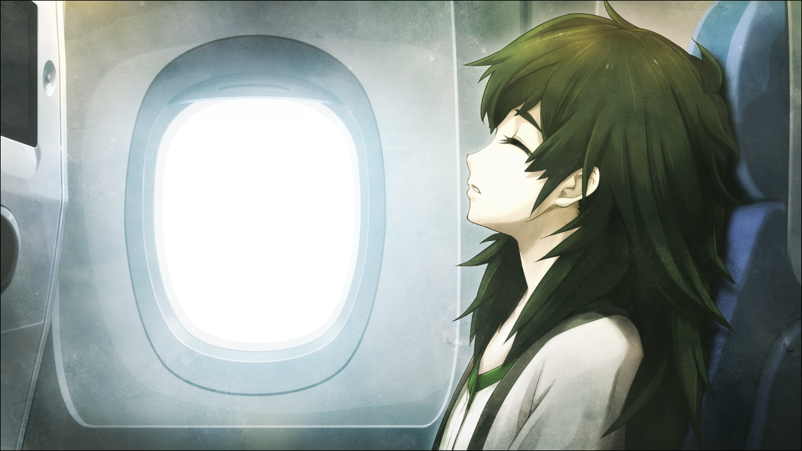

## 存在证明的自动机械- 18 （真帆结局）
> 1.081163  
> [ 2011/01/31 真帆视角 ] 真帆从冈伦处了解到全部真相，准备回美国继续红莉栖的研究。  

“尊敬的各位旅客，本次航班即将起飞，请系好安全带。”  
“……”  
“这位乘客。”  
“……”  
“这位乘客？”  
“诶，啊，我吗？”  
“飞机就要起飞了，请系好安全带。”  
“啊啊，好的，谢谢。”  

（要离开日本了感到寂寞了吗？）  
（……可能是吧。）”  
那场骚乱之后，已经差不多过了一个月。虽然这么说，总觉得这一个月转瞬即逝。待在日本的这段时间，对真帆来说发生了太多的事情。要理清这些事情，说不定要花上比在日本这段期间更长的时间。  
（回到研究所之后，该怎么办呢？）  
（不过，就连研究所本身，都不知道会变成什么样。）  
失去了雷斯吉宁教授，脑科学研究所陷入一片混乱。为了争夺研究所和他的研究项目的继承权，今后应该会发生麻烦的派系斗争吧；精神生理研究所方面，因为莱耶丝教授的丑闻而轰动一时。依情况而定，说不定那边的研究所本身会被解散。当时萌郁避开了要害，莱耶丝并没有死。现在应该在接受CIA或FBI的调查吧。关于这一点，真帆不是太清楚，也不感兴趣；萌郁多亏了“红莉栖”及时呼叫了救护车才保住了性命。因为需要住院将近一个月，萌郁现在停职休假，她所编辑的报道和特辑也中止了。  
（『Amadeus』彻底消失了呢……）  
真帆的删除程序执行得很完美。结果来说，脑科学研究所引以为傲的人工智能『Amadeus』，已经不复存在了。  
（……不过没关系。）  
（我并没有改变。）  
（我，就是我。  
（坚持自己，坚持向着自己相信的道路前进。）  
——相信。  

在这一个月里，真帆从冈部那里听说了全部，冈部伦太郎经历的事。一开始根本无法相信。但是，看到了真正的时间机器，然后，被告知了命运石之门的存在，终于逐渐相信了一切。不，准确的说，应该是想去相信。真帆突然回想起了，在那最后时刻“红莉栖”说的话：  
“**我们想要到达的世界是确实存在的。**  
 **我们一定能够到达那个地方。**”  
当时到底是怎么回事，现在已经无从知晓了。『Amadeus』的数据被彻底删除了，所以也无法追溯系统日志。不过，有一个假设。『Amadeus』是模拟人类大脑机能的系统。从理论上讲，『Amadeus』等同于人脑。佐证是，从人类大脑读取的记忆数据，可以移植给『Amadeus』，像在人脑中一样运行，表现出人类的言行举止。也就是说，人类大脑能产生的现象，『Amadeus』也能产生。  
“如果……其他世界线的记忆，能超越时空而共享的话，发生在『Amadeus』上也不足为奇……”  
没办法确定。说不定这只是真帆对『Amadeus』在完全删除前，碰巧出现的故障的一种让自己好过一点的解释；或许，那是『Amadeus』为了鼓励真帆，随便说的而已；又或许，那时真帆已经昏倒了，仅仅是她的梦境。事到如今，已经没有确认的方法了。『Amadeus』已经完全从这个世界上消失了。至少，是从这条世界线里。  
（嘛，其实也无所谓啦。）  
（总有一天，我会从本人那里求证的。）  
红莉栖让我相信她。相信她说的话，相信我自己的能力。  
（……我相信你，红莉栖。）  

真帆轻抚着腿上的小提包，里面装着硬盘，来自红莉栖的笔记本电脑。在最后的对话里，红莉栖透露了个人电脑的登录密码，正是她为了欺骗莱耶丝哼唱的，莫扎特A大调第11号钢琴奏鸣曲，第一乐章的开头旋律。硬盘里保存着红莉栖写了一半的论文，罗列着连创意也算不上的关键字集合，还有无数的情报。当然，时间机器相关的论文也在里面。真帆将复印件交给了桶子，自己打算回国之后详细调查一番。  
（时间机器……）  
（绝对，会造出来。）  
（然后，绝对会拯救你。）  
（我的，阿马德乌斯。）  

窗外的景色开始移动，飞机开始向跑道滑行，准备起飞。  
（再见了，日本）  
（大概，还会再来的。）  
（不，绝对还会回来的。）  
（那时候，不知道能不能见到那位凤凰院凶真先生呢。）  
（嘛，就算还是一副颓废的样子，那就由我来拉他一把，让他振作起来吧。）  
必须要做的事情有很多，看样子今后会是令人兴奋的人生啊。  

手机响了起来。  
“不好，忘记关机了……稍微再用一下吧。”  
原来是萌郁发来的RINE。  
『差不多该出发了呢  
 起飞的时候记得关掉手机电源哟  
 啊，但是这样的话就看不到这条消息了！要是再早点发送就好了！>_<  
   
 虽然相处的时间不长，但是和你一起度过的时光真的很开心！  
 总有一天，还会再见面的！一定！  
   
 RINE上也会发很多消息过去的，到时候也请全部都回复啊！  
   
 那么，再见啦！  
 拜拜，再见啦，真帆！o(>ω<)o 』  
“呵呵……再见啦，萌郁。”  

 

> （to be continued）
---

| [←prev]（./0091） | [home]（../../） | [next→]（./0093） |
