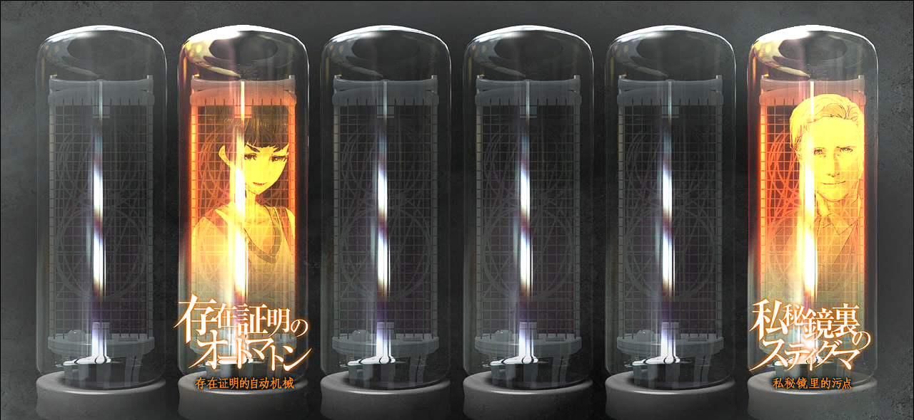

# 瓦尔基里最终报告 - 02
> 1.081163  
> [ 2036 /08/13 ] 

## 情报整理 | 各方势力
### LABMem
- 冈部伦太郎
  - 未觉醒。
  - 2025 年去世。
- 桐生萌郁
  - 接受桶子的委托调查篝的情报。
  - 与真帆成为知心好友。
    - “我就是我。”
    - 同住在菲莉丝家中，合力引发了“清扫军曹”事件。
  - 从莱耶丝手中救出真帆。
- 椎名篝
  - 被琉华子父亲的朋友发现，失去记忆。
  - 借住在柳林神社。
  - 被疑似军队的势力盯上。
  - 在显像管工坊打工。
- 比屋定真帆
  - 从冈伦处得知时间机器情报。
  - 从红莉栖处得知电脑密码，获得时间机器论文。
  - 决心继承红莉栖的研究。

### 同盟  
- SERN-Rounder
  - 与天王寺（FB）谈判后，同意篝和铃羽在工坊打工，提供保护。

### 中立  
- 阿莱克西斯·雷斯吉宁 *Alexis·Leskinen*

### 敌对  
- 朱蒂·莱耶丝 *Judy·Reyes*
  - 【美】疑似为军方工作。
  - 想要抢夺『Amadeus』控制代码。
  - 杀死雷斯吉宁教授，胁迫真帆。
- 黑色骑手装女性
  - 真实身份未知。
  - 跳跃世界线前：新年派对时袭击 LAB
    - 萌郁的嫌疑排除。
    - 由季的嫌疑产生。
    - 使用暗号 K6205，疑似西方军队势力
  - 跳跃世界线后：“清扫军曹”庆功宴结束后的回家路上袭击众人。

## 情报整理 | 重要物品
- 红莉栖笔记本电脑和移动硬盘
  - 密码已解锁：K331 第一乐章开头旋律。
  - 其中有时间机器相关论文。
  - 由真帆继承。
- 『Amadeus』
  - 被美国军方盯上。
  - 所谓的控制代码其实是彻底删除指令。
  - 已被删除。

## 情报整理 | 重要事件
- 未知原因条约世界线
  - 发生时机：『Amadeus』疑似被劫持时接到“红莉栖”的联络，接听后。
  - 此事件变成未发生。
  - 新年派对袭击事件变为未发生。
- 红莉栖疑似进入『Amadeus』
  - 猜测其机能等同于人脑，所以也有能力产生 *Reading·Steiner*。
  - 红莉栖向真帆交托遗志：
    - “我们想要到达的世界是确实存在的。”
    - “我们一定能够到达那个地方。”
    - “凤凰院凶真，就拜托你了！”

## STEINS;GATE 到达条件
- ■■■■■■■■■■■■■
  - ■■■■■■■■■■
  - ■■■■■■■■■■
- ■■■■■■■■■■■■■
  - ■■■■■■■■■■
  - ■■■■■■■■■■
- ■■■■■■■■■■■■■
  - ■■■■■■■■■■
  - ■■■■■■■■■■

---

“不知道什么时候能见到那位凤凰院凶真先生呢？”  

 ——No.009 KURISU 
  

 

> Hope is always there in the “future”.
---

| [←prev](./0092) | [menu](../) | [next→](./0094) |
