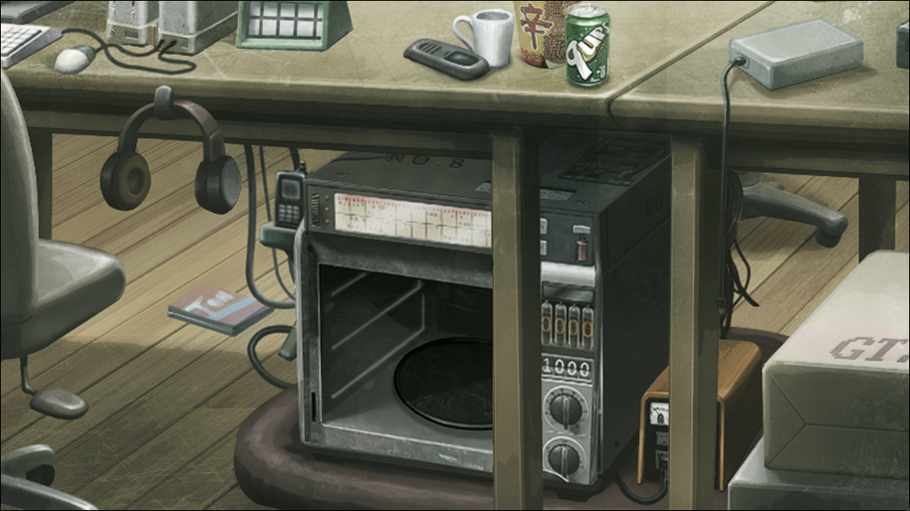
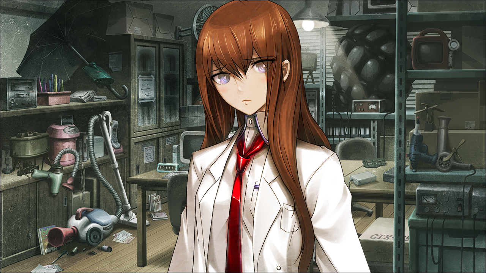
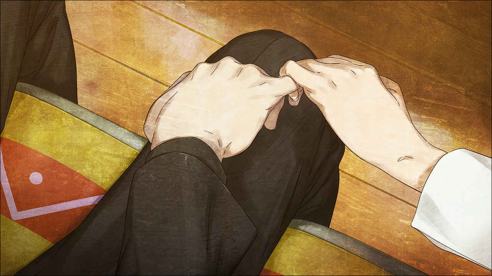
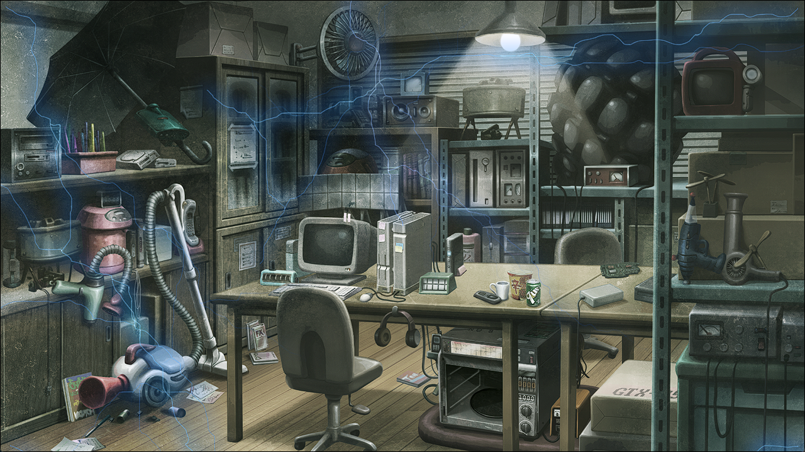

## 二律背反的双模 - 02
> 0.571082  
> [ 2011/01/02 ] 红莉栖通过D-Mail将冈伦送回了β世界线。与动画描写不同，红莉栖仅仅通过简短的对话就洞察了全部真相，本来打算偏趁着冈伦出门偷偷将他送回去。结果冈伦察觉了，冲回LAB发现了红莉栖的行为。两人进行了饱含深情却又克制的告别。  

“呼……”  
一走出Lab全身就脱力了。在活着的红莉栖面前，不管怎么样还是太紧张了。现在的我已经不知道怎么和活生生的红莉栖讲话，不知道该和她说些什么了。明明和“红莉栖”就能那样正常地聊天。话说回来，现在还是难以置信。这里真的是α世界线吗？不，既然红莉栖在的话，肯定是的吧？但是，这样的话，到底为什么……是谁做了什么，才引起了世界线的变动？那时候来自“红莉栖”的求救。莫非，那是什么事件的契机吗？……不，这些都只是推测。如果是什么不认识的人引起的，我就不应该介入。已经不想介入了。欲图颠覆世界的构造什么的，现在的我绝对不会想这些了。我只想安安稳稳的生活而已——活在世界线和世界线收束之类的概念不存在的世界里。我不要再被名为命运的恶作剧戏弄了。我能做到的事情，早就什么都——  
“……”
突然一股违和感喷涌而出。刚刚红莉栖的话……到底是什么意思——一脸奇妙的表情、语气格外温柔地叫我振作点……难道，那家伙！我急忙返身冲回LAB。  
“红莉栖！！”  
“诶……？”  
“红莉栖……你……这个是……”  
“呃……败给你了，被你发现啦~”  
红莉栖和一开始我看到她的时候一样，伫立着，盯着开发室的角落。昏暗的角落摆放着的，是在刚刚还被很大一块布盖着的，一台连门都没有的古老的微波炉。  

——电话微波炉（暂定）。曾经我们在这里制造的，未来机械8号机。也是改变了我的——不，是改变了世界的命运的机器。  
“为什么？这东西不是已经被破坏了吗？”  
“……嗯嗯，已经破坏了。  
 这是我重新制造的，说起来应该叫『电话微波炉改』呢~  
 准确的说是要加（暂定）对吧？所以就变成了『电话微波炉（暂定）改』~”  
红莉栖眯起一只眼睛，故作轻松地说着无关紧要的话。那样子与刻在我脑海深处的一样可爱，可是现在的我完全无暇欣赏，也无暇接上她的话题。  
“名字什么的怎么样都好。为什么……要重新造出来……”  
“为了把邮件送到过去。我要发送邮件，改变世界线。  
 嗯，对你来说用‘回去’比较好吧，**回到原来的世界线**……  
 实际上，完成这个，是一个多月前的事情了。  
 从那时开始我就站在这里，为了到底该不该发送而烦恼。  
 然后没想到，你居然会**来这里**呢。”  
“你……为什么……”  
“呐，冈部。你，刚才，是**从其他的世界线过来的**对吧？”  
“——！”  
“而且是**从β世界线**……不是吗？”  
“……你注意到了吗？”  
“如果不是这样，你应该也不会做出那种事情。”  
“那种事情？”  
“……就、就是，那个……像那样抱紧我……那种……事情啦……”  

她的每一点都很惹人怜爱。像现在这样，为了隐藏自己的害羞而涨红了脸，不敢直视的样子也是；强硬撅起的嘴唇也是；玩弄着发梢的动作也是。处处都惹人怜爱。事到如今，我再次确认了我的心意。我，确实喜欢着牧濑红莉栖。  
“更准确地说，这次世界线变动**是由某个未知的人引起的**，  
 **并不是因为你的意愿而产生的**。我说中了吗？”  
“这一切……都被你看穿了啊……”  
“我只是一直注视着你这样一路走来而已。”  
“诶？”  
“啊，不、不是的。说是注视着你一路走来……也不是这个意思……不，也不能说没有……”  
“……”  
“总、总之！”  
深呼吸之后，原本躲开了视线的红莉栖，直直地看向了我。  
“既然你是从β世界线来的，也就是说**你曾经选择了那个世界**对吧？”  
我真的赢不过她。如此短的时间里，就能理解到这种程度。全部都如红莉栖所言。即使如此，我也无法点头。承认这点就意味着，承认我曾经对红莉栖——对她见死不救。那种事情，如今的我不可能做到。  
“……对不起。”  
最后说出口的，仅仅是这样的话语。这样和直接承认了也没什么两样。但是，红莉栖露出的表情却没有一点悲伤……不仅如此——  
“不要道歉，笨蛋。这是你自己做的决定不是吗？所以，对自己的选择要有自信。”  
她甚至在如此鼓励我。没错，正如红莉栖所言，选择了那个世界——β世界线的是我自己。但是——  
“而且呢，你也许并没有错……  
 虽然你刚刚来还不知道，这半年来，你一直在责备自己……  
 虽然那种姿态，绝对不会让我看到就是了。”  
一样的。和至今为止的我一样。和β世界线的我一样。  
“但是，我什么都没能做到。  
 因为，你的痛苦都是源于我……  
 为了让我活着，你才会那么痛苦。  
 不过，到今天就结束了。必须让它结束。  
 因为，再这样下去，你会一直被自己有罪的想法折磨，最后一定会崩溃的。”  
“……一样的。”  
“……什么意思？”
“不管在哪边，最后我都是一直在后悔。  
 后悔救不了真由理，后悔救不了你。  
 不管是在α世界线，还是在β世界线，都没有改变。”  
既然如此，那就——干脆就这样——  
“振作点，冈部伦太郎！”  
“红莉栖……”  
“这是什么表情啊，一点都不像你。我喜欢的凤凰院凶真，脸上要更加充满自信的。”  
凤凰院凶真……吗？十分令人怀念的名字。  
“你选择了正确的道路。拯救真由理这个选择是绝对没错的！”  
“但是，我把你……”  
“听好了，现在，你在这里的这件事……对，只是在做梦而已哦~”  
“梦……？”  
“对，在梦里，你见到了我。只是这样而已。怎么样？这样想的话，稍微轻松一点了吧？”  
红莉栖耸了耸肩，笑了。  
“虽然脑科学的研究已经有了这么大的进展，但是人做梦的机理还没有解明呢。  
 虽然有一种说法，人在睡觉的时候，大脑会进行记忆的整理，在这个过程中产生了梦。  
 简言之，这里是β世界线的你闯入的梦中世界，是为了让你整理脑中的记忆哦~  
 既然是梦的话，总是要醒过来的，对吗？”  
“但是，这不是梦！现在这样——”  
我伸出手，触碰着红莉栖的脸颊。  
“现在这样，你就在这样存在于这里不是吗……”  
“触感只不过是脑感知的机能之一哦~”  
红莉栖轻快地后退了一步。随着她的身姿远去，手掌的触感一下子消失了。  
“况且，在这里的你也不会幸福。永远也没办法从后悔中走出来。而我也一样……”  
“就算在β世界线，也是一样的……我一直、一直都活在救不了你的悔恨之中。”  
“但是，至少真由理能够幸福地活着对吧？”  
“……真由理她……”  
她什么都不知道。因为我就是这样希望的。希望真由理就那样什么都不知道地，带着笑容活下去。这个愿望现在姑且算是实现了。  
“你的愿望是希望真由理能够露出笑容。我的愿望也是同样的。所以说，果然你的选择是没错的。”  
“……”  
明明好不容易才能这样再度重逢，明明她还这样活在这里。  
“啊，真是的！”  
红莉栖毫不掩饰自己的焦躁，逼近过来。  
“闹够了没有，冈部伦太郎！已经得出结论了不是吗？你不能留在这里，你非回去不可！  
 不从梦里醒来是不行的啊。因为我已经……已经不想再看见你这么痛苦了……”  
“红莉栖……”
“那么，这样下去也是浪费时间。我要开始了。”  
斩钉截铁地扔下结论，红莉栖转过身去。存在于她的背影中的，是无可动摇的意志，是决意。我想起了刚来到这条世界线时候，一直伫立在那里的红莉栖。现在想起来，她站在电话微波炉（暂定）面前之时，就已经下定决心了。不让任何人知道，没和任何人告别，就决定要前往自己不存在的世界。在得出结论之前，到底经历了多少思想斗争呢？质疑了多少次，迷茫了多少次呢？如果说这就是她经历过这些而得出的结论——我没有阻止的权利。我无法阻止她。  
“呐，冈部，在梦醒之前，我想做一个约定。”  
“约定？”  
“到达β世界线以后，请忘了我吧。”  
这是和那天完全相反的祈求。那天——我决定选择β世界线的时候，红莉栖是这么说的——“不要忘记我。”然而，现在红莉栖所说的请求，和那时完全相反。  
“忘记你……这种事情，怎么可能做得到！”  
这家伙总是这样，比起自己更在意他人，牺牲自己。这个请求，是为我考虑。明明就不想被被遗忘，明明是比别人更容易感到寂寞的人。
“我都说了，这是梦哦。一般梦醒之后都会忘了的吧。”  
固执、耿直。绝对不可能忘记。不会忘，但是——  
“小时候的噩梦，到现在也还记得啊！”  
“你说谁是噩梦啊，真是的！”  
我竭尽全力地逞强。这一点，恐怕红莉栖也是同样。  
“总之，忘记我吧。不管是今天相遇的事情，还是之前经历的事情。这就是我的愿望。”  
红莉栖又转过身来，伸出了小拇指，强硬的勾住我的小拇指。  
“拉钩上吊~说谎的人海马体被电极刺~拉钩了~”  
“……韵脚真糟糕呐。”  
“你管我。”  

勾着的小拇指分开了。对视的目光也分开了。永别的时间就要到了。发送给过去的邮件——即使这是正确的，即使知道这就是红莉栖所希望的，即使如此——  
“红莉栖！”——“冈部！”  
声音重合在一起。  
“怎、怎么了？”  
“你、你才是，什么事？”  
“没什么……只是、想叫你一声。”  
呼唤重要之人的名字。  
“好、好巧啊……我也…一样。”  
呼唤喜欢之人的名字。  
“呐，你还记得吗？和我第一次相遇时的场景……”  
“怎么可能忘得了。不管怎么说，那时的印象可太强烈了……”  
“真要说起来你才是呢。  
 真是……那时候，完全想不到我们会有这样的发展呢。  
 没想到，那样的相遇，竟然——”  
竟然，让彼此成为了这般无可替代的存在——虽然事到如今，这样的告白说不出口。  
“还真是想不到呢……”  
虽然说不出口——  
“啊，但是先说好，我们的相遇也只能记住到现在为止了哦。”  
至少稍微——  
“回到β世界线的话，就必须忘记的哦。”  
即使一秒也好——  
“我知道了。”  
让这个时间——  
“呜……这么简单就能忘记了啊……”  
再稍微延续一下的话——  
“是你自己要求的吧。”  
她的声音——  
“就算是这样，你说得那么轻松还是很让人生气……”  
她的举止——  
“又说要我忘记，又说不要我忘记。你到底要我怎么做嘛。”  
她的微笑——  
“嘿嘿……开玩笑的，骗你的啦。骗你的……”  
“什么啊，骗我的啊……”  
“是的，骗你的……”  
我全都不要忘记——  
“……”
“…………”
但是这一切都——  
“冈部……”  
“嗯？”  
“那么，再见……”  
这是宣告魔法时间结束的信号。  
“啊……”  
“呵……”
我咽下了想要满溢而出的话语，只这么简单的回应一声。红莉栖对这样的我，露出了满足的笑容，转身朝向电话微波炉（暂定）。邮件的内容早已准备好了吧。她毫不犹豫，电话微波炉（暂定）开始发出雷鸣般的巨大声响。倒计时非常、非常漫长。在这个过程中，红莉栖一直背对着我。我也只是注视着她的背影。雷鸣逐渐变得激烈。显示面板的数字逐渐减小——  
然后，归零之时已至。  

“冈部……好好醒来哦~”  
红莉栖在那一瞬间转过身来，调动全身的力气露出她能做到的最大的笑容。随后她的声音，消失在噪音中——  

 

> (to be continued)
---

| [←prev](./0094) | [menu](../) | [next→](./0096) |
