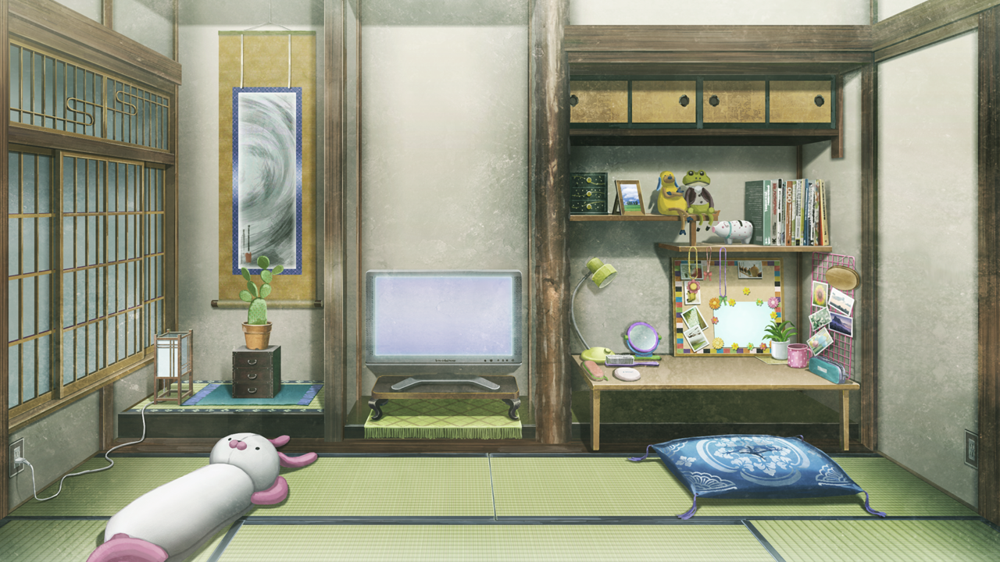
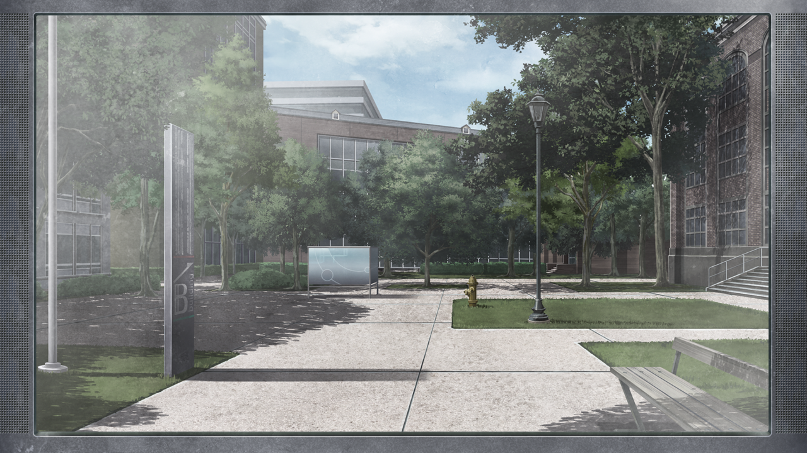
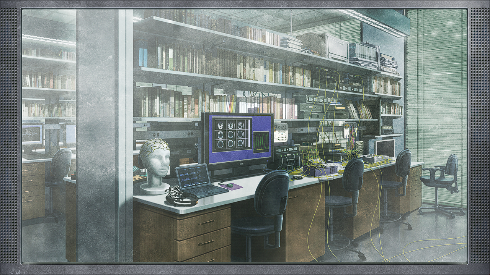

# 二律背反的双模 - 04
> 1.053649  
> [ 2011/01/02 篝视角 ] 篝看到电视里介绍的维克多·孔多利亚大学，不知为何对里面十分熟悉。同时预感到有什么可怕的事情即将发生。  

| [←prev](./0096) | [menu](../) | [next→](./0098) |

---

椎名篝，比其他人所想的要更加感到满足。记忆丧失，现在的篝，只有儿时的记忆。10 岁就跳跃回到过去，之后和铃羽走散了。那之后的记忆突然变得空洞，有的只是最近几周的记忆而已。孩提时代之后的时间中，最早的记忆是醒来瞬间的天花板。古老寺院中的天花板，到处都是污点。那些污点看起来像是人的脸，令人感到有些害怕。后来不久，篝就借宿在这个柳林神社了。  
“篝，要喝茶吗？”  
“哦，嗯。谢谢你，琉华君。”  
“那么，我这就去泡茶了。”  
和漆原琉华这个人见面也是在那个时候，那时候的篝还不知道自己所认识的漆原琉华是“琉华君”。漆原琉华是篝的养母——椎名真由理的好友，经常和年幼的篝一起玩。还是孩子的篝一直把琉华当成女性，在她眼中，有种可靠又成熟的感觉，甚至让当时的她虽然抱有疑问，却也能稍微认同铃羽称呼他为“琉华哥哥”。  
“给，请慢用。”  
“谢谢。”  
但现在眼前的琉华比起篝知道的更加年轻，不管从哪里看都是可爱的少女，而且还不是很可靠的样子。所以，知道他就是自己所认识的漆原琉华，是在和真由理妈妈她们相逢之后的事了。  
“嗯……？这杯红茶，总感觉有点不一样的味道。”  
“迷迭香茶。听说能提升记忆力和注意力，菲莉丝小姐给的。”  
虽然认为恢复记忆和提升记忆力并不是一回事，不过篝没有说出口，那份心意令篝很高兴。包括琉华在内，真由理妈妈和冈部先生他们，都在想方设法帮篝取回记忆。一般来说失去记忆会十分不安吧，不知道自己曾经在怎样的时间中生活，不安也是理所当然的。但是，说实话篝觉得想不起记忆也没关系。偶尔会有记忆碎片在脑海中突然出现，每当如此，篝的内心都会被近乎恐惧的不安所占据。  
“难道……不好喝吗？”  
琉华担心地看着喝了一口就停下的篝。  
“啊，不是，没这回事，很好喝哦！只是……在想一些事而已。”  
“想一些事？”  
“对！但是，并不是什么大事。”  
为了蒙混过去，篝又喝了一口红茶。  
“话说回来，琉华君真的是男孩子？”  
真由理妈妈叫他“琉华君”。对于这个称呼，作为小孩子的她没有觉得不可思议，也效仿着叫他“琉华君”。  
“是……的啊。”  
“嗯\~不管怎么看都是女孩子嘛。”  
“就算这样说也……”  
“对了，呐，明天，一起洗澡吧？”  
“诶——！？”  
“这样就能搞明白，琉华君是不是真的男孩子了。”  
“不、不不，不行啊，这种事！”  
“为什么？”  
“就、就是，这种……就是，和女性一起洗澡什么的，这种事……”  
“你没有和姐姐一起洗过澡吗？”  
“洗过是洗过……不过，那是小时候的事情了。”  
“噗……噗噗——哈哈哈哈哈哈哈！”  
“篝……篝？”  
“抱歉抱歉，开玩笑、开玩笑的啦。琉华君很可爱，忍不住就捉弄了一下。”  
“怎么这样……”  
“但是，既然是这种反应，果然是男孩子啊\~”  
“一开始不就是这样说的嘛……”  
连困扰的表情也十分像女孩子，篝如此想着。  
“如您所见，在这里的店有着数十种的食物，全部都是随便吃！”  
电视的画面上，从刚才开始就播放着看起来很美味的食物。  
“好厉害啊……”  
对这幅画面，篝发出感叹。  
“这个时代真厉害啊，和我所知道的未来完全不同。”  
“是吗？未来的世界是怎样的感觉？”  
“想知道吗？”  
对于这个问题，琉华露出有点为难的表情。对于篝来说，虽说这样问了，但也烦恼着说出来到底好不好。篝知道的未来充满了绝望。明天一定会有好事。后天一定——大家一边依靠着那微弱的希望，一边拼命生活着。如果未来没有希望，人要怎样才能活下去呢？”  
“果然，还是别说吧。”  
这个回答令篝放下了心。  
“这才对。因为未来，是可以改变的。”  
“未来可以改变……？”  
“嗯！妈妈这样说的，一定可以改变，绝对会改变未来的。”  
“改变……未来……”  
真由理一直都对篝这样说。这对篝来说是微弱的希望之光。  
“那个什么……什么来着……Stein……什么的。”  
“*Steins;Gate* 吗？”  
“对，就是这个！*Steins;Gate* 一定存在，妈妈是这么说的。  
 ……话是这么说，它到底什么，我也不太明白，诶嘿嘿——”  
*Steins;Gate*——这个词的意思，说实话篝并不明白。尽管如此，只要听到真由理说这句话，心就暖和起来了。只要想着，引领我们通向 *Steins;Gate* 的人一定会出现，明天就会充满希望。  

“那么，接下来是下一则特集。  
 您知道吗？当今世界上，记忆再生技术的研究正在进行着。  
 今天，我们的特集将带您走进，引领这项研究最前沿的一所美国大学。”  
电视在不知不觉间从美食报告切换到了另一个节目。画面里映出了绿意盎然的大学校园。明显与日本的不同，是广阔开放的校内景象。  
“……”  
看到那些画面的瞬间，篝的内心产生了激烈的动摇。  
“这里是维克多·孔多利亚大学。乍看之下是普通的大学校园，但是，这里正在研究着一个重大项目……  
记者的话语开始涉及到专业性词汇。按理说，只有孩提时代记忆的篝是无法理解的。但是——  
“换个频道吧——”  
“啊，等下！”  
篝阻止了琉华伸向遥控器的手。  
“……”  
“篝，你能看明白吗？”  
“嗯。脑的构造……是否可以捏造记忆的话题。”  
“诶？好厉害啊。对我来说太难了，根本不知道在说什么……”  
节目的内容，顺畅地进入了篝的大脑。为什么？怎么回事？为什么能理解呢？  
“是吗？并不是什么难理解的话题哟？”  
 记忆是由大脑中名为海马体的部分掌管，而其中又有被称为齿状回的结构。”  
被自己的话语困惑的同时，晦涩的词句还是不断浮现而出。  
“在那里进行的神经细胞生成，会造成已有神经回路的重组，进而诱发记忆的忘却。  
 这个研究团队以小白鼠为实验对象，说明记忆是可以被捏造的。”  
 啊，你看，那里面的房间，小白鼠的实验就是在那里做的。”  
“那个……篝，难道说，你对这个大学很熟？”  
“诶？”  
注意到的时候，琉华脸上带着不可思议的表情。  
“因为……总觉得，听你的口气，好像知道得很详细的样子……”  

画面中显示着的场景，毫无疑问是研究所。镜头往里走——打开白色的门，走进了旁边的房间。  
“在这个房间，正在进行小白鼠实验。据此研究组……”  
“……不，不知道……”  
“但是，刚才……”  
是的，不知道。自己不知道这样的地方。但——  
“不明白……不知道，但是……不知道为什么，刚才又感觉……好像知道……”  
大脑深处绞痛着，篝非常不安，好像有什么可怕的事情即将发生。  

 

> (to be continued)
---

| [←prev](./0096) | [menu](../) | [next→](./0098) |
