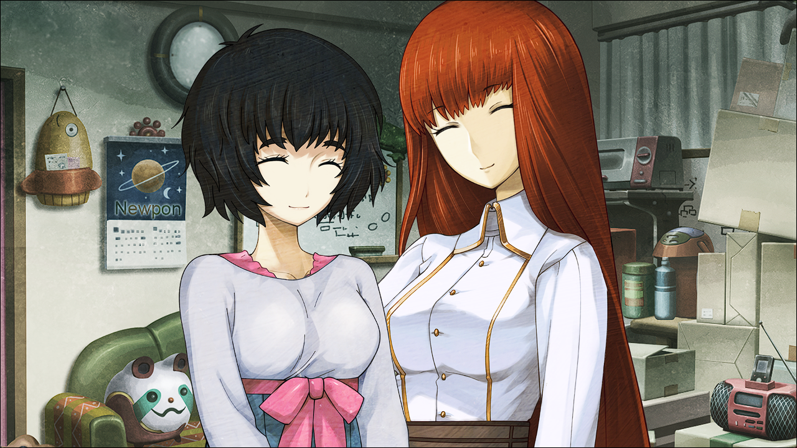
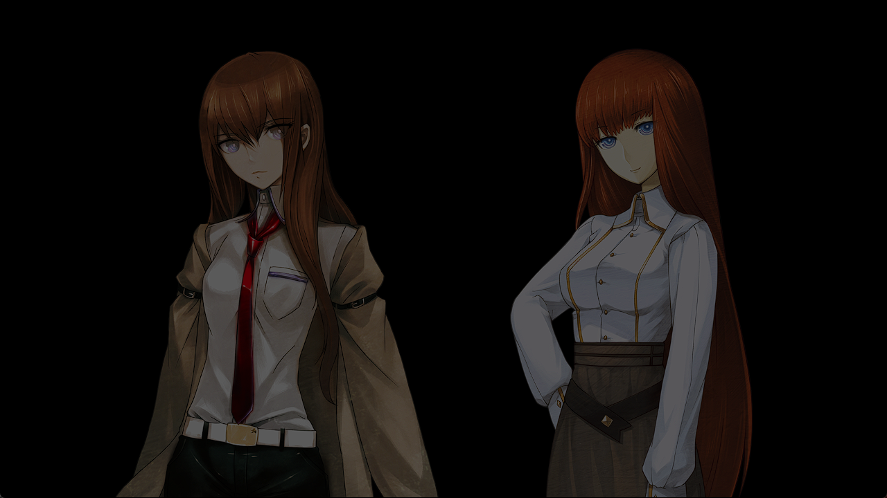

# 二律背反的双模 - 10
> 1.053649  
> [ 2011/01/06 ] 篝脑海中的红莉栖记忆越来越多了。细节：1.篝小的时候经常接受检查，以治疗 PTSD 的名义；2.未来的 LABMem 也会经常说起已经去世的冈伦和红莉栖，即使没见过，冈伦目前也避免提及，真由理也了解了红莉栖是冈伦重要的人。室内谈话后冈伦决定带篝上街买东西。  

| [←prev](./0102) | [menu](../) | [next→](./0104) |

---

篝的脑海中留有红莉栖的记忆——这个假说变得越来越有真实感。那之后又过了几天。  
“对不起，给冈伦先生带来了好多麻烦。”  
“没什么……我也不觉得麻烦。比起我，琉华子和真由理才是为你操了不少心吧。”  
实际上，真由理和琉华子很照顾篝。说到真由理，她本人应该没有感觉到，她被篝确实地当作妈妈爱慕着。琉华子毕竟负责照顾她的衣食住行，看样子也相当关心篝。  
“哪里，我不过是陪她聊聊天而已。”  
“真由喜才是，很抱歉没有帮到你什么。”  
“不！没那回事！琉华君很照顾我，妈妈只要在身边我就很开心了。”  
被称呼为妈妈，真由理有些不好意思地扭了扭身体。也没办法，在这个年龄，还被一个比自己年纪大的人叫妈妈，任谁都会感觉奇怪吧。  
“呐，妈妈？”  
“什么？”  
“‘啾’一下可以吗？”  
“‘啾’？”  
“就像小时候妈妈经常对我做的，抱我一下可以吗？”  
“诶～哇哇～好害羞的～”  
“不行吗？”  
“不会……当然可以的呀\~”  
篝满面阳光地抱住了害羞着点头的真由理。  
“篝酱～好乖～好乖～”  
“诶嘿嘿～”  
虽然真由理没有深究，但是对于篝身上发生的事，多少应该觉察到了一些，明白现在这么做会比较好吧。  
“妈妈……”  
不可思议。实际年龄应该是篝年长一些，但是这样看起来，还真的挺像母女。  
“谢谢你，妈妈。”  
篝慢慢离开真由理。  
多亏了真由理，篝似乎冷静了不少。现在应该可以和她继续聊下去了吧。  

“那么，篝，状态怎么样。”  
“状态？状态啊……怎么说呢，我也不是很清楚啊。”  
“不是很清楚……是什么意思？”  
“虽然有时突然会想起一些事情，但我也不清楚，那到底是自己的记忆还是红莉栖的。  
 很复杂的公式啊、实验啊……不懂但是知道，这种感觉……”  
篝的脑海中存有的记忆，只有小时候的部分，和在琉华子父亲相熟的某位住持处被发现后的部分。其他空缺的部分，被偶尔出现的红莉栖的记忆侵蚀着。这到底是什么样的感觉，我无法想象。  
“那个，前阵子，也有想起爸爸的事。那是小时候，被爸爸表扬时的记忆。  
 想起那些，不知为何觉得非常开心……  
 但是，我在婴儿时期就失去了双亲，之后是真由理妈妈养育的我，我并不知道爸爸的事情啊。  
 然而，自己明明没有经历过，但的确有被表扬后感到开心的情感。  
 一想到这里，脑海里就变得一团糟……”  
篝面容扭曲地抱着脑袋。刚见面的时候，我就惊讶于她那和红莉栖几乎一模一样的外貌。但是，像这样交谈之后发现，椎名篝和红莉栖有很大的区别。生动的表情也好，略微夸张的反应也好，非要说的话更像真由理。果然这就是来自母亲的影响吗？  
“那个……红莉栖的记忆经常会出现吗？”  
“嗯……和之前比起来，好像更频繁了……”  
“是吗……”  
“呐，冈伦，篝酱到底怎么了呀？”  
“……本来的话，最好到正规的专业机构去检查一下。”  
但是对于篝的处境，并不能这么简单行事。  
“不是很想要接受检查呢。小时候，就总是要接受检查。”  
“是吗？”  
“嗯，说是为了治疗 PTSD。”  
本人也没有意向要去检查。但是……如果这样下去，红莉栖的记忆流入增多的话，她会变成什么样呢？是变成“持有牧濑红莉栖记忆”的“椎名篝”呢，还是会变成“牧濑红莉栖”呢？”单纯记忆并不能形成人格。但记忆也是形成人格所需要素的一部分。拥有红莉栖记忆的她，会变成怎样的存在呢？现在大概没有人能知道答案，因为共享某人的记忆这种现象本身，恐怕至今为止都还未出现过。  

“啊，真由理酱，时间不早了。”  
“啊……真的。呐，冈伦，接下来篝酱的事情可以拜托你吗？  
 之后在学校有一场关于升学的宣讲会\~我们必须要出席。”  
“对不起……”  
“不用道歉。别担心，我一定会把篝平安送到家的。”  
“非常感谢。”  
“那么篝酱，明天见啦\~”  
“嗯，妈妈，明天见。”  

送走真由理和琉华子之后，房间里就只剩我和篝两个人。因为记忆的问题，篝这几天也暂缓了显像管工房的打工。话虽如此，为了以防万一，还是让她白天尽量到这里来。楼下有天王寺和铃羽，这样也能安心一些。  
“……”  
我无意间注意到了篝的视线。  
“怎么了？”  
那个，仔细想了一下，觉得能这样和冈伦先生交谈，真不可思议呢。”  
“不可思议？为什么？”  
“因为，对我来说，冈伦先生是属于故事中的人物呀。”  
“故事中的……”  
“嗯，从桶子叔叔或者妈妈那听来的故事里的人。”  
原来如此。听铃羽说，我在 2025 年就死了。也就是说，在篝那个时代，我已经不在了。  
“妈妈经常会说到冈伦先生的故事呢。  
 比如‘冈伦救了妈妈，冈伦是妈妈的牵牛星哦\~’之类的。”  
“那家伙，未来还在讲这种话吗？”  
这次轮到我感到不好意思了。  
“所以我一直都很好奇，妈妈一直念念不忘的冈伦先生，是怎样的人呢？  
 一直成为大家话题的那位，名为冈部伦太郎的人，究竟是怎样的一个人呢？”  
 也许……还有些憧憬？”  
“你就别戏弄我了。”  
“哈哈，冈伦先生害羞了呢。”  
完全陷入篝的节奏了。  
“啊，从这种意义上来说，那位叫牧濑红莉栖的人也是这样的呢。”  
“红莉栖？”  
“嗯，因为牧濑红莉栖这个名字，也经常从妈妈或桶子叔叔口中听到。  
 那么早就去世的人，还有这么大的影响力，她会是怎样的一个人呢？”  
“那个……真由理是怎么评价红莉栖的？”  
“……说是冈伦先生的重要的人。”  
“……”  
——重要的人。对我来说，这是无法否定的事实。但是，对于 LABMem 的大家来说不一样。在这条世界线，真由理和红莉栖并没有相遇。至今为止，我自己也尽可能不去提及红莉栖的事。即便如此，在未来，我还是让真由理抱持了这样的想法吗？  

“对了，我现在正要去购物，你要一起来吗？”  
“购物？”  
“啊。你对这周围还不是很熟悉吧？”  
“可以吗？”  
“当然了。”  
虽然鉴于前一条世界线的事件，应该要避免不必要的外出，但是让现在的她稍微散散心也许会比较好。现在还是白天，选人多的路走应该就没问题了吧。  
“太好啦！其实呢，我也有好多东西想买呢。”  
“……有想要的东西？”  
“嗯。日用品什么的，好多好多。”  
“琉华子没有给你准备吗？”  
“虽然有准备，但是，那个，琉华君也是男孩子吧？所以，什么事都拜托他也不太好。”  
的确，不管再怎么可爱动人，琉华子也是男的。不论如何也有不了解的东西吧。  
“那么就出发吧。”  
“嗯！”  

 

> (to be continued)
---

| [←prev](./0102) | [menu](../) | [next→](./0104) |
