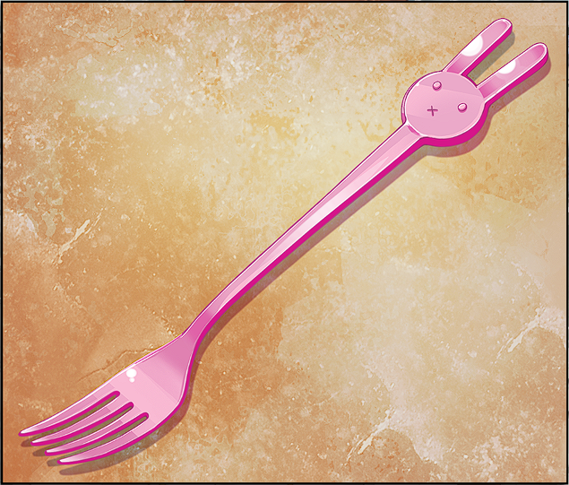
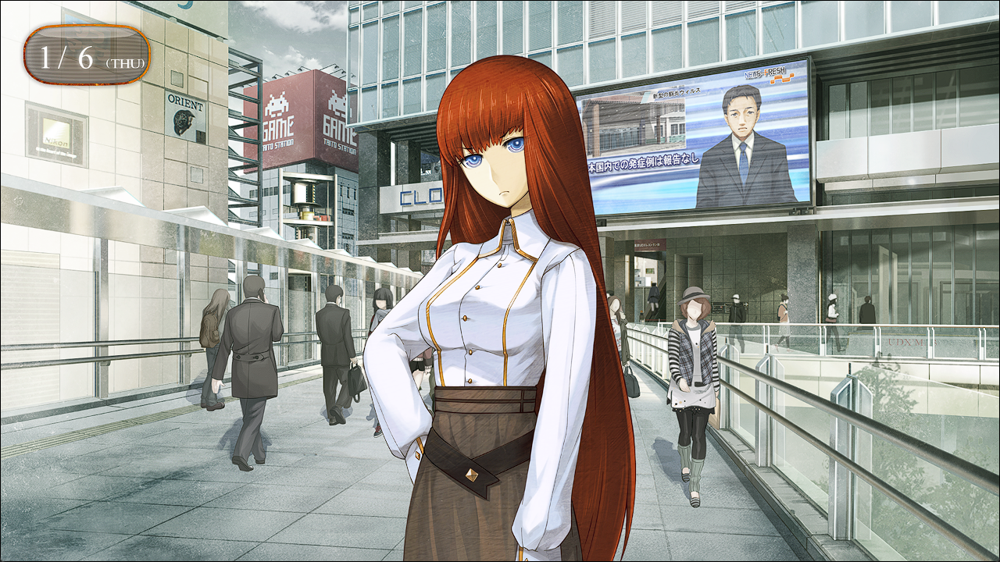
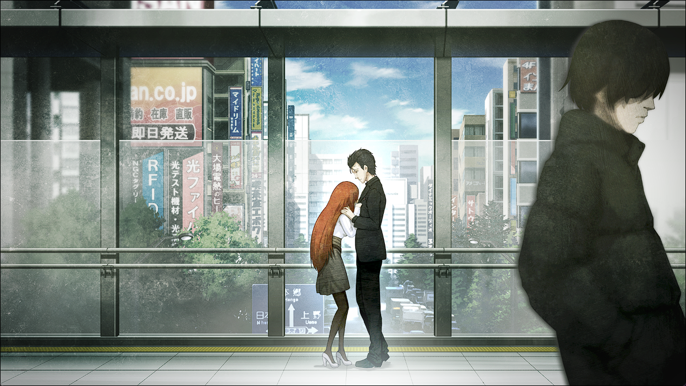

# 二律背反的双模 - 11
> 1.053649  
> [ 2011/01/06 ] 和篝逛街，聊天。冈伦给给她讲红莉栖的事，感觉她除了表情更加丰富之外，越来越像红莉栖，甚至在想，如果如果她大脑中的记忆完全替换成红莉栖的话……最后篝靠在了冈伦身上（断章鬼才）。  

“果然好厉害呢！”  
来到街上，篝眼里闪闪发光地环顾着四周。  
“人也好多，商店也好多，完全想不到这和那个秋叶原是同一个地方。”  
“未来的秋叶原是什么样的？”  
“用一句话来说……那个……瓦砾堆吧。不过，也不光是秋叶原那样。”  
铃羽说过，在不远的未来，会发生第三次世界大战。这么一来，年幼的篝只会知道战争发生以后的悲惨的世界。这归根到底都是我的错……吧。如果我听取了铃羽的请求，再一次回到去年 7 月 28 日的话——这样就能进入不会发生战争的世界线了吗？  
……不可能的。世界线的收束，是无法反抗的。  
“啊，冈伦先生，难道在想，这是你的责任是吗？”  
篝一句话正中靶心，让我愣了一下。  
“这个反应说明我猜对了呢。但是，这种想法是不行的，打叉！  
 就我所知，妈妈也好，桶子叔叔也好，谁都没有责怪冈伦先生哦。  
 因为妈妈她们都相信，冈伦先生总有一天能做到的。  
 呃……那个，命运石之门……对吧？把我们引导到那里。”  
我知道篝的话是在为我着想，也知道真由理和桶子是绝对不会责怪我的。即便如此，对现在的我来说，这些话不过是重荷而已——对于这个放弃一切的现在的我。  
“……哇，对不起。”  
“诶？”  
“我没有要逼你的意思……”  
看来，我的脸上显露着相当深沉的表情。  
“不，我才应该道歉。但是我已经……”  
“Stop、Stop！今天不是来讨论这件事的。  
 好不容易才出来一趟，聊点开心的话题吧。”  
“嗯……”  
如今篝的脑海里，应该只有战争痛苦的记忆而已。至少作为“椎名篝”的记忆只有这些。然而，她却还这么顾虑我。即使没有血缘关系，她果然就是真由理的孩子。  

虽说要聊开心的事，但是该聊些什么好呢？  
“嗯……是哦，难得有这个机会，就说说妈妈年轻时候的事情吧~”  
“真由理的？”  
“啊，说是年轻的时候，妈妈现在也很年轻。  
 但是，我想听更年轻时候的故事。比如说……‘人质’的故事？”  
“真由理连这种事情都告诉你了啊。”  
“嗯。妈妈在说冈伦先生的故事时的表情，我最喜欢了呢。  
 那种表情，就像是在慢慢打开一个非常重要的宝箱一样。  
 那个表情，那个时候的声音……单单想起来就觉得心里好温暖。”  
对于篝来说，真由理肯定是那个昏暗浑浊的世界里，如同星星般的存在吧，夜空中最耀眼最璀璨的星星。  
“也不是什么了不起的故事。  
 那时她失去了最喜欢的奶奶，一直沉浸在悲伤中，仿佛马上就要消逝了一样……  
 然后我就说了，那句羞耻的台词……”  
“‘你是我的人质’——吗？”  
从其他人嘴里听到这句话，我羞耻得都想钻进地缝里了。  
“那时的我太年轻了，所谓的年少轻狂惹的祸。”  
“即使这样，这句话也拯救了妈妈吧？”  
“……谁知道呢。”  
如果因为这句话，我一直——即使到未来都一直，束缚着真由理的话……  

“冈伦先生？”  
“比起这个，肚子不饿吗？我们去吃点什么吧。”  
“诶？啊，嗯……”  
我为了岔开话题迈出了步子，篝也不明所以地跟了过来。  
“有什么想吃的吗？”  
“嗯……我的话吃什么都可以啦~”  
“这种回答是最让人困扰的。”  
“因为，这个时代的食物，不管什么都好好吃，好吃到令人震惊。”  
“未来都吃什么呢。”  
“只有白薯一类的吧。啊，但是，妈妈每天都会调配不同的味道。”  
“真由理吗？”  
“嗯。”  
“真由理做的料理，那个……好吃吗？”  
“嗯！”  
“这样啊……”  
人类貌似是会成长的生物。真由理最近好像也跟由季学了各种各样的料理，也许是这些学习的成果。  
“所以我吃什么都可以哦。”  
既然这样的话——  
“欢迎回来喵，主人。啊，冈伦！还有篝喵！”  
难得顺路就来到了 *MayQueen+Nyan²*，这里已经是人山人海。  
“今天好满啊。”  
“就是喵，今天开始是动漫的联合宣传活动喵。”  
说起来，店门口确实立着，会在街上看到那种动漫角色的立式招牌。  
“拜其所赐生意超旺，都满座了喵。要入座的话，差不多还得等 30 分钟喵……”  
“既然这样，那就下次吧。”  
“嗯，不那么忙的时候，我们再过来吧。”  
“特地跑来一趟，对不起喵~”  

从 *MayQueen+Nyan²* 出来之后就到处逛。因为正好是午饭时间，显眼的店面不管哪家都是人满为患。  
“好厉害啊，到处都是人。”  
“真是的，为什么都特地跑出来吃饭，在家里吃不就行了。”  
“哈哈~不过，这句话也能套用在我们身上吧。”  
“那接下来怎么办呢。”  
“回 LAB 吃吧？”  
“先说好，我是不会做饭的。”  
“我也是我也是～”  
“这不是白说了？”  
“简单的也可以。我想吃那个，就是加热水的面条。”  
“杯面吗？这种东西就可以吗？”  
“那个，在未来呢，工厂少了许多，所以很难获得呢。  
 桶子叔叔总是念叨‘好想吃——好想吃——’，所以我一直很好奇呢。”  
既然她觉得可以，我也无所谓。既然如此，难得地就——  
我们在附近的便利店买入了大量的杯面。买多的部分，反正桶子会吃掉的。  
“好厉害啊，杯面有那么多种类啊~”  
“现在和未来不一样，是能够吃撑的时代。便利店这些地方，每周都有新商品上架。”  
“这样啊。呐，这里面，吃哪个都可以吗。”  
篝向我提着的购物袋里面窥探着。  
“当然，就选个你喜欢的吧。”  
“那，选哪个好呢？这个、那个……”  
篝用食指抵着嘴唇，两眼发光地样子，简直像个孩子。  
“我选这个！咸味的！”  
“如果你想，吃两杯三杯都没问题哦。”  
“真的吗！啊……但是吃太多会变胖的啊——”  
她的表情十分丰富，真是百看不厌。  
“说起来，你刚刚好像还买了其他什么东西？”  
“啊，这个。”  
我从便利袋中，拿出了一个塑料制的东西。  

“这是……”  
“叉子。我觉得你用筷子吃饭可能会挺吃力的。  
 这就作为你的专属餐具，放在 LAB 里面就好了。”  
“我可以收下吗……？”  
“没什么，又不是什么贵重的东西。”  
红莉栖过去想要的 “My Fork”——我并不是为了赎罪，只是单纯想这么做而已。  
“太棒啦！谢谢！实际上我很不擅长用筷子呢，总是被妈妈矫正……  
 啊，这个末端还有兔子先生，好可爱~  
 诶嘿嘿～我专属的叉子。这是我的第二个专属物品啦~”  
另外一个肯定是真由理给她的乌帕钥匙圈吧。  
“但是，怎么说呢……我觉得自己好像一直想要这个的……  
 难道，这也是红莉栖小姐的记忆吗？”  
“谁知道呢……”  
“呐，冈伦先生，你喜欢红莉栖小姐对吧？”  
“什——咳咳。”  
这句神转折的发言，让我一下子呛到了。  
“没事吧？”  
“突、突然间说什么呢？”  
“因为，所谓重要的人，就是这种意思吧？”  
“……”  
“然后呢？怎么样？是喜欢吗？”  
她一副兴趣盎然的样子不依不饶，这点倒是和年纪相仿。  
“嘛……与她的邂逅大幅地改变了我的人生。”  
“啊，想这么糊弄过去，好狡猾！  
 但是……重要到改变人生的程度的人呢，好令人憧憬啊。”  
如字面所示，不论过去还是未来，都因她发生了巨大的改变。  
“呐，在冈伦先生看来，牧濑红莉栖小姐是怎样的人呢？”  
“很在意吗？”  
“我想更多地了解脑海中那些记忆的主人。”  
“就算我不告诉你，这些记忆不也在你的脑海里吗？”  
“这是因为，我没办法主动回忆起那些记忆，  
 只是时不时会有一些片段自己跑出来，而且基本上都是一些难以理解的事情……  
 所以，想要知道那些更人性一点的事情，比如为人之类的。”  
“……”  
对于篝来说，红莉栖是完全没有接触过的陌生人。既然和陌生人共享了记忆，想要进一步了解对方也不无道理。  
“那家伙……牧濑红莉栖，总之是一个好奇心很强的家伙。”  
“嗯嗯。”  
“而且很固执，自己认为正确的事情，不管谁怎么说都绝对不会改变。”  
“这样啊。”  
“骄矜又爱逞强，然而却是个很怕寂寞的人。”  
脑海中，与红莉栖的说过的话，经历过的事，一件又一件地浮现出来。说起来，我也曾经在我们目前所处的这个天桥上，和她这样聊过天。虽然这些事在现在已经都不存在了。  
“还有，生气的时候超可怕。”  
“可怕？什么样的？”  
“‘把你开颅之后用电极插进你的海马体！’……她总说这种危险的话哦。”  
“唔诶～”  
篝发出感叹声，之后好像想到了什么，向前小跑几步，然后转过身来——  
“再讲这种话，就把你开颅之后用电极插进你的海马体！”  

“……”  
红莉栖……  
“是不是这种感觉呢？”  
“……”  
“冈伦先生……？”  
“啊，没事……”  
篝脑中的红莉栖的记忆——如果，在大脑中完全重现的话——名为椎名篝的少女就会变成牧濑红莉栖吗？我知道这是荒唐的想法。人格和记忆应该是不同的。即便如此，如果——如果，她的记忆都替换成红莉栖的记忆的话——如果那样的话——  
“冈伦……先生……”  
“呃？”  
篝摇晃着脚步向我走近，将她的身体靠在了我身上。因事出突然，我屏住了呼吸。胸口所触碰到的体温，触感，让我想起来红莉栖。  
“红莉……栖……？”  

 

> (to be continued)
---

| [←prev](./0103) | [menu](../) | [next→](./0105) |
