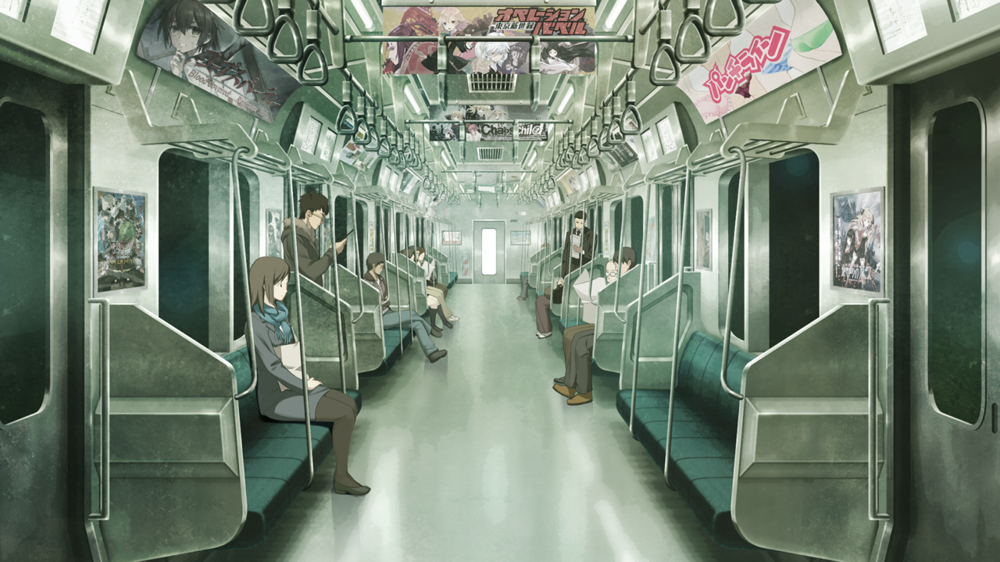

# 二律背反的双模 - 14
> 1.053649  
> [ 2011/01/06 真帆视角 ] 和光市办公室被侵入，但是没有丢失什么东西。雷斯吉宁套话得知真帆的笔记本在酒店。真帆请假，带着行李和红莉栖笔记本与硬盘准备常驻 LAB 研发『时间跳跃机』。  

| [←prev](./0106) | [menu](../) | [next→](./0108) |

---

（难以置信……）  
（但这是真的呢！）  

电车里，比屋定真帆无法抑制自己的兴奋。自称来自未来的两名少女，还有冈部伦太郎不断进行时间跳跃的故事。通常来说，不论如何也不会相信。但是，如果说这些构想是基于牧濑红莉栖的智慧的话，就能接受。如果是她——那位天才，也许能将之化为可能。红莉栖对于真帆来说，就是能让她感受到那种可能性。而且，不管怎么说，真帆亲眼见到了那个东西。  
从 LAB 离开后，她被铃羽带到了广播会馆的屋顶，看到了真正的时间机器。虽然时间紧迫，而且又是黑夜，没有进行详细调查，但那一看就不是现代技术能够制造的东西。说真心话，她真想从明天——不，今天就开始详细分析那个机器，然后制造个一样的出来。但是，在那之前，真帆有不得不完成的事情——红莉栖研发的『时间跳跃机』，制造其改良版，为此要暂时先泡在 LAB 里了。  
这么思考着，真帆来到了位于和光市的办公室，为了拿些必要物品。从外面看办公室的窗户，即使到了这个时间，依然看起来灯火通明。  
“*Maho!*”  
一进入办公室，雷斯吉宁教授就脸色铁青地赶了过来。  
“呃……这是怎么了……”  

屋内有明显被侵入的痕迹。因为办公室本来就好像空房间一样，没什么重要物品，一眼看去好像没什么变化。但真帆和雷斯吉宁教授的办公桌明显被重点翻找过了。本来应该上锁的抽屉，现在都被破坏，里面的东西全被倾倒一空。莱耶丝教授没在办公室放什么重要物品，所以万幸没有受到太大损失。即便如此，抽屉还是都被翻了个底朝天。  
“这……到底发生了什么？”  
“好像被什么人入侵了。”  
“小偷吗？”  
“我到的时候就已经是这个样子了。或许，是企业间谍也说不定。”  
“在这种什么都没有的地方？”  
那样的话不是应该瞄准隔壁的物理化学研究所吗？而且说起来，知道这个办公室的人应该屈指可数。一时间，刚才冈部他们说的事，开始有了现实感。难道这也和那些事情有关吗？围绕着时间机器，国家之间桌面下的斗争已经开始了吗？

“总之，*Maho*，你先检查一下有没有什么被偷。”  
“好、好的……”  
“怎么样？有没有什么东西被偷？”  
“没，我的东西没事……”  
桌面和抽屉都检查过了，什么都没被偷。  
“教授你们呢？”  
“我这里也什么都没被偷。”  
“我的电脑里面也仔细检查过了，没有第三者访问过的痕迹。  
 *Maho*，你真的什么都没被偷吗？”  
“是的。”  
“说起来，*Maho*，你的笔记本呢？该不会是被偷走了吧？”  
“啊，那个我放在酒店里了所以没事。”  
“这样啊，那就好……”  
“怎么办？报警吗？”  
“什么都没被偷的话，也许就没必要把事情闹大了吧……”  
“也是……那我们静观其变吧。”  
虽然就这么简单处理不是很好，但是也能理解，报警又会把事情变得很麻烦，特别是对于从外国过来的我们而言。此外，教授他们最讨厌被研究以外的事情占据时间了。对于这点真帆也是同样的感受。  
“那个，教授，实际上我有个请求——”  

雷斯吉宁教授意外爽快地同意了真帆的休假请求。正月里也来了一趟办公室说不定是正确的。这样，就能专心进行『时间跳跃机』的制作了。  
回到酒店房间的真帆，匆忙地收拾着行李。虽然并不准备退房，但是为了待在 LAB 还是需要替换衣物等诸多用品。  
“好嘞，接下来……”  
真帆一只手拿着塞满行李的包，另一只手又拿起放在旁边的另一个包——里面装着作为红莉栖遗物分得的笔记本电脑和硬盘。至今已经不知道试着解析过密码多少次，但还未成功过。虽然知道带过去可能暂时也用不上，但是无法容忍自己扔下这些。  

“对了，记得他……”  
全部确认完毕，刚要走出房间的时候，真帆脑海中突然浮现了一个想法——连自己都觉得不错的想法——说不定，这也是已故的红莉栖的意愿。就这么想着想着，真帆慌张地摇了摇头。会让红莉栖生气的吧。死和生是 0 和 1，只能在其中一边。没有任何人的意志，可以在死后继续干预这个世界。  
如果存在的话，也只存在于脑海之中而已。  

 

> (to be continued)
---

| [←prev](./0106) | [menu](../) | [next→](./0108) |
