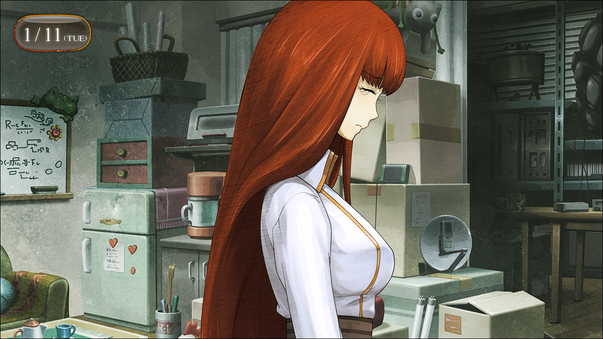
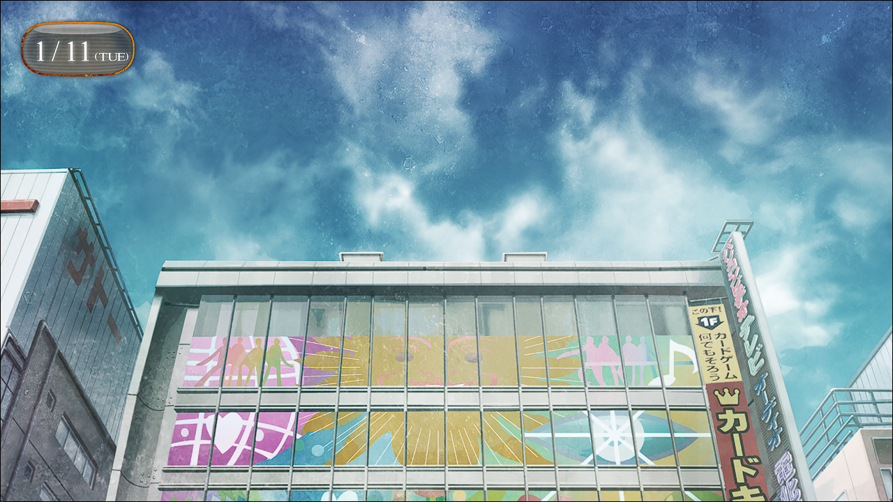
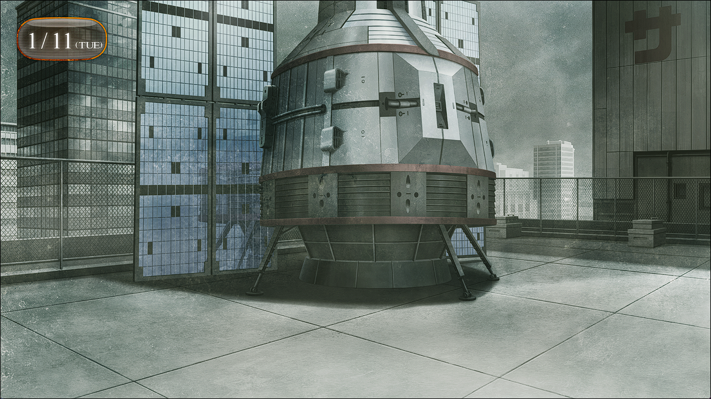

# 二律背反的双模 - 15
> 1.053649  
> [ 2011/01/11 ] 调查没有进展，篝变得越来越像红莉栖。冈伦拼命压抑想要放任看篝会不会变成红莉栖的想法。篝情绪激动，两人出门散心，于是来到了广播会馆楼顶。  

时间又过去了数日。在此期间我们努力调查着，到底是谁把红莉栖的记忆植入了篝的脑内，却始终毫无进展。虽然到保护过篝的住持那里询问，又到附近试着打探了消息，但并没有获得有价值的信息。铃羽自己也在展开调查，从那之后就没有回过 LAB。她好像定期会跟桶子联络，看样子没有碰上什么危险。我再次委托了天王寺和萌郁，但好像他们也没有发现什么蛛丝马迹。说到底，这条世界线里，LAB 没有遭到袭击。这么一来，那伙人说不定在进行着什么别的行动。就算真是这样，他们到底在做什么，我也想象不出来。但可以确定的是，有人带走了年幼的椎名篝，并对其进行了实验，直到最近她才从囚禁中逃了出来。肯定有什么不好的事情正在酝酿着。就算这样，我们已经没有多少时间，不可能等着这群家伙行动。可是，手上没有线索的话也没法采取对策。冥思苦想而无果，只是徒然增添焦虑。  
“不好意思，真帆前辈，为了我……”  
“没什么……还差一点就完成了。而且，这也是为了我自己”  
真帆从开发室拖着晃晃悠悠的脚步走出来，一屁股坐在了沙发上，很疲惫地笑着。她的眼袋上出现了黑圆圈。这几天废寝忘食地投身于装置的开发，争分夺秒地想让努力得到回报。  
“话说回来，使用手机什么的，一般人是不会想到的吧。  
 就算想到了，我也不觉得会有人去实践。”  
“因为手机通话的时候无论如何都要把听筒靠近太阳穴附近啊。”  
“因为在太阳穴周围有大脑额叶和大脑颞叶呢。  
 考虑到颞叶的海马旁回是记忆的储存场所，我认为这样是妥当的判断。”  
篝很自然地跟上了话题。  
“问题就是，怎样把记忆压缩呢”  
“关于这一点，眼下我正在通宵奋斗中。”  
“抱歉呐，桶子……”  
“而且，因为冈伦说了，这次的黑客行为绝对不能暴露，实在很难办。明明手上还有其他的工作要做。”  
关于记忆的压缩，无论如何都需要借 SERN 的 LHC 一用，这让我十分的苦恼。如果 SERN 变成敌人的话，又会发生那个惨剧。但是 SERN 袭击我们的一个关键原因是那条短信——向过去发送的 D-Mail。只要没有那个，SERN 应该就不至于做出那样的行动。说到底这次并不是发送 D-Mail，所以不会被 SERN 捕捉到……大概吧。值得庆幸的是，黑进 SERN 所需要的 IBN5100 也在铃羽手上。先决条件在以超乎想象的速度集齐着。  
“话说回来，冈伦，她……真的，就像是另一个人。”  
“是啊……”  
我对于桶子的耳语点头回应。这些天里，篝的大脑受到了大量红莉栖记忆的侵蚀。最近，她和长时间呆在这里的真帆，经常进行着专业方面的交流，对于真帆的称呼也完全变成了“前辈”。虽然真帆最初也感到违和，但现在看样子已经习惯了。对真帆来说，也想要从红莉栖那里听取装置的概要，看样子是帮上忙了。  
“话说回来，在这样的 LAB 真的造出了时间跳跃装置，就算已经亲眼看过时间机器也还是不敢相信。”  
“但是，将人类的记忆整个数据化再发向过去的想法很厉害呢，不愧是真帆前辈。”  
“这句话，完完整整地还给你。”  
“嗯？”  
“你是天才，我说到底不过是萨列里。”  
“嗯……？”  
像这样听着两人的对话，我陷入了仿佛是真帆和红莉栖在说话的错觉之中。但我立刻反应过来，忍不住出声想要插入进去。  
“呐，篝……”  
“对了。说到『Amadeus』我想起来了，项目变得怎么样了？”  
“很遗憾，被冻结了。”  
“篝……”  
我略微加大了音量。  
“冻结？为什么？难道是雷斯吉宁教授决定的吗？”  
“我也不清楚，虽然教授说这是上面的指示。”  
“怎么会这样，好不容易进行得这么顺利。”  
“呐，红莉栖？”  
“嗯？”  
这次篝终于回应了我。  
“…………”  
“诶……诶？我，刚刚……”  
“你是篝……椎名篝对吧？”  
“椎名……篝……  
 没错……我是椎名篝……我是……”  
篝突然好像变得很不安，双手抱紧了自己的身体。  
“但是，那样的话……这是……在我脑中的记忆是什么？”  
“那是牧濑红莉栖的记忆，并不是你的。”  
“你这么说我也搞不懂啊！”  
篝突然一改刚才和真帆交谈时的说话方式，像个任性的孩子一样在叫嚷着。  
“因为，对我来说这都是我的记忆啊！  
 跟真由理妈妈她们的记忆也好，小时候跟爸爸的记忆也好，
 美国的大学的事情也好，全都在我的脑袋里面啊！  
 哪个是真的哪个又是假的，我……搞不懂啊……”  
她的哭喊最后变成了呜咽。这也是没办法的，在篝看来，全部都是真实的，没有什么虚假。努力保持自我——只是嘴上说起来轻松，并不是那么简单就能做到的。曾经，在那个时间跳跃装置完成的时候，红莉栖也说过，绝对不要向别人的脑中输送记忆，会引起人格的崩坏。但是，如果……只是假设……就这样放任不管的话，篝会变得怎么样呢？篝的记忆会消失，只有红莉栖的记忆留了下来——这种可能性并不为零。到那时，在我面前的到底是谁？是篝，还是……红莉栖？如果，是红莉栖的话——  
“……”  
没有这种事。不可能会有这种事。不能去想这种事。但是，越是这么思考，这种恶魔般的想法越是会冒出来，我对此拼命地否定着。  
“呐……我，到底该怎么办？救救我……妈妈……爸爸……”  
这种时候要是真由理在旁边就好了。但是很不巧，真由理和琉华子现在去了学校。两人都很担心篝的情况，虽然也说了如果有什么情况要立刻联络他们，但也不能因此就随便差遣他们。  
“篝碳，转换一下心情，出去散个步怎么样？”  
“是呢，人类待着不动的话，就会胡思乱想的哟。让身体活动一下说不定是个好主意呢。”  
“……嗯”  
“所以说，冈伦，篝就拜托你了。”  
“……知道了。”  

虽然两人并肩走到了中央通路，但是并没有什么目的地。可能是外面的空气起到了转换心情的功效，篝稍微冷静了点。  
“那个……有什么，想去的地方吗？”  
“……哪里都行吗？”  
“啊啊，只要是你想去的地方都行。”  
“……那么希望你带我去红莉栖去过的地方。”  
“……诶？”  
“带我去冈伦和红莉栖一起去过的地方。”  
我和红莉栖一起去过的地方……是呢，比如说，这附近的自助洗衣房；比如说，芳林公园；比如说，牛肉盖浇饭专门店 <abbr title="neta 自位于秋叶原的牛肉盖浇饭专门店 Sannbo">Sannpo</abbr>。虽然没有什么有魅力或是欢乐的地方，虽然和那家伙共度了不少时间，但是其中大部分，都是已经流逝在多条世界线里的时间，是一次又一次重新来过的时间。在这些消失的时间里，要说我和那家伙做了些什么的话，基本就是在 LAB 里面讨论和开发。并没有很好地享有一起去哪里玩的时间。即使说了去青森的约定，最终也是不了了之。  
“冈伦和红莉栖第一次相遇的地方，是哪里？”  
“初次相遇的地方……”  
“我，想去那里。”  
我和红莉栖第一次相遇的地方，那是——  

“是这里吗？”  
“…………”  
矗立在秋叶原车站前的，非常靓丽的建筑——广播会馆——开始的地方。没错，一切都是从这里开始的。那一天，出现在屋顶的时间机器。我和红莉栖的第一次相遇，就在那不久之后。即使现在我也能回想起来，那双像是在挑衅一样的眼睛。回想起来，我可能那时候就已经迷上红莉栖了。这里，是我第一次遇见红莉栖的地方，但是同时也是在这里，我把她……把她……  
“呜——！”  
“冈伦？怎么了？”  
“抱，抱歉……”  
最近一直忙于篝的事情，我还以为症状稍微好点了。  
“流了好多汗……对不起，难道是，因为我的原因？”  
“不，没这回事。只是……”  
一来到这里，哪怕不情愿也会回想起，回想起那天的的事情。但是……  
“走、走吧……”  
“没关系吗？脸色很差啊？”  
“没事……”  
不能一直像这样止步不前。如果这样下去，不管过了多久还是会让真由理她们担心。如果早晚都要克服过去的话——  
“明白了。那么，走吧。”  
手上传来柔软的触感。篝紧紧地握住了我的手。  
“谢……谢……”  
我像是被篝领着一样，双腿颤颤巍巍地走进了广播会馆热闹的通道里。可能是篝握着我的手的缘故，就算进到里面我也比想象中的要镇静。话虽这么说，还是不想踏上发生过那件事的台阶。  
我们乘坐电梯，向屋顶进发。  

 

> (to be continued)
---

| [←prev](./0107) | [menu](../) | [next→](./0109) |
