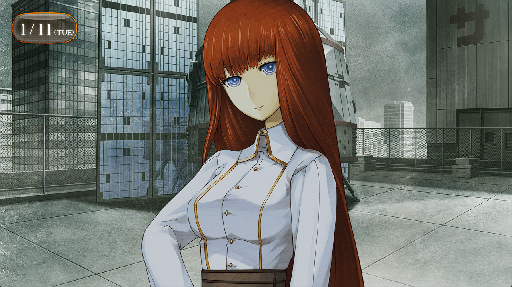
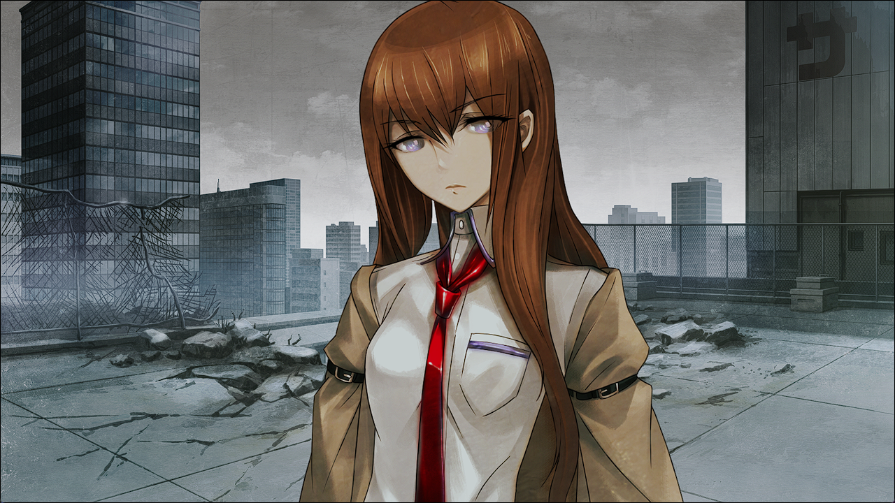
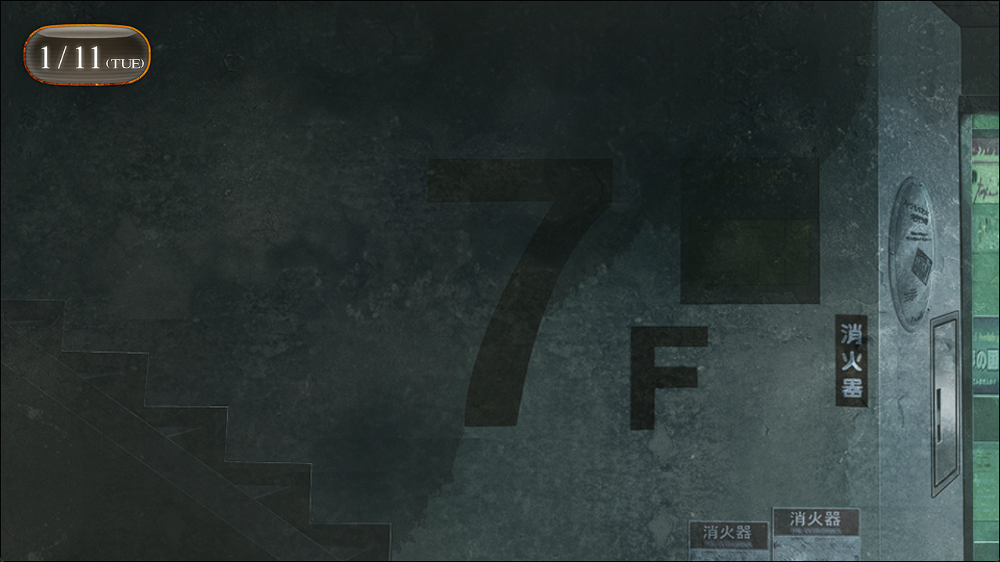
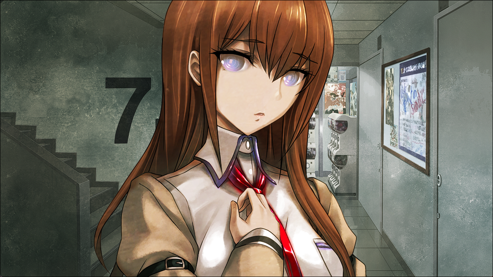
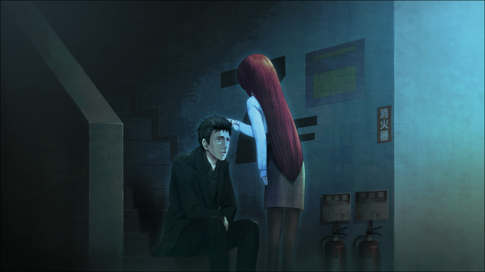
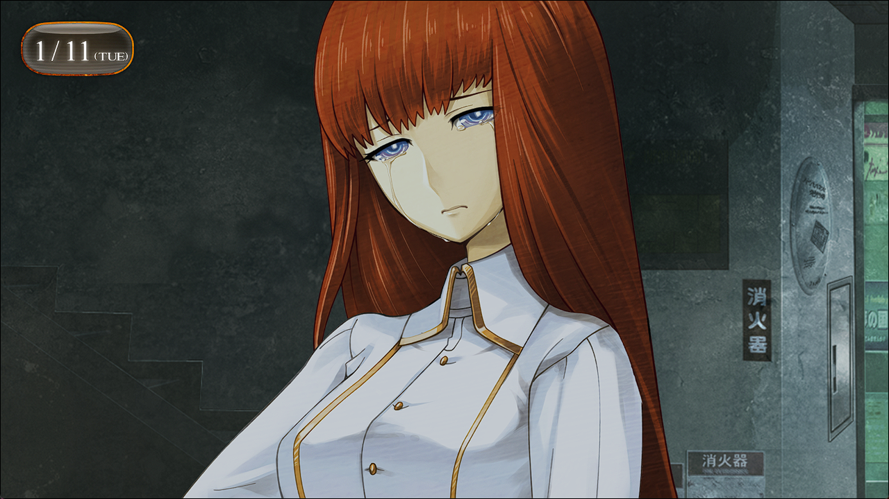

# 二律背反的双模 - 16
> 1.053649  
> [ 2011/01/11] 冈伦给篝讲述了和红莉栖的相遇，痛苦时被篝温柔地安慰。然后篝担心自己会不会变成红莉栖，留着泪表示不想这样不了解自己的经历、不被需要地变成别人。  

楼顶根据菲莉丝，即秋叶留未穗的命令，被紧紧地封锁着，不让除特定人员之外的人进入。虽然我也有这里的钥匙，但是今天才有了初次使用的机会。久违的广播会馆楼顶上，最先映入眼帘的，是一个椭圆的搭乘物——时间机器。  

“哇，好怀念！这个这个！我就是坐着这个来的呢！”  
篝开心地向时间机器跑去。她失去的是和铃羽分开之后的记忆，看样子还记得从未来跳到 1975 年的这里这件事。  
“第一次到这栋大楼的楼顶上的时候，天空很漂亮，我吓了一跳呢。”  
我抬头望向天空，是让人感到遗憾的阴云密布。即便这样，篝仿佛看到的是湛蓝的天空一样，继续说着。  
“我呢，因为讨厌和妈妈分开，一直待在这个机器里面，哭着说着想见妈妈……  
 ‘这样是不行的，不要做个爱哭鬼。’被铃羽姐姐这么说着，但我还是很伤心。  
 那时从打开的舱门看到的外面，是湛蓝的天空。”  
“2036 年的天空不蓝吗？”  
“嗯。因为战争的影响，一直是黑色的昏暗的天空。而且，也没什么机会到外面去。”  
说到二十世纪中叶，差不多是高度发展期结束的时候，那个年代还没有普及现代所谓的环保这一概念，也是大气污染很成问题的时期。说不定，比现在的空气质量还要糟糕。就算这样，她还觉得当时的天空很美，看来未来的大气应该被污染得很严重吧。  
“冈伦，和红莉栖是在这里相遇的吗？”  
“不，不是这里。这里是——”  
“啊……”  
寒冷的雨滴落到鼻尖。  
“下雨了。”  
“啊啊，是啊……”  

“……冈部吗。”  
“还活着啊……”  
“也是啊，忘了在这里会有遇到你的可能性。”  
“你在做什么？”  
“……想事情。”  
“是吗……”  
对了，那时，也下着雨呢。自己和真由理之间存在着要有一个人死去的命运——知道了这些的红莉栖在那一天，在这里，也像这样，抬头看着天空。  

“哇！下、下得好大~！冈伦，到里面——”  
“…………”  
“冈伦？”  
那个时候，那家伙在想些什么呢。把自己的命运交给他人——交给我来决断的那家伙。  
“冈伦真是的！这样下去要感冒的！快点过来！”  
被篝拽着胳膊，像是要摆脱喧嚣的雨声一样，钻进了大楼之中。  

就这样被拽了进来，等我我回过神来的时候——发现自己坐在了这里。不知是不是改建计划的影响，已经没有正在营业的店铺，照明也关闭了，因此光线十分昏暗。  
“哈~吓我一跳。”  
那天，在那场雨之后，我和红莉栖正是在这里，彼此相依促膝长谈。而且同时，这里是——  
“就是这里。”  
“诶？”  
“这是我和红莉栖第一次相遇的场所。”  
严格地说，是和β世界线的红莉栖初次相遇的场所。半年前的那个时候——  

“刚才，有什么想和我说的吗？”  
“刚才指的是什么时候？”  
“差不多 15 分钟之前，招待会开始之前。  
 是有什么想和我说的吧？你一副很悲伤的表情。  
 就好像，马上会哭出来一样，很痛苦的样子。  
 ……为什么？我，之前有和你见过面吗？”  
现在想来，那是一切的开端。要是没有相遇就好了，既然会变得像现在这样的话，要是最初没有相遇，也就不会有这种心情……  

“冈伦……”  
我的头被轻柔地抚摸着。  
“篝……”  
“我害怕的时候，妈妈经常会这么做……”  
“为、什么……”  
“因为，冈伦，显得很痛苦……好像马上要哭出来的样子。”  
按照安抚孩子的方法，篝一次又一次地抚摸着我的头。  
“我和那家伙……和红莉栖，就是在这里相遇的。”  
“这里……是说这个楼梯平台这里？”  
“啊啊……第一印象十分糟糕。  
 明明是初次见面，就用那种居高临下的视线看人，一点都不可爱。  
 不过，对方心里应该也是这么看我的。”  
毕竟那时候的我，机关的特务什么的，净说着这种胡言乱语。  
“但是……尽管如此，红莉栖还是成为了对冈伦来说很重要的人……”  
“……啊啊。”  
这指的是α世界线的红莉栖。在这里相遇的红莉栖，之后……  
“我的脸，和红莉栖很像吧？”  
“……为什么会知道这个？”  
“前……从真帆那里听说的。  
 然后去网上调查了一下，相似到连我自己也大吃一惊。  
 这样的人的记忆存在于我的脑中……这也是命运吗？”  
命运——一如既往，命运嘲笑着我们，玩弄着我们。  
“呐，如果……”  
篝发梢滑下的水滴，滴落到地上。  
“如果，椎名篝的记忆消失了，完全变成红莉栖的记忆的话……  
 那样的话，我，会变成牧濑红莉栖吗？”  
“……不是那么容易就会变成那样的……”  
“但是，我是说如果哦？如果，变成那样的话……  
 冈伦，会开心吗？”  
 我变成红莉栖的话，冈伦会开心吗？”  
这是我否定了无数次的恶魔的耳语。  
“我……”  
我对与这种事——能够说不期望发生吗？  
“但是……我果然还是讨厌啊……”  
泪滴滴落在地上。  
“像这样，不知道自己经历了怎样的人生……不被任何人需要的情况下消失……”  
“篝……”  
“我……到底会变得怎么样……我……我……”  
篝微微地颤抖着。这绝不是因为寒冷。  
“对不……起……”  
“不……”  
她是为了什么而道歉，我不得而知。  
“这样下去要感冒的，差不多该回去了。”  
“嗯……”  

 

> (to be continued)
---

| [←prev](./0108) | [menu](../) | [next→](./0110) |
