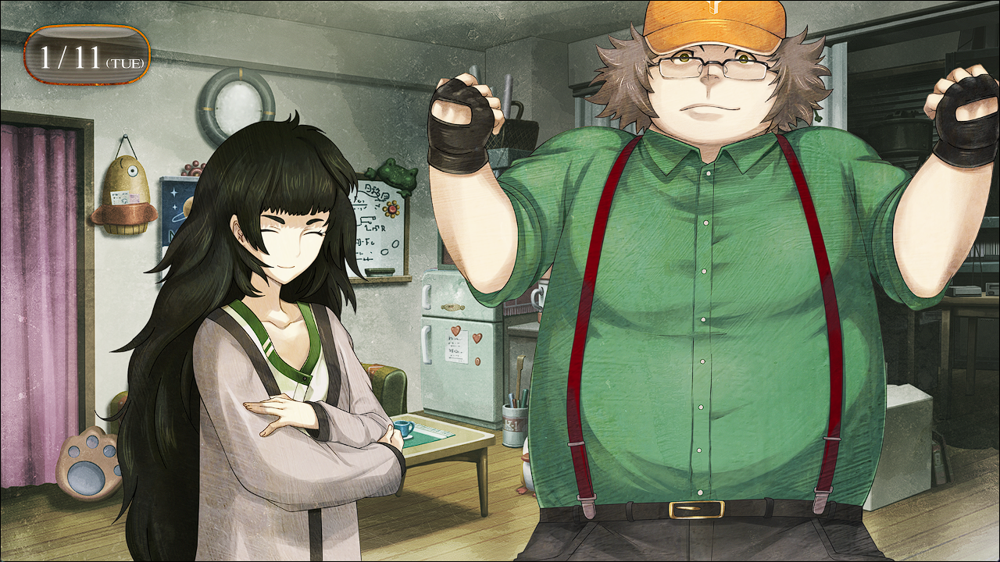

# 二律背反的双模 - 17
> 1.053649  
> [ 2011/01/11] 篝的情况已经恶化到遗忘真由理并晕倒，目前留在柳林神社由真由理和琉华子照顾。回到 LAB，骇入 SERN、制作时间跳跃装置完成。真帆得知酒店房间遭窃，推测目标是红莉栖笔记本电脑和硬盘。  

“总、总之，请先进来。”  
初次进入琉华子的房间……果然很像女孩子的房间。  
“哇，两个人都湿透了……要赶紧换衣服啊~”  
比起从广播会馆回 LAB，往柳林神社走会更省时间。我这样判断，把篝带回了柳林神社。中途因为真由理打电话过来，就先让她来这边了。对于现在的篝来说，比起我，有真由理妈妈在身边，应该会更安心吧。  
“妈妈……”  
果然，看到真由理的脸，篝的表情稍微平静了一点。  
“很冷吧~？”  
“我去烧洗澡水！”  
在给了我们用于擦干雨水的毛巾之后，琉华子赶忙走出了房间。  
“我想和妈妈一起……洗澡……”  
“和真由喜？嗯，好哒~啊，但是，冈伦要怎么办？”  
“我没事，让篝先进去洗吧。”  
“嗯，谢谢。冈伦也别感冒了，就算只是换件衣服也好啊？”  
“那个……我看着办。”  
要从琉华子的父亲那里借衣服吗……？就这样想着，我在把篝拜托给真由理之后准备起身——  
“篝……酱？”  
“…………”  
“怎么了，篝酱？”  
篝的样子变得很奇怪，她一脸不可思议地看着真由理的脸。  
“篝？”  
“……谁？”  
“诶？”  
“你是……谁……？”  
“……真由喜啊，篝酱。”  
“篝……我的……名字……？”  
“篝……”  
“不……对……我……我是……谁……？我是谁？我是……！  
 唔……哇哇啊……啊啊啊啊啊啊啊！！”  
篝拼命抓着头发，发出了仿佛来自地狱般凄厉的叫声。  
“振作点，篝！”  
“啊啊啊啊啊！好痛……好痛好痛好痛好痛！  
 好痛……好痛啊妈妈……救救我……爸爸……救救我……！  
 谁来……救救我……救救我啊……  
 谁……来……救救……我……”  
“篝酱！”  
简直就像断了线的人偶，篝应该是耗尽了全身的力气，就这样倒了下去——  

离开琉华子家的时候，雨已经停了。在那之后，稍微观望了一下状况，但是篝并没有醒来。因为睡着的样子还算安定，所以这里暂时就拜托给真由理他们，我则赶回了 LAB。根据真由理和琉华子所说，篝迄今为止好像有过数次意识混乱的情况，但是像这次一样严重的还是第一次。说不定我们考虑得太简单了，或许她的大脑已经承载了太多的负担了，一定要尽快找出解决对策。但是，为此——  

“成了————！”  
“成功了！！”  
打开 LAB 房门的时候，桶子和真帆两人的欢呼响彻屋内。  

“真、真的吗！？”  
我连鞋都没脱就冲了进去。  
“哦！冈伦，来的正好！”  
“冈部，浑身湿透了呀！”  
“这种事怎样都好！比起这个……搞定了吗！？”  
“呣哼！”  
桶子坚定地竖起了大拇指。  
“干得好，桶子！”  
“我可是超级黑客 daze！这种东西小事一桩。”  
虽然被轻描淡写地带过了，但是黑进 SERN 需要多少能力和精力，这点我十分清楚。普通的黑客可做不到，超级黑客可不是浪得虚名。  
“比屋定怎么样！？也完成了！？”  
“对我来说，这种程度的东西不成问题。”  
真帆和桶子一样，竖起了大拇指。  
“真不愧是你们……”  
“嘛，虽然这一切都是从你和篝那里得到的情报。  
 这种意义上来说，篝体内留下的红莉栖的记忆帮了大忙呢。”  
“不，就算这样，这还是依靠比屋定的实力才得以完成的。”  
“谢谢，这句话我就坦率地收下了。  
 剩下的就是到底能不能实际运行的问题了……但是这一点没有办法测试呢，”  
“是啊。”  
“你要在厨房次郎请客三回哦。”  
这种要求小事一桩。总之，这样条件就集齐了。剩下的就是，调查清楚那群人的身份。但这才最头疼的问题。  

“呼……那么，我就去稍微休息一下了，实在是有点累——”  
像是要盖过真帆的声音一般，她的手机铃声响了。  
“真是的，谁啊，在我要准备睡觉的时候……  
 喂，你好……”  
真帆一边抱怨着一边拿起手机往开发室里面走去。  
“那么，篝碳那边的状况怎么样了？”  
“关于这个……”  
在开口的同时，我收到了 RINE 的信息。  
『篝醒了，现在安定下来了。』  
「了解了。不好意思，暂时帮我看一下状况，有什么事就立刻联系我。」
收到琉华子的联络让我松了一口气，之后我便立刻回复了他，然后继续跟桶子介绍情况。  
“实际上并不是太好，今天把真由理的事情也给忘了。”  
“真的假的……？”  
“并不只是这样，之后，还因为剧烈的头痛而失去了意识。”  
“这，不是很糟糕吗？”  
“的确不妙。再不做点什么的话……”  
关键的“敌人”身份未明的情况下什么也做不了。  

“诶诶！？真的吗！？”  
突然，开发室里面传来真帆的惊呼，我和桶子对视了一眼。  
“真帆碳，怎么了？”  
“发生什么了吗！？”  
真帆看向正在窥探情况的我们，一脸呆然地说到。”  
“说是遭窃了……我暂住的……酒店的房间……”  
电话是酒店打过来的，真帆所住的和光市的商务酒店。在这几天没有她回酒店的时间里，那个房间似乎被什么人搜刮过了。暂放在酒店那里的房卡没有被使用，门上有撬锁留下的痕迹，刚刚才的电话是为了征求本人的同意，开始房间的调查。  
“然后呢？知道详细情况了吗？”  
“刚刚联系了警察，说是为了核查有什么东西被偷了，要我快点回去之类的。”  
“那、那就是还不知道有什么东西被偷了？难难难、难道是内衣什么的！？”  
“这些东西全都带过来了啊！要我以性骚扰的罪名起诉你吗？”  
“噫，饶了我吧。”  
“嘛，如果乐观考虑，我的房间本来就很乱，也有错看成被盗的可能性呢。  
 虽然锁被撬开了，有人进去过这件事……是不会有错的。  
 其实，就在不久前，办公室那边也遭窃了。”  
“那么，并不是单纯的偶然啊。有人，在找比屋定拥有的什么东西。”  
“是呢。至于在找什么东西我已经有头绪了。”  
“是什么？”  
“……红莉栖的笔记本电脑和硬盘。”  
“那个啊……”  
综合至今为止的所有事情考虑，这个可能性是最高的。在篝脑里植入红莉栖记忆的那群人，和在之前的世界线带走篝的应该是同一群人。这些家伙的目的，是**红莉栖脑中的时间机器理论**。但是，可能是因为针对篝的实验进行得仍然不怎么顺利，甚至失去了篝，那群人又盯上了红莉栖的另一个遗物——真帆拥有的**笔记本电脑和硬盘**。但是，如果这是他们的目标的话……难道，东西已经到他们手上了吗！？”  
“话说，那个笔记本电脑，是之前真帆碳托付给我的那个？”  
“什么？”  
“其实，因为我无论如何都想破解密码，刚好要在这里住下，就拜托给桥田先生了。”  
“那这么说，笔记本电脑……”  
“没事哟。对吧？”  
“当然，现在在我的秘密基地里呢。  
 不过，最近一直都奋斗于骇入 SERN 的事，还没有开始解析密码呢。”  
听到这话我安心了。如果能通过这件事，弄清楚闯入真帆房间进行偷窃的是谁就好了……但是应该不会轻易如愿吧。但是，已经开始如此行事，可以肯定，那群家伙现在很焦急。下次究竟会用什么手段呢……等一下——  
“……说不定，可以利用这一点。”  
“利用……？”  
我没有回答他们的疑问，而是用手机联系了某人。  

 

> (to be continued)
---

| [←prev](./0109) | [menu](../) | [next→](./0111) |
