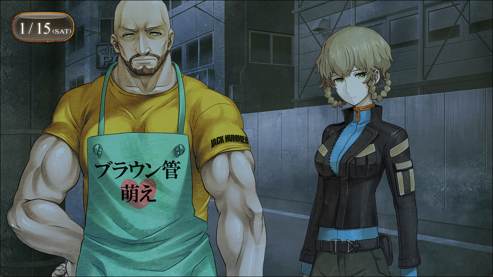

# 二律背反的双模 - 18
> 1.053649  
> [ 2011/01/15 ] 冈伦联系天王寺和铃羽设下埋伏，成功抓住在找篝的人。得知其来自 STRATFO，安排桶子骇入。  

过去了数天——篝的身体状况日趋恶化。  

清脆的脚步声，回荡在秋叶原夜晚的黑暗中。白天热闹的家电贩卖场、响彻着尖叫声的演唱会厅、咖啡店，到了晚上就都悄无声息了，取而代之的是一片静籁。在其中，有一个脚步声打着恒定的节拍，慢慢地前进着。脚步声的主人是一名女性。在昏暗之中看不清身影，但是她的行动明显有些奇怪。她用帽子遮住眼睛，避人耳目似地走着，就好像在躲避什么人，像是被什么人追着一样。然后，女性的身影走到转角处，突然冒出了一群人。女人吃惊地停下脚步，但是，在她的身后不知道什么时候也出现了一群男人的身影。  

“你是椎名篝吧……”  
其中一个男人发问道。虽然说着流畅的日语，但是仔细听应该还是能听出一些外国口音。  
“…………”  
被男人们包围的女性，只是站在那里呆然不动。其中一个男人想着，这次的工作真是轻松。只是要把这么一名柔弱的女性带回去罢了，犯不着动用这么多人。不只他一个人，几乎是在场的全员都这么认为。  
“如果你老实点，就不会对你动粗。”  
像是配合着这句话，男人构成的包围圈又进一步缩小了。女人只是一脸胆怯，没有要抵抗的样子。毫不费力——一个男人露出笑容，把手伸过去的瞬间——  
“哦哦哦哦哦哦哦哦！！”  
发出像是要撕裂空气般的叫声，男人捂住了自己伸出去的那只手蹲在了地上。三条跟香肠差不多的物体在地面上滚动着。  
“嘎！”  
在意识到那是男人的手指之前，这次是另一个的男人，脸上吃了一记踢击倒在了地上。之前还悠闲自得的男人们现在变得凶狠了起来。  
“*You fuckin’ bitch!!*”  
嘴上咒骂着一同向女性扑了过去。但是——  
“嘎啊啊啊啊啊啊！”  
正要从女人背后袭击的那群男人，发出了巨大的悲鸣。  
“喂喂，安静点啊。要是动静闹得太大，对你们不也是个麻烦吗？”  
一位魁梧的男人从黑暗中现身，背对着月光，用冰冷的声音说着。  

“好厉害……”  
看着他把那群身强力壮的男人们一个个击倒，我只能发出这样的感叹。天王寺的强大从他那魁梧的体格就可以体现，需要着重强调的是另一个人。铃羽不知何时解除了变装，随着如猫般灵巧的动作，男人们一个个都蹲在了地上。虽然知道铃羽受过战斗训练，没想到她认真起来，会强到这种地步。特别是那双修长的双腿的踢击，看上去就像是艺术一样。  
“有一手啊，打工的。”  
“店长也是呢。”  
连拔刀掏枪都没来得及，男人们就倒在了地上。  

几天前——察觉出那群人的焦急心态，我想出了一个点子。在之前的世界线里萌郁说过，有什么人在搜索篝。说不定，在这条世界线上也是这样——所以我拜托萌郁，让她把消息放出去。“一名疑似椎名篝的人物，每天都会在差不多这个时间，从这条路走过”——这样的消息。数天后的现在，这群人完美地咬住了我们准备好的饵。我一个人躲在这小路的角落，没面子地看着铃羽他们战斗。但是，我就算出去了也派不上用场，反倒会碍手碍脚，交给那两个人处理才是正确的判断。  
“你那边怎么样了？”  
耳机里传来了桶子的声音。为了能随时联系，我把手机保持在了通话状态。  
“铃羽不要紧吧？有没有受伤？”  
铃羽提出担任诱饵这件事，桶子到最后还是坚决反对。果然还是担心女儿遇到危险吧。  
“不用担心，你的女儿比你想象的还要强好多。”  
“那是，谁让她是我女儿呢。但是，要是她受伤了，冈伦，我恨你一辈子。”  
需要担心的，是对面那群家伙。  
“！？”  
突然，附近响起了一声尖锐的口哨。随着这个信号，男人们四散而逃。那群家伙意识到是陷阱，一起开始逃跑了。  
“哎呀，想得美。”  
天王寺如圆木般粗壮的手臂抓住了一个男人的手。但是——  
“嘎——”  
在听到清脆的破裂音的瞬间，被抓住的男人全身失去了力气。  
“切——！”  
怎么会……死了——？居然，自尽……  
“叔叔，那边！”  
铃羽的声音让我回过神来。其中一个逃走的人，向着我所在的小路这里赶来。我们的目的是抓住他们，让他们招认自己的身份。这样下去，好不容易抓住的线索就要没了！于是我拼尽全力，跳到男人面前。他看到突然出现的我，出现了一瞬间的犹豫。但是，他没有减速，继续向这边突进。他的腰间附近，有什么发光的东西。  
“咕——！”  
“哈啊！！”  
在我和他撞到一起的同时，赶来的铃羽用一记飞踢制服了男人。  
“嘎——！”  
“哦哟！”  
天王寺等在被全力一击踢飞的男人面前，轻松地接住了男人的身体，为了防止男人自杀而用行云流水的动作固定住男人的双臂。  
“叔叔，没有受伤吧？”  
“呼……！”  
“没事吧！？”  
“没、没什么……”  
“冈伦！怎么了！？发生什么了？”  
“别担心……这边全员安全。比起这个铃羽，那家伙呢！？”  
被天王寺固定住的男人的嘴里，传来了一阵呜咽。不知什么时候，他的嘴里被塞进了毛巾一类的东西，应该是为了防止他像刚才那个家伙一样自尽的对策吧。  
“喂喂，别乱动啊。弄出骚乱来有麻烦的是你们吧。  
 何况不过才第一根手指而已，真不像话。还有九根哦？”  
“呜，呼……呼……”  
“手指用完了还有眼睛，之后还有双耳和鼻子……可以享受的地方还多着呢。”  
冷酷的声音。这才是，真正的天王寺裕吾——FB 的姿态。面对让人不由得想背过视线的状况，铃羽面不改色地看着。  
“我也不想做这些麻烦事啊。反正早晚要说的，早点说的话我觉得对双方都有好处啊？”  
“呜呜呜呜呜！！！！”  
“嗯？怎么样，要再来一根吗？”  
“唔！唔！！”  
男人拼命地左右摇着头。  
“早这样不就行了嘛。那么，你们的老大是谁？”  
“…………”  
男人嘴里的毛巾被取出，用几乎听不到的声音在天王寺耳边说着。中途，天王寺脸色骤变。  
“……STRATFO？喂，你没开玩笑吧？”  
男人再次拼命地摇头。  
“STRATFO 吗……又是个麻烦的家伙……”  
STRATFO……我听说过。中二病时期，在网上调查过。”  
“正式名称【<abbr title="neta 自现实中的 Strategic Forecasting Inc.">*Strategic·Focus*</abbr>】，被称为“影之 CIA”，是美国的民间情报组织。特别强化了军事相关的能力，在海湾战争和伊拉克战争中，听说发挥了不少的作用。会被 SERN 的 Rounder 天王寺如此评价，想必不会是简单的对手。但是……现在不是胆小的时候。  
“听到了吗，桶子！现在立刻骇进 STRATFO！”  
“*Okey-dokey!*”  
姑且算是达成了目的，全身快要脱力了。但是，还不能这样。接下来才是重头戏。  
“……”  
“怎么了，店长，有什么在意的地方吗？”  
“不，STRATFO 可是民间机构啊。换句话说，是为了金钱而受雇佣的家伙。  
 这样的家伙，就算被抓住，至于要自杀吗？”  
这么一说还真是有些奇怪。  
“喂，你，真的是——！”  
天王寺又一次拽起了男人的衣领。  
“切！失去意识了，没种的家伙。”  
无可奈何的天王寺，只好拿出绳子准备把男人绑起来。  
“收尾工作就交给我，你们快去吧。”  
“可以……吗？”  
“这事还没结束吧？”  
“嗯……我明白了。之后的事情就拜托您了！”  
虽然在意之后他会怎么处理这群人……但比起这个还有更优先要做的事情。  
我向天王寺道谢过后，和铃羽一同向 LAB 赶去。  

“呜……”  
“叔叔，快点！”  
“知、知道了！”  
我拼命地追赶，在深夜的街道上如猎豹般驰骋的铃羽的背影。平时很快就能赶到 LAB 的道路，这次觉得特别的漫长。  

 

> (to be continued)
---

| [←prev](./0110) | [menu](../) | [next→](./0112) |
