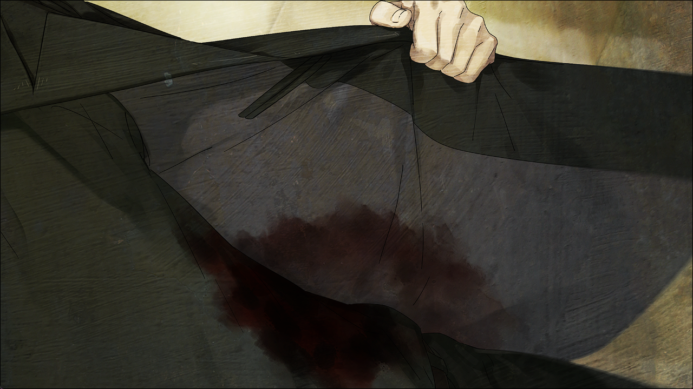
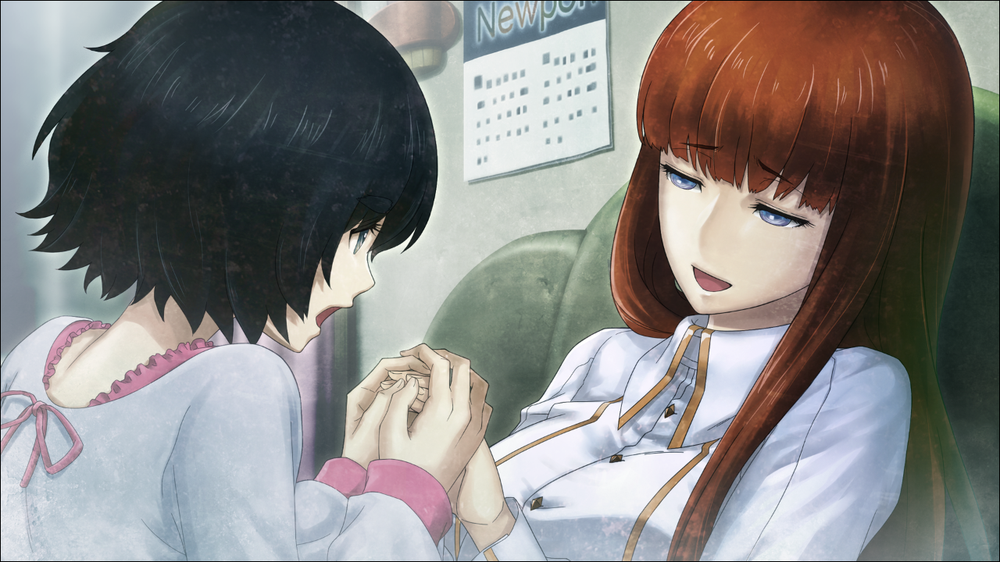
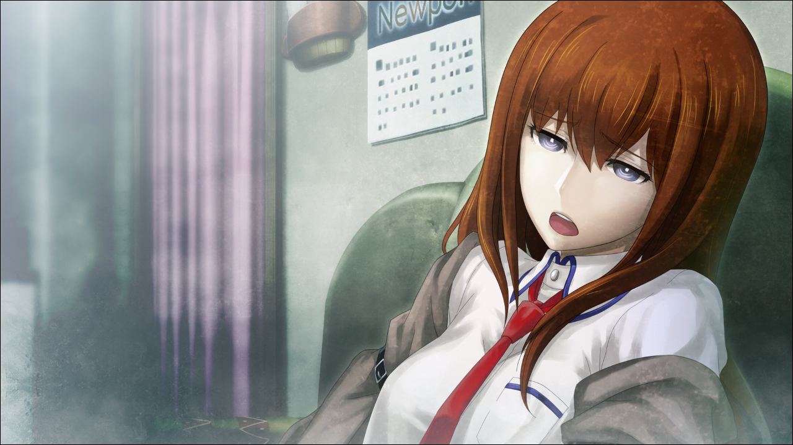
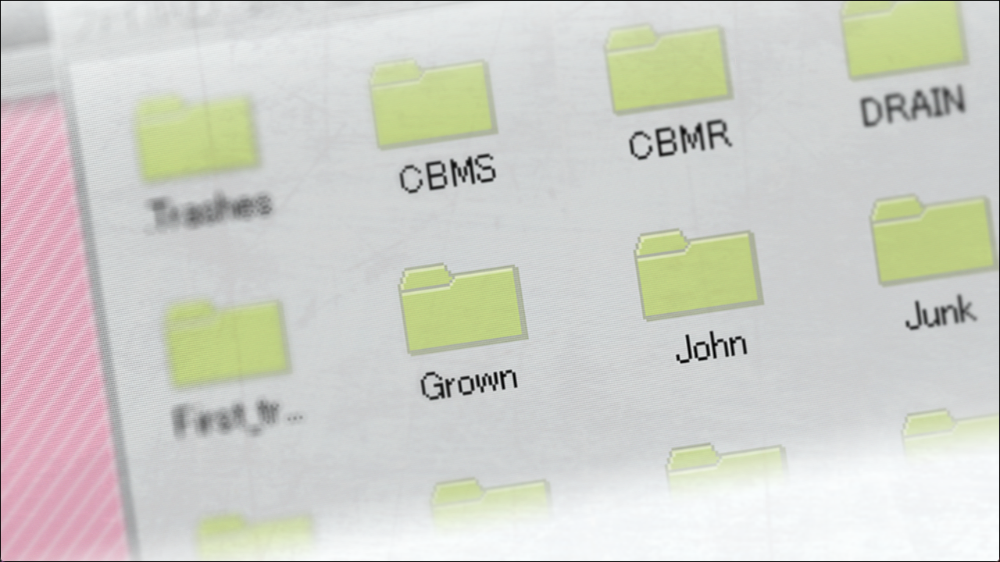
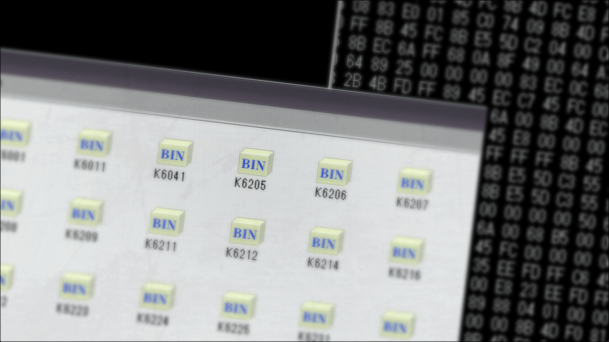

# 二律背反的双模 - 19
> 1.053649  
> [ 2011/01/15 ] LAB 被包围，篝的身体濒临崩溃，情况千钧一发。桶子骇入 STRATFO 成功得到篝的记忆。P4：是否接听电话覆盖篝的记忆？  

| [←prev](./0111) | [menu](../) | [拒绝接听→](./0113) |  
|                 |             | [接听电话→](./0123) |

---

好不容易赶到了 LAB，真由理和菲莉丝她们全员都在。篝也在……痛苦地喘着粗气，精疲力尽地靠在沙发上。呼吸紊乱，脸色糟糕，感觉随时会撑不住的样子。  
“桶子……怎么样了？”  
“稍微等一下。因为有以前骇进去时留下的路线，现在正在找。”  
“之前……你、做过这么危险的事情吗！？”  
“稍微和朋友打了个赌，比谁能更快骇进去，赌资是一年的 GOGO 咖喱。”  
这家伙……做事真是不怕危险。  
“啊咧？不问问哪边赢了吗？”  
看这态度，不用问也知道结果了吧。  
“总之，快点。”  
“遵命！”  
这次篝的夺回作战失败而终，STRATFO 进一步采取强硬手段的可能性很高。没时间在这里浪费，而且——  
“——呜。”  
“冈伦？脸色，很差啊？”  
“不，没什么……”  
“哪里是没什么喵，让我看看喵！”  
菲莉丝半强硬地脱下了我的外套。  

“……好严重的伤喵！”  
“冈部先生……血……”  
“冈伦……！”  
虽然试着不让别人看见，但是超出预期的出血量把衬衫的侧腹附近都染黑了。刚才阻止那个男人的时候，被摆了一道。  
“……没事的。”  
“怎么会没事喵！琉华喵，准备急救用品！”  
“是！！”  
“我没事的……真由理，比起这个……篝怎么样……？”  
“……哈啊……”  
“啊，篝酱！？振作点！”  
篝瘫坐在沙发上，重复着急促短浅的呼吸。在这几天，她已经变得非常虚弱了。她的手游移在半空——  
“妈妈……妈妈，你在哪？”  
“妈妈在这里哟，好好地在你身边哟。”  
真由理紧紧地握住她的手之后，篝终于露出了虚无缥缈的笑容。  

“呐……妈妈……我会就这样……消失吗……？”  
“不会的。冈伦和桶子君一定会想办法的”  
“冈……伦……？”  
“是的，冈伦……认得的吧？”  
“冈伦……”  
篝虚无的眼神看向了我。  
“不用担心。再过一会……再过一会，一切都会恢复原状了。”  
“……冈……部……”  
“嗯？”  
“把我……消除掉……”  
“篝……”  
不对。  
“从她的体内……把我消除掉……  
 再这样下去……她会……”  
这是红莉栖在说话。人格和记忆不同，不能因为有红莉栖的记忆，就说篝体内有红莉栖的人格。但是……  
“拜托了……冈部……  
 把我……消除掉……！”  
这的确是红莉栖的话语，至少我是这么认为的。那个时候，那家伙说过——救救真由理。牺牲真由理而让自己活下来，她做不到。说不定，红莉栖的记忆会在篝体内安定下来，是有这种可能性的。但是就算这样，那家伙还是这么选择了。把自己从这身体里消除，自己从这里消失。篝嘴里说出的话，是因为有红莉栖的记忆，造就了她的人格所说的话吗，这我不清楚，但是可以肯定，这的确是红莉栖的话语。  
“呜……！”  
现在那家伙是“记忆”这种没有形体的存在。但是——为什么？为什么在只剩下记忆的现在，还不得不这么痛苦呢？非要折磨她吗？
“对不起啊……冈部……”  
从她微闭的眼睛里，透明的泪滴滑落脸颊。  

“桶子……还没好吗……？！”  
红莉栖！压抑住想要这么叫的冲动，我几乎要向桶子吼了出来。  
“等一下……快了，就快了……！”  
“不妙啊，叔叔……”  
铃羽正窥探窗外的状况。  
“1、2……3……好多人聚集过来了……是 STRATFO。”  
“——桶子！”  
“好了，来吧，来吧，来吧！”  
焦急的心情不断地加剧着。还没好吗？还没好吗！  
“好啦！！”  
“桶子！？”  
“好，好了，来了来了来了！！Bingo！！！”  
我制止了拿着医疗用品赶过来的琉华子她们，看向了电脑屏幕。桶子另一侧，真帆也把身子探过来。  

“从看起来重要的文件中，选择体积大的！”  
“等一下……体积大的……那个，嗯？难道是这个？但是文件名是‘John’……”  
“莫扎特的洗礼名是 *Joannes*！肯定就是这个！”  
“虽然不明白，不过 ok。但是，里面文件好多……”  
“让我看看！”  

文件夹之中，有许多用号码命名的文件。  
“文件增加了……在我们进行的研究阶段，还没有这么多……”  
也就是说，在研究冻结之后，这些资料以什么形式移交到了 STRATFO 手里，又多次进行了验证实验。  
“这里面应该有一个就是篝的记忆数据……”  
真帆还在努力辨认究竟哪个才是篝的记忆，我却一瞬间想到了——
“是 K6205……”  
“诶？”  
“K6205 就是篝的记忆，桶子！”  
克歇尔编号 K620——魔笛。  
“K62……有了，这个！”  
“接下来的步骤，就跟之前说的一样，拜托了！”  
做法，相比于红莉栖的时间跳跃装置更为简单。因为已经有记忆数据了，所以不需要扫描用的 VR 耳机，也不需要电话微波炉（暂定）。只要单纯地把篝的记忆输进解码程序，由 SERN 的 LHC 压缩，再将压缩完成的数据转送回来，接着传到手机上——  
“快点！完全被包围了！！”  
“桶子，准备好了吗！？”  
“没问题！”  
“好，开始！”  
“等一下！！”  
我抬起头，真帆脸色铁青地看着画面。  
“……怎么了，比屋定……”  
“……能够顺利吗？如果失败的话，篝会——！”  
跨过桶子的后背，我把手搭在真帆肩上。  
“没问题。我保证……”  
“冈部……”  
“叔叔！！”  
“篝……！”  
我离开电脑那里，走到了瘫坐在沙发上的篝的面前。  
“冈部……？”  
“准备好了吗？”  
“嗯……”  
永别了，红莉栖——  

“他们来了！”  
“桶子！”  
“了解！”  
登上楼梯的脚步声，手机的铃声，各种声音交错着。  
“那个，冈部……”  
最后，沙发上的少女她说——  
“我……可能，对冈部……对你……”  
这是红莉栖说的，还是篝说的——？不知道答案，话语的后续消失在破门声和怒号声中——  

我就这样拿着手机，死死盯着来点界面上一红一绿的两个按钮。  

 

> (to be continued)
---

| [←prev](./0111) | [menu](../) | [拒绝接听→](./0113) |  
|                 |             | [接听电话→](./0123) |
