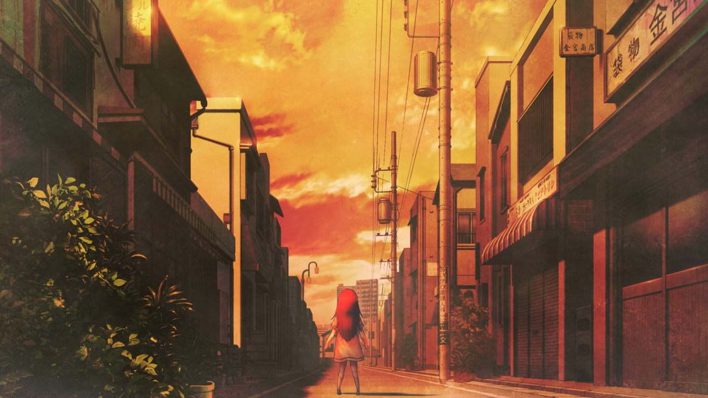

# 相互回归的鹅妈妈 - 02
> 1.064756  
> [ 2011/01/15 ] 《星之奏》或成为篝记忆恢复的关键，于是众人开始溯源。目前的链条：篝 <- 真由理。  

| [←prev](./0113) | [menu](../) | [next→](./0115) |

---

[ 2032 ]

*♪\~有个要寻找的东西\~♪*  
*♪\~星星在对我笑眯眯\~♪*  
*♪\~随着风眼睛眨呀眨\~♪*  
*♪\~伸出手的话就能够抓到哟\~♪*  

“妈妈。”  
“怎么了，篝酱？”  
“这是什么歌？”  
“诶嘿嘿\~这个啊，很重要的歌哦。”  
“是什么样的歌呢？”  
“嗯\~是那种让哭泣的人找回笑容的歌吧。”  
“让哭泣的人找回笑容，很重要吗？”  
“这也很重要，不过不只是因为这个呢。  
 因为这首歌，把妈妈和篝酱联系在了一起。  
 因为这首歌，我们才能相遇。”  
“没有这首歌的话，妈妈就可能不是篝的妈妈了吗？  
 我不要那样……”  
“啊，对不起对不起，不是这个意思啦。  
 不管发生了什么，妈妈都是篝酱的妈妈哦。  
 但是妈妈呢……希望篝酱能记住这首歌呢。  
 为了某一天，篝酱和重要的人相遇的时候，  
 在那个人哭泣的时候，能让那个人找回笑容。  
 那么，我们一起来唱吧？  
 *♪\~有个要寻找的东西\~♪*  
 *♪\~星星在对我笑眯眯\~♪* ”  
“*♪\~有个要寻找的东西\~♪*  
 *♪\~星星在对我笑眯眯\~♪* ”  
“嗯，真棒真棒！接下来是……”  

“妈妈……  
 妈妈，在哪里？  
 你在哪里？呐，妈妈？妈妈？  
 妈妈……？  
 不——  
 不要……！  
 不要走……！  
 妈妈！”  

---  
[ 2011/01/15 ]

我在厨房把毛巾润湿后，拿来放在躺在沙发的篝的额头上。篝好像在做噩梦，一直在痛苦地喘着气，意识还未恢复。  
“唔……”  
“她没事吧？”  
“谁知道呢……”  
毕竟，她突然倒下……不过是 5 分钟前，才刚到达这里的时候。我和桶子、真由理慌慌张张地把她抬到沙发上睡下。  
“话说，用湿毛巾敷在额头上，是用来应对高烧晕倒的症状吧。  
 篝碳看起来并没有在发烧啊？  
 这对于失去意识的人也有效果吗？”  
“没办法啊，因为我也不知道有什么其他能做的。”  
以我和桶子的知识，不知道这种情况下该做什么比较好。而且，没有保险证和居住证的篝，带去医院也会很麻烦。现在除了等篝醒来，其他什么都做不了。  
“……妈妈。”  
听起来，篝嘴里好像正在嘟囔着什么。  
“刚刚，听到她在叫妈妈。”  
我和桶子把耳朵靠近了篝的嘴边。  
“不……别走……妈妈……！”  
突然，篝“啪”的一下子坐了起来。我们千钧一发地躲开了一记头槌。  
“好、好险啊……  
 啊！不对！我错过了吃篝碳豆腐的好机会！  
 笨蛋！我真是笨蛋！”  
放着后悔得“咚咚”敲着地板的桶子不管，我对着篝问道。  
“没事吧？”  
“……冈部先生？”  
篝呆愣愣地看着我，然后注意到了自己正躺在沙发上。  
“诶？我，睡着了吗？为什么？”  
“不记得了吗？”  
“你刚到 LAB，一看见真由喜就失去意识了哦。”  
“真由理小姐……？”  
篝带着迷茫的表情小声念着，我发现她的语气和世界线变动之前相比有所变化。与其说变化，不如说是恢复恢复成第一次遇到的篝。  
“你好像听过真由理哼的那首歌。”  
“歌……？……啊！对的！那首歌！我听过那首歌！  
 我在哪里听过那首歌！很久很久以前，我还是孩子的时候！”  
“啊，出现了！这难道就是记忆恢复的 Flag 吗？！”  
“真由理小姐呢！？ 真由理小姐在哪里？  
 我必须向她问清楚那首歌的事情！”  
篝着急地在 LAB 四处张望。  
“真由理要去 *MayQueen* 打工，你来之后她就出去了。”  
“她也很担心篝碳的情况哦。”  
真由理由于之前就被拜托了，今天要在午餐时段打工，不得不离开，一脸歉意地将篝托付给了我跟桶子，然后依依不舍地离开了。  
“这样啊……”  
“除此之外，你还想起其他什么事情吗？什么都可以。”  
“其他的……”  
篝把手按在额头上，努力思考着。  
“那个……”  
但是最终，还是无力地摇了摇头。  
“……不行，其他什么都没想起。  
 我只能确定自己听过那首歌，但是具体从谁那里听到的，完全想不起来……”  
“篝碳，你刚刚失去意识的时候，有没有梦见什么？”  
“梦吗？”  
“嗯，你那时做了噩梦的样子，还喊了‘妈妈’。”  
“啊，你刚醒来的时候也喊了。”  
“我……做过这种事……？”  
“所以我们在想，那首歌是不是作为线索，唤起了你的什么记忆？”  
“那个……不行，想不起来。  
 虽然感觉确实梦见了什么，也感觉是很重要的梦……”  
“这样啊。”  
“对不起……给你们添麻烦了……”  
虽说如此，我和桶子知道，这已经是很大的进步了。真由理听过的歌，篝也听过。篝说是小时候听到这首歌的，也就是说，是在未来，是乘时间机器跳跃到过去之前的，未来。那么答案只有一个——教会篝这首歌的，是未来的真由理。  
“冈伦，先去问问真由喜怎么样？”  
“是啊。她说过，打工只是在午餐时段，算好时间去 *MayQueen* 一趟吧。”  
“我，我也要去！”  
篝刷地一下从沙发站起来。  
“别着急，也不是现在马上就去，你再稍微休息一下比较好。”  
“啊，也是呢……对不起。”  
说完，篝的肚子传来咕咕地动静。  
“啊……”  
“肚子饿了吗？这里还有杯面。”  
“还有真由喜买来的炸鸡块和香蕉哦。”  
“那个……请给我香蕉吧。”  
篝害羞地说道。  

 

> (to be continued)
---

| [←prev](./0113) | [menu](../) | [next→](./0115) |
