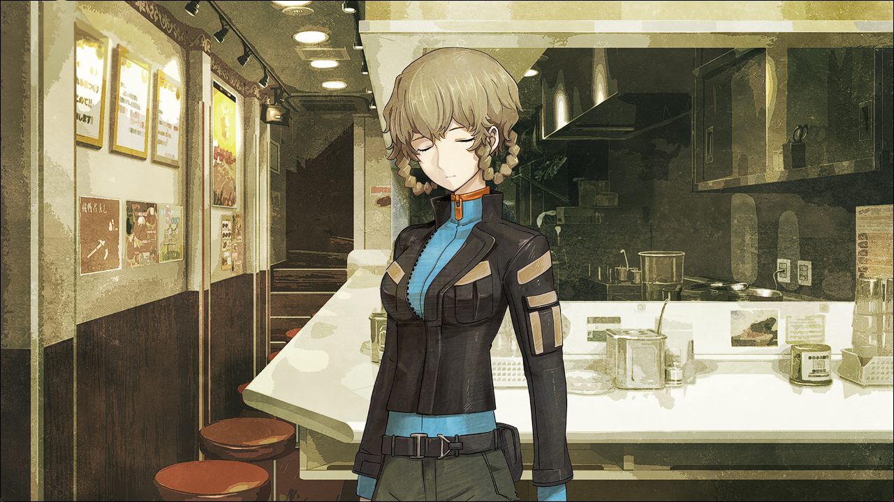

# 相互回归的鹅妈妈 - 03
> 1.064756  
> [ 2011/01/15 ] 去 MayQueen 找真由理，得知是从铃羽那听来的；铃羽参加 GOGO 咖喱大胃王夺冠，表示是小时候从由季那里听来的。目前的链条：篝 <- 真由理 <- 铃羽 <- 由季。  

| [←prev](./0114) | [menu](../) | [next→](./0116) |

---

“主人，欢迎回来喵。”  
一进入 *MayQueen+Nyan²*，熟悉的猫耳女仆就笑着迎上来。  
“啊，冈伦\~！篝喵，也欢迎回来喵。”  
“你好，菲莉丝小姐。”  
“呜喵……冈伦最近每次来都带着不同的女孩子一起喵……  
 原来传闻是真的喵，你已经获得究极奥义——汇聚现充大学生气场的能力了喵！”  
“才不是。我们是来接真由理的，差不多是打工结束的时间了吧。”  
“真由喜今天只负责厨房喵。”  
“厨房……！”  
“今天午餐时段的女仆人数不够了喵……所以这个时段会让真由喜帮帮忙喵。”  
“那、那个……让真由理做料理真的没问题吗？”  
“虽然她本人很想做，但基本上就是让她洗洗盘子喵。”  
不愧是菲莉丝，很懂得该让什么人做什么事。  
“已经可以下班了，现在是换衣服的时间喵。”  
“那就麻烦你跟她说一下，我们在外面等她。”  
“明白喵！”  

在下面等了一会儿，真由理就出来了。  
“冈伦！篝小姐！不好意思呢\~让你们来接我\~篝小姐，你没事吧？”  
真由理刚出来就一把拉过篝，一脸担心地看着她。  
“谢谢你，真由理小姐。我已经没事了。”  
“太好了\~。你刚刚‘啪’的一下就倒下了，吓了我一跳哦\~”  
“让你担心了，不好意思。”  
“但是，为什么你们俩会过来接我呢\~？”  
“因为有些事情想问你，关于你之前哼的歌。”  
我把在 LAB 和篝聊过的事情，对真由理重复了一遍。  
“情况就是这样，所以想知道，你从哪里学会这首歌的。”  
“那个呢，真由喜是从铃小姐那里听到的。”  
“铃羽？”  
“嗯。”  
“真由喜在打工结束后，经常在 LAB 学习。  
 每当下雨天，铃小姐就会在房间里锻炼，仰卧起坐、俯卧撑什么的。  
 然后呢，锻炼结束之后，铃小姐就会去洗澡。  
 洗完澡出来，她总是一边吹头发，一边看着窗外的雨。  
 那时候，她总是会小声哼着这首歌。  
 不过我还没问过铃小姐这是什么歌呢。”  
“……原来如此。”  
既然这样，说不定这首歌是未来的歌，比方说是 2030 年代的人群中流行的歌曲。说不定，篝是和铃羽在同样的情况下听到的。  
“这样的话，接下来去找铃羽如何？”  
“是的呢。”  
“都走到这一步了，就让我奉陪到底吧。”  
“真的吗？非常感谢！”  
虽然在这条世界线，我和铃羽的关系应该一样尴尬，但是为了取回篝的记忆，她应该会来协助吧。  
“那就再回去一次吧。铃羽现在应该在显像管工房看店。”  
“真由喜也一起去。”  
“真由理小姐，方便吗？”  
“嗯！”  
真由理在很有精神地回答后，奇怪地变得有些害羞，开始扭捏起来。  
“那个、那个……不知道该怎么说……  
 我看着篝小姐，就有种一定要为你做点什么的感觉。  
 想保护你啦，想帮助你啦，这样的感觉。  
 这是怎么了呢？好不可思议啊，诶嘿嘿\~”  
这就是母亲和孩子之间的羁绊吧。虽然真由理成为篝的母亲这件事，还要在很久以后。  
“而且呢，没有回忆的话，觉得好孤单……”  
“真由理小姐……非常感谢。”  
“不用谢啦。大家一起加油吧\~\~”  
就这样，三人一起回 LAB 了。  

“诶？铃小姐的自行车不在呢。”  
“好奇怪啊，出门的时候还在的……”  
正当我往显像管工房里看去时，天王寺走了出来。  
“哦，有什么事吗？”  
“那个，铃羽不在吗？刚刚还看到她在看店的。”  
“啊，那家伙今天下班了。好像下午有要事，带着一副从未见过的认真表情出去了。”  
“有问她有什么要事吗？”  
“没有，我可没打算连临时工的隐私都刨根问底。”  
说完，天王寺又回店里去了。  
“铃小姐去哪里了呢？”  
“要事是什么呢？”  
希望不是什么严重的事情。总之先在 RINE 上问看看吧。  
「关于篝记忆的事，好像找到了一些线索  
 有些事情想要问你，你现在在哪里呢？」  
『GOGO 咖喱』  
GOGO 咖喱？这么晚才吃午饭吗？这就是……要事？  
“总之我们去看看吧。”  

“啊呀呀，太精彩了！GOGO 咖喱·秋叶原店，本月大胃王大赛的冠军是——  
 本店史上第一个三连冠！【寂静杀戮者】小姐！”  
“好厉害！那么苗条的身材，居然能装下那么巨量的咖喱！”  
“咖喱女神！咖喱女神现世！”  
“果然不负杀戮者的名号呢！看到那种进食姿态，说她真正的杀手我也信！”  
“优胜者【寂静杀戮者】小姐，恭喜你！”  
“好厉害啊。”  
“好厉害哦\~”  
“真的好厉害呢……”  
铃羽所说的要事，难道就是这个……？店员宣布三连冠的时候，客人好像都认识铃羽，她是这个店的常客吧。铃羽推开兴奋的观众，朝这边走了过来。  
“呼……诶？你们三位怎么过来了？  
 抱歉，因为刚刚要开始比赛了，消息回的太随意了。”  
“好厉害呢\~那么一大盘咖喱，转眼间就一点不剩了！”  
“能吃东西的时候，就要把能吃的东西全部吃掉，这是从战场上活下来的所必要的素质。”  
“战场？”  
“我是不是听错了……？”  
“我觉得你不要太在意比较好。”  

“叔叔，那个，你说的关于篝记忆的线索是？”  
我把至今为止的经过解释了一下。  
“诶？我唱的歌？听到了吗？真是的，告诉我一声嘛，真由姐。”  
“因为铃小姐唱歌的样子超可爱的，觉得告诉你的话你就不唱了，所以就没告诉你啦\~”  
“坏心眼……”  
“那么，那首歌是从哪里听到的呢？”  
“妈妈唱过的。”  
“由季小姐吗？”  
“诶？由季小姐？铃羽小姐的母亲，名字也叫由季吗？”  
“啊！”（x2）  
“不、不是的！因为由季小姐有个绰号叫‘玛玛’！”  
“对对！就是这样！刚刚一不留神就叫了绰号呢！”  
“诶，这……这样啊。这个绰号怎么来的——”  
“抱歉，这个下次在讲吧！”  
“叔叔，过来一下！”  
铃羽拉着我，和篝她们稍微拉开了距离。  
“那个，仔细想一想，妈妈的事情不特意隐瞒也行吧？”  
“因为她有可能无法恢复记忆，所以我觉得不说比较明智。”  
“这样啊。”  
“虽然我是想尽力避免变成那样的。  
 然后，由季小姐教会你那首歌，是在未来吧？”  
“当然了。妈妈在料理的时候经常哼，很自然就记住了。”  
情况开始变得混乱。到底怎么回事？
“儿时的篝，是从铃羽或者由季小姐那里学会这首歌的吗？”  
“那是不可能的。”  
“篝成为真由姐的养女，是在妈妈去世后的事。  
 我也没在人前唱过歌，更不会让篝听到。  
 那个年代活下去就要竭尽全力了，所以并没有那种闲情逸致。  
 我会无意识哼歌这种事，我也是刚刚才知道。”  
 篝在儿时学过这首歌的话，我觉得是真由姐教给她的。”  
“这样啊……”  

现在的情况就是，篝是从真由理那里学会的，真由理是在铃羽哼歌时记住的，而铃羽是从妈妈由季那里学会的。  
“那么接下来就要去问由季小姐了吧？搞得像个传话游戏一样。”  
即使如此，耐心地调查下去，总会找到真相的。  
“我还要检修时间机器，就不奉陪了。篝的事情就拜托你了。”  
“啊。”  

 

> (to be continued)
---

| [←prev](./0114) | [menu](../) | [next→](./0116) |
