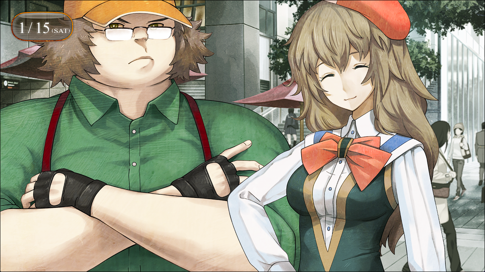

# 相互再归的鹅妈妈 - 04
> 1.064756  
> [ 2011/01/15 ] 路上偶遇由季约会，三人在旁边吃可丽饼并观察。真由理和篝相处十分融洽，互相投喂。  

“情况就是这样了。”  
我把从铃羽那里听来的，对真由理和篝解释了一遍。当然，不能说的未来的部分，就恰当地蒙混过去了。  
“这样啊\~那么接下来就是由季小姐了呢。”  
“真由理，能帮忙联系一下吗？”  
“嗯\~知道了\~”  
真由理拿出电话打给了由季。  
“……没接呢。RINE 上发给她吧。”  
真由理放弃打电话，给由季发了一条 RINE 信息。  
“这样就OK了\~”  
“好像变成一件大事了……对不起呢。”  
“不要在意哦\~！而且，真由喜能和篝小姐这样出来散步，就很开心了。”  
“……谢谢。我也是，和真由理小姐这样一边散步一边聊天，心情特别舒畅。”  
“啊，这个，真由喜也一样呢\~！”  
“也许我们很合得来呢。”  
“诶嘿嘿\~好开心呀！”  
要是桶子在场，一定会高喊“百合展开出现了！”这样。说起来，桶子今天也说有要事，中午就离开 LAB 了，感觉肯定是什么可疑的要事。  
“啊，由季小姐回信了哦\~嗯\~她说
 ‘其实现在正在和桥田先生约会中\~’  
 哇\~原来这样啊！”  
“那两位，正在交往吗……！”  
“我没听说他俩都已经发展到约会的程度了啊。”  
桶子说的要事就是这个啊。  
“然后呢……由季小姐傍晚好像要来 LAB。”  
“傍晚吗，那还有段时间。”  
“但是，打扰人家约会就不好了。”  
“对啊，我们就等等吧。”  
连篝都这么说了，我也没什么好讲的。拜托真由理回复由季后，我们就回 LAB 了。  

回程途中——  
“……啊！”  
“嗯？怎么了？”  
“冈伦，那里！”  
真由理突然压低声音，手指着露天平台的咖啡区。  
“啊……！”  
其中一张桌子边，有两个熟悉的身影——桶子和由季。两个人正亲密地吃着三明治！  
“这就是那什么吧……总之，按桶子平时的说法——桶子，现充爆炸吧……！”  
“怎、怎么办？”  
“打扰人家是不好的……”  
“话说回来，这种场景难得一见啊！”  
“这、的确呢！”  
真由理露出从未见过的灼热目光，差点就要冲上去给他俩添个助攻的样子。  
“等他们吃完的时候，我们就装作巧遇吧。”  
“真由喜赞成！”  
“这主意不错！”  
篝和真由理的情绪不断高涨，这个场景有这么令人兴奋吗。我们低调地找了露天平台角落的一张桌子当作据点，然后尽量小心地低着头，偷偷监视着桶子和由季。那两人开心地继续吃着午饭，勉强能听到他们说话。  
“啊啦啊啦，桥田先生，嘴巴边沾着番茄酱哦，我帮你擦掉吧\~”  
“不不不不不不，没事的没事的，我我我我我自己擦掉好了。”  
“但是，你一直都不带手帕的嘛。来，请把脸转过来\~”  
“我我我我我我的体液沾上去的话，阿万音氏的手帕会弄脏脏脏脏掉掉掉掉。”  
“我不觉得脏啦。好，我要擦了哦\~”  
“啊啊\~\~\~\~”  

“……那家伙在干嘛啊。”  
“感情好好的样子，好羡慕啊\~”  
“那两人很般配呢。”  
“是吗？”  
“是的啊！”（x2）  
完全搞不懂。  
“真好啊，好幸福的样子。”  
真由理一脸陶醉地感叹着他们开心的样子。就在这时——  
“啊呜……”  
“真由理小姐，肚子饿了吗？”  
“诶嘿嘿\~本打算打工结束后去吃午饭的……”  
“啊，这样啊。那么，点些东西吃吧，这次我请客。”  
“可以吗？”  
“作为帮忙的回报。”  
“太好啦！冈伦好慷慨呢\~那么、那么……”  
真由理双眼发光地扫描着菜单。  
“想吃可丽饼呢！要那种放好多草莓和奶油的！”  
看来可丽饼是今天的特色菜呢。  
“我知道了，篝呢？”  
“我刚刚才吃过午饭……”  
“诶\~一起吃嘛\~”  
“不用客气。”  
“不好意思了，那就点加了香蕉和巧克力的。”  
“了解。”  
我注意着不被桶子他们看到，去买可丽饼了。  

“啊呜\~！”（x2）  
“好好吃！好吃到让人感动\~！”  
“是呢！巧克力的苦味好棒\~！”  
“草莓也好好吃哦！来，篝小姐，啊\~\~”  
“啊\~\~嗯！好好吃\~  
 呃，你怎么还喂我吃啊！”  
“诶？不用害羞啦\~都是女生嘛\~”  
“这个，虽然如此……”  
“啊，脸上沾到奶油了哦\~”  
“诶，讨厌……”  
“真由喜帮你弄掉吧\~”  
“没、没事的！我自己擦掉好了！”  
篝慌手慌脚地从小包中取出小镜子和手帕，麻利地擦干净了。  
“啊，真由喜想还帮你擦的。”  
“真是的，真由理小姐这样，我很困扰的……”  
“诶\~？为什么？”  
“因为那个……听到真由理小姐这么说，会有一种奇怪的感觉……”  
“奇怪的感觉？”  
“对。不知为何，变得非常想向真由理小姐撒娇。  
 好奇怪啊，明明是我的年纪比较大……”  
篝红着脸，眼睛时不时向上瞟着看一下真由理。  
“诶嘿嘿\~这是因为篝小姐喜欢真由喜对吧？”  
“诶！？”  
“真由喜也超喜欢篝小姐的哦\~！”  
“那、那个，真由理小姐？我、我……”  
“啊，真由理的话没有什么深层的含义，不要介意。”  
“是、是吗？”  
“呐呐，可以也给真由喜吃一块吗？啊\~\~”  
“这个……”  
“啊\~\~”  
“真没办法呢……好吧，啊\~\~”  
真由理张大嘴巴，咬了一口篝递过去的可丽饼。旁人看来，也许就像两个姐妹在互相品尝对方的可丽饼。当然，真由理会被当成妹妹。但是，在我看来并非如此。仿佛小小的篝，害羞地把手伸向了作为妈妈的真由理。果然，想早点帮她取回记忆。卷入了第三次世界大战的未来世界是怎样的一个地方，我只是停留在想象中。但不管是多么绝望的情况，吃饭也应该还保留着让家族团聚的含义。或许即使在未来，也有这样的场景也说不定，那真是非常幸福啊——  
“冈伦？”  
“嗯？”  
“怎么了，愣在那里？”  
“啊，不好意思，稍微想了点事情。”  
“冈伦也想吃可丽饼吧？”  
“要不现在去买？”  
“没事的，我也才吃过午饭。”  
而且可丽饼太甜了，我并没有食欲。  
“啊，有了！那真由喜的给你吃一口吧，啊\~\~”  
“那么我的也给你一口，啊\~\~”  
眼前毫无防备地出现了两份可丽饼，以及两位在后面伸着手微笑着的可爱女孩子。  
“笨、笨蛋，别这样啊，太羞耻了吧——！”  
我条件反射地要把椅子往后推，结果脚尖卡到了桌脚。”  
“啊——！”  
“冈伦！”  
“冈部先生！”  

 

> (to be continued)
---

| [←prev](./0115) | [menu](../) | [next→](./0117) |
