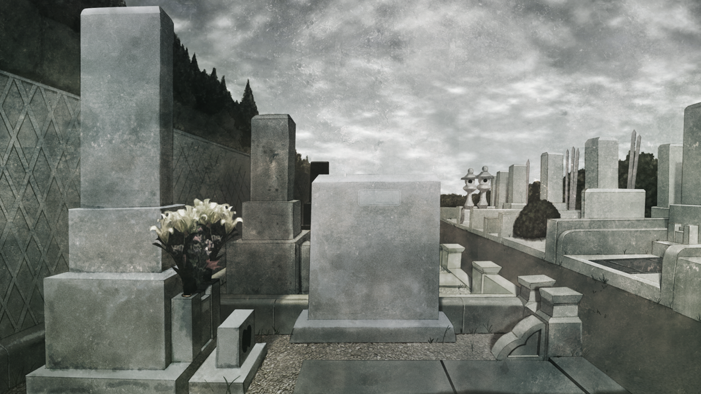
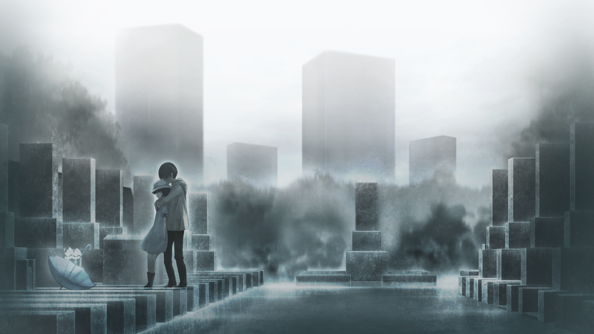
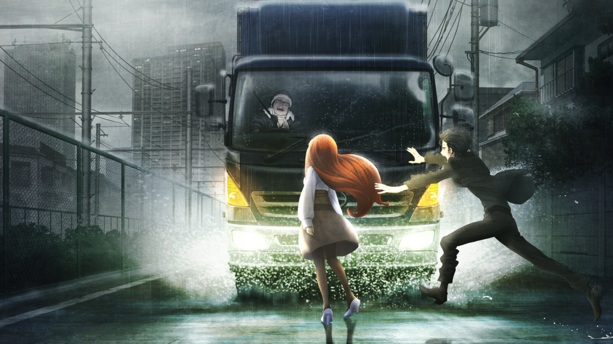

# 相互再归的鹅妈妈 - 06
> 1.064756  
> [ 2011/01/16 ] 扫墓，然后下雨。避雨的路上篝突然表示听到了声音，然后跑道机动车道。差点被卡车撞到，冈伦飞身去救。  

| [←prev](./0117) | [menu](../) | [next→](./0119) |

---

第二天，从早上开始就乌云密布。我和真由理、篝，在真由理祖母坟墓所在陵园附近集合了。  
“好像要下雨了呢。”  
“我没带伞呢，因为天气预报说不会下雨……”  
“真由喜也是呢\~”  
我本来就没有为了预防下雨而带伞的习惯。也就是说，大家都没带伞。  
“在雨落之前把事情解决了吧。”  
“好\~奶奶知道冈伦来了一定很高兴呢。”  
“……应该吧。”  
“而且今天篝小姐也来了。能把最棒的朋友们介绍给奶奶，真由喜好开心呐\~”  
“真由理小姐……”  
“冈伦，快走吧？真由喜有一堆话想和奶奶说。”  
“是的呢，快走吧。”  

很快我们就到了陵园。天空覆盖的乌云更黑了，看起来随时都会开始下雨。我们三人打扫完坟墓，依次在墓前合手参拜后，真由理一个人坐在了墓前，一直和祖母说着话。我和篝在离她稍远的地方望着她。  
“然后呢，篝小姐进来时满脸惊讶，接着‘噗通——’地一下子晕倒了，把我吓了一跳呢。  
 真由喜当时超级慌、超级担心，但是无论如何打工都不能不去……  
 所以，只好对着冈伦和桶子君说道‘篝就拜托了！”，就跑出了 LAB。  
 但是，我真的好担心好担心，胸口好像都要裂开了呢……”  
“冈部先生，那个……”  
篝带着困惑的神情在我耳边说道。  
“啊，不用担心真由理，那已经成了她的一种仪式。”  
“仪式？”  
“嗯。真由理是奶奶带大的，奶奶去世的时候，她的灵魂好像也跟着奶奶走了一样。  
 大概半年都不和人说话，每天都来这里，恍恍惚惚地站一整天。  
 看起来就像是在祈祷着，希望自己也一起去奶奶所在的地方。”  
“然后就是，冈部先生把她带回来了吧！”  
“唔！为、为什么你知道这种事？”  
“真由理小姐给我讲的。”  
“那家伙……”  
“不是很好嘛，很帅哦，疯狂科学家凤凰院凶真先生\~”  
“别说了……那时候我也是拼了。  
 虽然回想起来也觉得那是正确的做法，但果然是很令人羞耻的行为。”  
是的，那时候的我爆发了所拥有的全部中二病，把真由理的灵魂留下了。  
“我不允许，你被带走……  
 真、真由理是我的人质！是人体试验的活祭品！  
 永远别想跑掉！哈哈，唔哈哈哈！”  
“这样……啊……真由喜，是人质呢……  
 那就没办法了呢。嘿嘿嘿……”  

“不会啊，我觉得是个非常美妙的故事。”  
“是吗？”  
“是的哦。啊！”  
“嗯？”  
“下雨了。”  
抬起头，感觉到雨滴拍打在脸上。很快，冰冷的雨水就越下越大。  
“没想到这么快就开始下雨了……怎么办？”  
才刚到这里，还什么都没做，就算要回去至少也要先稍微调查一下。  
“姑且先找个躲雨的地方吧，或者去便利店买把伞。”  
“知道了。真由理小姐，我们先回车站去吧！”  
“诶？哇啊！下雨了\~！”  

三人赶往车站的过程中，雨越下越大。  
“呀——！全身都湿透啦——！  
 之前要是买伞了就好了呢！  
 这样下去，得赶快洗个澡呢，不然会感冒的！  
 对了！篝小姐，要去真由喜家里吗？一起洗澡吧\~”  
 ——咦？”  
真由理回头看向篝，突然停了下来。于是我也停住了脚步，转身发现，本该跑在后面的篝，并没有跟上。稍微远点的地方，篝一脸恍惚地呆立不动。虽然脸朝向这边，眼睛好像在看着某个遥远的地方。  
“篝小姐？怎么了？”  
“……能听到。”  
她的声音很空洞，仿佛和刚刚的篝不是一个人。  
“能听到什么？”  
“……声音。能听到声音。”  
“篝、小姐？”  
真由理慢慢走向篝。  
“我……不能不去。”  
突然——篝不管不顾地踏着积水，直直朝着机动车道飞奔。  
“篝小姐！”  
车道上，一辆卡车飞奔而来。  
“篝小姐！快躲开！”  
真由理尖叫着——我的身体自己动了起来，粗暴地拉住已经冲出人行道的真由理的肩膀，把她拉倒在地上。  
“啊！”  
借着这股势头，我自己朝车道飞奔而去。  
“冈伦——！！”  

 

> (to be continued)
---

| [←prev](./0117) | [menu](../) | [next→](./0119) |
