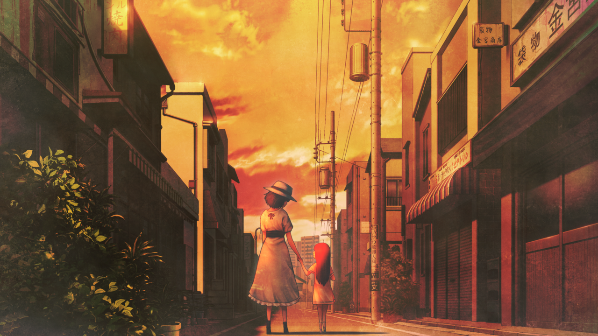
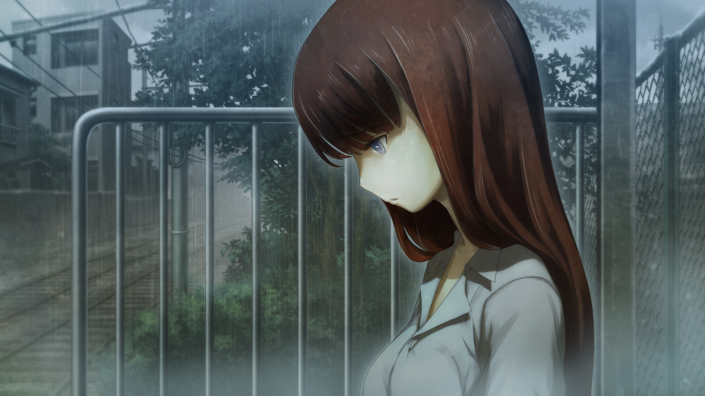
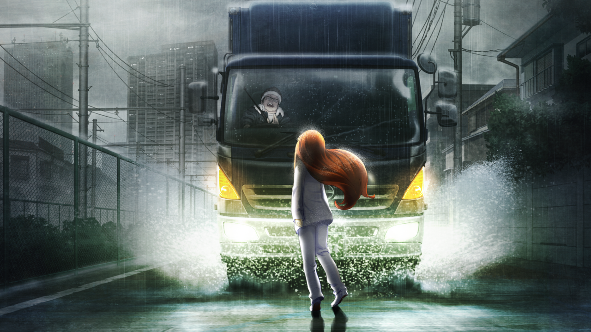

# 相互回归的鹅妈妈 - 07
> 1.064756  
> [ 2005/06/30 篝视角 ] 大雨天，篝从『教授』处出逃，失落的她遇上了同样失落的少年，给他唱了《星之奏》。少年离开后她被『教授』找到，逃离时同样冲上了机动车道，差点被卡车撞到。  

| [←prev](./0118) | [menu](../) | [next→](./0120) |

---

“以前呀，空气还没像现在这样被污染，大家即使淋了雨也不会在意哦。  
 妈妈在和篝差不多大的时候，一到下雨天就很开心呢。  
 能和冈伦一起，在外面跑来跑去。  
 在雨中跑步，就好像是在海里游动一样呢。  
 冈伦和妈妈呢，就是在那里面游泳的鱼，世界上仅有的两条鱼。  
 好开心呢……”  

---  

那到底是什么时候的事情呢？1998 年，和铃羽姐姐分开之后，一直被关在某个设施里。我从那里逃出来是什么时候的事情呢？促使我逃出的理由是……想快点和妈妈见面，仅此而已。  
某一天在某个设施里，篝和平常一样等待着『教授』得到来，透过小小的窗户，注意到外面正在下雨。感受到窗外传来的水的气息，想起了妈妈的话。回过神来，篝已经脱掉了覆盖在头上的装置。因为谁都没预料到这个行动，所以篝很简单就逃了出来。她撕掉贴在两臂上的导线，从小小的窗户爬到了外面，然后躲进了正好从停车场出发的卡车的车斗里。  
设施好像在深山里。摇晃了好几个小时后，卡车终于到达了某个小镇。趁着卡车停车的时机，篝冲到外面，一边淋雨，一边漫无目的地走着。她并没有想去的地方，虽然想和妈妈见面，但是不知道妈妈在哪里。就算见到了，这时候的妈妈也比篝还小几岁，而且根本就不知道篝的事。冲动地从设施里跑出来，连钱都没带，她什么都做不了，只能等着『教授』找过来。在那之前——想要好好淋一次雨。雨一直淅沥淅沥地下着，虽然衣服都湿了，但她完全不在意。  
（……淋了不会痛的雨，真是奇怪的感觉。）  
这个时代的雨，接触了皮肤也不会感到刺激，不如说，有些温暖。篝知道了，原来自然不是单纯要让人类感受到痛苦而存在的。篝想道，这个时代的雨是有生命的。这个时代的雨是“活雨”，和未来世界所下的“死雨”，完全不一样。篝享受着被活雨包裹着的感觉，继续走着。  
……究竟走了多远呢？脚终于走累了的时候，篝找到了一个有屋檐的长凳。这是一个有轨电车的月台，没有工作人员，也没有检票口。篝坐在椅子上，茫然地抬头看着天空。雨好像还没有要停的样子。  
（……神也一定讨厌这样的雨吧。  
 比起活雨，一定更喜欢死雨吧。  
 不然就无法解释，未来的雨为什么是死雨。）  
篝一点也不觉得未来的“死雨”，比现在的“活雨”要好。但是有一点能确定，妈妈所在的未来所下的雨，是“死雨”。和妈妈再一次相遇时，下的也会是“死雨”。所以，她对神没有什么特别的抱怨。  

“迷路了吗？”  
长凳旁边，站着一个男孩，看起来年龄比篝稍微小一点。虽然举着伞，但是裤子膝盖以下都湿透了，一定是在这场雨中走了很长时间吧。篝默不作声。男孩在旁边坐下，露出一副疲惫又悲伤的表情。  
“我也是。”  
男孩好像自言自语一般开口说着。他当时到底说了什么呢，篝已经记不起来了。但是，少年看起来很痛苦，好像背负着全世界的悲伤一样。为什么他会来找素不相识的篝搭话呢？为什么他会向篝倾诉这些事情呢？不可思议的是，篝对此并不讨厌。是一样的——我和这个孩子，是一样的。虽然不知为何，不可思议地，篝这时候却能理解。这个世界，有着靠自己力量无论如何也做不到的事情。对于从指间滑落的东西，除了眼睁睁看着，什么也做不到。明明不能放弃，却只能放弃。充满了这样的绝望。或许，是这场雨让两人相遇的。虽然在这个世界上有无数人类生存，但是两个对谁也无法坦白心意的人，却被这场雨联结在了一起。这场“活雨”，温暖的雨，温柔的雨。  
“冈伦和妈妈呢，就是在那里面游泳的鱼，世界上仅有的两条鱼。”  
说着那些话的妈妈，脸上带着怀念而高兴的表情。但是篝觉得，那些话让人很是寂寞。因为，世界明明那么大，但是在其中游泳的鱼只有两条。没有其他伙伴什么的，这一点很寂寞。篝一直这么认为。但是那时的篝稍微理解了妈妈的心情。世界上仅有的两条鱼，但是，至少不是一条。和自己想着相同事情的人，至少，在身旁，还有一个。虽然这很冷清，但是一定不会孤单。在那片活雨的海底，她明白了这一点。  
*♪\~有个要寻找的东西\~♪*  
*♪\~星星在对我笑眯眯\~♪*  
*♪\~随着风眼睛眨呀眨\~♪*  
*♪\~伸出手的话就能够抓到哟\~♪*  
篝没有什么能为这个少年做的。但是那时的篝想着，或许这个少年需要这首歌。  

回过神来，少年已经不在了。  
“雨……下个不停呢。”  
“让我好找啊。”  
“……”  
“好了，走吧。”  
“……”  
“怎么了？”  
“我……不能不去。”  
篝甩开了『教授』的手，冲到机动车道上，在雨中跑了起来。这时，前方一辆卡车，一边碾过积水，一边冲了过来。  

 

> (to be continued)
---

| [←prev](./0118) | [menu](../) | [next→](./0120) |
